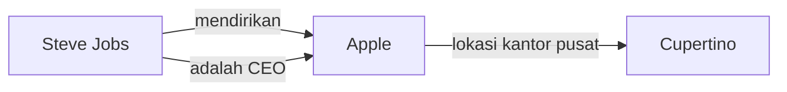
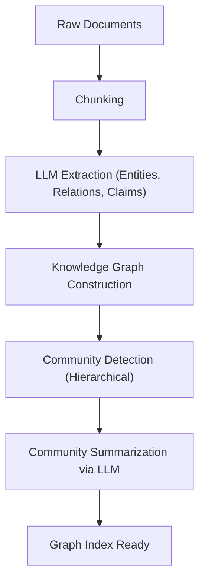

# Evolusi RAG: Integrasi GraphRAG dan Knowledge Graph

Dengan munculnya Large Language Models (LLM), bidang Natural Language Processing (Pemrosesan Bahasa Alami) telah mengalami evolusi yang pesat. Namun, LLM sendiri memiliki tantangan seperti "tidak dapat menangani informasi terbaru yang tidak termasuk dalam data pelatihan" dan "kemungkinan menyebabkan halusinasi (hallucination)". Sebagai sarana untuk memecahkan masalah ini, **RAG (Retrieval-Augmented Generation)** telah tersebar luas.

RAG konvensional sebagian besar adalah "pencarian vektor", yang membagi dokumen menjadi beberapa chunk (potongan), mengubahnya menjadi vektor, dan melakukan pencarian kesamaan. Namun, pencarian vektor sederhana mencapai batasnya dalam menalar konteks kompleks atau informasi yang tersebar di beberapa dokumen. Oleh karena itu, "**GraphRAG**", yang mengintegrasikan **Knowledge Graph (Grafik Pengetahuan)** dan RAG, saat ini menarik banyak perhatian.

Dalam artikel ini, dimulai dengan masalah yang dihadapi oleh RAG berbasis pencarian vektor konvensional, kita akan menggali secara detail dan mendalam tentang metode ekstraksi hubungan semantis menggunakan knowledge graph, serta arsitektur GraphRAG dan praktik terbaik untuk implementasinya.

---

## 1. Keterbatasan RAG Berbasis Pencarian Vektor Konvensional

### Mekanisme dan Keuntungan Pencarian Vektor

RAG konvensional utamanya beroperasi melalui alur berikut:

1. **Pengindeksan Dokumen**: Data tidak terstruktur seperti PDF, file teks, dan Wiki internal dalam perusahaan dibaca dan dibagi menjadi ukuran tertentu (chunk).
2. **Pembuatan Embedding**: Setiap chunk yang dibagi diubah menjadi titik dalam ruang vektor multidimensi menggunakan model embedding.
3. **Penyimpanan di Database Vektor**: Vektor yang dihasilkan disimpan bersama dengan teks aslinya dalam database vektor (Pinecone, Milvus, Qdrant, dll.).
4. **Pencarian dan Pembuatan**: Ketika pengguna memasukkan pertanyaan, kalimat pertanyaan tersebut juga diubah menjadi vektor, dan kesamaan kosinus dengan vektor dalam database dihitung untuk mengambil chunk yang paling mirip. Chunk yang diambil disematkan sebagai konteks ke dalam prompt LLM untuk menghasilkan jawaban.

Metode ini sederhana dan kuat, serta sangat baik dalam menemukan hubungan faktual tertentu atau informasi yang ditulis dalam satu dokumen tunggal.

### Tantangan dan Batasan yang Dihadapi

Namun, di lingkungan produksi nyata, RAG berbasis pencarian vektor sederhana mulai menunjukkan beberapa keterbatasan mendasar.

#### 1. Kesulitan dalam "Penalaran Multi-hop" yang Mengintegrasikan Banyak Informasi

Mari pertimbangkan jika pertanyaan pengguna bersifat kompleks seperti, "Berapa populasi kota tempat universitas tempat CEO Perusahaan A lulus berada?" Untuk menjawab pertanyaan ini, langkah-langkah berikut diperlukan:
- Menemukan bahwa CEO Perusahaan A adalah "Taro Yamada".
- Menemukan bahwa universitas tempat "Taro Yamada" lulus adalah "Universitas Tokyo".
- Menemukan bahwa kota tempat "Universitas Tokyo" berada adalah "Tokyo".
- Menemukan populasi "Tokyo".

Meskipun pencarian vektor dapat menemukan fragmen teks yang secara semantis dekat dengan string "CEO Perusahaan A", sangat sulit untuk menelusuri fakta yang tersebar di beberapa dokumen secara berurutan seperti di atas (penalaran multi-hop). Hal ini karena embedding pada dasarnya hanya merepresentasikan keseluruhan "kedekatan makna" teks, dan tidak menyimpan hubungan logis spesifik antar entitas.

#### 2. Kurangnya Pemahaman Global (Global Understanding)

Pencarian vektor tidak berfungsi untuk pertanyaan luas (kueri global) terhadap sekumpulan besar dokumen seperti "Apa tema utama dalam dataset ini?" atau "Tolong ringkas gambaran keseluruhannya." Karena pencarian vektor hanya mengekstrak "bagian serupa secara lokal" (pencarian k-NN), metode ini tidak dapat menghasilkan jawaban yang meninjau keseluruhan.

#### 3. Dilema Ukuran Chunk dan Fragmentasi Konteks

Saat membagi teks menjadi chunk, "berapa ukuran yang harus dibagi" selalu menjadi masalah besar. Jika chunk terlalu kecil, konteksnya akan hilang dan informasinya akan terfragmentasi. Sebaliknya, jika terlalu besar, persentase noise yang tidak relevan akan meningkat, yang menurunkan akurasi pencarian. Meskipun ada metode untuk membagi chunk pada batas semantis (semantic chunking), hilangnya konteks secara intrinsik karena "memotong dokumen" tidak dapat dihindari.

---

## 2. Apa itu Knowledge Graph?

### Konsep Dasar Knowledge Graph

Knowledge Graph adalah representasi entitas di dunia nyata (orang, tempat, organisasi, konsep, dll.) dan hubungan di antara mereka terstruktur sebagai sebuah jaringan (grafik).

Sebuah knowledge graph pada dasarnya terdiri dari "node (simpul)" dan "edge (sisi)".
- **Node**: Mewakili sebuah entitas. (Contoh: "Steve Jobs", "Apple")
- **Edge**: Mewakili hubungan antar entitas. (Contoh: "mendirikan", "adalah CEO")

Elemen-elemen ini biasanya direpresentasikan sebagai tripel (tiga bagian) dari **Subjek-Predikat-Objek (Subject-Predicate-Object)**.
(Contoh: `Steve Jobs (Subject) -- mendirikan (Predicate) --> Apple (Object)`)

### Mengapa RAG Membutuhkan Knowledge Graph?

Sementara pencarian vektor mengukur "jarak dalam ruang semantis", knowledge graph memodelkan "hubungan yang jelas antara satu fakta dengan fakta lainnya". Mengintegrasikan knowledge graph ke dalam RAG memberikan manfaat berikut:

1. **Pemahaman Hubungan yang Akurat**: Dapat secara signifikan mengurangi halusinasi karena memungkinkan pelacakan hubungan logis yang eksplisit, seperti "A adalah bagian dari B" dan "C memiliki D".
2. **Penalaran Kompleks (Pencarian Multi-hop)**: Dengan menelusuri (traversing) node grafik, penalaran melalui beberapa entitas menjadi mungkin.
3. **Peringkasan Informasi Global**: Dengan menganalisis struktur grafik keseluruhan, atau komunitas tertentu (kumpulan node yang terhubung erat), ringkasan dan tren dari keseluruhan kumpulan dokumen dapat dihasilkan.

---

## 3. Arsitektur dan Alur Pemrosesan GraphRAG

GraphRAG (Graph Retrieval-Augmented Generation) adalah metode yang membangun knowledge graph dari teks tidak terstruktur dan mengintegrasikannya ke dalam proses pencarian dan pembuatan LLM. Menggunakan arsitektur GraphRAG yang diusulkan oleh tim peneliti Microsoft sebagai pendekatan perwakilan, kami akan menjelaskan langkah-langkah detailnya.

### Fase 1: Pembangunan Indeks (Indexing Phase)

Fase paling penting dan memakan komputasi tinggi dari GraphRAG adalah membangun knowledge graph dari teks tidak terstruktur.

#### 1.1 Pemotongan Teks (Text Chunking)
Sama seperti RAG konvensional, pertama-tama dokumen input dibagi menjadi teks chunk dengan ukuran yang sesuai.

#### 1.2 Ekstraksi Entitas dan Hubungan (Entity & Relationship Extraction)
Inilah inti dari GraphRAG. Menggunakan LLM, entitas (node) dan hubungan (edge) diekstrak dari setiap chunk.
LLM diberikan prompt seperti berikut:
"Dari teks berikut, ekstrak semua orang, organisasi, tempat, dan konsep, identifikasi hubungan di antara mereka, dan output dalam format (Source Node, Relationship, Target Node, Description)."

Proses ini mengubah fakta eksplisit dalam teks menjadi data terstruktur.

#### 1.3 Konstruksi Grafik dan Resolusi Entitas (Graph Construction & Entity Resolution)
Tripel yang diekstrak digabungkan untuk membangun satu grafik besar. Di sini, "Entity Resolution" menjadi sangat penting.
Misalnya, jika entitas "Apple Inc.", "Apple", dan "perusahaan tersebut" diekstrak dari chunk yang berbeda, mereka harus diidentifikasi sebagai merujuk pada hal yang sama dan disatukan sebagai node yang sama pada grafik.

#### 1.4 Deteksi Komunitas dan Peringkasan (Community Detection & Summarization)
Untuk knowledge graph yang telah dibangun, algoritma teori graf (misalnya, algoritma Leiden, metode Louvain) diterapkan untuk mendeteksi kelompok node yang terhubung erat (komunitas). Komunitas-komunitas ini mewakili "topik" atau "tema" dalam dataset.
Selanjutnya, LLM digunakan untuk menghasilkan ringkasan untuk setiap komunitas (Community Summary). Dengan melakukan clustering hierarkis, ringkasan pada tingkat granularitas yang berbeda dibuat, dari tingkat keseluruhan hingga tingkat terperinci.

### Fase 2: Pencarian dan Pembuatan (Query Phase)

Setelah indeks dibangun, ini adalah fase untuk menghasilkan jawaban atas pertanyaan pengguna. GraphRAG menggunakan strategi pencarian yang berbeda (Local Search / Global Search) tergantung pada sifat pertanyaan.

#### 2.1 Pencarian Lokal (Local Search)
Cocok untuk pertanyaan terperinci tentang entitas atau fakta tertentu. (Contoh: "Apa peran Bapak △△ dalam Insiden 〇〇?")

1. **Identifikasi Entitas**: Mengekstrak entitas penting dari pertanyaan pengguna.
2. **Pengambilan Node**: Menemukan node yang terkait dengan entitas yang diekstrak dari knowledge graph.
3. **Pengumpulan Konteks**: Mengumpulkan edge (hubungan) yang terhubung langsung ke node yang ditemukan, chunk teks yang relevan, dan ringkasan komunitas tempat node tersebut berada.
4. **Pembuatan Jawaban**: Meneruskan informasi yang dikumpulkan ke LLM sebagai prompt untuk menghasilkan jawaban.

#### 2.2 Pencarian Global (Global Search)
Cocok untuk pertanyaan luas dan ringkasan yang mencakup seluruh dataset. (Contoh: "Ringkas tema utama dan struktur konflik dari dataset ini.")

1. **Pemrosesan Paralel Ringkasan Komunitas**: Menanggapi pertanyaan, meneruskan ringkasan komunitas yang dibuat sebelumnya ke LLM (secara paralel jika perlu), dan mengevaluasi/memfilter seberapa berguna setiap ringkasan dalam menjawab pertanyaan.
2. **Pembuatan Jawaban Menengah**: Untuk setiap ringkasan komunitas yang dinilai berguna, jawaban perantara (Intermediate Response) dihasilkan.
3. **Integrasi Jawaban Akhir**: Semua jawaban perantara diintegrasikan untuk menghasilkan jawaban akhir yang komprehensif. Ini adalah proses yang mirip dengan konsep Map-Reduce.

---

## 4. Teknik Lanjutan dan Tantangan dalam Implementasi GraphRAG

Untuk menyukseskan GraphRAG di lingkungan produksi, beberapa rintangan teknis harus diatasi.

### Peningkatan Akurasi Ekstraksi dan Optimalisasi Biaya

Pada fase pembangunan indeks, karena semua chunk teks dilewatkan melalui LLM untuk mengekstrak entitas, konsumsi token (biaya API) menjadi sangat besar.
- **Pemanfaatan Model Ringan**: Untuk tugas ekstraksi, alih-alih model besar kelas GPT-4, menggunakan model berskala kecil hingga menengah yang telah di-fine-tuning (Llama 3 8B, Mistral, dll.) atau model khusus untuk ekstraksi informasi (seperti GLiNER) dapat mengoptimalkan biaya dan kecepatan.
- **Mendefinisikan Ontologi**: Menentukan skema (ontologi) sebelumnya dan menginstruksikan LLM tentang jenis entitas apa (Person, Organization, TechSkill, dll.) dan hubungan yang akan diekstrak meningkatkan akurasi dan konsistensi ekstraksi.

### Pendekatan Hibrida (Vektor + Grafik)

Faktanya, pencarian vektor dan GraphRAG tidak saling eksklusif. Arsitektur yang paling kuat adalah **Pencarian Hibrida** yang menggabungkan keduanya.

1. Untuk pertanyaan pengguna, dapatkan chunk yang relevan menggunakan pencarian vektor konvensional.
2. Pada saat yang sama, dapatkan substruktur grafik yang relevan menggunakan pencarian lokal GraphRAG.
3. Integrasikan kedua konteks dan sajikan ke LLM.

Pencarian vektor ahli dalam menangkap "kesamaan makna implisit" dan "nuansa", sedangkan knowledge graph ahli dalam menangkap "hubungan faktual eksplisit". Menggabungkan keduanya menghasilkan sistem RAG yang sangat tangguh.

### Pemilihan Database Property Graph

Memilih database (database grafik) untuk menyimpan dan menanyakan knowledge graph juga penting. Neo4j adalah yang paling terkenal dan memiliki ekosistem yang matang, tetapi baru-baru ini database yang mengintegrasikan fungsi pencarian vektor dan kueri grafik (Cypher, Gremlin, dll.) (seperti NebulaGraph, ArangoDB, atau PostgreSQL dikombinasikan dengan Apache AGE atau pgvector) juga mendapatkan popularitas.

---

## 5. Kesimpulan dan Prospek Masa Depan

RAG berbasis vektor konvensional telah membuat langkah besar dalam aplikasi praktis AI generatif, tetapi memiliki keterbatasan dalam penalaran multi-hop dan pemahaman struktur secara keseluruhan. "GraphRAG", yang mengintegrasikan knowledge graph dan RAG, memberikan "struktur semantis dan logis" pada data, memungkinkan sistem AI generasi berikutnya yang dapat menjawab pertanyaan yang lebih kompleks dan akurat sambil mengurangi halusinasi.

Meskipun masih ada tantangan yang harus diselesaikan, seperti tingginya biaya pembuatan dan kesulitan ekstraksi entitas, tidak diragukan lagi bahwa dengan evolusi LLM itu sendiri dan penyempurnaan algoritma ekstraksi, GraphRAG akan menjadi arsitektur standar untuk AI perusahaan.

Dari sekadar "pencarian teks" ke "eksplorasi jaringan pengetahuan". Harapan tinggi terus ditempatkan pada kemungkinan RAG baru yang dibuka oleh GraphRAG.
