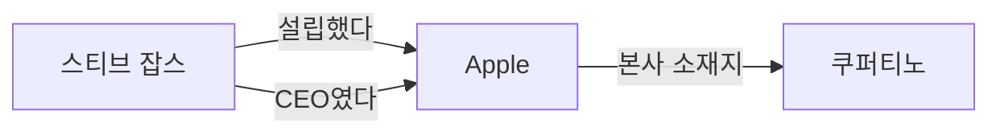
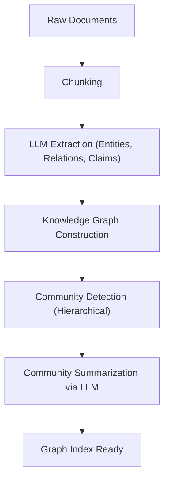

# RAG의 진화: GraphRAG와 지식 그래프의 통합

대규모 언어 모델(LLM)의 등장으로 자연어 처리 분야는 비약적인 발전을 이루었습니다. 그러나 LLM 단독으로는 "학습 데이터에 포함되지 않은 최신 정보에 대응할 수 없다", "환각(할루시네이션)을 일으킬 가능성이 있다"는 등의 과제가 존재합니다. 이를 해결하기 위한 수단으로 널리 보급된 것이 **RAG(Retrieval-Augmented Generation: 검색 증강 생성)**입니다.

기존의 RAG는 문서를 청크로 분할하고, 벡터화하여 유사도 검색을 수행하는 '벡터 검색'이 주류였습니다. 하지만 복잡한 문맥이나 여러 문서에 걸친 정보의 추론에 있어서 단순한 벡터 검색은 한계에 부딪히고 있습니다. 그래서 현재 주목받고 있는 것이 **지식 그래프(Knowledge Graph)**와 RAG를 통합한 '**GraphRAG**'입니다.

본 문서에서는 기존의 벡터 검색 기반 RAG가 안고 있는 과제에서 출발하여, 지식 그래프를 이용한 의미적 연결 추출 기법, 그리고 GraphRAG의 아키텍처와 그 구현의 베스트 프랙티스까지 상세하고 깊이 있게 파헤쳐 설명합니다.

---

## 1. 기존 벡터 검색 기반 RAG의 한계

### 벡터 검색의 원리와 장점

기존의 RAG는 주로 다음과 같은 흐름으로 동작합니다.

1. **문서 인덱싱**: 기업 내 PDF, 텍스트 파일, 사내 위키 등의 비정형 데이터를 읽어 들여 일정한 크기(청크)로 분할합니다.
2. **임베딩 생성**: 분할된 각 청크를 임베딩 모델을 사용하여 다차원 벡터 공간의 점으로 변환합니다.
3. **벡터 데이터베이스에 저장**: 생성된 벡터를 원본 텍스트와 함께 벡터 데이터베이스(Pinecone, Milvus, Qdrant 등)에 저장합니다.
4. **검색 및 생성**: 사용자가 질문을 입력하면 질문도 동일하게 벡터화되어, 데이터베이스 내의 벡터와 코사인 유사도 등을 계산하고 가장 유사한 청크를 가져옵니다. 가져온 청크를 LLM의 프롬프트에 컨텍스트로 포함시켜 답변을 생성합니다.

이 방식은 단순하고 강력하며, 특정 사실 관계나 단일 문서에 기재된 정보를 찾아내는 데 매우 뛰어납니다.

### 직면한 과제와 한계

하지만 실제 운영 환경에서 단순한 벡터 검색 기반의 RAG는 몇 가지 근본적인 한계를 드러내기 시작했습니다.

#### 1. 여러 정보를 통합하는 '멀티홉 추론'의 어려움

사용자의 질문이 "A사 CEO가 졸업한 대학이 위치한 도시의 인구는?"과 같이 복잡한 경우를 생각해 봅시다. 이 질문에 답하기 위해서는 다음 단계가 필요합니다.
- A사 CEO가 "홍길동"이라는 것을 찾는다.
- "홍길동"이 졸업한 대학이 "한국대학교"라는 것을 찾는다.
- "한국대학교"가 위치한 도시가 "서울"이라는 것을 찾는다.
- "서울"의 인구를 찾는다.

벡터 검색은 "A사 CEO"라는 문자열과 의미적으로 가까운 텍스트의 파편은 찾을 수 있지만, 위와 같이 여러 문서에 흩어진 사실을 연쇄적으로 추적하는(멀티홉 추론) 것은 매우 어렵습니다. 임베딩은 어디까지나 텍스트의 전반적인 '의미적 근접성'을 표현하는 것이며, 엔티티 간의 구체적인 논리적 관계성을 유지하지 않기 때문입니다.

#### 2. 대국적 이해(Global Understanding)의 부재

대량의 문서군 전체에서 "이 데이터셋의 주요 주제는 무엇인가?", "전체적인 그림을 요약해 달라"와 같은 광범위한 질문(글로벌 쿼리)에 대해 벡터 검색은 작동하지 않습니다. 벡터 검색은 '국소적인 유사 부분'을 추출(k-NN 검색)할 뿐이므로 전체를 조망하는 답변을 생성할 수 없습니다.

#### 3. 청크 크기의 딜레마와 문맥의 단절

텍스트를 청크로 분할할 때 "어느 정도 크기로 분할할 것인가"는 항상 큰 과제가 됩니다. 청크가 너무 작으면 문맥을 잃고 정보가 단절됩니다. 반대로 너무 크면 무관한 노이즈가 포함될 비율이 높아져 검색 정확도가 떨어집니다. 의미적 경계로 청크를 분할하는 기법(시맨틱 청킹)도 존재하지만, 본질적으로 "문서를 잘게 써는" 것으로 인한 문맥의 상실은 피할 수 없습니다.

---

## 2. 지식 그래프(Knowledge Graph)란 무엇인가?

### 지식 그래프의 기본 개념

지식 그래프란 현실 세계의 엔티티(사람, 장소, 조직, 개념 등)와 그들 간의 관계성을 네트워크 구조(그래프)로 표현한 것입니다.

지식 그래프는 기본적으로 '노드(정점)'와 '엣지(간선)'로 구성됩니다.
- **노드(Node)**: 엔티티를 나타냅니다. (예: "스티브 잡스", "Apple")
- **엣지(Edge)**: 엔티티 간의 관계성을 나타냅니다. (예: "설립했다", "CEO이다")

이러한 요소는 보통 **주어-술어-목적어(Subject-Predicate-Object)**의 트리플(세 쌍)로 표현됩니다.
(예: `스티브 잡스 (Subject) -- 설립했다 (Predicate) --> Apple (Object)`)

### 왜 RAG에 지식 그래프가 필요한가?

벡터 검색이 '의미 공간에서의 거리'를 측정하는 반면, 지식 그래프는 '사실과 사실 간의 명확한 관계성'을 모델링합니다. RAG에 지식 그래프를 통합함으로써 다음과 같은 이점을 얻을 수 있습니다.

1. **정확한 관계성 파악**: "A는 B의 일부이다", "C는 D를 소유하고 있다"와 같은 명확한 논리 관계를 추적할 수 있어 환각을 획기적으로 줄일 수 있습니다.
2. **복잡한 추론(멀티홉 검색)**: 그래프의 노드를 따라가는(순회하는) 과정을 통해 여러 엔티티를 거치는 추론이 가능해집니다.
3. **전역적 정보의 요약**: 그래프 구조 전체 또는 특정 커뮤니티(밀접하게 연결된 노드의 집합)를 분석하여 문서군 전체의 경향이나 요약을 생성할 수 있습니다.

---

## 3. GraphRAG의 아키텍처와 처리 흐름

GraphRAG(Graph Retrieval-Augmented Generation)는 비정형 텍스트에서 지식 그래프 구축하고, 이를 LLM의 검색 및 생성 프로세스에 통합하는 기법입니다. 대표적인 접근법인 Microsoft 연구팀이 제안한 GraphRAG의 아키텍처를 바탕으로 그 세부 단계를 설명합니다.

### 1단계: 인덱스 구축 (Indexing Phase)

GraphRAG에서 가장 중요하고 또 컴퓨팅 비용이 가장 많이 드는 단계가 비정형 텍스트로부터 지식 그래프를 구축하는 것입니다.

#### 1.1 텍스트 청킹 (Text Chunking)
기존의 RAG와 마찬가지로 먼저 입력 문서를 적절한 크기의 텍스트 청크로 분할합니다.

#### 1.2 엔티티 및 관계성 추출 (Entity & Relationship Extraction)
여기가 GraphRAG의 핵심입니다. LLM을 사용하여 각 청크에서 엔티티(노드)와 관계성(엣지)을 추출합니다.
LLM에 다음과 같은 프롬프트를 제공합니다:
"다음 텍스트에서 모든 사람, 조직, 장소 및 개념을 추출하고, 이들 간의 관계를 식별하여 (Source Node, Relationship, Target Node, Description) 형식으로 출력하세요."

이 과정을 통해 텍스트 내의 명시적 사실이 구조화된 데이터로 변환됩니다.

#### 1.3 그래프 구축 및 엔티티 해결 (Graph Construction & Entity Resolution)
추출된 트리플을 통합하여 하나의 거대한 그래프를 구축합니다. 이때 'Entity Resolution(엔티티 통합)'이 매우 중요해집니다.
예를 들어 다른 청크에서 "Apple Inc.", "애플", "동사"라는 엔티티가 추출된 경우, 이들이 동일한 대상을 가리키고 있음을 식별하여 그래프 상에서 동일한 노드로 통합해야 합니다.

#### 1.4 커뮤니티 탐지 및 요약 (Community Detection & Summarization)
구축된 지식 그래프에 대해 그래프 이론의 알고리즘(예: Leiden 알고리즘, Louvain 방법)을 적용하여 밀접하게 결합된 노드의 그룹(커뮤니티)을 탐지합니다. 이러한 커뮤니티는 데이터셋 내의 '토픽'이나 '테마'를 나타냅니다.
나아가 LLM을 이용해 각 커뮤니티의 요약(Community Summary)을 생성합니다. 계층적 클러스터링을 수행함으로써 전체 수준부터 세부 수준까지 다양한 세밀도를 가진 요약을 만듭니다.

### 2단계: 검색 및 생성 (Query Phase)

인덱스가 구축된 후, 사용자의 질문에 대한 답변을 생성하는 단계입니다. GraphRAG는 질문의 성격에 따라 다른 검색 전략(Local Search / Global Search)을 구분하여 사용합니다.

#### 2.1 로컬 검색 (Local Search)
특정 엔티티나 사실에 관한 상세한 질문에 적합합니다. (예: "OO 사건에서 △△씨의 역할은?")

1. **엔티티 식별**: 사용자의 질문에서 중요한 엔티티를 추출합니다.
2. **노드 가져오기**: 추출한 엔티티와 관련된 노드를 지식 그래프에서 찾아냅니다.
3. **컨텍스트 수집**: 찾아낸 노드와 직접 연결된 엣지(관계성), 관련된 텍스트 청크, 그리고 해당 노드가 속한 커뮤니티의 요약을 수집합니다.
4. **답변 생성**: 수집한 정보를 LLM에 프롬프트로 전달하여 답변을 생성하게 합니다.

#### 2.2 글로벌 검색 (Global Search)
데이터셋 전체에 걸친, 대국적이고 요약적인 질문에 적합합니다. (예: "이 데이터셋의 주요 테마와 대립 구조를 요약해 줘")

1. **커뮤니티 요약의 병렬 처리**: 질문에 대해 사전에 생성해 둔 커뮤니티 요약을 (필요에 따라 병렬로) LLM에 전달하여 각 요약이 질문에 답하는 데 얼마나 유용한지를 평가하고 필터링합니다.
2. **중간 답변 생성**: 유용하다고 판단된 커뮤니티 요약마다 중간 답변(Intermediate Response)을 생성합니다.
3. **최종 답변 통합**: 모든 중간 답변을 통합하여 최종적인 포괄적 답변을 생성합니다. Map-Reduce의 개념과 유사한 처리 방식입니다.

---

## 4. GraphRAG 구현에서의 고급 기술과 과제

GraphRAG를 실무 환경에서 성공시키기 위해서는 몇 가지 기술적인 장벽을 넘어야 합니다.

### 추출 정확도 향상 및 비용 최적화

인덱스 구축 단계에서 모든 텍스트 청크를 LLM에 통과시켜 엔티티 추출을 수행하므로, 토큰 소비량(API 비용)이 막대해집니다.
- **경량 모델 활용**: 추출 작업에는 GPT-4급의 거대 모델이 아닌, 파인 튜닝된 중소 규모 모델(Llama 3 8B, Mistral 등)이나 정보 추출에 특화된 모델(GLiNER 등)을 사용함으로써 비용과 속도를 최적화할 수 있습니다.
- **온톨로지 정의**: 어떤 엔티티 유형(Person, Organization, TechSkill 등)과 관계성을 추출할 것인지 사전에 스키마(온톨로지)를 정의하여 LLM에 지시함으로써 추출의 정확도와 일관성이 향상됩니다.

### 하이브리드 접근법 (Vector + Graph)

사실 벡터 검색과 GraphRAG는 상호 배타적인 것이 아닙니다. 가장 강력한 아키텍처는 두 가지를 결합한 **하이브리드 검색**입니다.

1. 사용자의 질문에 대해 기존의 벡터 검색으로 관련 청크를 가져옵니다.
2. 동시에 GraphRAG의 로컬 검색으로 관련된 그래프 하위 구조를 가져옵니다.
3. 두 컨텍스트를 통합하여 LLM에 제시합니다.

벡터 검색은 '암묵적인 의미 유사성'이나 '뉘앙스'를 포착하는 데 능하며, 지식 그래프는 '명시적인 사실 관계'를 포착하는 데 뛰어납니다. 양쪽을 보완함으로써 매우 견고한 RAG 시스템이 구현됩니다.

### 속성 그래프 데이터베이스의 선택

지식 그래프를 저장하고 쿼리하기 위한 데이터베이스(그래프 데이터베이스)의 선정도 중요합니다. Neo4j가 가장 유명하고 생태계가 성숙해 있지만, 최근에는 벡터 검색 기능과 그래프 쿼리(Cypher나 Gremlin 등)를 통합한 데이터베이스(NebulaGraph, ArangoDB, 또는 PostgreSQL에 Apache AGE나 pgvector를 조합한 구성)도 인기를 끌고 있습니다.

---

## 5. 요약 및 향후 전망

기존의 벡터 기반 RAG는 생성형 AI의 실용화를 크게 앞당겼지만, 멀티홉 추론이나 전체 구조의 이해에 있어서는 한계가 있었습니다. 지식 그래프와 RAG를 통합한 'GraphRAG'는 데이터에 '의미적·논리적인 구조'를 부여함으로써 더 정확하고 더 복잡한 질문에 답할 수 있으며, 환각을 억제한 차세대 AI 시스템을 실현합니다.

구축 비용이 높고 엔티티 추출이 어렵다는 등 여전히 해결해야 할 과제는 있지만, LLM 자체의 진화와 추출 알고리즘의 발전을 통해 GraphRAG는 엔터프라이즈 AI의 표준 아키텍처로 자리 잡을 것이 틀림없습니다.

단순한 '텍스트 검색'에서 '지식의 네트워크 탐색'으로. GraphRAG가 열어갈 새로운 RAG의 가능성에 앞으로도 큰 기대가 모아지고 있습니다.
