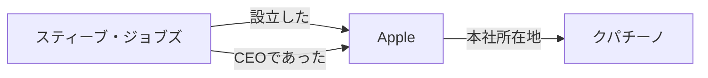
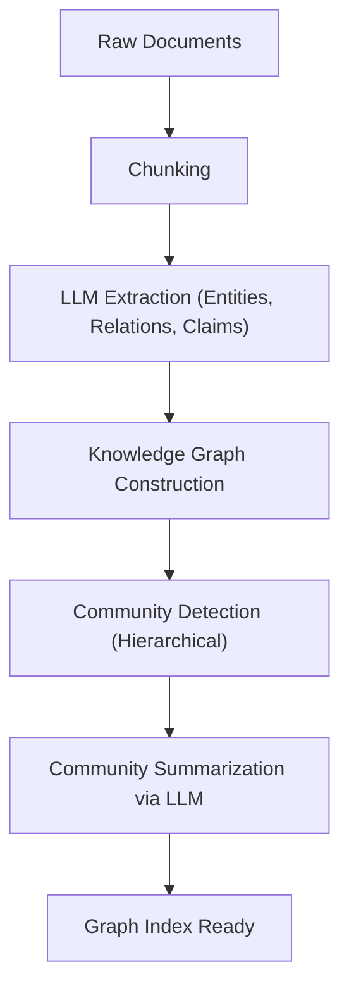

# RAGの進化系：GraphRAGと知識グラフの統合

大規模言語モデル（LLM）の台頭により、自然言語処理の分野は飛躍的な進化を遂げました。しかし、LLM単体では「学習データに含まれない最新情報に対応できない」「幻覚（ハルシネーション）を引き起こす可能性がある」といった課題が存在します。これを解決する手段として広く普及したのが、**RAG（Retrieval-Augmented Generation：検索拡張生成）**です。

従来のRAGは、ドキュメントをチャンクに分割し、ベクトル化して類似度検索を行う「ベクトル検索」が主流でした。しかし、複雑な文脈や複数の文書にまたがる情報の推論において、単純なベクトル検索は限界を迎えています。そこで現在注目を集めているのが、**知識グラフ（Knowledge Graph）**とRAGを統合した「**GraphRAG**」です。

本記事では、従来のベクトル検索ベースのRAGが抱える課題から出発し、知識グラフを用いた意味的つながりの抽出手法、そしてGraphRAGのアーキテクチャとその実装のベストプラクティスまでを、詳細かつ深く掘り下げて解説します。

---

## 1. 従来のベクトル検索ベースRAGの限界

### ベクトル検索の仕組みと利点

従来のRAGは、主に以下のようなフローで動作します。

1. **ドキュメントのインデックス化**: 企業内のPDF、テキストファイル、社内Wikiなどの非構造化データを読み込み、一定のサイズ（チャンク）に分割します。
2. **エンベディング生成**: 分割された各チャンクを、エンベディングモデルを用いて多次元ベクトル空間上の点に変換します。
3. **ベクトルデータベースへの格納**: 生成されたベクトルを、元のテキストとともにベクトルデータベース（Pinecone, Milvus, Qdrantなど）に保存します。
4. **検索と生成**: ユーザーが質問を入力すると、質問文も同様にベクトル化され、データベース内のベクトルとのコサイン類似度などを計算し、最も類似したチャンクを取得します。取得したチャンクをLLMのプロンプトにコンテキストとして埋め込み、回答を生成します。

この手法は、シンプルかつ強力であり、特定の事実関係や単一のドキュメントに記載されている情報を見つけ出すことには非常に長けています。

### 直面する課題と限界

しかし、実運用環境において、単純なベクトル検索ベースのRAGはいくつかの根本的な限界を露呈し始めています。

#### 1. 複数の情報を統合する「マルチホップ推論」の困難さ

ユーザーの質問が「A社のCEOが卒業した大学が位置する都市の人口は？」のような複雑なものである場合を考えてみましょう。この質問に答えるためには、以下のステップが必要です。
- A社のCEOが「山田太郎」であることを見つける。
- 「山田太郎」の卒業した大学が「東京大学」であることを見つける。
- 「東京大学」が位置する都市が「東京」であることを見つける。
- 「東京」の人口を見つける。

ベクトル検索は、「A社のCEO」という文字列と意味的に近いテキストの断片は見つけられますが、上記のように複数の文書に散らばった事実を連鎖的に辿る（マルチホップ推論）ことは極めて困難です。エンベディングはあくまでテキストの全体的な「意味の近さ」を表現するものであり、エンティティ間の具体的な論理的関係性を保持していないからです。

#### 2. 大局的な理解（Global Understanding）の欠如

大量の文書群全体から、「このデータセットにおける主要なテーマは何か？」「全体像を要約してほしい」といった広範な質問（グローバルクエリ）に対して、ベクトル検索は機能しません。ベクトル検索は「局所的な類似部分」を抽出（k-NN検索）するだけなので、全体を俯瞰した回答を生成することができないのです。

#### 3. チャンクサイズのジレンマと文脈の分断

テキストをチャンクに分割する際、「どのサイズに分割すべきか」は常に大きな課題となります。チャンクが小さすぎると文脈が失われ、情報が分断されます。逆に大きすぎると、無関係なノイズが含まれる割合が高くなり、検索精度が低下します。意味的な境界でチャンクを分割する手法（セマンティック・チャンキング）も存在しますが、本質的に「文書を切り刻む」ことによる文脈の喪失は避けられません。

---

## 2. 知識グラフ（Knowledge Graph）とは何か？

### 知識グラフの基本概念

知識グラフとは、現実世界のエンティティ（人、場所、組織、概念など）と、それらの間の関係性をネットワーク構造（グラフ）として表現したものです。

知識グラフは、基本的に「ノード（頂点）」と「エッジ（辺）」で構成されます。
- **ノード（Node）**: エンティティを表します。（例：「スティーブ・ジョブズ」、「Apple」）
- **エッジ（Edge）**: エンティティ間の関係性を表します。（例：「設立した」、「CEOである」）

これらの要素は通常、**主語-述語-目的語（Subject-Predicate-Object）**のトリプル（三つ組）として表現されます。
（例：`スティーブ・ジョブズ (Subject) -- 設立した (Predicate) --> Apple (Object)`）

### なぜRAGに知識グラフが必要なのか？

ベクトル検索が「意味空間での距離」を測るのに対し、知識グラフは「事実と事実の明確な関係性」をモデル化します。RAGに知識グラフを統合することで、以下の利点が得られます。

1. **正確な関係性の把握**: 「AはBの一部である」「CはDを所有している」といった明確な論理関係を追跡できるため、ハルシネーションを劇的に減少させることができます。
2. **複雑な推論（マルチホップ検索）**: グラフのノードを辿る（トラバースする）ことで、複数のエンティティを経由した推論が可能になります。
3. **大域的情報の要約**: グラフ構造全体、あるいは特定のコミュニティ（密に繋がったノードの集まり）を分析することで、文書群全体の傾向や要約を生成することが可能になります。

---

## 3. GraphRAGのアーキテクチャと処理フロー

GraphRAG（Graph Retrieval-Augmented Generation）は、非構造化テキストから知識グラフを構築し、それをLLMの検索・生成プロセスに統合する手法です。代表的なアプローチである、Microsoftの研究チームが提唱したGraphRAGのアーキテクチャをベースに、その詳細なステップを解説します。

### フェーズ1：インデックス構築（Indexing Phase）

GraphRAGの最も重要な、そして最も計算コストがかかるフェーズが、非構造化テキストからの知識グラフの構築です。

#### 1.1 テキストのチャンク化 (Text Chunking)
従来のRAGと同様に、まずは入力ドキュメントを適切なサイズのテキストチャンクに分割します。

#### 1.2 エンティティと関係性の抽出 (Entity & Relationship Extraction)
ここがGraphRAGの核心です。LLMを使用して、各チャンクからエンティティ（ノード）と関係性（エッジ）を抽出します。
LLMに以下のようなプロンプトを与えます：
「以下のテキストから、すべての人物、組織、場所、および概念を抽出し、それらの間の関係性を特定して、(Source Node, Relationship, Target Node, Description) の形式で出力してください。」

このプロセスにより、テキスト中の明示的な事実が構造化されたデータに変換されます。

#### 1.3 グラフの構築とエンティティ解決 (Graph Construction & Entity Resolution)
抽出されたトリプルを統合して一つの巨大なグラフを構築します。この際、「Entity Resolution（名寄せ）」が極めて重要になります。
例えば、別のチャンクから「Apple Inc.」「アップル」「同社」というエンティティが抽出された場合、これらが同一のものを指していることを特定し、グラフ上で同じノードとして統合する必要があります。

#### 1.4 コミュニティの検出と要約 (Community Detection & Summarization)
構築された知識グラフに対し、グラフ理論のアルゴリズム（例：Leidenアルゴリズム、Louvain法）を適用し、密に結合しているノードのグループ（コミュニティ）を検出します。これらのコミュニティは、データセット内の「トピック」や「テーマ」を表しています。
さらに、LLMを用いて各コミュニティの要約（Community Summary）を生成します。階層的クラスタリングを行うことで、全体レベルから詳細レベルまで、異なる粒度の要約を作成します。

### フェーズ2：検索と生成（Query Phase）

インデックスが構築された後、ユーザーの質問に対する回答を生成するフェーズです。GraphRAGは、質問の性質に応じて異なる検索戦略（Local Search / Global Search）を使い分けます。

#### 2.1 ローカル検索（Local Search）
特定のエンティティや事実に関する詳細な質問に適しています。（例：「〇〇事件における△△氏の役割は？」）

1. **エンティティの特定**: ユーザーの質問から重要なエンティティを抽出します。
2. **ノードの取得**: 抽出したエンティティに関連するノードを知識グラフから見つけ出します。
3. **コンテキストの収集**: 見つけたノードと直接つながっているエッジ（関係性）、関連するテキストチャンク、およびそのノードが属するコミュニティの要約を収集します。
4. **回答生成**: 収集した情報をLLMにプロンプトとして渡し、回答を生成させます。

#### 2.2 グローバル検索（Global Search）
データセット全体にまたがる、大局的・要約的な質問に適しています。（例：「このデータセットの主要なテーマと対立構造を要約して」）

1. **コミュニティ要約の並列処理**: 質問に対して、事前に生成しておいたコミュニティ要約を（必要に応じて並列で）LLMに渡し、各要約が質問に答えるためにどれだけ有用かを評価・フィルタリングします。
2. **中間回答の生成**: 有用と判断されたコミュニティ要約ごとに、中間的な回答（Intermediate Response）を生成します。
3. **最終回答の統合**: すべての中間回答を統合し、最終的な包括的な回答を生成します。Map-Reduceの概念に近い処理です。

---

## 4. GraphRAG実装における高度なテクニックと課題

GraphRAGを実運用環境で成功させるためには、いくつかの技術的なハードルを越える必要があります。

### 抽出精度の向上とコスト最適化

インデックス構築フェーズにおいて、すべてのテキストチャンクをLLMに通してエンティティ抽出を行うため、トークン消費量（APIコスト）が膨大になります。
- **軽量モデルの活用**: 抽出タスクには、GPT-4クラスの巨大モデルではなく、ファインチューニングされた小〜中規模モデル（Llama 3 8B, Mistral等）や情報抽出に特化したモデル（GLiNERなど）を使用することで、コストと速度を最適化できます。
- **オントロジーの定義**: どのようなエンティティタイプ（Person, Organization, TechSkillなど）や関係性を抽出したいのか、事前にスキーマ（オントロジー）を定義してLLMに指示することで、抽出の精度と一貫性が向上します。

### ハイブリッド・アプローチ（Vector + Graph）

実のところ、ベクトル検索とGraphRAGは排他的なものではありません。最も強力なアーキテクチャは、両者を組み合わせた**ハイブリッド検索**です。

1. ユーザーの質問に対し、従来のベクトル検索で関連チャンクを取得する。
2. 同時に、GraphRAGのローカル検索で関連するグラフサブ構造を取得する。
3. 両方のコンテキストを統合してLLMに提示する。

ベクトル検索は「暗黙的な意味の類似性」や「ニュアンス」を捉えるのが得意であり、知識グラフは「明示的な事実関係」を捉えるのが得意です。両者を補完させることで、極めて堅牢なRAGシステムが実現します。

### プロパティグラフデータベースの選択

知識グラフを保存・クエリするためのデータベース（グラフデータベース）の選定も重要です。Neo4jは最も有名でエコシステムが成熟していますが、近年はベクトル検索機能とグラフクエリ（CypherやGremlinなど）を統合したデータベース（NebulaGraph, ArangoDB、またはPostgreSQLにApache AGEやpgvectorを組み合わせた構成）も人気を集めています。

---

## 5. まとめと今後の展望

従来のベクトルベースのRAGは、生成AIの実用化を大きく前進させましたが、マルチホップ推論や全体構造の理解において限界がありました。知識グラフとRAGを統合した「GraphRAG」は、データに「意味的・論理的な構造」を与えることで、より正確で、より複雑な質問に答えられ、ハルシネーションを抑えた次世代のAIシステムを実現します。

構築コストの高さやエンティティ抽出の難易度など、まだ解決すべき課題はありますが、LLM自体の進化と抽出アルゴリズムの洗練により、GraphRAGはエンタープライズAIの標準的なアーキテクチャになっていくことは間違いありません。

単なる「テキスト検索」から、「知識のネットワーク探索」へ。GraphRAGが切り拓く新たなRAGの可能性に、今後も大きな期待が寄せられています。
