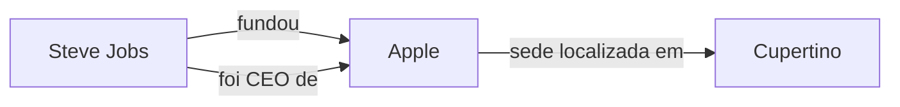
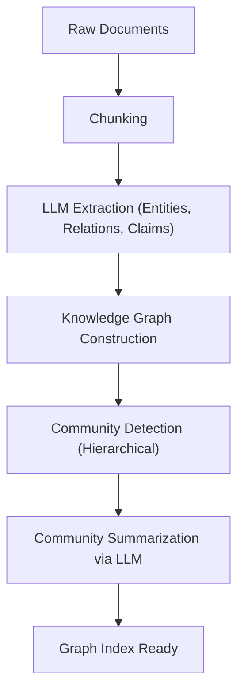

# A Evolução do RAG: A Integração entre GraphRAG e Grafos de Conhecimento

Com a ascensão dos Grandes Modelos de Linguagem (LLMs), o campo do processamento de linguagem natural alcançou uma evolução notável. No entanto, os LLMs por si sós apresentam desafios, como a "incapacidade de lidar com informações recentes não incluídas nos dados de treinamento" e a "possibilidade de gerar alucinações (hallucinations)". Como um meio para resolver isso, o **RAG (Retrieval-Augmented Generation: Geração Aumentada por Recuperação)** se tornou amplamente difundido.

No RAG convencional, o método predominante tem sido a "busca vetorial", que divide os documentos em fragmentos (chunks), os vetoriza e realiza uma busca por similaridade. Contudo, em contextos complexos e na inferência de informações espalhadas por múltiplos documentos, a simples busca vetorial está atingindo seus limites. É por isso que o "**GraphRAG**", que integra **Grafos de Conhecimento (Knowledge Graphs)** e RAG, está atraindo grande atenção atualmente.

Neste artigo, partindo dos desafios enfrentados pelo RAG convencional baseado em busca vetorial, vamos explorar profunda e detalhadamente os métodos de extração de conexões semânticas usando grafos de conhecimento, até a arquitetura do GraphRAG e as melhores práticas para a sua implementação.

---

## 1. Os Limites do RAG Convencional Baseado em Busca Vetorial

### Como Funciona a Busca Vetorial e Seus Benefícios

O RAG convencional geralmente opera no seguinte fluxo:

1. **Indexação de Documentos**: Lê dados não estruturados da empresa, como PDFs, arquivos de texto e Wikis internas, e os divide em pedaços de um determinado tamanho (chunks).
2. **Geração de Embeddings**: Cada chunk dividido é convertido em um ponto em um espaço vetorial multidimensional usando um modelo de embedding.
3. **Armazenamento no Banco de Dados Vetorial**: Os vetores gerados são armazenados junto com o texto original em um banco de dados vetorial (Pinecone, Milvus, Qdrant, etc.).
4. **Busca e Geração**: Quando o usuário insere uma pergunta, a frase da pergunta também é vetorizada. A similaridade de cosseno (por exemplo) com os vetores no banco de dados é calculada para recuperar os chunks mais similares. Os chunks recuperados são incorporados como contexto no prompt do LLM para gerar uma resposta.

Este método é simples e poderoso, sendo excelente para encontrar relações factuais específicas ou informações contidas em um único documento.

### Desafios e Limites Enfrentados

No entanto, em ambientes de produção reais, o RAG baseado em busca vetorial simples começou a expor alguns limites fundamentais.

#### 1. A Dificuldade da "Inferência Multi-Hop" para Integrar Múltiplas Informações

Imagine um caso em que a pergunta do usuário seja complexa, como: "Qual é a população da cidade onde fica a universidade da qual se formou o CEO da empresa A?". Para responder a essa pergunta, as seguintes etapas são necessárias:
- Descobrir que o CEO da empresa A é "Taro Yamada".
- Descobrir que a universidade da qual "Taro Yamada" se formou é a "Universidade de Tóquio".
- Descobrir que a cidade onde a "Universidade de Tóquio" está localizada é "Tóquio".
- Descobrir a população de "Tóquio".

A busca vetorial pode encontrar fragmentos de texto cujo significado se aproxima da string "CEO da empresa A", mas é extremamente difícil seguir cadeias de fatos espalhados por múltiplos documentos dessa maneira (inferência multi-hop). Isso ocorre porque os embeddings apenas representam a "proximidade de significado" geral do texto e não preservam as relações lógicas específicas e concretas entre as entidades.

#### 2. Falta de Compreensão Global (Global Understanding)

Para perguntas amplas (consultas globais) abrangendo todo um grande conjunto de documentos, como "Qual é o tema principal neste conjunto de dados?" ou "Gostaria que você resumisse o panorama geral", a busca vetorial não funciona. Como a busca vetorial extrai apenas as "partes locais similares" (busca k-NN), ela não consegue gerar uma resposta que ofereça uma visão geral de todo o conjunto.

#### 3. O Dilema do Tamanho dos Chunks e a Fragmentação do Contexto

Ao dividir o texto em chunks, a questão de "qual tamanho de divisão usar" é sempre um grande problema. Se o chunk for muito pequeno, o contexto se perde e as informações são fragmentadas. Se for muito grande, a proporção de ruído irrelevante incluído aumenta e a precisão da busca diminui. Embora existam métodos para dividir os chunks por limites semânticos (chunking semântico), a perda de contexto causada pela natureza de "fatiar o documento" é inevitável.

---

## 2. O que é um Grafo de Conhecimento (Knowledge Graph)?

### Conceitos Básicos dos Grafos de Conhecimento

Um grafo de conhecimento representa entidades do mundo real (pessoas, lugares, organizações, conceitos, etc.) e as relações entre elas através de uma estrutura de rede (grafo).

Fundamentalmente, um grafo de conhecimento é composto por "Nós" (Nodes/Vértices) e "Arestas" (Edges).
- **Nó (Node)**: Representa uma entidade. (Ex: "Steve Jobs", "Apple")
- **Aresta (Edge)**: Representa a relação entre entidades. (Ex: "fundou", "é CEO de")

Esses elementos costumam ser representados como triplas (triples) do tipo **Sujeito-Predicado-Objeto (Subject-Predicate-Object)**.
(Ex: `Steve Jobs (Subject) -- fundou (Predicate) --> Apple (Object)`)

### Por que o RAG Precisa de Grafos de Conhecimento?

Enquanto a busca vetorial mede a "distância no espaço semântico", o grafo de conhecimento modela "as relações claras entre um fato e outro". Ao integrar grafos de conhecimento ao RAG, obtêm-se as seguintes vantagens:

1. **Compreensão Precisa das Relações**: Como é possível rastrear relações lógicas explícitas como "A faz parte de B" ou "C é dono de D", as alucinações (hallucinations) podem ser drasticamente reduzidas.
2. **Inferência Complexa (Busca Multi-Hop)**: Ao navegar (percorrer) pelos nós do grafo, torna-se possível fazer inferências passando por múltiplas entidades.
3. **Resumo de Informações Globais**: Ao analisar toda a estrutura do grafo ou comunidades específicas (grupos de nós densamente conectados), torna-se possível gerar tendências e resumos do conjunto completo de documentos.

---

## 3. A Arquitetura e o Fluxo de Processamento do GraphRAG

GraphRAG (Graph Retrieval-Augmented Generation) é uma técnica que constrói um grafo de conhecimento a partir de texto não estruturado e o integra ao processo de busca e geração do LLM. Com base na arquitetura representativa do GraphRAG proposta pela equipe de pesquisa da Microsoft, explicaremos as etapas detalhadas.

### Fase 1: Construção do Índice (Indexing Phase)

A fase mais importante, e de maior custo computacional no GraphRAG, é a construção do grafo de conhecimento a partir de textos não estruturados.

#### 1.1 Chunking de Texto (Text Chunking)
De forma semelhante ao RAG convencional, o primeiro passo é dividir os documentos de entrada em blocos de texto (chunks) de tamanho adequado.

#### 1.2 Extração de Entidades e Relações (Entity & Relationship Extraction)
Aqui está a essência do GraphRAG. Usando um LLM, as entidades (nós) e as relações (arestas) são extraídas de cada chunk.
Um prompt como o seguinte é fornecido ao LLM:
"Do texto a seguir, extraia todas as pessoas, organizações, locais e conceitos, identifique as relações entre eles e os retorne no formato (Nó de Origem, Relação, Nó de Destino, Descrição)."

Por meio desse processo, os fatos explícitos no texto são convertidos em dados estruturados.

#### 1.3 Construção do Grafo e Resolução de Entidades (Graph Construction & Entity Resolution)
As triplas extraídas são unificadas para construir um único grafo massivo. Nesse ponto, a "Resolução de Entidades (Entity Resolution)" se torna extremamente crucial.
Por exemplo, se as entidades "Apple Inc.", "Apple" e "a empresa" forem extraídas de chunks diferentes, é necessário identificá-las como sendo o mesmo objeto e unificá-las como um mesmo nó no grafo.

#### 1.4 Detecção e Resumo de Comunidades (Community Detection & Summarization)
Aplicam-se algoritmos da teoria dos grafos (ex: Algoritmo de Leiden, Método Louvain) sobre o grafo de conhecimento construído para detectar grupos de nós densamente conectados (comunidades). Essas comunidades representam "tópicos" ou "temas" no conjunto de dados.
Além disso, um LLM é usado para gerar um resumo de cada comunidade (Community Summary). Ao realizar um agrupamento hierárquico, são criados resumos em diferentes níveis de granularidade, do nível global ao nível de detalhe.

### Fase 2: Busca e Geração (Query Phase)

Após o índice ter sido construído, esta é a fase para gerar as respostas às perguntas do usuário. O GraphRAG alterna entre diferentes estratégias de busca (Busca Local / Busca Global) de acordo com a natureza da pergunta.

#### 2.1 Busca Local (Local Search)
Ideal para perguntas detalhadas sobre fatos ou entidades específicas. (Ex: "Qual foi o papel do Sr. Fulano no incidente X?")

1. **Identificação das Entidades**: Extrai as entidades importantes da pergunta do usuário.
2. **Obtenção dos Nós**: Encontra no grafo de conhecimento os nós relacionados às entidades extraídas.
3. **Coleta de Contexto**: Coleta as arestas (relações) diretamente conectadas aos nós encontrados, os chunks de texto associados e o resumo da comunidade à qual o nó pertence.
4. **Geração de Resposta**: Passa as informações coletadas como prompt ao LLM e faz com que ele gere uma resposta.

#### 2.2 Busca Global (Global Search)
Ideal para perguntas gerais e focadas em resumos abrangendo o conjunto completo de dados. (Ex: "Resuma os principais temas e as estruturas de conflito deste conjunto de dados.")

1. **Processamento Paralelo dos Resumos de Comunidade**: Em resposta à pergunta, os resumos de comunidades gerados previamente são enviados ao LLM (em paralelo, se necessário) para que ele avalie e filtre quão útil é cada resumo para responder à pergunta.
2. **Geração de Respostas Intermediárias**: Para cada resumo de comunidade considerado útil, uma resposta intermediária (Intermediate Response) é gerada.
3. **Integração na Resposta Final**: Todas as respostas intermediárias são integradas para gerar uma resposta final abrangente. Trata-se de um processamento próximo ao conceito de Map-Reduce.

---

## 4. Técnicas Avançadas e Desafios na Implementação do GraphRAG

Para que o GraphRAG obtenha sucesso em um ambiente de produção real, é necessário superar alguns obstáculos técnicos.

### Melhoria na Precisão de Extração e Otimização de Custos

Na fase de construção do índice, passar todos os chunks de texto pelo LLM para extrair entidades resulta em um enorme consumo de tokens (custos de API).
- **Uso de Modelos Leves**: Em vez de usar modelos massivos da classe GPT-4 para a tarefa de extração, pode-se otimizar os custos e a velocidade usando modelos de pequeno ou médio porte com fine-tuning (Llama 3 8B, Mistral, etc.) ou modelos especializados em extração de informações (como GLiNER).
- **Definição de Ontologia**: Definir antecipadamente um esquema (ontologia) para dizer ao LLM que tipo de entidades (Pessoa, Organização, Habilidade Técnica, etc.) e relações deseja-se extrair melhora a precisão e a consistência da extração.

### Abordagem Híbrida (Vector + Graph)

Na verdade, a busca vetorial e o GraphRAG não são mutuamente exclusivos. A arquitetura mais poderosa é a **Busca Híbrida** combinando ambos.

1. Para a pergunta do usuário, recuperar chunks relacionados usando a busca vetorial convencional.
2. Simultaneamente, recuperar as subestruturas de grafos relacionadas usando a busca local do GraphRAG.
3. Integrar ambos os contextos e apresentá-los ao LLM.

A busca vetorial é muito boa em capturar "nuances" e "similaridade implícita de significado", enquanto o grafo de conhecimento é excelente para capturar "relações factuais explícitas". A complementação de ambas possibilita a realização de um sistema RAG extremamente robusto.

### Escolha de um Banco de Dados de Grafos de Propriedades (Property Graph Database)

A seleção do banco de dados (banco de dados de grafos) para armazenar e consultar o grafo de conhecimento também é importante. O Neo4j é o mais famoso e tem um ecossistema maduro, mas nos últimos anos bancos de dados que integram busca vetorial e consultas em grafos (como Cypher, Gremlin) — como o NebulaGraph, ArangoDB, ou uma arquitetura que combina PostgreSQL com Apache AGE ou pgvector — também ganharam popularidade.

---

## 5. Conclusão e Perspectivas Futuras

O RAG convencional baseado em vetores levou a grandes avanços na aplicação prática das IAs gerativas, mas apresentava limites na inferência multi-hop e na compreensão de estruturas gerais. O "GraphRAG", que integra grafos de conhecimento e RAG, proporciona uma "estrutura semântica e lógica" aos dados, conseguindo responder com mais precisão a perguntas muito complexas e habilitando sistemas de IA da próxima geração que reduzem as alucinações.

Embora existam desafios que ainda precisam ser resolvidos, como os altos custos de construção e a dificuldade na extração de entidades, a evolução dos próprios LLMs e o refinamento dos algoritmos de extração garantem que o GraphRAG se tornará, sem dúvida, a arquitetura padrão para IA corporativa.

Saindo de uma simples "busca em texto" para uma "exploração em rede do conhecimento". O GraphRAG abre novas possibilidades para o RAG, nas quais há grandes expectativas para o futuro.
