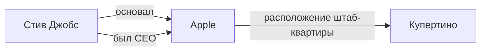
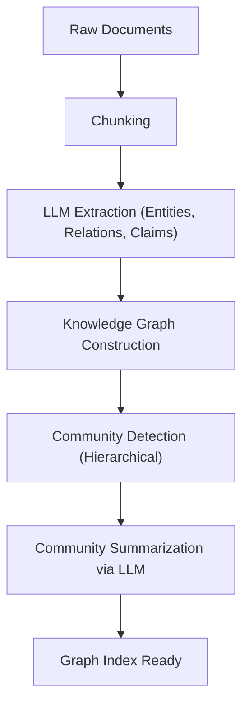

# Эволюция RAG: Интеграция GraphRAG и графов знаний

С появлением больших языковых моделей (LLM) область обработки естественного языка совершила колоссальный скачок в развитии. Однако у самих по себе LLM существуют такие проблемы, как "неспособность работать с новейшей информацией, не включенной в обучающие данные" и "возможность возникновения галлюцинаций". В качестве средства решения этих проблем широкое распространение получил **RAG (Retrieval-Augmented Generation: поисковая генерация)**.

В традиционном RAG основным методом был "векторный поиск", при котором документы разбиваются на фрагменты (чанки), векторизуются, и выполняется поиск по сходству. Однако при работе со сложным контекстом и логическом выводе информации, распределенной по нескольким документам, простой векторный поиск достигает своих пределов. В связи с этим в настоящее время большое внимание привлекает "**GraphRAG**" — интеграция **графов знаний (Knowledge Graph)** и RAG.

В этой статье, начиная с проблем, присущих традиционному RAG на основе векторного поиска, мы подробно и глубоко рассмотрим методы извлечения семантических связей с использованием графов знаний, а также архитектуру GraphRAG и лучшие практики её реализации.

---

## 1. Ограничения традиционного RAG на основе векторного поиска

### Механизм и преимущества векторного поиска

Традиционный RAG работает в основном по следующему сценарию:

1. **Индексирование документов**: Неструктурированные данные компании, такие как PDF-файлы, текстовые документы и внутренние Wiki, считываются и разбиваются на фрагменты определенного размера (чанки).
2. **Генерация эмбеддингов**: Каждый разделенный фрагмент преобразуется в точку в многомерном векторном пространстве с использованием модели эмбеддингов.
3. **Хранение в векторной базе данных**: Сгенерированные векторы сохраняются вместе с исходным текстом в векторной базе данных (Pinecone, Milvus, Qdrant и т.д.).
4. **Поиск и генерация**: Когда пользователь вводит вопрос, текст вопроса также векторизуется. Вычисляется косинусное сходство с векторами в базе данных, и извлекаются наиболее похожие фрагменты. Извлеченные фрагменты встраиваются в промпт LLM в качестве контекста, после чего генерируется ответ.

Этот метод прост и эффективен, он отлично справляется с поиском конкретных фактов или информации, содержащейся в одном документе.

### Сталкивающиеся проблемы и ограничения

Однако в реальных условиях эксплуатации простой RAG на основе векторного поиска начинает обнаруживать несколько фундаментальных ограничений.

#### 1. Сложность "многошагового вывода" (Multi-hop Reasoning) при интеграции множественной информации

Представьте ситуацию, когда вопрос пользователя является сложным, например: "Каково население города, в котором находится университет, который окончил CEO компании А?". Чтобы ответить на этот вопрос, необходимы следующие шаги:
- Найти, что CEO компании А — это "Таро Ямада".
- Найти, что университет, который окончил "Таро Ямада" — это "Токийский университет".
- Найти, что город, в котором находится "Токийский университет" — это "Токио".
- Найти население "Токио".

Векторный поиск может найти фрагмент текста, семантически близкий к строке "CEO компании А", но ему крайне сложно последовательно проследить факты, разбросанные по нескольким документам (многошаговый вывод). Это связано с тем, что эмбеддинги лишь выражают общую "смысловую близость" текста и не сохраняют конкретных логических связей между сущностями.

#### 2. Отсутствие глобального понимания (Global Understanding)

Векторный поиск не работает для широких вопросов (глобальных запросов) ко всему массиву документов, таких как "Какова основная тема в этом наборе данных?" или "Обобщите картину в целом". Поскольку векторный поиск лишь извлекает "локальные сходные части" (k-NN поиск), он не может сгенерировать ответ, охватывающий всю информацию целиком.

#### 3. Дилемма размера чанка и разрыв контекста

При разделении текста на фрагменты вопрос "на фрагменты какого размера следует разбивать" всегда является большой проблемой. Если фрагмент слишком мал, теряется контекст и информация фрагментируется. Наоборот, если он слишком велик, возрастает доля нерелевантного шума, и точность поиска снижается. Хотя существуют методы разделения фрагментов по смысловым границам (семантический чанкинг), потеря контекста из-за "разрезания документа" по своей сути неизбежна.

---

## 2. Что такое граф знаний (Knowledge Graph)?

### Базовые концепции графов знаний

Граф знаний — это представление сущностей реального мира (люди, места, организации, концепции и т.д.) и связей между ними в виде сетевой структуры (графа).

Граф знаний в основном состоит из "узлов (вершин)" и "ребер (дуг)".
- **Узлы (Nodes)**: Представляют сущности. (Пример: "Стив Джобс", "Apple")
- **Ребра (Edges)**: Представляют связи между сущностями. (Пример: "основал", "является CEO")

Эти элементы обычно представляются в виде триплетов (троек) **субъект-предикат-объект (Subject-Predicate-Object)**.
(Пример: `Стив Джобс (Subject) -- основал (Predicate) --> Apple (Object)`)

### Почему RAG нуждается в графах знаний?

В то время как векторный поиск измеряет "расстояние в смысловом пространстве", граф знаний моделирует "четкие связи между фактами". Интеграция графов знаний в RAG дает следующие преимущества:

1. **Точное понимание связей**: Возможность отслеживать четкие логические связи, такие как "A является частью B" или "C владеет D", позволяет радикально сократить количество галлюцинаций.
2. **Сложный логический вывод (многошаговый поиск)**: Обход (траверсирование) узлов графа позволяет осуществлять логический вывод через несколько сущностей.
3. **Обобщение глобальной информации**: Анализируя структуру графа в целом или конкретные сообщества (группы плотно связанных узлов), можно генерировать тренды и резюме для всего массива документов.

---

## 3. Архитектура и процесс обработки GraphRAG

GraphRAG (Graph Retrieval-Augmented Generation) — это метод построения графа знаний из неструктурированного текста и его интеграции в процесс поиска и генерации LLM. Мы подробно рассмотрим шаги на основе архитектуры GraphRAG, предложенной исследовательской группой Microsoft, которая является типичным подходом.

### Фаза 1: Построение индекса (Indexing Phase)

Самой важной и вычислительно затратной фазой GraphRAG является построение графа знаний из неструктурированного текста.

#### 1.1 Фрагментация текста (Text Chunking)
Как и в традиционном RAG, сначала входные документы разбиваются на текстовые фрагменты подходящего размера.

#### 1.2 Извлечение сущностей и связей (Entity & Relationship Extraction)
Здесь находится ядро GraphRAG. С помощью LLM из каждого фрагмента извлекаются сущности (узлы) и связи (ребра).
LLM получает примерно следующий промпт:
"Извлеките из следующего текста всех людей, организации, места и концепции, определите связи между ними и выведите их в формате (Source Node, Relationship, Target Node, Description)."

С помощью этого процесса явные факты в тексте преобразуются в структурированные данные.

#### 1.3 Построение графа и разрешение сущностей (Graph Construction & Entity Resolution)
Извлеченные триплеты объединяются для построения одного гигантского графа. При этом крайне важным становится "Разрешение сущностей (Entity Resolution)".
Например, если из другого фрагмента извлекаются сущности "Apple Inc.", "Apple" и "эта компания", необходимо определить, что они указывают на одно и то же, и объединить их как один узел на графе.

#### 1.4 Обнаружение сообществ и резюмирование (Community Detection & Summarization)
К построенному графу знаний применяются алгоритмы теории графов (например, алгоритм Лэйдена, метод Лувена) для обнаружения групп плотно связанных узлов (сообществ). Эти сообщества представляют собой "темы" или "сюжеты" в наборе данных.
Далее с помощью LLM генерируется резюме каждого сообщества (Community Summary). Выполняя иерархическую кластеризацию, создаются резюме разной степени детализации: от глобального уровня до детального.

### Фаза 2: Поиск и генерация (Query Phase)

После того как индекс построен, наступает фаза генерации ответа на вопрос пользователя. GraphRAG использует различные стратегии поиска (Local Search / Global Search) в зависимости от характера вопроса.

#### 2.1 Локальный поиск (Local Search)
Подходит для подробных вопросов о конкретных сущностях или фактах. (Пример: "Какова была роль господина △△ в инциденте 〇〇?")

1. **Идентификация сущностей**: Извлечение важных сущностей из вопроса пользователя.
2. **Получение узлов**: Нахождение в графе знаний узлов, связанных с извлеченными сущностями.
3. **Сбор контекста**: Сбор ребер (связей), непосредственно связанных с найденными узлами, соответствующих текстовых фрагментов и резюме сообщества, к которому принадлежит этот узел.
4. **Генерация ответа**: Передача собранной информации в LLM в качестве промпта для генерации ответа.

#### 2.2 Глобальный поиск (Global Search)
Подходит для глобальных и обобщающих вопросов, охватывающих весь набор данных. (Пример: "Обобщите основные темы и конфликтные структуры в этом наборе данных")

1. **Параллельная обработка резюме сообществ**: Заранее сгенерированные резюме сообществ передаются в LLM (при необходимости параллельно), чтобы оценить и отфильтровать, насколько каждое резюме полезно для ответа на вопрос.
2. **Генерация промежуточных ответов**: Для каждого резюме сообщества, признанного полезным, генерируется промежуточный ответ (Intermediate Response).
3. **Интеграция окончательного ответа**: Все промежуточные ответы объединяются для формирования окончательного исчерпывающего ответа. Этот процесс близок к концепции Map-Reduce.

---

## 4. Продвинутые методы и проблемы при реализации GraphRAG

Чтобы успешно применять GraphRAG в реальных производственных условиях, необходимо преодолеть несколько технических барьеров.

### Повышение точности извлечения и оптимизация затрат

Поскольку на этапе построения индекса все текстовые фрагменты пропускаются через LLM для извлечения сущностей, потребление токенов (затраты на API) становится огромным.
- **Использование легковесных моделей**: Для задач извлечения можно использовать не гигантские модели класса GPT-4, а дообученные модели малого и среднего размера (Llama 3 8B, Mistral и т.д.) или специализированные модели для извлечения информации (например, GLiNER), что оптимизирует затраты и скорость.
- **Определение онтологии**: Предварительное определение схемы (онтологии) и указание LLM, какие типы сущностей (Person, Organization, TechSkill и т.д.) и связи нужно извлекать, повышает точность и согласованность извлечения.

### Гибридный подход (Vector + Graph)

На самом деле, векторный поиск и GraphRAG не являются взаимоисключающими. Самой мощной архитектурой является **гибридный поиск**, сочетающий их оба.

1. Получение релевантных фрагментов с помощью традиционного векторного поиска по вопросу пользователя.
2. Одновременное получение связанных подструктур графа с помощью локального поиска GraphRAG.
3. Интеграция обоих контекстов и представление их LLM.

Векторный поиск отлично справляется с улавливанием "неявного семантического сходства" и "нюансов", а граф знаний — с фиксацией "явных фактических связей". Их взаимное дополнение позволяет создать чрезвычайно надежную систему RAG.

### Выбор базы данных графов свойств

Важным также является выбор базы данных для хранения графов знаний и выполнения запросов к ним (графовая база данных). Neo4j является самой известной и обладает зрелой экосистемой, но в последние годы популярность также набирают базы данных, интегрирующие функции векторного поиска и графовых запросов (Cypher, Gremlin и т.д.) (NebulaGraph, ArangoDB или конфигурации, объединяющие PostgreSQL с Apache AGE и pgvector).

---

## 5. Заключение и перспективы на будущее

Традиционный RAG на основе векторов значительно продвинул практическое применение генеративного ИИ, но имел ограничения в многошаговом выводе и понимании глобальной структуры. "GraphRAG", интегрирующий графы знаний и RAG, придает данным "семантическую и логическую структуру", позволяя отвечать на более сложные вопросы с большей точностью и реализуя системы ИИ следующего поколения с пониженным уровнем галлюцинаций.

Хотя еще остаются проблемы, требующие решения, такие как высокие затраты на построение и сложность извлечения сущностей, несомненно, что благодаря развитию самих LLM и совершенствованию алгоритмов извлечения GraphRAG станет стандартной архитектурой корпоративного ИИ.

От простого "текстового поиска" к "исследованию сетей знаний". Ожидается, что новые возможности RAG, открываемые GraphRAG, будут и впредь вызывать большие надежды.
