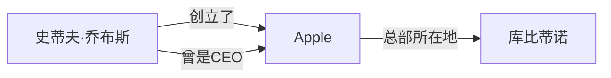
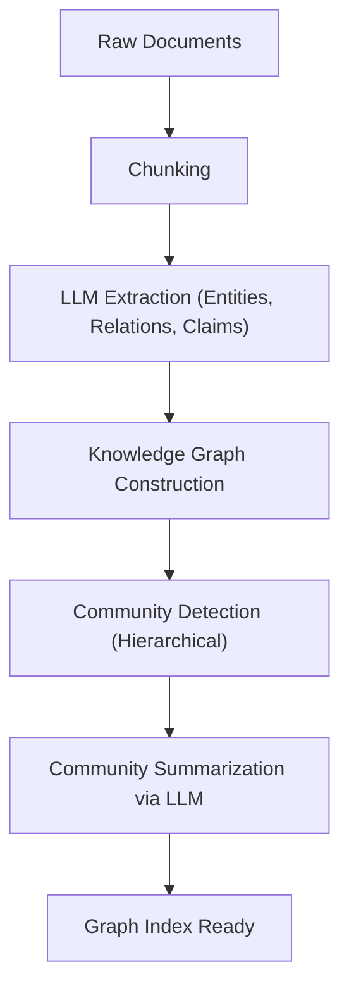

# RAG的进化：GraphRAG与知识图谱的整合

随着大型语言模型（LLM）的崛起，自然语言处理领域取得了飞跃性的进展。然而，仅靠LLM本身存在一些问题，例如“无法应对训练数据中未包含的最新信息”以及“可能产生幻觉（Hallucination）”。作为解决这些问题的手段，**RAG（Retrieval-Augmented Generation：检索增强生成）**得到了广泛的普及。

传统的RAG主要采用“向量检索”的方式，即将文档分割成块（Chunk），将其向量化并进行相似度检索。然而，在处理复杂的上下文或跨越多个文档的信息推理时，简单的向量检索已达到其极限。因此，目前备受瞩目的是将**知识图谱（Knowledge Graph）**与RAG整合而成的“**GraphRAG**”。

本文将从传统的基于向量检索的RAG所面临的挑战出发，深入探讨使用知识图谱提取语义关联的方法，以及GraphRAG的架构及其实现的最佳实践。

---

## 1. 传统的基于向量检索的RAG的局限性

### 向量检索的机制与优势

传统的RAG主要按照以下流程运行：

1. **文档索引化**: 读取企业内部的PDF、文本文件、内部Wiki等非结构化数据，并将其分割成一定大小（Chunk）。
2. **生成嵌入（Embedding）**: 使用嵌入模型将分割后的每个块转换为多维向量空间中的点。
3. **存储至向量数据库**: 将生成的向量连同原始文本一起保存在向量数据库（如Pinecone、Milvus、Qdrant等）中。
4. **检索与生成**: 当用户输入问题时，问题也会同样被向量化，并计算与数据库中向量的余弦相似度等，获取最相似的块。将获取到的块作为上下文嵌入到LLM的提示词（Prompt）中，生成回答。

这种方法简单且强大，非常擅长找出特定事实或记录在单个文档中的信息。

### 面临的挑战与局限性

然而，在实际运行环境中，简单的基于向量检索的RAG开始暴露出一些根本性的局限性。

#### 1. 整合多项信息的“多跳推理（Multi-hop Reasoning）”的困难

考虑一下当用户提出像“A公司CEO毕业的大学所在城市的人口是多少？”这样复杂的问题时的情况。为了回答这个问题，需要以下步骤：
- 找出A公司的CEO是“山田太郎”。
- 找出“山田太郎”毕业的大学是“东京大学”。
- 找出“东京大学”所在的城市是“东京”。
- 找出“东京”的人口。

向量检索虽然能找到与“A公司CEO”这个字符串在语义上相近的文本片段，但像上面这样连锁地追踪散落在多个文档中的事实（多跳推理）是极其困难的。因为嵌入仅仅表达了文本整体的“语义相似度”，并未保留实体之间具体的逻辑关系。

#### 2. 缺乏全局理解（Global Understanding）

对于从大量文档群整体中提出的广泛问题（全局查询），例如“这个数据集中的主要主题是什么？”、“请总结一下全貌”，向量检索无法发挥作用。向量检索只是提取“局部相似部分”（k-NN检索），因此无法生成俯瞰全局的回答。

#### 3. 块大小的困境与上下文的割裂

在将文本分割成块时，“应该分割成多大”始终是一个重大难题。如果块太小，上下文就会丢失，信息会被割裂。反之如果太大，包含无关噪声的比例就会增加，导致检索精度下降。虽然也存在在语义边界上分割块的方法（语义分块），但本质上将文档“切碎”所导致的上下文丢失是不可避免的。

---

## 2. 什么是知识图谱（Knowledge Graph）？

### 知识图谱的基本概念

知识图谱是将现实世界中的实体（人、地点、组织、概念等）以及它们之间的关系以网络结构（图）的形式表现出来的东西。

知识图谱基本上由“节点（Node）”和“边（Edge）”构成。
- **节点（Node）**: 表示实体。（例：“史蒂夫·乔布斯”、“Apple”）
- **边（Edge）**: 表示实体之间的关系。（例：“创立了”、“是CEO”）

这些元素通常以**主语-谓语-宾语（Subject-Predicate-Object）**的三元组（Triple）形式来表达。
（例：`史蒂夫·乔布斯 (Subject) -- 创立了 (Predicate) --> Apple (Object)`）

### 为什么RAG需要知识图谱？

向量检索测量的是“语义空间中的距离”，而知识图谱则对“事实与事实之间明确的关系”进行建模。通过将知识图谱整合到RAG中，可以获得以下优势：

1. **准确把握关系**: 由于可以追踪“A是B的一部分”、“C拥有D”等明确的逻辑关系，因此可以大幅减少幻觉。
2. **复杂的推理（多跳检索）**: 通过遍历图的节点（Traverse），可以实现经过多个实体的推理。
3. **全局信息的总结**: 通过分析整个图结构，或特定的社区（密集连接的节点集合），可以生成整个文档群的趋势或总结。

---

## 3. GraphRAG的架构与处理流程

GraphRAG（Graph Retrieval-Augmented Generation）是一种从非结构化文本中构建知识图谱，并将其整合到LLM的检索和生成过程中的方法。这里将基于代表性的方法，即微软研究团队提出的GraphRAG架构，对其详细步骤进行解说。

### 阶段1：构建索引（Indexing Phase）

GraphRAG中最重要，也是计算成本最高的阶段，就是从非结构化文本中构建知识图谱。

#### 1.1 文本分块 (Text Chunking)
与传统的RAG一样，首先将输入文档分割成适当大小的文本块。

#### 1.2 提取实体与关系 (Entity & Relationship Extraction)
这里是GraphRAG的核心。使用LLM从每个块中提取实体（节点）和关系（边）。
向LLM提供如下提示词：
“请从以下文本中提取所有人物、组织、地点及概念，并识别它们之间的关系，以 (源节点, 关系, 目标节点, 描述) 的格式输出。”

通过这个过程，文本中的显性事实被转换为结构化数据。

#### 1.3 构建图与实体消解 (Graph Construction & Entity Resolution)
将提取出的三元组整合，构建成一个巨大的图。此时，“实体消解（Entity Resolution，实体对齐）”变得极其重要。
例如，如果从不同的块中提取出“Apple Inc.”、“苹果”、“该公司”这些实体，必须识别出它们指的是同一个事物，并在图上将它们整合为同一个节点。

#### 1.4 社区检测与总结 (Community Detection & Summarization)
对构建的知识图谱应用图论算法（例如：Leiden算法、Louvain方法），检测紧密结合的节点组（社区）。这些社区代表了数据集内的“话题”或“主题”。
此外，使用LLM生成每个社区的总结（Community Summary）。通过进行层次聚类，创建从全局级别到细节级别不同粒度的总结。

### 阶段2：检索与生成（Query Phase）

在索引构建完成后，这是生成对用户问题回答的阶段。GraphRAG会根据问题的性质，分别使用不同的检索策略（本地检索 / 全局检索）。

#### 2.1 本地检索（Local Search）
适用于关于特定实体或事实的详细问题。（例：“在〇〇事件中△△先生的角色是什么？”）

1. **锁定实体**: 从用户的问题中提取重要实体。
2. **获取节点**: 从知识图谱中找出与提取的实体相关的节点。
3. **收集上下文**: 收集与找到的节点直接相连的边（关系）、相关的文本块，以及该节点所属社区的总结。
4. **生成回答**: 将收集到的信息作为提示词传递给LLM，让其生成回答。

#### 2.2 全局检索（Global Search）
适用于跨越整个数据集的、大局性的、总结性的问题。（例：“请总结这个数据集的主要主题和对立结构”）

1. **并行处理社区总结**: 针对问题，将事先生成的社区总结（必要时并行）传递给LLM，评估并过滤每个总结对于回答问题有多大用处。
2. **生成中间回答**: 对于被判断为有用的每个社区总结，生成中间回答（Intermediate Response）。
3. **整合最终回答**: 将所有中间回答整合，生成最终的综合回答。这是一种类似于Map-Reduce概念的处理。

---

## 4. GraphRAG实现中的高级技巧与挑战

为了在实际运行环境中成功实施GraphRAG，必须跨越一些技术难关。

### 提高提取精度与优化成本

在构建索引阶段，由于需要将所有文本块通过LLM进行实体提取，因此Token消耗量（API成本）将非常庞大。
- **利用轻量级模型**: 在提取任务中，不使用GPT-4级别的巨大模型，而是使用经过微调的中小型模型（Llama 3 8B、Mistral等）或专用于信息提取的模型（如GLiNER等），可以优化成本和速度。
- **定义本体（Ontology）**: 事先定义模式（本体）来指示LLM希望提取什么样的实体类型（Person、Organization、TechSkill等）和关系，从而提高提取的精度和一致性。

### 混合方法（Vector + Graph）

实际上，向量检索和GraphRAG并不是互斥的。最强大的架构是将两者结合的**混合检索（Hybrid Search）**。

1. 针对用户的问题，通过传统的向量检索获取相关块。
2. 同时，通过GraphRAG的本地检索获取相关的图子结构。
3. 将两种上下文整合后提示给LLM。

向量检索擅长捕捉“隐含的语义相似性”和“细微差别”，而知识图谱则擅长捕捉“明确的事实关系”。通过使两者互补，可以实现极其稳健的RAG系统。

### 属性图数据库的选择

选择用于保存和查询知识图谱的数据库（图数据库）也非常重要。Neo4j是最有名的且生态系统成熟，但近年来，集成了向量检索功能和图查询（Cypher或Gremlin等）的数据库（NebulaGraph、ArangoDB，或PostgreSQL结合Apache AGE或pgvector的架构）也备受欢迎。

---

## 5. 总结与未来展望

传统的基于向量的RAG极大地推进了生成式AI的实用化，但在多跳推理和全局结构的理解上存在局限性。整合了知识图谱和RAG的“GraphRAG”，通过赋予数据“语义和逻辑结构”，能够回答更准确、更复杂的问题，并实现抑制幻觉的新一代AI系统。

虽然目前仍有构建成本高、实体提取难度大等需要解决的课题，但随着LLM本身的进化和提取算法的精炼，GraphRAG毫无疑问将成为企业AI的标准架构。

从单纯的“文本检索”迈向“知识的网络探索”。人们对GraphRAG开拓RAG新可能性的未来充满期待。
