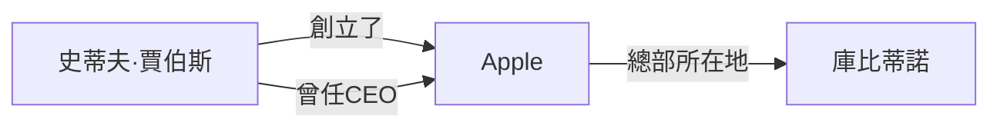
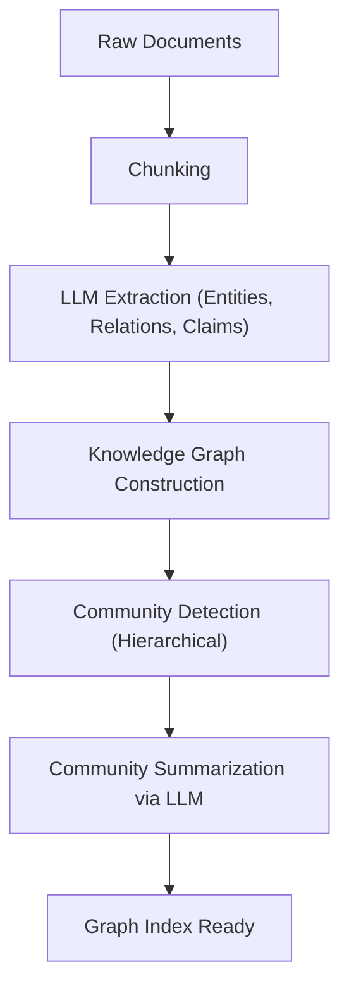

# RAG的進化型：GraphRAG與知識圖譜的整合

隨著大型語言模型（LLM）的崛起，自然語言處理領域取得了突破性的進展。然而，單靠LLM本身仍存在一些挑戰，例如「無法應對訓練數據中未包含的最新資訊」以及「可能會產生幻覺（Hallucination）」。為了解決這些問題而廣泛普及的技術就是**RAG（Retrieval-Augmented Generation：檢索增強生成）**。

傳統的RAG主要是將文件分割為區塊（Chunk），進行向量化後再執行相似度搜尋，也就是以「向量搜尋」為主流。然而，在處理複雜的上下文或跨越多份文件的資訊推理時，單純的向量搜尋已經達到了極限。因此，目前備受矚目的是將**知識圖譜（Knowledge Graph）**與RAG整合而成的「**GraphRAG**」。

本文將從傳統基於向量搜尋的RAG所面臨的問題出發，深入且詳細地探討如何使用知識圖譜來萃取語意連結，並解析GraphRAG的架構及其最佳實踐。

---

## 1. 傳統基於向量搜尋的RAG之極限

### 向量搜尋的機制與優勢

傳統的RAG主要依照以下流程運作：

1. **文件索引化**: 讀取企業內的PDF、純文字檔、內部Wiki等非結構化資料，並將其分割成固定大小的文本區塊（Chunk）。
2. **生成嵌入（Embedding）**: 將分割後的各個區塊，利用嵌入模型轉換為多維向量空間中的點。
3. **儲存至向量資料庫**: 將生成的向量連同原始文本一起儲存到向量資料庫中（如Pinecone, Milvus, Qdrant等）。
4. **搜尋與生成**: 當使用者輸入問題時，會將問題同樣轉換為向量，並計算其與資料庫中向量的餘弦相似度等，取得最相似的區塊。接著將取得的區塊作為上下文嵌入到LLM的提示詞中，從而生成回答。

這種方法簡單而強大，在找出特定事實或記載於單一文件中的資訊方面非常擅長。

### 面臨的挑戰與限制

然而，在實際應用環境中，單純基於向量搜尋的RAG開始暴露出幾個根本性的限制。

#### 1. 難以進行整合多項資訊的「多跳推理（Multi-hop Reasoning）」

想像一下使用者提出了這類複雜的問題：「A公司CEO畢業大學所在城市的總人口數是多少？」。要回答這個問題，需要以下幾個步驟：
- 找出A公司的CEO是「山田太郎」。
- 找出「山田太郎」畢業的大學是「東京大學」。
- 找出「東京大學」所在的城市是「東京」。
- 找出「東京」的人口數。

向量搜尋雖然能找到與「A公司CEO」這個字串語意相近的文字片段，但要像上述那樣連鎖式地追蹤散落在多份文件中的事實（多跳推理）卻極其困難。因為嵌入（Embedding）終究只能呈現文本整體的「語意相近程度」，並未保留實體（Entity）之間具體的邏輯關係。

#### 2. 缺乏全局理解（Global Understanding）

針對涵蓋大量文件群體的廣泛問題（Global Query），例如「這個資料集的主要主題是什麼？」、「請總結整體概況」，向量搜尋是無法發揮作用的。因為向量搜尋只是萃取出「局部相似的部分」（k-NN搜尋），無法生成俯瞰整體的回答。

#### 3. 區塊大小的兩難與上下文的斷裂

在將文字分割成區塊時，「應該分割成多大」始終是一個巨大的挑戰。區塊太小會失去上下文，導致資訊斷裂。反之若區塊太大，包含無關雜訊的比例就會升高，導致搜尋準確度下降。雖然也有基於語意邊界來分割區塊的方法（Semantic Chunking），但本質上因「切割文件」所造成的上下文遺失是無可避免的。

---

## 2. 什麼是知識圖譜（Knowledge Graph）？

### 知識圖譜的基本概念

知識圖譜是將現實世界中的實體（人物、地點、組織、概念等）以及它們之間的關係，以網路結構（圖）的形式表現出來的模型。

知識圖譜基本上由「節點（Node）」與「邊（Edge）」所構成。
- **節點（Node）**: 代表實體。（例：「史蒂夫·賈伯斯」、「Apple」）
- **邊（Edge）**: 代表實體之間的關係。（例：「創立了」、「是其CEO」）

這些元素通常以**主詞-動詞-受詞（Subject-Predicate-Object）**的三元組（Triple）來表示。
（例：`史蒂夫·賈伯斯 (Subject) -- 創立了 (Predicate) --> Apple (Object)`）

### 為什麼RAG需要知識圖譜？

向量搜尋衡量的是「語意空間中的距離」，而知識圖譜則對「事實與事實之間明確的關係」進行建模。將知識圖譜整合至RAG中，可獲得以下優勢：

1. **準確掌握關係**: 由於能追蹤「A是B的一部分」、「C擁有D」這類明確的邏輯關係，因此能大幅減少幻覺（Hallucination）。
2. **複雜的推理（多跳搜尋）**: 透過遊走（Traverse）圖形中的節點，就能實現跨越多個實體的推理。
3. **全局資訊的總結**: 藉由分析整個圖形結構，或是特定的社群（密集連結的節點群體），就能夠生成整個文件群體的趨勢或摘要。

---

## 3. GraphRAG的架構與處理流程

GraphRAG（Graph Retrieval-Augmented Generation）是一種從非結構化文本中建構知識圖譜，並將其整合至LLM搜尋與生成流程中的手法。以下我們將以Microsoft研究團隊提出的代表性GraphRAG架構為基礎，解說其詳細步驟。

### 階段1：建構索引（Indexing Phase）

GraphRAG最重要，同時也是計算成本最高的階段，就是從非結構化文本中建構知識圖譜。

#### 1.1 文本區塊化 (Text Chunking)
與傳統RAG相同，首先會將輸入文件分割成合適大小的文本區塊。

#### 1.2 萃取實體與關係 (Entity & Relationship Extraction)
這裡是GraphRAG的核心。利用LLM從各個區塊中萃取出實體（節點）與關係（邊）。
我們會給予LLM類似以下的提示詞：
「請從以下文本中，萃取出所有的人物、組織、地點與概念，並識別它們之間的關係，然後以 (Source Node, Relationship, Target Node, Description) 的格式輸出。」

透過這個過程，文本中的明示事實就會轉換為結構化的數據。

#### 1.3 建構圖譜與實體消歧 (Graph Construction & Entity Resolution)
將萃取出的三元組整合起來，建構出一個巨大的圖譜。此時，「實體消歧（Entity Resolution）」會變得極為重要。
例如，若是從不同的區塊中萃取出「Apple Inc.」、「蘋果公司」、「該公司」等實體，就必須識別出它們指涉的是同一個事物，並在圖譜上將其整合為同一個節點。

#### 1.4 社群偵測與總結 (Community Detection & Summarization)
對建構好的知識圖譜套用圖論演算法（如：Leiden演算法、Louvain方法），以偵測出緊密結合的節點群體（社群）。這些社群代表了資料集內的「主題」或「議題」。
此外，再使用LLM生成各個社群的摘要（Community Summary）。透過階層式分群，就能建立從全局層次到詳細層次、不同粒度的摘要。

### 階段2：搜尋與生成（Query Phase）

在索引建構完成後，便是生成使用者問題回答的階段。GraphRAG會根據問題的性質，採用不同的搜尋策略（Local Search / Global Search）。

#### 2.1 局部搜尋（Local Search）
適用於關於特定實體或事實的詳細問題。（例：「某某事件中△△先生的角色為何？」）

1. **鎖定實體**: 從使用者的問題中萃取出重要的實體。
2. **取得節點**: 從知識圖譜中找出與萃取出的實體相關聯的節點。
3. **蒐集上下文**: 蒐集與找到的節點直接相連的邊（關係）、相關的文本區塊，以及該節點所屬社群的摘要。
4. **生成回答**: 將蒐集到的資訊作為提示詞傳遞給LLM，讓其生成回答。

#### 2.2 全局搜尋（Global Search）
適用於跨越整個資料集的全局性、總結性的問題。（例：「請總結這個資料集的主要主題與對立結構」）

1. **社群摘要的平行處理**: 針對問題，將事先生成的社群摘要（視需要可平行處理）傳遞給LLM，評估並過濾出每個摘要對回答問題有多大幫助。
2. **生成中間回答**: 針對被判定為有幫助的社群摘要，分別生成中間回答（Intermediate Response）。
3. **整合最終回答**: 整合所有的中間回答，生成最終的綜合性回答。這種類似於Map-Reduce概念的處理方式。

---

## 4. GraphRAG實作上的進階技巧與挑戰

為了讓GraphRAG在實際應用環境中獲得成功，必須克服幾個技術上的門檻。

### 提升萃取準確度與成本最佳化

在建構索引的階段，因為必須將所有的文本區塊送交LLM進行實體萃取，所以代幣（Token）消耗量（API成本）會非常龐大。
- **活用輕量級模型**: 在萃取任務上，不使用GPT-4等級的巨大模型，而是使用經過微調的中小型模型（Llama 3 8B, Mistral等）或是專門用於資訊萃取的模型（如GLiNER），就能最佳化成本與速度。
- **定義本體論（Ontology）**: 預先定義出想要萃取哪些實體類型（Person, Organization, TechSkill等）與關係的綱要（Ontology）並指示LLM，就能提升萃取的準確度與一致性。

### 混合式方法（Vector + Graph）

實際上，向量搜尋與GraphRAG並非互斥的。最強大的架構是將兩者結合的**混合搜尋（Hybrid Search）**。

1. 針對使用者的問題，先以傳統向量搜尋取得相關區塊。
2. 同時，利用GraphRAG的局部搜尋取得相關的圖譜子結構。
3. 將兩邊的上下文整合起來提供給LLM。

向量搜尋擅長捕捉「隱含的語意相似性」與「細微差別」，而知識圖譜擅長捕捉「明確的事實關係」。讓兩者互補，就能實現極其穩健的RAG系統。

### 屬性圖資料庫的選擇

選擇用於儲存與查詢知識圖譜的資料庫（圖資料庫）也非常重要。Neo4j是最知名且生態系最成熟的選項，但近年來整合了向量搜尋功能與圖查詢（如Cypher或Gremlin）的資料庫（NebulaGraph, ArangoDB，或是PostgreSQL搭配Apache AGE及pgvector的架構）也越來越受歡迎。

---

## 5. 總結與未來展望

傳統基於向量的RAG大幅推動了生成式AI的實用化，但在多跳推理與理解整體結構方面存在局限。將知識圖譜與RAG整合而成的「GraphRAG」，透過賦予資料「語意與邏輯結構」，能更準確地回答更複雜的問題，並抑制幻覺，實現次世代的AI系統。

雖然還有建構成本高昂、實體萃取難度等問題需要解決，但隨著LLM本身的進化以及萃取演算法的精進，GraphRAG無疑將成為企業級AI的標準架構。

從單純的「文本搜尋」邁向「知識的網路探索」。GraphRAG所開創的全新RAG可能性，未來也將持續備受期待。
