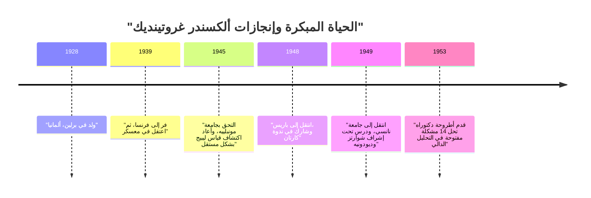
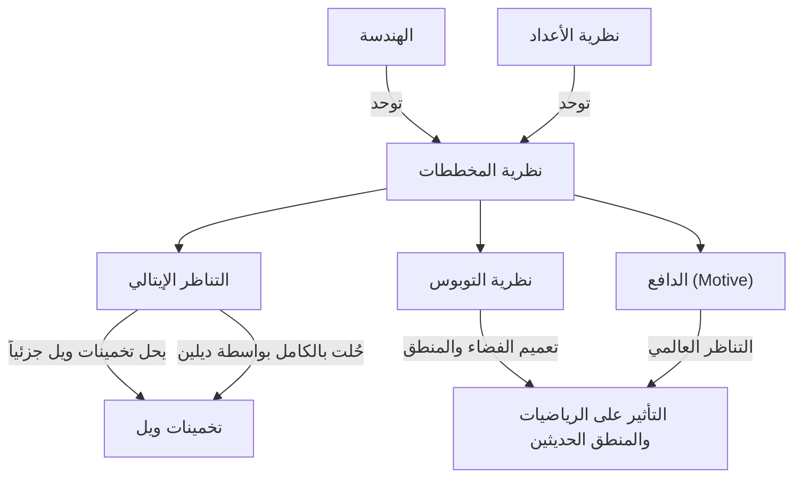

# [ألكسندر غروتينديك: حياة وإنجازات أعظم عالم رياضيات في القرن العشرين](https://kenji.blog/ar/p/grothendieck/)

[ألكسندر غروتينديك](https://kenji.blog/ar/p/grothendieck/) هو أحد أعظم علماء الرياضيات في التاريخ الذي أحدث تحولًا أساسيًا في النموذج الرياضي في أواخر القرن العشرين، خاصة في مجال الهندسة الجبرية. تجاوزت إنجازاته مجرد حل المشكلات المفتوحة الفردية؛ فقد أعادت بناء لغة الرياضيات نفسها وإطارها المفاهيمي من الأساس. في هذه المقالة، سنقدم شرحًا مفصلاً لحياته الاستثنائية والدرامية، بالإضافة إلى تأثيره الذي لا يُقاس على الرياضيات الحديثة.

## 1. طفولة مضطربة وظل الحرب

كانت حياة غروتينديك فريدة ومليئة بالصعاب تمامًا مثل إنجازاته الرياضية.

### آباء أناركيون وميلاده في برلين

ولد غروتينديك في برلين، ألمانيا في عام 1928، ونشأ على يد أبوين أناركيين متطرفين. كان والده، ساشا شابيرو، يهوديًا روسي المولد فر إلى ألمانيا بعد أن فقد ذراعه بسبب الاضطهاد أثناء الثورة الروسية. كانت والدته، هانكا غروتينديك، صحفية ألمانية. كان كلا الوالدين منخرطين بشدة في النشاط السياسي، وقضى الشاب ألكسندر جزءًا من طفولته المبكرة في العيش مع عائلات حاضنة.

### الحياة كلاجئ ومعسكرات الاعتقال

عندما استولى النازيون على السلطة في ألمانيا في عام 1933، شعر والده اليهودي والأناركي أن حياته في خطر وهرب إلى فرنسا، وتبعته والدته لاحقًا. بقي ألكسندر مع والديه بالتبني في ألمانيا حتى عام 1939، عندما سافر إلى فرنسا للانضمام إلى والديه مع اقتراب خطوات الحرب.

ومع ذلك، مع اندلاع الحرب العالمية الثانية، اتخذ مصير الأسرة منعطفًا مظلمًا. أُرسل والده إلى معسكر اعتقال أوشفيتز، حيث لقي حتفه. تم اعتقال ألكسندر ووالدته في معسكر ريوكروس في فرنسا. حتى في ظل هذه الظروف القاسية، يُقال إنه أظهر لمحة من تركيزه الاستثنائي وموهبته في الرياضيات في مدرسة المعسكر. في وقت لاحق، تم إخفاؤه في منزل في قرية لو شامبون سور لينيون البروتستانتية، حيث تمكن من تلقي التعليم الثانوي.

## 2. ظهور صادم في عالم الرياضيات

بعد الحرب، بدأ غروتينديك في متابعة الرياضيات بجدية، لكن مساره كان غير تقليدي للغاية.

### إعادة اكتشاف "الحجم" في جامعة مونبلييه

في عام 1945، التحق بجامعة مونبلييه. لم يكن مستوى التعليم الرياضي هناك في ذلك الوقت مرتفعًا بالضرورة، ولعدم رضاه عن المحاضرات، حاول أن يحدد بدقة مفاهيم "الطول" و"المساحة" و"الحجم" بمفرده. وبدون مساعدة من المعلمين، أعاد بناء نظرية "قياس ليبيج"، التي أسسها مسبقًا هنري ليبيج، بمفرده تمامًا. توضح هذه القصة موقفه المتأصل المتمثل في التفكير في الأشياء من أسسها دون الاعتماد على المعرفة الموجودة.

### الأسطورة في نانسي: 14 مشكلة غير محلولة

في عام 1948، انتقل إلى باريس، مركز الرياضيات، وشارك في الندوة الأسطورية التي استضافها هنري كارتان وآخرون في المدرسة العليا للأساتذة. ومع ذلك، وبمواجهة فجوة في معرفته بالرياضيات المتطورة، تعرض لانتكاسة مؤقتة.

ثم انتقل إلى جامعة نانسي، حيث أشرف عليه اثنان من علماء الرياضيات البارزين، وهما لوران شوارتز وجان ديودونيه. في أحد الأيام، قدم شوارتز وديودونيه إلى غروتينديك 14 مشكلة غير محلولة تركت مفتوحة في أوراقهما المنشورة مؤخرًا.

ولدهشتهما، بعد بضعة أشهر، عاد غروتينديك وقدم ملاحظات **حلت المشاكل الـ 14 غير المحلولة بالكامل** . ابتكر مفاهيم جديدة تمامًا، مثل "حاصل الضرب الموتري الطوبولوجي" و"الفضاء النووي"، ليمسح المشاكل من جذورها. وبفضل هذا الإنجاز، اكتسب على الفور شهرة عالمية في مجال التحليل الدالي.

## 3. إعادة بناء الهندسة الجبرية: العصر الذهبي في معهد الدراسات العلمية المتقدمة (IHÉS)

بعد بلوغ قمة التحليل الدالي، حوّل تركيزه البحثي بشكل مفاجئ إلى مجالات مختلفة تمامًا: "الهندسة الجبرية" و"الجبر التماثلي".

### ورقة توهوكو

تُعد ورقته البحثية "Sur quelques points d'algèbre homologique" (حول بعض نقاط الجبر التماثلي)، التي نُشرت في المجلة اليابانية *Tohoku Mathematical Journal* في عام 1957، ورقة تاريخية دمجت نظرية الفئات والجبر التماثلي، مؤسسةً مفهوم **الفئة الأبيلية ([Abel](https://kenji.blog/ar/p/abel/)ian Category)** . وقد أتاح هذا تحديد تناظر الحزم بشكل دقيق فوق أي فضاء طوبولوجي.

### تأسيس IHÉS و EGA/SGA

في عام 1958، تم تأسيس معهد الدراسات العلمية المتقدمة (IHÉS) في فرنسا، وتم الترحيب بغروتينديك كعضو مؤسس وأستاذ في قسم الرياضيات التابع له. كانت الـ 12 عامًا التالية بمثابة "عصره الذهبي".

إلى جانب جان ديودونيه، وجان بيير سير وآخرين، شرع في مشروع ضخم لإعادة كتابة أسس الهندسة الجبرية بالكامل. أصبح هذا العمل يُعرف باسم *Éléments de géométrie algébrique* (المعروف اختصارًا بـ **EGA** ). علاوة على ذلك، تم نشر سجلات الندوات التي عُقدت تحت إدارته باسم *Séminaire de Géométrie Algébrique* (المعروف اختصارًا بـ **SGA** ). إنها أعمال ضخمة تمتد لآلاف الصفحات، ولا تزال تُقرأ اليوم على أنها "النصوص المقدسة" للهندسة الجبرية الحديثة.

## 4. مفاهيم رياضية ثورية

كانت أعظم مساهمة لغروتينديك هي تعميم كائنات الرياضيات بشكل أساسي وتقديم لغة جديدة وحدت الحقول التي تبدو متباينة.

### نظرية المخططات (Scheme Theory)

تقليديًا، تمت دراسة الهندسة الجبرية عبر "الحقول" مثل الأعداد المركبة. دفع غروتينديك هذا المفهوم إلى أقصى حدوده من خلال تقديم مفهوم **المخطط (Scheme)** .

بالنسبة للحلقة التبادلية $R$، فإن مجموعة جميع مُثُلها الأولية المزوّدة بطوبولوجيا وحزمة بنيوية تُسمى مخططًا تآلفيًا، ويُشار إليها بـ $\text{Spec}(R)$.

$$ \text{Spec}(R) = \{ \mathfrak{p} \mid \mathfrak{p} \text{ هو مثال أولي لـ } R \} $$

سمح هذا للأسئلة في نظرية الأعداد — مثل إيجاد حلول صحيحة للمعادلات — أن تُعامل كخصائص هندسية للفضاءات.

### التناظر الإيتالي وتخمينات ويل

كان أحد الأهداف الرئيسية لغروتينديك هو إثبات "تخمينات ويل" المتعلقة بالتنوعات الجبرية فوق الحقول المنتهية. وسع المفهوم الكلاسيكي للفضاءات الطوبولوجية وأسس نظرية جديدة تمامًا تسمى **التناظر الإيتالي (Étale Cohomology)** . باستخدام هذا السلاح القوي، أثبت جزءًا من تخمينات ويل، وتم إثبات الجزء الأخير من قبل طالبه اللامع، بيير ديلين.

### نظرية التوبوس والدوافع (Motives)

ارتقى تفكير غروتينديك إلى أعلى في سلم التجريد. ابتكر مفهوم **التوبوس (Topos)** ، والذي يعمم مفهوم الفضاء بحد ذاته.

علاوة على ذلك، اقترح مفهوم **الدافع (Motive)** ككائن عالمي يدمج مختلف نظريات التناظر (cohomology) المختلفة. لا تزال نظرية الدوافع غير مفهومة تمامًا اليوم وتظل أحد أعظم موضوعات الاستكشاف في الرياضيات الحديثة.

## 5. فلسفته الفريدة: تشبيه كسارة البندق

شرح غروتينديك نهجه الرياضي باستخدام تشبيه "كسارة البندق". عند محاولة فتح جوزة صلبة (مشكلة صعبة)، بدلاً من ضربها بقوة بمطرقة، كان يفضل نقع الجوزة في الماء، والانتظار حتى تلين بمرور الوقت، وترك القشرة تنفتح بشكل طبيعي. بعبارة أخرى، كان يفضل **"بناء بحر قوي وواسع من النظرية تذوب فيه المشكلة بشكل طبيعي"** بدلاً من حلها مباشرة.

## 6. رسومات الأطفال والهندسة اللابيلية

دخولًا في ثمانينيات القرن الماضي، اقترح نظريات جديدة تقترب من أعمق أسرار الرياضيات انطلاقًا من مفاهيم بسيطة ومرئية للغاية.

أحدها كان **"رسومات الأطفال" (Dessins d'enfants)** . اكتشف أنه من الرسوم البيانية البسيطة المرسومة على الأسطح المنحنية مثل الكرة، يمكن للمرء استخراج عمل زمرة جالوا المطلقة، وهي كائن غامض ومعقد للغاية في نظرية الأعداد.

علاوة على ذلك، اقترح برنامجًا يسمى **"الهندسة اللابيلية" (Anabelian Geometry)** . هذا هو التخمين المذهل بأنه بالنسبة لبعض التنوعات الجبرية، يمكن إعادة بناء الكائنات الهندسية والحسابية الأصلية بالكامل فقط من البيانات الطوبولوجية المعروفة باسم الزمرة الأساسية.

## 7. التقاعد المفاجئ والطريق إلى العزلة

على الرغم من فوزه بميدالية فيلدز في عام 1966، استقال غروتينديك فجأة من IHÉS في عام 1970 احتجاجًا بعد أن علم أن جزءًا من تمويلها جاء من وزارة القوات المسلحة. في وقت لاحق، غمر نفسه في الحركات البيئية والمناهضة للحرب.

في الثمانينيات، كتب مذكرات ضخمة بعنوان *حصاد وبذر* (Récoltes et Semailles). في عام 1991، قطع كل اتصالاته بعائلته وأصدقائه وذهب إلى العزلة في قرية صغيرة عند سفح جبال البرانس في جنوب فرنسا. حتى وفاته عن عمر يناهز 86 عامًا في عام 2014، لم يقابل أحداً، واستمر في أفكاره وكتاباته في عزلة تامة.

## خاتمة

كان [ألكسندر غروتينديك](https://kenji.blog/ar/p/grothendieck/) عملاقًا جلب مشهدًا جديدًا تمامًا لتخصص الرياضيات. تتجاوز المفاهيم التي تركها وراءه مجرد الإطار الرياضي، لتُظهر إمكانيات توسيع التفكير المنطقي البشري. إن العالم العميق الذي تأمله لا يزال يؤتي ثمارًا غنية حتى يومنا هذا.
