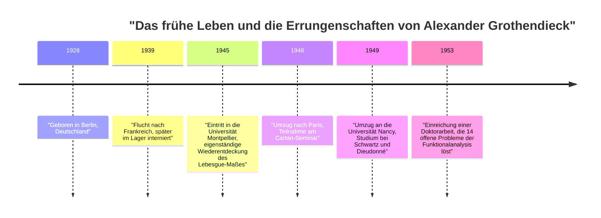
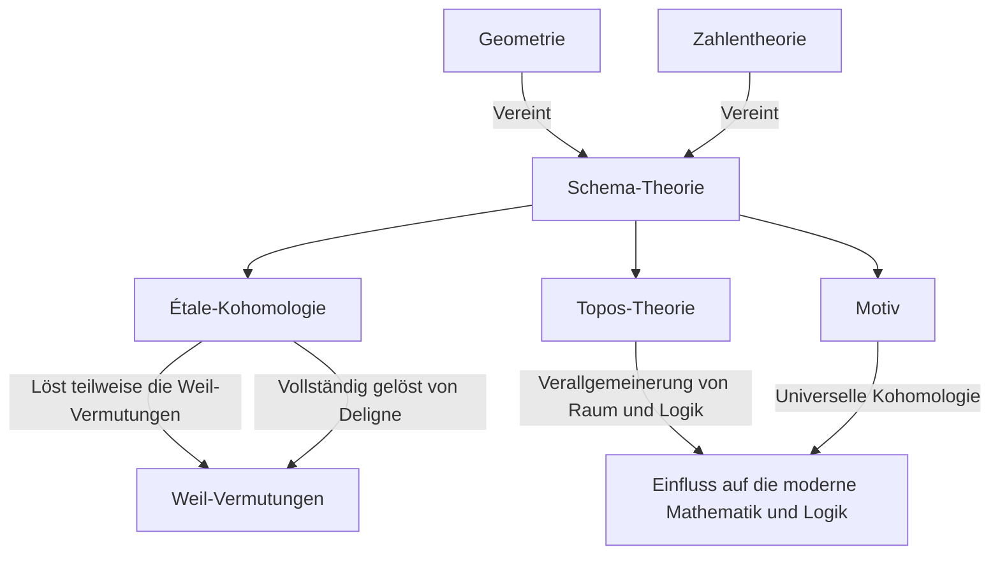

# [Alexander Grothendieck: Leben und Werk des größten Mathematikers des 20. Jahrhunderts](https://kenji.blog/p/grothendieck/)

[Alexander Grothendieck](https://kenji.blog/de/p/grothendieck/) ist einer der größten Mathematiker der Geschichte, der in der Mathematikergemeinschaft des späten 20. Jahrhunderts, insbesondere im Bereich der algebraischen Geometrie, einen grundlegenden Paradigmenwechsel herbeiführte. Seine Errungenschaften gingen weit über die Lösung einzelner offener Probleme hinaus; sie rekonstruierten die Sprache und den konzeptionellen Rahmen der Mathematik selbst von Grund auf. In diesem Artikel geben wir eine detaillierte Erklärung seines außergewöhnlichen und dramatischen Lebens sowie seines unermesslichen Einflusses auf die moderne Mathematik.

## 1. Eine turbulente Kindheit und der Schatten des Krieges

Grothendiecks Leben war so einzigartig und voller Härten wie seine mathematischen Errungenschaften.

### Anarchistische Eltern und Geburt in Berlin

Grothendieck wurde 1928 in Berlin, Deutschland, geboren und wuchs bei radikalen anarchistischen Eltern auf. Sein Vater, Sascha Schapiro, war ein in Russland geborener Jude, der nach Deutschland geflohen war, nachdem er bei Verfolgungen während der Russischen Revolution einen Arm verloren hatte. Seine Mutter, Hanka Grothendieck, war eine deutsche Journalistin. Beide Eltern waren stark im politischen Aktivismus engagiert, und der junge Alexander verbrachte einen Teil seiner frühen Kindheit bei Pflegeeltern.

### Leben als Flüchtling und in Internierungslagern

Als die Nationalsozialisten 1933 in Deutschland die Macht ergriffen, sah sein jüdischer und anarchistischer Vater sein Leben in Gefahr und floh nach Frankreich, später gefolgt von der Mutter. Alexander blieb bis 1939 bei seinen Pflegeeltern in Deutschland, als er nach Frankreich reiste, um sich seinen Eltern anzuschließen, während der Krieg näher rückte.

Mit dem Ausbruch des Zweiten Weltkriegs nahm das Schicksal der Familie jedoch eine dunkle Wendung. Sein Vater wurde in das Konzentrationslager Auschwitz deportiert, wo er umkam. Alexander und seine Mutter wurden im Lager Rieucros in Frankreich interniert. Selbst unter diesen harten Bedingungen soll er an der Lagerschule seine außergewöhnliche Konzentration und sein Talent für die Mathematik gezeigt haben. Später wurde er in einem Haus im protestantischen Dorf Le Chambon-sur-Lignon versteckt, wo er eine weiterführende Schulbildung erhalten konnte.

## 2. Ein schockierendes Debüt in der Mathematikwelt

Nach dem Krieg begann Grothendieck ernsthaft, Mathematik zu studieren, aber sein Weg war höchst unkonventionell.

### Die Wiederentdeckung des "Volumens" an der Universität Montpellier

1945 trat er in die Universität Montpellier ein. Das Niveau der mathematischen Ausbildung dort war damals nicht unbedingt hoch, und unzufrieden mit den Vorlesungen versuchte er, die Konzepte von "Länge", "Fläche" und "Volumen" selbst streng zu definieren. Ohne die Hilfe von Lehrern rekonstruierte er völlig eigenständig die Theorie des "Lebesgue-Maßes", die zuvor von Henri Lebesgue aufgestellt worden war. Diese Episode zeigt seine angeborene Haltung, Dinge von Grund auf zu durchdenken, ohne sich auf bestehendes Wissen zu verlassen.

### Die Legende in Nancy: 14 ungelöste Probleme

1948 zog er nach Paris, dem Zentrum der Mathematik, und nahm am legendären Seminar teil, das von Henri Cartan und anderen an der École Normale Supérieure veranstaltet wurde. Da er jedoch eine Lücke in seinem Wissen über modernste Mathematik feststellte, erlebte er einen vorübergehenden Rückschlag.

Er wechselte dann an die Universität Nancy, wo er von zwei herausragenden Mathematikern, Laurent Schwartz und Jean Dieudonné, betreut wurde. Eines Tages legten Schwartz und Dieudonné Grothendieck 14 ungelöste Probleme vor, die in ihren kürzlich veröffentlichten Arbeiten offengeblieben waren.

Zu ihrem Erstaunen kehrte Grothendieck wenige Monate später zurück und reichte Notizen ein, die **alle 14 ungelösten Probleme vollständig lösten** . Er schuf völlig neue Konzepte, wie das "topologische Tensorprodukt" und den "nuklearen Raum", und beseitigte die Probleme von Grund auf. Mit dieser Leistung erlangte er auf dem Gebiet der Funktionalanalysis sofort weltweite Berühmtheit.

## 3. Die Rekonstruktion der algebraischen Geometrie: Das goldene Zeitalter am IHÉS

Nachdem er den Gipfel der Funktionalanalysis erreicht hatte, verlagerte er seinen Forschungsschwerpunkt überraschenderweise auf völlig andere Gebiete: die "algebraische Geometrie" und die "homologische Algebra".

### Das Tohoku-Papier

Seine 1957 im japanischen *Tohoku Mathematical Journal* veröffentlichte Arbeit "Sur quelques points d'algèbre homologique" (Über einige Punkte der homologischen Algebra) ist eine historische Arbeit, die die Kategorientheorie und die homologische Algebra verschmolz und das Konzept einer **[Abel](https://kenji.blog/de/p/abel/)schen Kategorie** etablierte. Dies ermöglichte es, die Garbenkohomologie über jedem topologischen Raum rigoros zu definieren.

### Die Gründung des IHÉS und EGA/SGA

1958 wurde das Institut des Hautes Études Scientifiques (IHÉS) in Frankreich gegründet, und Grothendieck wurde als Gründungsmitglied und Professor in dessen mathematischer Abteilung aufgenommen. Die folgenden 12 Jahre markierten sein "goldenes Zeitalter".

Zusammen mit Jean Dieudonné, Jean-Pierre Serre und anderen startete er ein monumentales Projekt, um die Grundlagen der algebraischen Geometrie vollständig neu zu schreiben. Daraus entstanden die *Éléments de géométrie algébrique* (allgemein bekannt als **EGA** ). Darüber hinaus wurden die Aufzeichnungen der unter seiner Leitung durchgeführten Seminare als *Séminaire de Géométrie Algébrique* (allgemein bekannt als **SGA** ) veröffentlicht. Dies sind massive Werke von Tausenden von Seiten, die noch heute als die "heiligen Texte" der modernen algebraischen Geometrie gelesen werden.

## 4. Revolutionäre mathematische Konzepte

Grothendiecks größter Beitrag bestand darin, die Objekte der Mathematik grundlegend zu verallgemeinern und eine neue Sprache bereitzustellen, die scheinbar unterschiedliche Bereiche vereinte.

### Schema-Theorie

Traditionell wurde die algebraische Geometrie über "Körpern" wie den komplexen Zahlen studiert. Grothendieck trieb dieses Konzept an seine Grenzen, indem er das Konzept eines **Schemas** einführte.

Für einen kommutativen Ring $R$ wird die Menge all seiner Primideale, versehen mit einer Topologie und einer Strukturgarbe, als affines Schema bezeichnet, notiert als $\text{Spec}(R)$.

$$ \text{Spec}(R) = \{ \mathfrak{p} \mid \mathfrak{p} \text{ ist ein Primideal von } R \} $$

Dies ermöglichte es, Probleme der Zahlentheorie – wie das Finden ganzzahliger Lösungen für Gleichungen – als geometrische Eigenschaften von Räumen zu behandeln.

### Étale-Kohomologie und die Weil-Vermutungen

Eines von Grothendiecks Hauptzielen war es, die "Weil-Vermutungen" bezüglich algebraischer Varietäten über endlichen Körpern zu beweisen. Er erweiterte das klassische Konzept topologischer Räume und begründete eine völlig neue Theorie namens **Étale-Kohomologie** . Mit dieser mächtigen Waffe bewies er einen Teil der Weil-Vermutungen, und der letzte Teil wurde von seinem brillanten Studenten Pierre Deligne bewiesen.

### Topos-Theorie und Motive

Grothendiecks Denken stieg auf der Treppe der Abstraktion noch weiter nach oben. Er schuf das Konzept eines **Topos** , das das Konzept des Raumes selbst verallgemeinert.

Darüber hinaus schlug er das Konzept eines **Motivs** als universelles Objekt vor, das verschiedene Kohomologietheorien integriert. Die Theorie der Motive ist bis heute nicht vollständig verstanden und bleibt eines der größten Forschungsthemen der modernen Mathematik.

## 5. Seine einzigartige Philosophie: Die Nussknacker-Metapher

Grothendieck erklärte seinen mathematischen Ansatz mit der Metapher eines "Nussknackers". Beim Versuch, eine harte Nuss (ein schwieriges Problem) zu öffnen, zog er es vor, anstatt mit einem Hammer gewaltsam auf sie einzuschlagen, die Nuss in Wasser einzuweichen, zu warten, bis sie mit der Zeit weicher wird, und die Schale auf natürliche Weise aufplatzen zu lassen. Mit anderen Worten, er zog es vor, **"ein mächtiges und weites Meer der Theorie zu errichten, in dem sich das Problem auf natürliche Weise auflöst"** , anstatt es direkt zu lösen.

## 6. Dessins d'enfants und anabelsche Geometrie

Zu Beginn der 1980er Jahre schlug er neue Theorien vor, die sich den tiefsten Geheimnissen der Mathematik von sehr einfachen und visuellen Konzepten aus näherten.

Eines davon waren **"Dessins d'enfants" (Kinderzeichnungen)** . Er entdeckte, dass man aus einfachen Graphen, die auf gekrümmte Oberflächen wie eine Kugel gezeichnet sind, die Wirkung der absoluten [Galois](https://kenji.blog/de/p/galois/)gruppe extrapolieren kann, eines höchst mysteriösen und komplexen Objekts in der Zahlentheorie.

Darüber hinaus schlug er ein Programm namens **"anabelsche Geometrie"** vor. Dies ist die erstaunliche Vermutung, dass bei bestimmten algebraischen Varietäten die ursprünglichen geometrischen und zahlentheoretischen Objekte vollständig aus den topologischen Daten, bekannt als die Fundamentalgruppe, rekonstruiert werden können.

## 7. Plötzlicher Ruhestand und der Weg in die Einsamkeit

Obwohl er 1966 die Fields-Medaille gewann, trat Grothendieck 1970 aus Protest abrupt vom IHÉS zurück, nachdem er erfahren hatte, dass ein Teil seiner Finanzierung vom Verteidigungsministerium stammte. Anschließend tauchte er in Umwelt- und Antikriegsbewegungen ein.

In den 1980er Jahren schrieb er umfangreiche Memoiren mit dem Titel *Récoltes et Semailles* (Ernten und Säen). 1991 brach er jeglichen Kontakt zu Familie und Freunden ab und zog sich in ein kleines Dorf am Fuße der Pyrenäen in Südfrankreich zurück. Bis zu seinem Tod im Alter von 86 Jahren im Jahr 2014 traf er niemanden und setzte seine Gedanken und Schriften in völliger Einsamkeit fort.

## Fazit

[Alexander Grothendieck](https://kenji.blog/de/p/grothendieck/) war ein Gigant, der der Disziplin der Mathematik eine völlig neue Landschaft brachte. Die Konzepte, die er hinterließ, überschreiten den bloßen Rahmen der Mathematik und demonstrieren die sich erweiternden Möglichkeiten des menschlichen logischen Denkens. Die tiefe Welt, die er betrachtete, bringt bis heute reiche Früchte.
