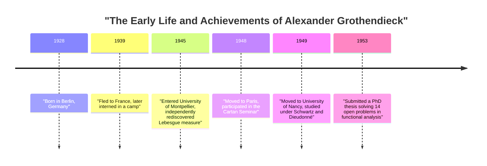
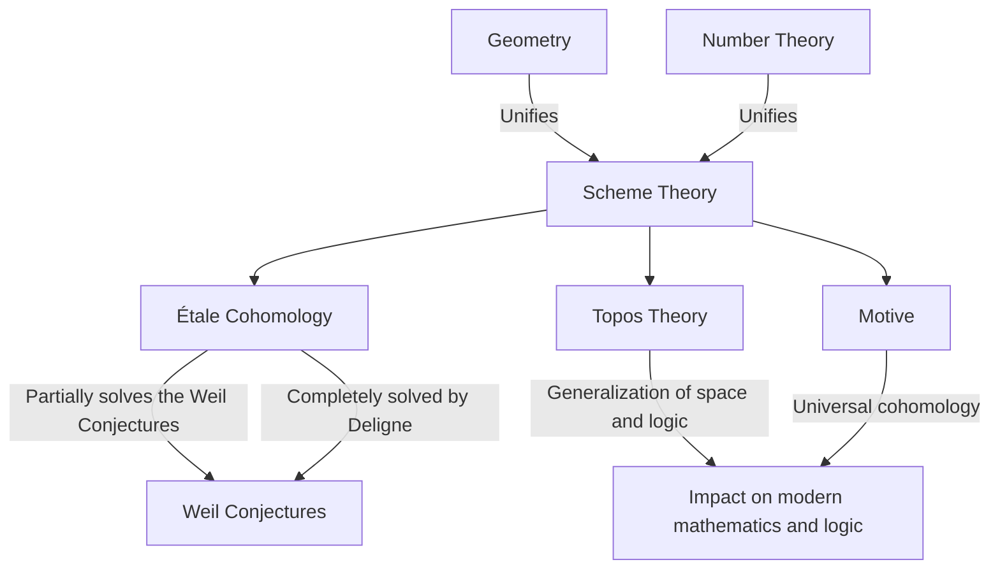

# [Alexander Grothendieck: The Life and Achievements of the 20th Century's Greatest Mathematician](https://kenji.blog/en/p/grothendieck/)

[Alexander Grothendieck](https://kenji.blog/en/p/grothendieck/) is one of the greatest mathematicians in history who brought about a fundamental paradigm shift in the mathematics community of the late 20th century, particularly in the field of algebraic geometry. His achievements went far beyond solving individual open problems; they fundamentally reconstructed the very language and conceptual framework of mathematics itself. In this article, we will provide a detailed explanation of his extraordinary and dramatic life, as well as his immeasurable impact on modern mathematics.

## 1. A Tumultuous Childhood and the Shadow of War

Grothendieck's life was as unique and filled with hardship as his mathematical achievements.

### Anarchist Parents and Birth in Berlin

Born in Berlin, Germany in 1928, Grothendieck was raised by radical anarchist parents. His father, Sascha Schapiro, was a Russian-born Jew who had fled to Germany after losing an arm to persecution during the Russian Revolution. His mother, Hanka Grothendieck, was a German journalist. Both parents were heavily involved in political activism, and young Alexander spent part of his early childhood living with foster parents.

### Life as a Refugee and the Internment Camps

When the Nazis seized power in Germany in 1933, his Jewish and anarchist father felt his life was in danger and fled to France, later followed by his mother. Alexander remained with his foster parents in Germany until 1939, when he traveled to France to join his parents as the footsteps of war drew near.

However, with the outbreak of World War II, the family's fate took a dark turn. His father was sent to the Auschwitz concentration camp, where he perished. Alexander and his mother were interned at the Rieucros Camp in France. Even in such harsh conditions, it is said that he showed a glimpse of his extraordinary concentration and talent for mathematics at the camp's school. Later, he was hidden in a home in the Protestant village of Le Chambon-sur-Lignon, where he was able to receive a high school education.

## 2. A Shocking Debut in the Mathematics World

After the war, Grothendieck began to pursue mathematics in earnest, but his path was highly unconventional.

### Rediscovering "Volume" at the University of Montpellier

In 1945, he entered the University of Montpellier. The level of mathematical education there at the time was not necessarily high, and unsatisfied with the lectures, he attempted to rigorously define the concepts of "length," "area," and "volume" on his own. Without the help of teachers, he completely reconstructed the theory of "Lebesgue measure," previously established by Henri Lebesgue, entirely by himself. This episode demonstrates his inherent attitude of thinking through things from their very foundations without relying on existing knowledge.

### The Legend in Nancy: 14 Unsolved Problems

In 1948, he moved to Paris, the center of mathematics, and participated in the legendary seminar hosted by Henri Cartan and others at the École Normale Supérieure. However, faced with a gap in his knowledge of cutting-edge mathematics, he experienced a temporary setback.

He then moved to the University of Nancy, where he was mentored by two outstanding mathematicians, Laurent Schwartz and Jean Dieudonné. One day, Schwartz and Dieudonné presented Grothendieck with 14 unsolved problems that had been left open in their recently published papers.

To their astonishment, a few months later, Grothendieck returned and submitted notes that **completely solved all 14 unsolved problems** . He created entirely new concepts, such as the "topological tensor product" and "nuclear space," wiping out the problems from their roots. With this achievement, he instantly gained worldwide fame in the field of functional analysis.

## 3. Reconstructing Algebraic Geometry: The Golden Age at IHÉS

After reaching the pinnacle of functional analysis, he surprisingly shifted his research focus to entirely different fields: "algebraic geometry" and "homological algebra."

### The Tohoku Paper

His paper "Sur quelques points d'algèbre homologique" (On some points of homological algebra), published in the Japanese *Tohoku Mathematical Journal* in 1957, is a historical paper that merged category theory and homological algebra, establishing the concept of an **[Abel](https://kenji.blog/en/p/abel/)ian Category** . This made it possible to rigorously define sheaf cohomology over any topological space.

### The Founding of IHÉS and EGA/SGA

In 1958, the Institut des Hautes Études Scientifiques (IHÉS) was established in France, and Grothendieck was welcomed as a founding member and professor in its mathematics division. The following 12 years marked his "Golden Age."

Together with Jean Dieudonné, Jean-Pierre Serre, and others, he embarked on a monumental project to completely rewrite the foundations of algebraic geometry. This became the *Éléments de géométrie algébrique* (commonly known as **EGA** ). Furthermore, the records of the seminars conducted under his direction were published as the *Séminaire de Géométrie Algébrique* (commonly known as **SGA** ). These are massive works spanning thousands of pages, and they continue to be read today as the "sacred texts" of modern algebraic geometry.

## 4. Revolutionary Mathematical Concepts

Grothendieck's greatest contribution was fundamentally generalizing the objects of mathematics and providing a new language that unified seemingly distinct fields.

### Scheme Theory

Traditionally, algebraic geometry was studied over "fields" such as complex numbers. Grothendieck pushed this concept to its limit by introducing the concept of a **Scheme** .

For a commutative ring $R$, the set of all its prime ideals endowed with a topology and a structure sheaf is called an affine scheme, denoted as $\text{Spec}(R)$.

$$ \text{Spec}(R) = \{ \mathfrak{p} \mid \mathfrak{p} \text{ is a prime ideal of } R \} $$

This allowed problems in number theory—such as finding integer solutions to equations—to be treated as geometric properties of spaces.

### Étale Cohomology and the Weil Conjectures

One of Grothendieck's main goals was to prove the "Weil Conjectures" regarding algebraic varieties over finite fields. He expanded the classical concept of topological spaces and founded an entirely new theory called **Étale Cohomology** . Using this powerful weapon, he proved part of the Weil Conjectures, and the final part was proven by his brilliant student, Pierre Deligne.

### Topos Theory and Motives

Grothendieck's thinking ascended even further up the staircase of abstraction. He created the concept of a **Topos** , which generalizes the very concept of space itself.

Furthermore, he proposed the concept of a **Motive** as a universal object that integrates various different cohomology theories. The theory of motives is still not completely understood today and remains one of the greatest exploration themes in modern mathematics.

## 5. His Unique Philosophy: The Nutcracker Analogy

Grothendieck explained his mathematical approach using the analogy of a "nutcracker." When trying to open a hard nut (a difficult problem), rather than striking it forcefully with a hammer, he preferred to soak the nut in water, wait for it to soften over time, and let the shell split open naturally. In other words, he preferred **"building a powerful and expansive sea of theory in which the problem naturally dissolves"** rather than solving it directly.

## 6. Dessins d'enfants and Anabelian Geometry

Entering the 1980s, he proposed new theories that approached the deepest mysteries of mathematics starting from very simple and visual concepts.

One of these was **"Dessins d'enfants" (Children's Drawings)** . He discovered that from simple graphs drawn on curved surfaces like a sphere, one could extract the action of the absolute [Galois](https://kenji.blog/en/p/galois/) group, a highly mysterious and complex object in number theory.

Furthermore, he proposed a program called **"Anabelian Geometry."** This is the astonishing conjecture that for certain algebraic varieties, the original geometric and number-theoretic objects can be completely reconstructed solely from the topological data known as the fundamental group.

## 7. Sudden Retirement and the Path to Solitude

Despite winning the Fields Medal in 1966, Grothendieck abruptly resigned from IHÉS in 1970 in protest after learning that part of its funding came from the Ministry of Armed Forces. Subsequently, he immersed himself in environmentalist and anti-war movements.

In the 1980s, he wrote a massive memoir titled *Récoltes et Semailles* (Reaping and Sowing). In 1991, he cut off all contact with family and friends and went into seclusion in a small village at the foot of the Pyrenees in southern France. Until his death at the age of 86 in 2014, he met no one, continuing his thoughts and writings in complete solitude.

## Conclusion

[Alexander Grothendieck](https://kenji.blog/en/p/grothendieck/) was a giant who brought an entirely new landscape to the discipline of mathematics. The concepts he left behind transcend the mere framework of mathematics, demonstrating the expanding possibilities of human logical thought. The profound world he gazed upon continues to bear rich fruit even today.
