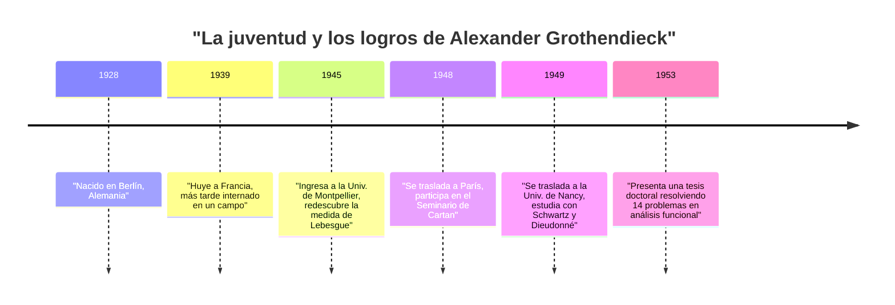
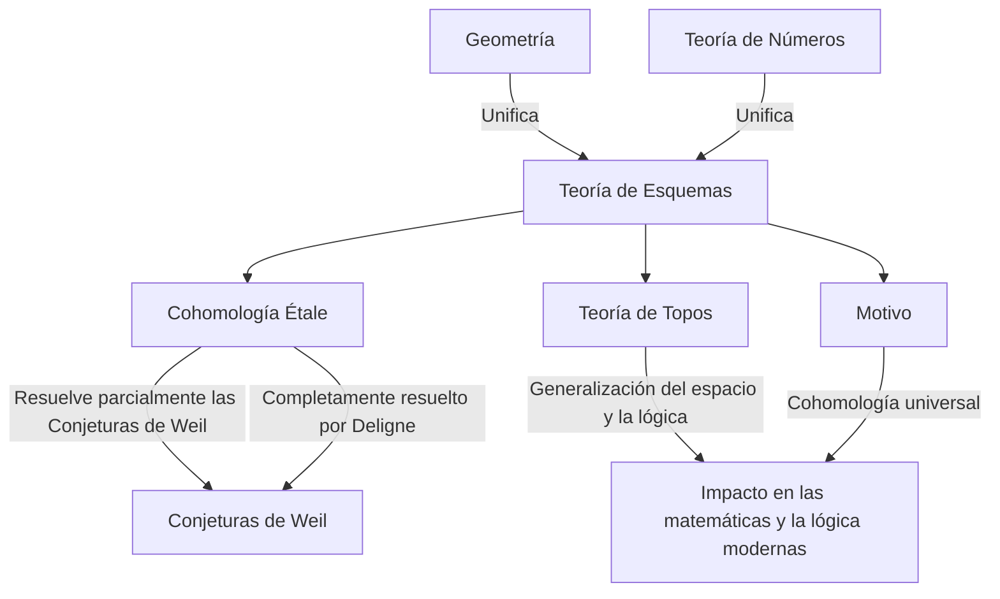

# [[Alexander Grothendieck](https://kenji.blog/es/p/grothendieck/): La vida y los logros del mayor matemático del siglo XX](https://kenji.blog/p/grothendieck/)

[Alexander Grothendieck](https://kenji.blog/es/p/grothendieck/) es uno de los matemáticos más grandes de la historia que provocó un cambio de paradigma fundamental en la comunidad matemática de finales del siglo XX, particularmente en el campo de la geometría algebraica. Sus logros fueron mucho más allá de resolver problemas abiertos individuales; reconstruyeron fundamentalmente el lenguaje mismo y el marco conceptual de las matemáticas. En este artículo, proporcionaremos una explicación detallada de su vida extraordinaria y dramática, así como de su inmenso impacto en las matemáticas modernas.

## 1. Una infancia tumultuosa y la sombra de la guerra

La vida de Grothendieck fue tan única y llena de dificultades como sus logros matemáticos.

### Padres anarquistas y nacimiento en Berlín

Nacido en Berlín, Alemania, en 1928, Grothendieck fue criado por padres anarquistas radicales. Su padre, Sascha Schapiro, era un judío nacido en Rusia que había huido a Alemania después de perder un brazo debido a la persecución durante la Revolución Rusa. Su madre, Hanka Grothendieck, era una periodista alemana. Ambos padres estaban muy involucrados en el activismo político, y el joven Alexander pasó parte de su primera infancia viviendo con familias de acogida.

### Vida como refugiado y en campos de internamiento

Cuando los nazis tomaron el poder en Alemania en 1933, su padre, judío y anarquista, sintió que su vida corría peligro y huyó a Francia, seguido más tarde por su madre. Alexander permaneció con sus padres de acogida en Alemania hasta 1939, cuando viajó a Francia para unirse a sus padres a medida que se acercaban los pasos de la guerra.

Sin embargo, con el estallido de la Segunda Guerra Mundial, el destino de la familia dio un giro oscuro. Su padre fue enviado al campo de concentración de Auschwitz, donde pereció. Alexander y su madre fueron internados en el campo de Rieucros en Francia. Incluso en condiciones tan duras, se dice que mostró un atisbo de su extraordinaria concentración y talento para las matemáticas en la escuela del campo. Más tarde, fue escondido en una casa en el pueblo protestante de Le Chambon-sur-Lignon, donde pudo recibir educación secundaria.

## 2. Un debut impactante en el mundo de las matemáticas

Después de la guerra, Grothendieck comenzó a dedicarse seriamente a las matemáticas, pero su camino fue muy poco convencional.

### Redescubriendo el "volumen" en la Universidad de Montpellier

En 1945, ingresó en la Universidad de Montpellier. El nivel de educación matemática allí en ese momento no era necesariamente alto, e insatisfecho con las conferencias, intentó definir rigurosamente los conceptos de "longitud", "área" y "volumen" por sí mismo. Sin la ayuda de profesores, reconstruyó por completo la teoría de la "medida de Lebesgue", previamente establecida por Henri Lebesgue, completamente por sí mismo. Este episodio demuestra su actitud inherente de pensar las cosas desde sus mismos cimientos sin depender de conocimientos existentes.

### La leyenda en Nancy: 14 problemas sin resolver

En 1948, se trasladó a París, el centro de las matemáticas, y participó en el legendario seminario organizado por Henri Cartan y otros en la École Normale Supérieure. Sin embargo, ante una laguna en su conocimiento de las matemáticas de vanguardia, experimentó un revés temporal.

Luego se trasladó a la Universidad de Nancy, donde fue asesorado por dos matemáticos destacados, Laurent Schwartz y Jean Dieudonné. Un día, Schwartz y Dieudonné le presentaron a Grothendieck 14 problemas sin resolver que habían quedado abiertos en sus artículos publicados recientemente.

Para su asombro, unos meses más tarde, Grothendieck regresó y presentó notas que **resolvían por completo los 14 problemas sin resolver** . Creó conceptos completamente nuevos, como el "producto tensorial topológico" y el "espacio nuclear", eliminando los problemas de raíz. Con este logro, ganó instantáneamente fama mundial en el campo del análisis funcional.

## 3. Reconstruyendo la geometría algebraica: La época dorada en el IHÉS

Después de alcanzar el pináculo del análisis funcional, sorprendentemente cambió su enfoque de investigación a campos completamente diferentes: la "geometría algebraica" y el "álgebra homológica".

### El artículo de Tohoku

Su artículo "Sur quelques points d'algèbre homologique" (Sobre algunos puntos del álgebra homológica), publicado en la revista japonesa *Tohoku Mathematical Journal* en 1957, es un artículo histórico que fusionó la teoría de categorías y el álgebra homológica, estableciendo el concepto de una **Categoría Abeliana** . Esto hizo posible definir rigurosamente la cohomología de haces sobre cualquier espacio topológico.

### La fundación del IHÉS y EGA/SGA

En 1958, se estableció en Francia el Institut des Hautes Études Scientifiques (IHÉS), y Grothendieck fue recibido como miembro fundador y profesor en su división de matemáticas. Los siguientes 12 años marcaron su "Época Dorada".

Junto con Jean Dieudonné, Jean-Pierre Serre y otros, se embarcó en un proyecto monumental para reescribir por completo los fundamentos de la geometría algebraica. Esto se convirtió en los *Éléments de géométrie algébrique* (comúnmente conocidos como **EGA** ). Además, los registros de los seminarios realizados bajo su dirección se publicaron como el *Séminaire de Géométrie Algébrique* (comúnmente conocido como **SGA** ). Estas son obras masivas que abarcan miles de páginas, y continúan siendo leídas hoy como los "textos sagrados" de la geometría algebraica moderna.

## 4. Conceptos matemáticos revolucionarios

La mayor contribución de Grothendieck fue generalizar fundamentalmente los objetos de las matemáticas y proporcionar un nuevo lenguaje que unificó campos aparentemente distintos.

### Teoría de Esquemas

Tradicionalmente, la geometría algebraica se estudiaba sobre "cuerpos" como los números complejos. Grothendieck llevó este concepto a su límite al introducir el concepto de un **Esquema** .

Para un anillo conmutativo $R$, el conjunto de todos sus ideales primos dotado de una topología y un haz estructural se denomina esquema afín, denotado como $\text{Spec}(R)$.

$$ \text{Spec}(R) = \{ \mathfrak{p} \mid \mathfrak{p} \text{ es un ideal primo de } R \} $$

Esto permitió que los problemas en la teoría de números — como encontrar soluciones enteras a ecuaciones — fueran tratados como propiedades geométricas de los espacios.

### Cohomología Étale y las Conjeturas de Weil

Uno de los principales objetivos de Grothendieck era demostrar las "Conjeturas de Weil" con respecto a las variedades algebraicas sobre cuerpos finitos. Amplió el concepto clásico de los espacios topológicos y fundó una teoría completamente nueva llamada **Cohomología Étale** . Utilizando esta poderosa arma, demostró parte de las Conjeturas de Weil, y la parte final fue demostrada por su brillante estudiante, Pierre Deligne.

### Teoría de Topos y Motivos

El pensamiento de Grothendieck ascendió aún más por la escalera de la abstracción. Creó el concepto de un **Topos** , que generaliza el concepto mismo de espacio.

Además, propuso el concepto de un **Motivo** como un objeto universal que integra varias teorías de cohomología diferentes. La teoría de motivos aún no se comprende por completo en la actualidad y sigue siendo uno de los mayores temas de exploración en las matemáticas modernas.

## 5. Su filosofía única: La analogía del cascanueces

Grothendieck explicó su enfoque matemático utilizando la analogía de un "cascanueces". Cuando trataba de abrir una nuez dura (un problema difícil), en lugar de golpearla con fuerza con un martillo, prefería sumergir la nuez en agua, esperar a que se ablandara con el tiempo y dejar que la cáscara se abriera naturalmente. En otras palabras, prefería **"construir un mar de teoría poderoso y expansivo en el que el problema se disuelve naturalmente"** en lugar de resolverlo directamente.

## 6. Dessins d'enfants y Geometría Anabeliana

Entrando en la década de 1980, propuso nuevas teorías que abordaban los misterios más profundos de las matemáticas a partir de conceptos muy simples y visuales.

Uno de estos fue los **"Dessins d'enfants" (Dibujos de niños)** . Descubrió que a partir de gráficos simples dibujados sobre superficies curvas como una esfera, se podía extraer la acción del grupo de Galois absoluto, un objeto sumamente misterioso y complejo en la teoría de números.

Además, propuso un programa llamado **"Geometría Anabeliana"** . Esta es la asombrosa conjetura de que para ciertas variedades algebraicas, los objetos geométricos y aritméticos originales pueden reconstruirse por completo únicamente a partir de los datos topológicos conocidos como grupo fundamental.

## 7. Retiro repentino y el camino a la soledad

A pesar de ganar la Medalla Fields en 1966, Grothendieck renunció abruptamente al IHÉS en 1970 en protesta tras enterarse de que parte de su financiación provenía del Ministerio de las Fuerzas Armadas. Posteriormente, se sumergió en los movimientos ecologistas y contra la guerra.

En la década de 1980, escribió unas enormes memorias tituladas *Récoltes et Semailles* (Cosechas y Siembras). En 1991, cortó todo contacto con familiares y amigos y se recluyó en un pequeño pueblo al pie de los Pirineos en el sur de Francia. Hasta su muerte a la edad de 86 años en 2014, no se reunió con nadie, continuando sus pensamientos y escritos en completa soledad.

## Conclusión

[Alexander Grothendieck](https://kenji.blog/es/p/grothendieck/) fue un gigante que trajo un paisaje completamente nuevo a la disciplina de las matemáticas. Los conceptos que dejó trascienden el mero marco de las matemáticas, demostrando las posibilidades de expansión del pensamiento lógico humano. El mundo profundo que contempló continúa dando ricos frutos hasta el día de hoy.
