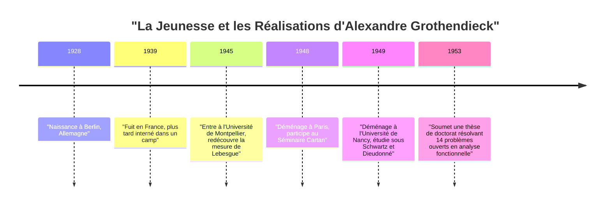
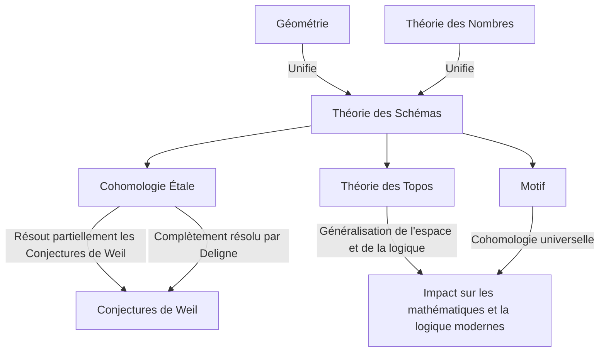

# [[Alexandre Grothendieck](https://kenji.blog/fr/p/grothendieck/) : Vie et Œuvres du Plus Grand Mathématicien du 20e Siècle](https://kenji.blog/p/grothendieck/)

[Alexandre Grothendieck](https://kenji.blog/fr/p/grothendieck/) est l'un des plus grands mathématiciens de l'histoire, ayant apporté un changement de paradigme fondamental dans la communauté mathématique de la fin du 20e siècle, en particulier dans le domaine de la géométrie algébrique. Ses réalisations sont allées bien au-delà de la résolution de problèmes ouverts individuels ; elles ont fondamentalement reconstruit le langage même et le cadre conceptuel des mathématiques. Dans cet article, nous fournirons une explication détaillée de sa vie extraordinaire et dramatique, ainsi que de son impact incommensurable sur les mathématiques modernes.

## 1. Une Enfance Tumultueuse et l'Ombre de la Guerre

La vie de Grothendieck a été aussi unique et pleine d'épreuves que ses réalisations mathématiques.

### Parents Anarchistes et Naissance à Berlin

Né à Berlin, en Allemagne, en 1928, Grothendieck a été élevé par des parents anarchistes radicaux. Son père, Sascha Schapiro, était un Juif d'origine russe qui avait fui vers l'Allemagne après avoir perdu un bras suite aux persécutions lors de la Révolution russe. Sa mère, Hanka Grothendieck, était une journaliste allemande. Les deux parents étaient fortement impliqués dans l'activisme politique, et le jeune Alexandre a passé une partie de sa petite enfance à vivre dans des familles d'accueil.

### Vie de Réfugié et Camps d'Internement

Lorsque les nazis ont pris le pouvoir en Allemagne en 1933, son père juif et anarchiste a senti que sa vie était en danger et a fui en France, suivi plus tard par sa mère. Alexandre est resté avec sa famille d'accueil en Allemagne jusqu'en 1939, date à laquelle il s'est rendu en France pour rejoindre ses parents alors que les bruits de la guerre se rapprochaient.

Cependant, avec le déclenchement de la Seconde Guerre mondiale, le destin de la famille a pris une tournure sombre. Son père a été envoyé au camp de concentration d'Auschwitz, où il a péri. Alexandre et sa mère ont été internés au camp de Rieucros en France. Même dans des conditions aussi difficiles, on dit qu'il a montré un aperçu de sa concentration extraordinaire et de son talent pour les mathématiques à l'école du camp. Plus tard, il a été caché dans une maison du village protestant du Chambon-sur-Lignon, où il a pu recevoir une éducation secondaire.

## 2. Des Débuts Choc dans le Monde des Mathématiques

Après la guerre, Grothendieck a commencé à poursuivre sérieusement les mathématiques, mais son parcours a été très peu conventionnel.

### Redécouverte du « Volume » à l'Université de Montpellier

En 1945, il entre à l'Université de Montpellier. Le niveau de l'enseignement mathématique à l'époque n'y était pas nécessairement élevé, et, insatisfait des cours, il a tenté de définir rigoureusement par lui-même les concepts de « longueur », « surface » et « volume ». Sans l'aide de professeurs, il a complètement reconstruit, seul, la théorie de la « mesure de Lebesgue », préalablement établie par Henri Lebesgue. Cet épisode démontre son attitude inhérente consistant à réfléchir aux choses depuis leurs fondements mêmes, sans se fier aux connaissances existantes.

### La Légende à Nancy : 14 Problèmes Non Résolus

En 1948, il s'installe à Paris, centre des mathématiques, et participe au légendaire séminaire animé par Henri Cartan et d'autres à l'École Normale Supérieure. Cependant, confronté à une lacune dans ses connaissances des mathématiques de pointe, il connaît un revers temporaire.

Il s'installe ensuite à l'Université de Nancy, où il est encadré par deux mathématiciens exceptionnels, Laurent Schwartz et Jean Dieudonné. Un jour, Schwartz et Dieudonné ont présenté à Grothendieck 14 problèmes non résolus qui avaient été laissés ouverts dans leurs articles récemment publiés.

À leur grand étonnement, quelques mois plus tard, Grothendieck revint et soumit des notes qui **résolvaient complètement les 14 problèmes non résolus** . Il a créé des concepts entièrement nouveaux, tels que le « produit tensoriel topologique » et l'« espace nucléaire », effaçant les problèmes à la racine. Avec cette réalisation, il a instantanément acquis une renommée mondiale dans le domaine de l'analyse fonctionnelle.

## 3. Reconstruire la Géométrie Algébrique : L'Âge d'Or à l'IHÉS

Après avoir atteint le sommet de l'analyse fonctionnelle, il a étonnamment réorienté ses recherches vers des domaines entièrement différents : la « géométrie algébrique » et l'« algèbre homologique ».

### L'Article de Tohoku

Son article « Sur quelques points d'algèbre homologique », publié dans le journal japonais *Tohoku Mathematical Journal* en 1957, est un document historique qui a fusionné la théorie des catégories et l'algèbre homologique, établissant le concept d'une **Catégorie Abélienne** . Cela a permis de définir rigoureusement la cohomologie des faisceaux sur n'importe quel espace topologique.

### La Fondation de l'IHÉS et les EGA/SGA

En 1958, l'Institut des Hautes Études Scientifiques (IHÉS) a été créé en France, et Grothendieck a été accueilli en tant que membre fondateur et professeur de sa division de mathématiques. Les 12 années suivantes ont marqué son « Âge d'Or ».

Avec Jean Dieudonné, Jean-Pierre Serre et d'autres, il s'est lancé dans un projet monumental visant à réécrire complètement les fondements de la géométrie algébrique. Cela est devenu les *Éléments de géométrie algébrique* (communément appelés **EGA** ). De plus, les comptes rendus des séminaires dirigés sous sa direction ont été publiés sous le titre de *Séminaire de Géométrie Algébrique* (communément appelé **SGA** ). Ce sont des œuvres massives de milliers de pages, qui continuent d'être lues aujourd'hui comme les « textes sacrés » de la géométrie algébrique moderne.

## 4. Concepts Mathématiques Révolutionnaires

La plus grande contribution de Grothendieck a été de généraliser fondamentalement les objets des mathématiques et de fournir un nouveau langage qui unifiait des domaines apparemment distincts.

### Théorie des Schémas

Traditionnellement, la géométrie algébrique était étudiée sur des « corps » tels que les nombres complexes. Grothendieck a poussé ce concept à sa limite en introduisant le concept de **Schéma** .

Pour un anneau commutatif $R$, l'ensemble de tous ses idéaux premiers doté d'une topologie et d'un faisceau structural est appelé un schéma affine, noté $\text{Spec}(R)$.

$$ \text{Spec}(R) = \{ \mathfrak{p} \mid \mathfrak{p} \text{ est un idéal premier de } R \} $$

Cela a permis aux problèmes de la théorie des nombres — comme la recherche de solutions entières à des équations — d'être traités comme des propriétés géométriques des espaces.

### Cohomologie Étale et Conjectures de Weil

L'un des principaux objectifs de Grothendieck était de prouver les « Conjectures de Weil » concernant les variétés algébriques sur des corps finis. Il a élargi le concept classique des espaces topologiques et a fondé une théorie entièrement nouvelle appelée **Cohomologie Étale** . Utilisant cette arme puissante, il a prouvé une partie des Conjectures de Weil, et la dernière partie a été prouvée par son brillant élève, Pierre Deligne.

### Théorie des Topos et Motifs

La pensée de Grothendieck est montée encore plus haut sur l'échelle de l'abstraction. Il a créé le concept de **Topos** , qui généralise le concept même d'espace.

De plus, il a proposé le concept de **Motif** comme objet universel intégrant diverses théories cohomologiques différentes. La théorie des motifs n'est toujours pas complètement comprise aujourd'hui et reste l'un des plus grands thèmes d'exploration des mathématiques modernes.

## 5. Sa Philosophie Unique : La Métaphore du Casse-Noisette

Grothendieck a expliqué son approche mathématique en utilisant l'analogie d'un « casse-noisette ». Lorsqu'on essaie d'ouvrir une noix dure (un problème difficile), plutôt que de la frapper avec un marteau, il préférait plonger la noix dans l'eau, attendre qu'elle se ramollisse avec le temps et laisser la coquille s'ouvrir naturellement. En d'autres termes, il préférait **« construire une mer de théorie puissante et vaste dans laquelle le problème se dissout naturellement »** plutôt que de le résoudre directement.

## 6. Dessins d'Enfants et Géométrie Anabélienne

Au début des années 1980, il a proposé de nouvelles théories abordant les mystères les plus profonds des mathématiques à partir de concepts très simples et visuels.

L'un d'eux était les **« Dessins d'enfants »** . Il a découvert qu'à partir de graphes simples dessinés sur des surfaces courbes comme une sphère, on pouvait extraire l'action du groupe de Galois absolu, un objet hautement mystérieux et complexe en théorie des nombres.

De plus, il a proposé un programme appelé **« Géométrie Anabélienne »** . Il s'agit de l'étonnante conjecture selon laquelle, pour certaines variétés algébriques, les objets géométriques et arithmétiques d'origine peuvent être complètement reconstruits uniquement à partir des données topologiques connues sous le nom de groupe fondamental.

## 7. Retraite Soudaine et Chemin vers la Solitude

Bien qu'ayant remporté la médaille Fields en 1966, Grothendieck a brusquement démissionné de l'IHÉS en 1970 en signe de protestation après avoir appris qu'une partie de son financement provenait du ministère des Armées. Par la suite, il s'est plongé dans les mouvements écologistes et anti-guerre.

Dans les années 1980, il a écrit d'immenses mémoires intitulés *Récoltes et Semailles*. En 1991, il a coupé tout contact avec sa famille et ses amis et s'est retiré dans un petit village au pied des Pyrénées, dans le sud de la France. Jusqu'à sa mort à 86 ans en 2014, il n'a vu personne, poursuivant ses pensées et ses écrits dans une solitude complète.

## Conclusion

[Alexandre Grothendieck](https://kenji.blog/fr/p/grothendieck/) était un géant qui a apporté un paysage entièrement nouveau à la discipline des mathématiques. Les concepts qu'il a laissés derrière lui transcendent le simple cadre des mathématiques, démontrant les possibilités d'expansion de la pensée logique humaine. Le monde profond qu'il contemplait continue de porter des fruits abondants encore aujourd'hui.
