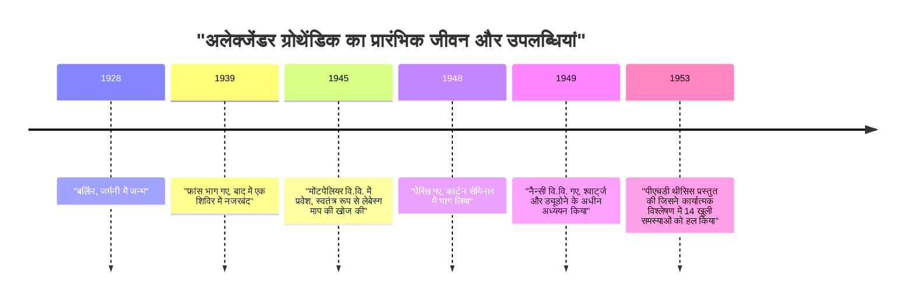
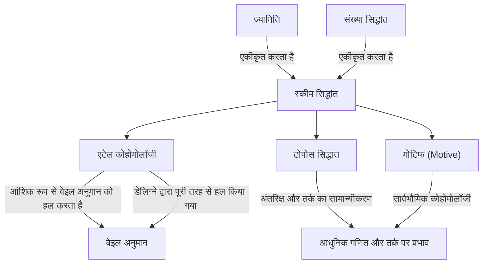

# [[अलेक्जेंडर ग्रोथेंडिक](https://kenji.blog/hi/p/grothendieck/): 20वीं सदी के सबसे महान गणितज्ञ का जीवन और उपलब्धियां](https://kenji.blog/p/grothendieck/)

[अलेक्जेंडर ग्रोथेंडिक](https://kenji.blog/hi/p/grothendieck/) इतिहास के उन महानतम गणितज्ञों में से एक हैं जिन्होंने 20वीं सदी के अंत में गणित समुदाय में, विशेष रूप से बीजगणितीय ज्यामिति के क्षेत्र में, एक मौलिक प्रतिमान विस्थापन (paradigm shift) लाया। उनकी उपलब्धियां व्यक्तिगत अनसुलझी समस्याओं को हल करने से कहीं आगे तक गईं; उन्होंने मूल रूप से गणित की भाषा और वैचारिक ढांचे का पुनर्निर्माण किया। इस लेख में, हम उनके असाधारण और नाटकीय जीवन के साथ-साथ आधुनिक गणित पर उनके अथाह प्रभाव का विस्तृत विवरण प्रदान करेंगे।

## 1. एक उथल-पुथल भरा बचपन और युद्ध की छाया

ग्रोथेंडिक का जीवन उनकी गणितीय उपलब्धियों की तरह ही अद्वितीय और कठिनाइयों से भरा था।

### अराजकतावादी माता-पिता और बर्लिन में जन्म

1928 में बर्लिन, जर्मनी में जन्मे ग्रोथेंडिक का पालन-पोषण कट्टरपंथी अराजकतावादी (anarchist) माता-पिता ने किया था। उनके पिता, साशा शापिरो, रूस में जन्मे एक यहूदी थे जो रूसी क्रांति के दौरान उत्पीड़न के कारण अपना एक हाथ खोने के बाद जर्मनी भाग गए थे। उनकी मां, हंका ग्रोथेंडिक, एक जर्मन पत्रकार थीं। माता-पिता दोनों राजनीतिक सक्रियता में गहराई से शामिल थे, और युवा अलेक्जेंडर ने अपने शुरुआती बचपन का एक हिस्सा पालक परिवारों (foster parents) के साथ रहने में बिताया।

### शरणार्थी के रूप में जीवन और नजरबंदी शिविर

जब 1933 में जर्मनी में नाजियों ने सत्ता पर कब्जा कर लिया, तो उनके यहूदी और अराजकतावादी पिता को लगा कि उनके जीवन को खतरा है और वे फ्रांस भाग गए, जिसके बाद उनकी मां भी वहां चली गईं। अलेक्जेंडर 1939 तक जर्मनी में अपने पालक माता-पिता के साथ रहे, जब वे युद्ध की आहट के करीब आते ही अपने माता-पिता के साथ जुड़ने के लिए फ्रांस चले गए।

हालाँकि, द्वितीय विश्व युद्ध के छिड़ने के साथ, परिवार की नियति ने एक अंधकारमय मोड़ ले लिया। उनके पिता को ऑशविट्ज़ एकाग्रता शिविर (Auschwitz concentration camp) में भेज दिया गया, जहाँ उनकी मृत्यु हो गई। अलेक्जेंडर और उनकी मां को फ्रांस में रियुक्रोस शिविर (Rieucros Camp) में नजरबंद कर दिया गया। यहां तक ​​कि ऐसी कठोर परिस्थितियों में भी, ऐसा कहा जाता है कि उन्होंने शिविर के स्कूल में अपनी असाधारण एकाग्रता और गणित की प्रतिभा की एक झलक दिखाई। बाद में, उन्हें ले चंबोन-सुर-लिग्नन (Le Chambon-sur-Lignon) के प्रोटेस्टेंट गांव के एक घर में छुपाया गया, जहां वे हाई स्कूल की शिक्षा प्राप्त करने में सक्षम हुए।

## 2. गणित की दुनिया में एक चौंकाने वाली शुरुआत

युद्ध के बाद, ग्रोथेंडिक ने पूरी लगन के साथ गणित को आगे बढ़ाना शुरू किया, लेकिन उनका रास्ता बेहद अपरंपरागत था।

### मोंटपेलियर विश्वविद्यालय में "आयतन" की फिर से खोज

1945 में, उन्होंने मोंटपेलियर विश्वविद्यालय में प्रवेश लिया। उस समय वहां गणितीय शिक्षा का स्तर जरूरी नहीं कि उच्च था, और व्याख्यानों से असंतुष्ट होकर, उन्होंने "लंबाई", "क्षेत्रफल" और "आयतन" की अवधारणाओं को अपने दम पर सख्ती से परिभाषित करने का प्रयास किया। शिक्षकों की मदद के बिना, उन्होंने पूरी तरह से अपने दम पर हेनरी लेबेस्ग (Henri Lebesgue) द्वारा पहले स्थापित "लेबेस्ग माप (Lebesgue measure)" के सिद्धांत का पुनर्निर्माण किया। यह घटना मौजूदा ज्ञान पर भरोसा किए बिना चीजों को उनकी नींव से सोचने के उनके अंतर्निहित दृष्टिकोण को प्रदर्शित करती है।

### नैन्सी में किंवदंती: 14 अनसुलझी समस्याएं

1948 में, वह गणित के केंद्र पेरिस चले गए, और इकोले नॉर्मले सुप्रीयर (École Normale Supérieure) में हेनरी कार्टन (Henri Cartan) और अन्य लोगों द्वारा आयोजित पौराणिक सेमिनार में भाग लिया। हालाँकि, अत्याधुनिक गणित के अपने ज्ञान में एक अंतर का सामना करते हुए, उन्हें एक अस्थायी झटके का अनुभव हुआ।

इसके बाद वे नैन्सी विश्वविद्यालय चले गए, जहां उन्हें दो उत्कृष्ट गणितज्ञों, लॉरेंट श्वार्ट्ज (Laurent Schwartz) और जीन ड्यूडोने (Jean Dieudonné) द्वारा सलाह दी गई। एक दिन, श्वार्ट्ज और ड्यूडोने ने ग्रोथेंडिक को 14 अनसुलझी समस्याएं प्रस्तुत कीं जो उनके हाल ही में प्रकाशित शोध पत्रों में खुली छोड़ दी गई थीं।

उनके आश्चर्य के लिए, कुछ महीने बाद, ग्रोथेंडिक लौटे और ऐसे नोट्स प्रस्तुत किए जिन्होंने **सभी 14 अनसुलझी समस्याओं को पूरी तरह से हल कर दिया** । उन्होंने "टोपोलॉजिकल टेंसर उत्पाद" और "परमाणु स्थान (nuclear space)" जैसी पूरी तरह से नई अवधारणाएं बनाईं, जिससे समस्याओं को उनकी जड़ों से मिटा दिया गया। इस उपलब्धि के साथ, उन्होंने कार्यात्मक विश्लेषण (functional analysis) के क्षेत्र में तुरंत विश्वव्यापी ख्याति प्राप्त की।

## 3. बीजगणितीय ज्यामिति का पुनर्निर्माण: IHÉS में स्वर्ण युग

कार्यात्मक विश्लेषण के शिखर तक पहुंचने के बाद, उन्होंने आश्चर्यजनक रूप से अपना शोध ध्यान पूरी तरह से अलग क्षेत्रों में स्थानांतरित कर दिया: "बीजगणितीय ज्यामिति" और "होमोलॉजिकल बीजगणित"।

### तोहोकू पेपर

1957 में जापानी *Tohoku Mathematical Journal* में प्रकाशित उनका शोध पत्र "Sur quelques points d'algèbre homologique" (होमोलॉजिकल बीजगणित के कुछ बिंदुओं पर), एक ऐतिहासिक पत्र है जिसने श्रेणी सिद्धांत (Category Theory) और होमोलॉजिकल बीजगणित का विलय किया, और **एबेलियन श्रेणी ([Abel](https://kenji.blog/hi/p/abel/)ian Category)** की अवधारणा स्थापित की। इससे किसी भी टोपोलॉजिकल स्पेस पर शीफ कोहोमोलॉजी को सख्ती से परिभाषित करना संभव हो गया।

### IHÉS की स्थापना और EGA/SGA

1958 में, फ्रांस में इंस्टीट्यूट डेस हाउट्स एट्यूड्स साइंटिफिक्स (IHÉS) की स्थापना की गई थी, और ग्रोथेंडिक का इसके गणित प्रभाग में एक संस्थापक सदस्य और प्रोफेसर के रूप में स्वागत किया गया था। अगले 12 वर्षों ने उनके "स्वर्ण युग" को चिह्नित किया।

जीन ड्यूडोने, जीन-पियरे सेरे और अन्य लोगों के साथ, उन्होंने बीजगणितीय ज्यामिति की नींव को पूरी तरह से फिर से लिखने के लिए एक स्मारकीय परियोजना शुरू की। ये *Éléments de géométrie algébrique* बन गए (आमतौर पर **EGA** के रूप में जाना जाता है)। इसके अलावा, उनके निर्देशन में आयोजित सेमिनारों के रिकॉर्ड *Séminaire de Géométrie Algébrique* (आमतौर पर **SGA** के रूप में जाना जाता है) के रूप में प्रकाशित किए गए थे। ये हजारों पृष्ठों तक फैले विशाल कार्य हैं, और आज भी आधुनिक बीजगणितीय ज्यामिति के "पवित्र ग्रंथों" के रूप में पढ़े जाते हैं।

## 4. क्रांतिकारी गणितीय अवधारणाएं

ग्रोथेंडिक का सबसे बड़ा योगदान मौलिक रूप से गणित की वस्तुओं का सामान्यीकरण करना और एक नई भाषा प्रदान करना था जिसने प्रतीत होने वाले भिन्न क्षेत्रों को एकीकृत किया।

### स्कीम सिद्धांत (Scheme Theory)

परंपरागत रूप से, बीजगणितीय ज्यामिति का अध्ययन जटिल संख्याओं जैसे "क्षेत्रों (fields)" पर किया जाता था। ग्रोथेंडिक ने **स्कीम (Scheme)** की अवधारणा को पेश करके इस अवधारणा को इसकी सीमा तक धकेल दिया।

एक क्रमविनिमेय वलय (commutative ring) $R$ के लिए, टोपोलॉजी और संरचना शीफ से संपन्न इसके सभी अभाज्य गुणजावली (prime ideals) के समुच्चय को एफाइन स्कीम कहा जाता है, जिसे $\text{Spec}(R)$ के रूप में दर्शाया जाता है।

$$ \text{Spec}(R) = \{ \mathfrak{p} \mid \mathfrak{p}, R \text{ का एक अभाज्य गुणजावली है} \} $$

इसने संख्या सिद्धांत की समस्याओं को — जैसे समीकरणों के पूर्णांक समाधान खोजना — रिक्त स्थान के ज्यामितीय गुणों के रूप में व्यवहार करने की अनुमति दी।

### एटेल कोहोमोलॉजी और वेइल अनुमान

ग्रोथेंडिक के मुख्य लक्ष्यों में से एक परिमित क्षेत्रों पर बीजगणितीय किस्मों (algebraic varieties) के संबंध में "वेइल अनुमान (Weil Conjectures)" को साबित करना था। उन्होंने टोपोलॉजिकल रिक्त स्थान की शास्त्रीय अवधारणा का विस्तार किया और **एटेल कोहोमोलॉजी (Étale Cohomology)** नामक एक पूरी तरह से नए सिद्धांत की स्थापना की। इस शक्तिशाली हथियार का उपयोग करते हुए, उन्होंने वेइल अनुमान का एक हिस्सा साबित किया, और अंतिम भाग उनके मेधावी छात्र पियरे डेलिग्ने (Pierre Deligne) द्वारा साबित किया गया था।

### टोपोस सिद्धांत और मोटिफ (Motives)

ग्रोथेंडिक की सोच अमूर्तता की सीढ़ी पर और भी ऊपर चढ़ गई। उन्होंने **टोपोस (Topos)** की अवधारणा बनाई, जो अंतरिक्ष की अवधारणा को ही सामान्यीकृत करती है।

इसके अलावा, उन्होंने विभिन्न कोहोमोलॉजी सिद्धांतों को एकीकृत करने वाली एक सार्वभौमिक वस्तु के रूप में **मोटिफ (Motive)** की अवधारणा का प्रस्ताव रखा। मोटिफ का सिद्धांत आज भी पूरी तरह से समझा नहीं गया है और आधुनिक गणित में अन्वेषण के सबसे महान विषयों में से एक बना हुआ है।

## 5. उनका अनूठा दर्शन: नटक्रैकर सादृश्य

ग्रोथेंडिक ने "नटक्रैकर" के सादृश्य (analogy) का उपयोग करके अपने गणितीय दृष्टिकोण की व्याख्या की। एक सख्त अखरोट (एक कठिन समस्या) खोलने की कोशिश करते समय, इसे हथौड़े से जोर से मारने के बजाय, वह अखरोट को पानी में भिगोना, समय के साथ इसके नरम होने की प्रतीक्षा करना और खोल को प्राकृतिक रूप से खुलने देना पसंद करते थे। दूसरे शब्दों में, उन्होंने सीधे हल करने के बजाय **"सिद्धांत का एक शक्तिशाली और विस्तृत समुद्र बनाना जिसमें समस्या स्वाभाविक रूप से घुल जाए"** को प्राथमिकता दी।

## 6. बच्चों के चित्र (Dessins d'enfants) और एनाबेलियन ज्यामिति

1980 के दशक में प्रवेश करते हुए, उन्होंने बहुत सरल और दृश्य अवधारणाओं से शुरू होने वाले गणित के सबसे गहरे रहस्यों के करीब पहुंचने वाले नए सिद्धांतों का प्रस्ताव रखा।

इनमें से एक **"बच्चों के चित्र (Dessins d'enfants)"** था। उन्होंने पाया कि एक गोले जैसी घुमावदार सतहों पर खींचे गए सरल रेखांकन से, कोई निरपेक्ष गैलोज़ समूह (absolute [Galois](https://kenji.blog/hi/p/galois/) group) की क्रिया को निकाल सकता है, जो संख्या सिद्धांत में एक अत्यधिक रहस्यमय और जटिल वस्तु है।

इसके अलावा, उन्होंने **"एनाबेलियन ज्यामिति (Anabelian Geometry)"** नामक एक कार्यक्रम का प्रस्ताव रखा। यह आश्चर्यजनक अनुमान है कि कुछ बीजगणितीय किस्मों के लिए, मूल ज्यामितीय और अंकगणितीय वस्तुओं को पूरी तरह से केवल टोपोलॉजिकल डेटा से खंगाला जा सकता है जिसे मौलिक समूह के रूप में जाना जाता है।

## 7. अचानक सेवानिवृत्ति और अकेलेपन का मार्ग

1966 में फील्ड्स मेडल जीतने के बावजूद, ग्रोथेंडिक ने 1970 में IHÉS से यह जानने के बाद अचानक इस्तीफा दे दिया कि इसकी कुछ फंडिंग सशस्त्र बल मंत्रालय से आई थी। इसके बाद, उन्होंने खुद को पर्यावरणविद् और युद्ध-विरोधी आंदोलनों में डुबो दिया।

1980 के दशक में, उन्होंने *Récoltes et Semailles* (काटना और बोना) नामक एक विशाल संस्मरण लिखा। 1991 में, उन्होंने परिवार और दोस्तों के साथ सभी संपर्क तोड़ दिए और दक्षिणी फ्रांस में पाइरेनीस पहाड़ों की तलहटी में एक छोटे से गांव में एकांत में चले गए। 2014 में 86 वर्ष की आयु में अपनी मृत्यु तक, वे किसी से नहीं मिले, और पूर्ण एकांत में अपने विचारों और लेखन को जारी रखा।

## निष्कर्ष

[अलेक्जेंडर ग्रोथेंडिक](https://kenji.blog/hi/p/grothendieck/) एक महान व्यक्ति थे जो गणित के अनुशासन में एक पूरी तरह से नया परिदृश्य लाए। उन्होंने जो अवधारणाएं छोड़ी हैं, वे मात्र गणित के ढांचे से परे हैं, जो मानव तार्किक सोच के विस्तार की संभावनाओं को प्रदर्शित करती हैं। जिस गहरी दुनिया को उन्होंने देखा था वह आज भी समृद्ध फल दे रही है।
