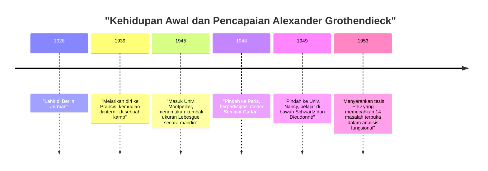
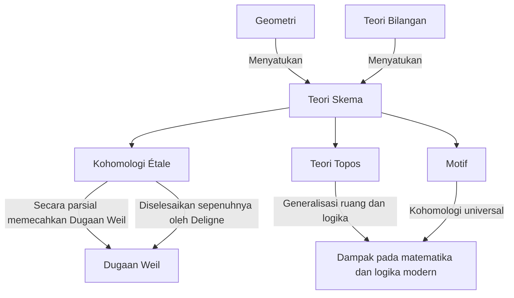

# [Alexander Grothendieck: Kehidupan dan Pencapaian Matematikawan Terbesar Abad ke-20](https://kenji.blog/p/grothendieck/)

[Alexander Grothendieck](https://kenji.blog/id/p/grothendieck/) adalah salah satu matematikawan terbesar dalam sejarah yang membawa pergeseran paradigma mendasar dalam komunitas matematika di akhir abad ke-20, khususnya di bidang geometri aljabar. Pencapaiannya jauh melampaui penyelesaian masalah terbuka secara individu; pencapaian tersebut pada dasarnya merekonstruksi bahasa dan kerangka konseptual matematika itu sendiri. Dalam artikel ini, kami akan memberikan penjelasan terperinci tentang kehidupannya yang luar biasa dan dramatis, serta dampaknya yang tak terukur pada matematika modern.

## 1. Masa Kecil yang Penuh Gejolak dan Bayang-Bayang Perang

Kehidupan Grothendieck sama uniknya dan penuh penderitaan seperti pencapaian matematikanya.

### Orang Tua Anarkis dan Kelahiran di Berlin

Lahir di Berlin, Jerman pada tahun 1928, Grothendieck dibesarkan oleh orang tua anarkis radikal. Ayahnya, Sascha Schapiro, adalah seorang Yahudi kelahiran Rusia yang telah melarikan diri ke Jerman setelah kehilangan satu lengannya akibat penganiayaan selama Revolusi Rusia. Ibunya, Hanka Grothendieck, adalah seorang jurnalis Jerman. Kedua orang tuanya sangat terlibat dalam aktivisme politik, dan Alexander muda menghabiskan sebagian masa kecilnya dengan tinggal bersama orang tua asuh.

### Kehidupan sebagai Pengungsi dan Kamp Interniran

Ketika Nazi merebut kekuasaan di Jerman pada tahun 1933, ayah Yahudi dan anarkisnya merasa nyawanya dalam bahaya dan melarikan diri ke Prancis, kemudian diikuti oleh ibunya. Alexander tetap bersama orang tua asuhnya di Jerman hingga tahun 1939, ketika ia pergi ke Prancis untuk bergabung dengan orang tuanya saat langkah-langkah perang semakin dekat.

Namun, dengan pecahnya Perang Dunia II, nasib keluarga itu berubah menjadi gelap. Ayahnya dikirim ke kamp konsentrasi Auschwitz, di mana ia binasa. Alexander dan ibunya diinternir di kamp Rieucros di Prancis. Bahkan dalam kondisi yang begitu keras, dikatakan bahwa ia menunjukkan sekilas konsentrasi dan bakatnya yang luar biasa dalam matematika di sekolah kamp. Kemudian, ia disembunyikan di sebuah rumah di desa Protestan Le Chambon-sur-Lignon, di mana ia dapat menerima pendidikan sekolah menengah.

## 2. Debut Mengejutkan di Dunia Matematika

Setelah perang, Grothendieck mulai mengejar matematika dengan sungguh-sungguh, tetapi jalannya sangat tidak konvensional.

### Menemukan Kembali "Volume" di Universitas Montpellier

Pada tahun 1945, ia masuk Universitas Montpellier. Tingkat pendidikan matematika di sana pada waktu itu belum tentu tinggi, dan karena tidak puas dengan perkuliahan, ia mencoba mendefinisikan dengan ketat konsep "panjang", "luas", dan "volume" secara mandiri. Tanpa bantuan guru, ia sepenuhnya merekonstruksi teori "ukuran Lebesgue", yang sebelumnya ditetapkan oleh Henri Lebesgue, sepenuhnya sendiri. Episode ini menunjukkan sikap bawaannya dalam memikirkan berbagai hal dari dasarnya tanpa mengandalkan pengetahuan yang ada.

### Legenda di Nancy: 14 Masalah yang Belum Terpecahkan

Pada tahun 1948, ia pindah ke Paris, pusat matematika, dan berpartisipasi dalam seminar legendaris yang diselenggarakan oleh Henri Cartan dan lainnya di École Normale Supérieure. Namun, dihadapkan pada kesenjangan pengetahuannya tentang matematika mutakhir, ia mengalami kemunduran sementara.

Ia kemudian pindah ke Universitas Nancy, di mana ia dibimbing oleh dua matematikawan luar biasa, Laurent Schwartz dan Jean Dieudonné. Suatu hari, Schwartz dan Dieudonné memberi Grothendieck 14 masalah yang belum terpecahkan yang dibiarkan terbuka dalam makalah mereka yang baru-baru ini diterbitkan.

Yang mengejutkan mereka, beberapa bulan kemudian, Grothendieck kembali dan menyerahkan catatan yang **sepenuhnya memecahkan ke-14 masalah yang belum terpecahkan tersebut** . Ia menciptakan konsep-konsep yang sama sekali baru, seperti "produk tensor topologis" dan "ruang nuklir", menyapu bersih masalah-masalah itu dari akarnya. Dengan pencapaian ini, ia langsung mendapatkan ketenaran di seluruh dunia di bidang analisis fungsional.

## 3. Merekonstruksi Geometri Aljabar: Era Keemasan di IHÉS

Setelah mencapai puncak analisis fungsional, ia secara mengejutkan mengalihkan fokus penelitiannya ke bidang yang sama sekali berbeda: "geometri aljabar" dan "aljabar homologis".

### Makalah Tohoku

Makalahnya "Sur quelques points d'algèbre homologique" (Tentang beberapa poin aljabar homologis), yang diterbitkan dalam *Tohoku Mathematical Journal* Jepang pada tahun 1957, adalah makalah bersejarah yang menggabungkan teori kategori dan aljabar homologis, menetapkan konsep **Kategori [Abel](https://kenji.blog/id/p/abel/)ian** . Ini memungkinkan untuk mendefinisikan secara ketat kohomologi berkas (sheaf cohomology) di atas ruang topologi apa pun.

### Pendirian IHÉS dan EGA/SGA

Pada tahun 1958, Institut des Hautes Études Scientifiques (IHÉS) didirikan di Prancis, dan Grothendieck disambut sebagai anggota pendiri dan profesor di divisi matematikanya. 12 tahun berikutnya menandai "Era Keemasan"-nya.

Bersama Jean Dieudonné, Jean-Pierre Serre, dan lainnya, ia memulai proyek monumental untuk sepenuhnya menulis ulang fondasi geometri aljabar. Ini menjadi *Éléments de géométrie algébrique* (umumnya dikenal sebagai **EGA** ). Lebih jauh lagi, catatan seminar yang dilakukan di bawah arahannya diterbitkan sebagai *Séminaire de Géométrie Algébrique* (umumnya dikenal sebagai **SGA** ). Ini adalah karya-karya besar yang mencakup ribuan halaman, dan terus dibaca hari ini sebagai "teks suci" geometri aljabar modern.

## 4. Konsep Matematika Revolusioner

Kontribusi terbesar Grothendieck adalah pada dasarnya menggeneralisasi objek-objek matematika dan memberikan bahasa baru yang menyatukan bidang-bidang yang tampaknya berbeda.

### Teori Skema

Secara tradisional, geometri aljabar dipelajari di atas "lapangan (field)" seperti bilangan kompleks. Grothendieck mendorong konsep ini ke batasnya dengan memperkenalkan konsep **Skema (Scheme)** .

Untuk cincin komutatif $R$, himpunan semua ideal primanya yang diberkahi dengan topologi dan struktur berkas disebut skema afin, dilambangkan sebagai $\text{Spec}(R)$.

$$ \text{Spec}(R) = \{ \mathfrak{p} \mid \mathfrak{p} \text{ adalah ideal prima dari } R \} $$

Hal ini memungkinkan masalah dalam teori bilangan — seperti menemukan solusi bilangan bulat untuk persamaan — diperlakukan sebagai sifat geometris ruang.

### Kohomologi Étale dan Dugaan Weil

Salah satu tujuan utama Grothendieck adalah untuk membuktikan "Dugaan Weil" mengenai varietas aljabar di atas lapangan berhingga. Ia memperluas konsep klasik ruang topologi dan mendirikan teori yang sama sekali baru yang disebut **Kohomologi Étale** . Menggunakan senjata ampuh ini, ia membuktikan sebagian dari Dugaan Weil, dan bagian terakhirnya dibuktikan oleh muridnya yang brilian, Pierre Deligne.

### Teori Topos dan Motif

Pemikiran Grothendieck naik lebih jauh ke atas tangga abstraksi. Ia menciptakan konsep **Topos** , yang menggeneralisasi konsep ruang itu sendiri.

Lebih jauh lagi, ia mengusulkan konsep **Motif** sebagai objek universal yang mengintegrasikan berbagai teori kohomologi yang berbeda. Teori motif masih belum sepenuhnya dipahami saat ini dan tetap menjadi salah satu tema eksplorasi terbesar dalam matematika modern.

## 5. Filosofinya yang Unik: Analogi Pemecah Kacang

Grothendieck menjelaskan pendekatan matematikanya menggunakan analogi "pemecah kacang". Ketika mencoba membuka kacang yang keras (masalah yang sulit), daripada memukulnya dengan paksa menggunakan palu, ia lebih suka merendam kacang tersebut dalam air, menunggunya melunak seiring waktu, dan membiarkan cangkangnya terbelah secara alami. Dengan kata lain, ia lebih suka **"membangun lautan teori yang kuat dan luas di mana masalah itu secara alami larut"** daripada memecahkannya secara langsung.

## 6. Dessins d'enfants dan Geometri Anabelian

Memasuki tahun 1980-an, ia mengusulkan teori-teori baru yang mendekati misteri terdalam matematika yang dimulai dari konsep visual dan sangat sederhana.

Salah satunya adalah **"Dessins d'enfants" (Gambar Anak-Anak)** . Ia menemukan bahwa dari grafik sederhana yang digambar pada permukaan melengkung seperti bola, seseorang dapat mengekstraksi aksi grup [Galois](https://kenji.blog/id/p/galois/) absolut, objek yang sangat misterius dan kompleks dalam teori bilangan.

Selain itu, ia mengusulkan program yang disebut **"Geometri Anabelian"** . Ini adalah dugaan mencengangkan bahwa untuk varietas aljabar tertentu, objek geometris dan aritmatika asli dapat sepenuhnya direkonstruksi semata-mata dari data topologi yang dikenal sebagai grup fundamental.

## 7. Pensiun Mendadak dan Jalan Menuju Kesendirian

Meskipun memenangkan Fields Medal pada tahun 1966, Grothendieck secara tiba-tiba mengundurkan diri dari IHÉS pada tahun 1970 sebagai protes setelah mengetahui bahwa sebagian dari pendanaannya berasal dari Kementerian Angkatan Bersenjata. Selanjutnya, ia membenamkan dirinya dalam gerakan lingkungan dan anti-perang.

Pada tahun 1980-an, ia menulis memoar besar-besaran berjudul *Récoltes et Semailles* (Menuai dan Menabur). Pada tahun 1991, ia memutuskan semua kontak dengan keluarga dan teman-temannya dan mengasingkan diri ke desa kecil di kaki pegunungan Pyrenees di Prancis selatan. Hingga kematiannya pada usia 86 tahun pada tahun 2014, ia tidak menemui siapa pun, melanjutkan pemikiran dan tulisannya dalam kesendirian yang utuh.

## Kesimpulan

[Alexander Grothendieck](https://kenji.blog/id/p/grothendieck/) adalah seorang raksasa yang membawa lanskap yang sama sekali baru ke disiplin matematika. Konsep-konsep yang ia tinggalkan melampaui kerangka matematika belaka, menunjukkan kemungkinan-kemungkinan yang meluas dari pemikiran logis manusia. Dunia mendalam yang ia tatap terus membuahkan hasil yang kaya bahkan hingga hari ini.
