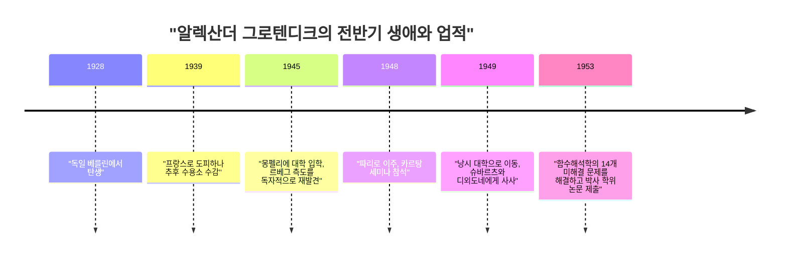
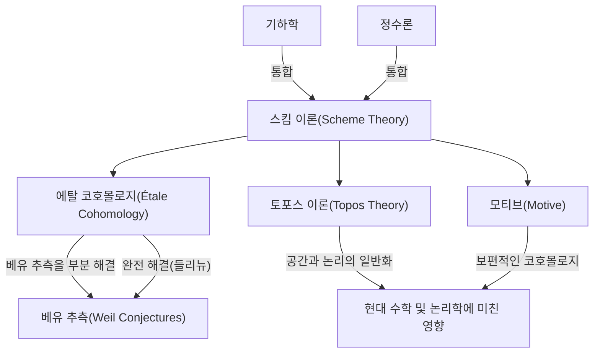

# [[알렉산더 그로텐디크](https://kenji.blog/p/grothendieck/): 20세기 위대한 수학자의 생애와 업적](https://kenji.blog/p/grothendieck/)

[알렉산더 그로텐디크](https://kenji.blog/p/grothendieck/)([Alexander Grothendieck](https://kenji.blog/p/grothendieck/))는 20세기 후반 수학계, 특히 대수기하학 분야에서 근본적인 패러다임의 전환을 가져온 역사상 최고의 수학자 중 한 명입니다. 그의 업적은 단순히 개별적인 미해결 문제를 해결한 수준에 그치지 않고, 수학이라는 학문 자체의 언어와 개념적 틀을 근본부터 재구성한 것이었습니다. 본 기사에서는 그의 기구하고 극적인 생애와 현대 수학에 미친 헤아릴 수 없는 영향에 대해 자세히 해설합니다.

## 1. 격동의 유년기와 전쟁의 그림자

그로텐디크의 생애는 그의 수학적 업적만큼이나 특이하고 많은 고난으로 가득 차 있었습니다.

### 무정부주의자 부모와 베를린에서의 탄생

1928년 독일 베를린에서 태어난 그로텐디크는 급진적인 무정부주의자 부모 밑에서 자랐습니다. 아버지 사샤 샤피로(Sascha Schapiro)는 러시아 출신의 유대인으로, 러시아 혁명 당시 박해를 받아 한쪽 팔을 잃고 독일로 피신한 인물이었습니다. 어머니 한카 그로텐디크(Hanka Grothendieck)는 독일인 저널리스트였습니다. 부모는 정치 활동에 몰두해 있었기 때문에, 어린 알렉산더는 위탁 가정에서 자라기도 했습니다.

### 난민으로서의 삶과 수용소

1933년 나치가 독일에서 권력을 잡자, 유대계이자 무정부주의자였던 아버지는 신변의 위협을 느끼고 프랑스로 도피했으며, 나중에 어머니도 그 뒤를 따랐습니다. 알렉산더는 1939년까지 독일의 위탁 가정에 머물렀지만, 전쟁의 발소리가 다가오면서 부모를 따라 프랑스로 향했습니다.

그러나 제2차 세계 대전이 발발하자 일가의 운명은 암전됩니다. 아버지는 아우슈비츠 강제 수용소로 보내져 그곳에서 목숨을 잃었습니다. 알렉산더와 어머니는 프랑스 내의 리외크로(Rieucros) 수용소에 수감되었습니다. 이러한 가혹한 환경 속에서도 그는 수용소 내 학교에서 수학에 대한 이상할 정도의 집중력과 재능의 편린을 보여주었다고 합니다. 그 후 그는 르샹봉쉬르리뇽(Le Chambon-sur-Lignon)이라는 개신교 마을의 시설에 숨겨져 고등 교육을 받을 수 있었습니다.

## 2. 수학계에 충격적인 등장

전후 그로텐디크는 본격적으로 수학의 길로 나아가기 시작하지만, 그 과정 또한 규격을 벗어난 것이었습니다.

### 몽펠리에 대학에서의 "부피" 재발견

1945년, 그는 몽펠리에 대학에 입학합니다. 당시 몽펠리에 대학의 수학 교육 수준은 반드시 높다고 할 수 없었고, 그는 강의 내용에 만족하지 못하여 독자적으로 "길이", "넓이", "부피"의 개념을 엄밀하게 정의하려고 시도했습니다. 그는 교사의 도움 없이 과거 앙리 르베그(Henri Lebesgue)가 구축했던 "르베그 측도" 이론을 독력으로 완전히 재구축해 낸 것입니다. 이 에피소드는 그가 기존 지식에 의존하지 않고 사물을 근본부터 스스로 끝까지 생각하는 자세를 이미 가지고 있었음을 보여줍니다.

### 낭시에서의 전설: 14개의 미해결 문제

1948년, 그는 수학의 중심지인 파리로 향하여 고등사범학교에서 앙리 카르탕(Henri Cartan) 등이 주재하는 전설적인 세미나에 참석합니다. 그러나 그곳에서 최첨단 수학 지식의 격차에 직면하고, 그는 일시적인 좌절을 맛봅니다.

그 후 그는 낭시 대학으로 옮겨 로랑 슈바르츠(Laurent Schwartz)와 장 디외도네(Jean Dieudonné)라는 두 뛰어난 수학자의 지도를 받게 됩니다. 어느 날, 슈바르츠와 디외도네는 그들이 최근 발표한 논문에서 미해결로 남아 있던 14개의 문제를 그로텐디크에게 제시했습니다.

그런데 몇 달 후, 그로텐디크는 그들 곁으로 돌아와 **14개의 미해결 문제를 완전히 해결한** 노트를 제출한 것입니다. 그는 "위상 텐서 곱"과 "핵 공간(Nuclear Space)"이라는 전혀 새로운 개념을 창안하여 문제들을 근본부터 일소해 버렸습니다. 이 업적으로 그는 함수해석학 분야에서 순식간에 세계적인 명성을 얻게 됩니다.

## 3. 대수기하학의 재구축: IHÉS에서의 황금기

함수해석학에서 정점을 찍은 후, 그는 놀랍게도 전혀 다른 분야인 "대수기하학"과 "호몰로지 대수학"으로 연구의 축을 옮깁니다.

### 도호쿠 논문(Tohoku Paper)

1957년 일본의 『도호쿠 수학 저널』에 발표된 논문 "호몰로지 대수학의 몇 가지 점에 대하여"는 범주론과 호몰로지 대수학을 융합시켜 **아벨 범주(Abelian Category)** 의 개념을 확립한 역사적인 논문입니다. 이로써 층의 코호몰로지를 임의의 위상 공간 위에서 엄밀하게 정의하는 것이 가능해졌습니다.

### IHÉS의 설립과 EGA/SGA

1958년 프랑스 고등과학연구소(IHÉS)가 설립되었고, 그로텐디크는 그 창설 멤버의 수학 부문 교수로 초빙됩니다. 여기서부터 약 12년간이 그의 "황금기"였습니다.

그는 장 디외도네, 장 피에르 세르(Jean-Pierre Serre) 등과 함께 대수기하학의 기초를 완전히 다시 쓰는 장대한 프로젝트를 시작했습니다. 그것이 『대수기하학 원론』(통칭 **EGA** )입니다. 또한 그의 지도 아래 진행된 세미나의 기록은 『대수기하학 세미나』(통칭 **SGA** )로 출판되었습니다. 이들은 수천 페이지에 달하는 방대한 저작으로, 현대 대수기하학의 "성전"으로서 현재까지도 계속 읽히고 있습니다.

## 4. 혁명적인 수학 개념들

그로텐디크의 가장 큰 공헌은 수학의 대상을 근본적으로 일반화하고, 전혀 다른 분야로 여겨졌던 영역들을 통합하는 새로운 언어를 제공한 것입니다.

### 스킴 이론(Scheme Theory)

기존의 대수기하학은 복소수 등의 "체(Field)" 위에서 전개되었습니다. 그로텐디크는 이 개념을 극한까지 확장하여 **스킴(Scheme)** 이라는 개념을 도입했습니다.

가환환 $R$ 에 대하여 그 소아이디얼의 전체에 위상과 구조층을 준 것을 아핀 스킴이라고 부르며, $\text{Spec}(R)$ 로 표기합니다.

$$ \text{Spec}(R) = \{ \mathfrak{p} \mid \mathfrak{p} \text{ 는 } R \text{ 의 소아이디얼} \} $$

이로써 방정식의 정수해를 구하는 정수론의 문제를 기하학적인 공간의 성질로서 다룰 수 있게 되었습니다.

### 에탈 코호몰로지와 베유 추측

그로텐디크의 주요 목표 중 하나는 유한체 위의 대수다양체에 관한 "베유 추측"을 증명하는 것이었습니다. 그는 고전적인 위상 공간의 개념을 확장하여 **에탈 코호몰로지(Étale Cohomology)** 라는 전혀 새로운 이론을 창설했습니다. 그는 이 무기를 사용하여 베유 추측의 일부를 증명했고, 마지막 부분은 그의 뛰어난 제자인 피에르 들리뉴(Pierre Deligne)에 의해 증명되었습니다.

### 토포스 이론과 모티브

그로텐디크의 사고는 한층 더 추상의 계단을 오릅니다. 그는 공간의 개념 자체를 일반화하는 **토포스(Topos)** 라는 개념을 만들어냈습니다.

또한 다양한 코호몰로지 이론을 통합하는 보편적인 대상으로서 **모티브(Motive)** 의 개념을 제창했습니다. 모티브 이론은 현재에도 완전히 해명되지 않았으며, 현대 수학에 있어 최대의 탐구 주제 중 하나로 남아 있습니다.

## 5. 독자적인 철학: 호두까기의 비유

그로텐디크는 자신의 수학적 접근 방식을 "호두까기"의 비유를 사용하여 설명했습니다. 단단한 호두(난제)를 열 때 망치로 힘껏 내리치는 것이 아니라, 호두를 물에 담그고 시간을 들여 부드럽게 하여 자연스럽게 껍질이 두 갈래로 갈라지기를 기다린다. 즉, **"문제가 자연스럽게 녹아내릴 듯한 강력하고 광범위한 이론의 바다를 구축하는"** 것을 선호했습니다.

## 6. 어린이의 그림(Dessins d'enfants)과 원아벨 기하학

1980년대에 접어들며, 그는 매우 단순하고 시각적인 개념에서 출발하여 수학의 가장 깊은 수수께끼에 접근하는 새로운 이론을 제창했습니다.

그중 하나가 **"어린이의 그림(Dessins d'enfants)"** 입니다. 구면 등 곡면 위에 그려진 단순한 그래프로부터 절대 갈루아 군이라는 신비로운 대상의 작용을 이끌어낼 수 있다는 것을 발견했습니다.

더 나아가 그는 **"원아벨 기하학(Anabelian Geometry)"** 이라는 프로그램을 제창했습니다. 이것은 어떤 종류의 대수다양체에서는 기본군이라고 불리는 위상적인 구조의 데이터만으로 원래의 대상을 완전히 복원할 수 있다는 놀라운 추측입니다.

## 7. 갑작스러운 은퇴와 고독으로의 발걸음

1966년 필즈상을 수상한 그로텐디크였지만, 1970년 IHÉS의 자금 일부가 군사부에서 제공되고 있다는 사실을 알고 항의의 표시로 돌연 사임합니다. 이후 그는 환경보호 운동과 반전 운동에 심취해 갑니다.

1980년대에는 『수확과 씨뿌리기(Récoltes et Semailles)』라는 방대한 회고록을 집필했습니다. 1991년 그는 가족이나 친구와의 연락을 모두 끊고 프랑스 남부 피레네 산맥 기슭에 있는 작은 마을에 은둔했습니다. 이후 2014년 86세로 세상을 떠날 때까지 그는 아무도 만나지 않고 고독 속에서 사색과 집필을 계속했습니다.

## 결론

[알렉산더 그로텐디크](https://kenji.blog/p/grothendieck/)는 수학이라는 학문에 전혀 새로운 풍경을 가져다준 거인이었습니다. 그가 남긴 개념들은 단순한 수학의 틀을 넘어 인간의 논리적 사고의 가능성이 얼마나 넓어질 수 있는지를 보여줍니다. 그가 응시하던 심연의 세계는 지금도 여전히 풍성한 열매를 맺고 있습니다.
