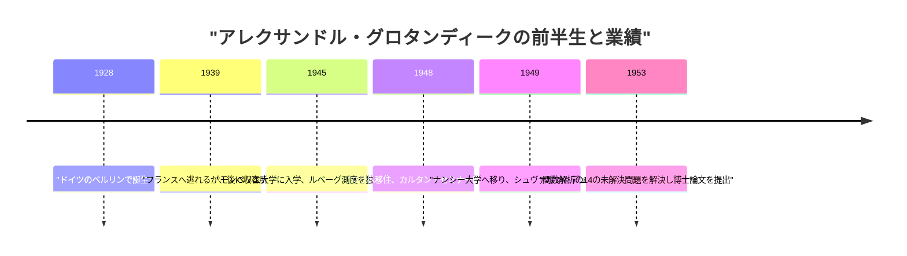
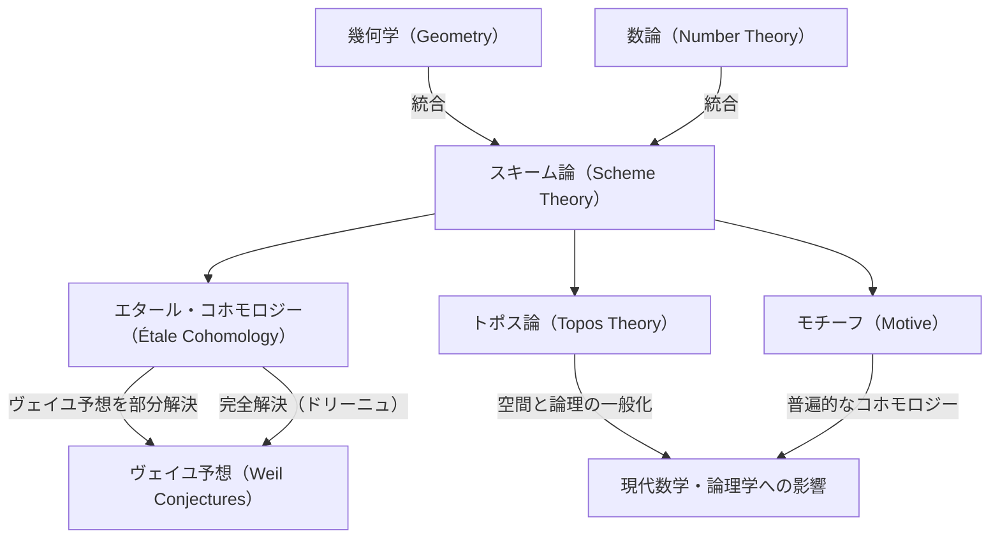

# [アレクサンドル・グロタンディーク](https://kenji.blog/p/grothendieck/)：20世紀最大の数学者の生涯と業績

[アレクサンドル・グロタンディーク](https://kenji.blog/p/grothendieck/)（[Alexander Grothendieck](https://kenji.blog/p/grothendieck/)）は、20世紀後半の数学界、特に代数幾何学の分野において、根本的なパラダイムシフトをもたらした史上最高の数学者の一人です。彼の業績は、単に個別の未解決問題を解決したというレベルにとどまらず、数学という学問そのものの言語と概念の枠組みを根底から再構築するものでした。本記事では、彼の数奇で劇的な生涯と、現代数学に与えた計り知れない影響について、詳細に解説します。

## 1. 激動の幼少期と戦争の影

[グロタンディーク](https://kenji.blog/p/grothendieck/)の生涯は、彼の数学的業績と同じくらい特異で、多くの困難に満ちていました。

### 無政府主義者の両親とベルリンでの誕生

1928年、ドイツのベルリンで生まれた[グロタンディーク](https://kenji.blog/p/grothendieck/)は、急進的な無政府主義者（アナキスト）の両親のもとで育ちました。父親のサシャ・シャピロ（Sascha Schapiro）はロシア出身のユダヤ人で、ロシア革命の際に迫害を受けて片腕を失い、ドイツへ逃れてきた人物でした。母親のハンカ・[グロタンディーク](https://kenji.blog/p/grothendieck/)（Hanka Grothendieck）はドイツ人のジャーナリストでした。両親は政治活動に没頭しており、幼いアレクサンドルは里親のもとで育てられる時期もありました。

### 難民としての生活と収容所

1933年にナチスがドイツで権力を握ると、ユダヤ系で無政府主義者であった父親は身の危険を感じてフランスへ逃亡し、後に母親もそれに続きました。アレクサンドルは1939年までドイツの里親のもとに留まりましたが、戦争の足音が近づく中、両親を追ってフランスへ向かいました。

しかし、第二次世界大戦が勃発すると、一家の運命は暗転します。父親はアウシュビッツ強制収容所に送られ、そこで命を落としました。アレクサンドルと母親はフランス国内のリエジュー収容所に収監されました。このような過酷な環境の中でも、彼は収容所内の学校で数学に対する異常な集中力と才能の片鱗を見せていたと言われています。その後、彼はプロテスタントの村であるル・シャンボン＝シュル＝リニョン（Le Chambon-sur-Lignon）の施設に匿われ、高校教育を受けることができました。

## 2. 数学界への衝撃的な登場

戦後、[グロタンディーク](https://kenji.blog/p/grothendieck/)は本格的に数学の道へと進み始めますが、その過程も規格外のものでした。

### モンペリエ大学での「体積」の再発見

1945年、彼はモンペリエ大学に入学します。当時のモンペリエ大学の数学教育のレベルは必ずしも高いものではありませんでしたが、彼は講義の内容に満足できず、独自に「長さ」「面積」「体積」の概念を厳密に定義しようと試みました。彼は教師の助けを借りることなく、かつてアンリ・ルベーグ（Henri Lebesgue）が構築した「ルベーグ測度」の理論を、独力で完全に再構築してしまったのです。このエピソードは、彼が既存の知識に頼らず、物事の根本から自分で考え抜くという姿勢をすでに持っていたことを示しています。

### ナンシーでの伝説：14の未解決問題

1948年、彼は数学の中心地であるパリへ向かい、エコール・ノルマル・シュペリウール（高等師範学校）でアンリ・カルタン（Henri Cartan）らが主宰する伝説的なセミナーに参加します。しかし、そこでの最先端の数学の知識のギャップに直面し、彼は一時的に挫折を味わいます。

その後、彼はナンシー大学に移り、ローラン・シュヴァルツ（Laurent Schwartz）とジャン・デュドネ（Jean Dieudonné）という二人の卓越した数学者の指導を受けることになります。ある日、シュヴァルツとデュドネは、彼らが最近発表した論文の中で未解決として残されていた14個の問題を[グロタンディーク](https://kenji.blog/p/grothendieck/)に提示しました。

ところが数ヶ月後、[グロタンディーク](https://kenji.blog/p/grothendieck/)は彼らのもとに戻ってくると、 **14の未解決問題すべてを完全に解決した** ノートを提出したのです。彼は「位相テンソル積」と「核型空間」という全く新しい概念を創り出し、問題を根底から一掃してしまいました。この業績により、彼は関数解析の分野で瞬く間に世界的な名声を獲得します。

## 3. 代数幾何学の再構築：IHÉSでの黄金期

関数解析で頂点を極めた後、彼は驚くべきことに全く別の分野である「代数幾何学」と「ホモロジー代数」へと研究の軸足を移します。

### 東北論文（Tohoku Paper）

1957年に日本の『東北数学雑誌』に発表された論文「ホモロジー代数について」は、圏論とホモロジー代数を融合させ、 **[アーベル](https://kenji.blog/p/abel/)圏（[Abel](https://kenji.blog/p/abel/)ian Category）** の概念を確立した歴史的な論文です。これにより、層のコホモロジーを任意の空間上で厳密に定義することが可能になりました。

### IHÉSの設立とEGA/SGA

1958年、フランス高等科学研究所（IHÉS）が設立され、[グロタンディーク](https://kenji.blog/p/grothendieck/)はその創設メンバーの数学部門教授として迎えられます。ここからの約12年間が、彼の「黄金期」でした。

彼はジャン・デュドネやジャン＝ピエール・セール（Jean-Pierre Serre）らと共に、代数幾何学の基礎を完全に書き換える壮大なプロジェクトを開始しました。それが『代数幾何学原論』（通称 **EGA** ）です。さらに、彼の指導の下で行われたセミナーの記録は『代数幾何学セミナー』（通称 **SGA** ）として出版されました。これらは数千ページに及ぶ膨大な著作であり、現代の代数幾何学における「聖典」として現在でも読まれ続けています。

## 4. 革命的な数学概念たち

[グロタンディーク](https://kenji.blog/p/grothendieck/)の最大の貢献は、数学の対象を根本的に一般化し、全く異なると思われていた分野を統合する新しい言語を与えたことです。

### スキーム論（Scheme Theory）

従来、代数幾何学は複素数などの「体」の上で行われていました。[グロタンディーク](https://kenji.blog/p/grothendieck/)は、この概念を極限まで拡張し、 **スキーム（Scheme）** という概念を導入しました。

可換環 $R$ に対して、その素イデアルの全体に位相と構造層を与えたものをアファイン・スキームと呼び、 $\text{Spec}(R)$ と表記します。

$$ \text{Spec}(R) = \{ \mathfrak{p} \mid \mathfrak{p} \text{ は } R \text{ の素イデアル} \} $$

これにより、方程式の整数解を求めるという数論の問題を、幾何学的な空間の性質として扱うことができるようになりました。

### エタール・コホモロジーと[ヴェイユ](https://kenji.blog/p/weil/)予想

[グロタンディーク](https://kenji.blog/p/grothendieck/)の主要な目標の一つは、有限体上の代数多様体に関する「ヴェイユ予想」を証明することでした。彼は、古典的な位相空間の概念を拡張し、 **エタール・コホモロジー（Étale Cohomology）** という全く新しい理論を創設しました。彼はこの武器を用いて[ヴェイユ](https://kenji.blog/p/weil/)予想の一部を証明し、最後の部分は彼の弟子であるピエール・ドリーニュ（Pierre Deligne）によって証明されました。

### トポス論とモチーフ

[グロタンディーク](https://kenji.blog/p/grothendieck/)の思考はさらに抽象の階段を上ります。彼は、空間の概念そのものを一般化する **トポス（Topos）** という概念を生み出しました。

また、様々な異なるコホモロジー理論を統合する普遍的な対象として **モチーフ（Motive）** の概念を提唱しました。モチーフの理論は現在でも完全に解明されているわけではなく、現代数学における最大の探求テーマの一つであり続けています。

## 5. 独自の哲学：くるみ割りの比喩

[グロタンディーク](https://kenji.blog/p/grothendieck/)は自身の数学的アプローチを「くるみ割り」の比喩を用いて説明しています。硬いくるみ（難問）を開けるとき、ハンマーで力任せに叩き割るのではなく、くるみを水に浸し、時間をかけて柔らかくして、自然に殻が二つに割れるのを待つ。つまり、 **「問題が自然に溶けてしまうような強力で広範な理論の海を構築する」** ことを好みました。

## 6. 子供のデッサンと遠[アーベル](https://kenji.blog/p/abel/)幾何学

1980年代に入り、彼は非常にシンプルで視覚的な概念から、数学の最も深い謎に迫る新しい理論を提唱しました。

その一つが **「子供のデッサン（Dessins d'enfants）」** です。球面などの曲面上に描かれた単純な[グラフ](https://kenji.blog/p/tree-graph-data-structures-search-dfs-bfs-dijkstra/)から、絶対[ガロア](https://kenji.blog/p/galois/)群という神秘的な対象の作用を引き出せることを発見しました。

さらに彼は **「遠[アーベル](https://kenji.blog/p/abel/)幾何学（Anabelian Geometry）」** というプログラムを提唱しました。これは、ある種の代数多様体においては、その基本群と呼ばれる位相的な構造のデータだけで元の対象が完全に復元できるという驚くべき予想です。

## 7. 突然の引退と孤独への歩み

1966年にフィールズ賞を受賞した[グロタンディーク](https://kenji.blog/p/grothendieck/)でしたが、1970年、IHÉSの資金の一部が軍事省から提供されていることを知り、抗議のために突如として辞任します。以降、彼は環境保護運動や反戦運動に傾倒していきます。

1980年代には『収穫と種まき（Récoltes et Semailles）』という膨大な回想録を執筆しました。1991年、彼は家族や友人との連絡を全て絶ち、フランス南部のピレネー山脈の麓にある小さな村に隠遁しました。以降、2014年に86歳でこの世を去るまで、彼は誰とも会わず、孤独の中で思索と執筆を続けました。

## 結論

[アレクサンドル・グロタンディーク](https://kenji.blog/p/grothendieck/)は、数学という学問に全く新しい景色をもたらした巨人でした。彼の残した概念は、単なる数学の枠組みを超えて、人間の論理的思考の可能性の広がりを示しています。彼が見つめていた深淵な世界は、今もなお豊饒な果実をもたらし続けています。
