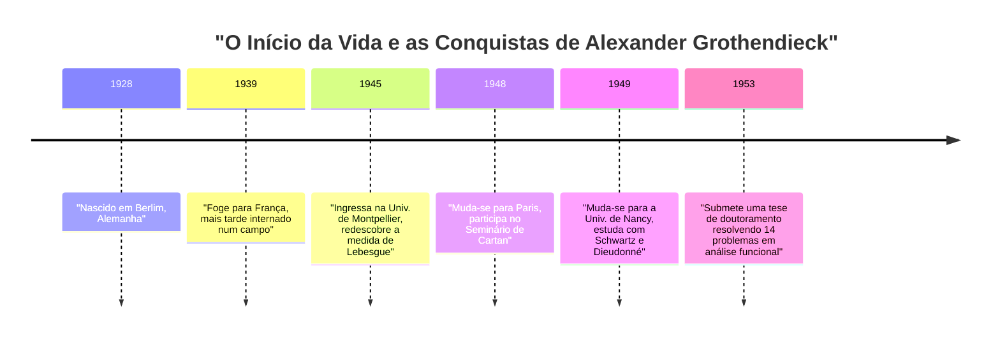
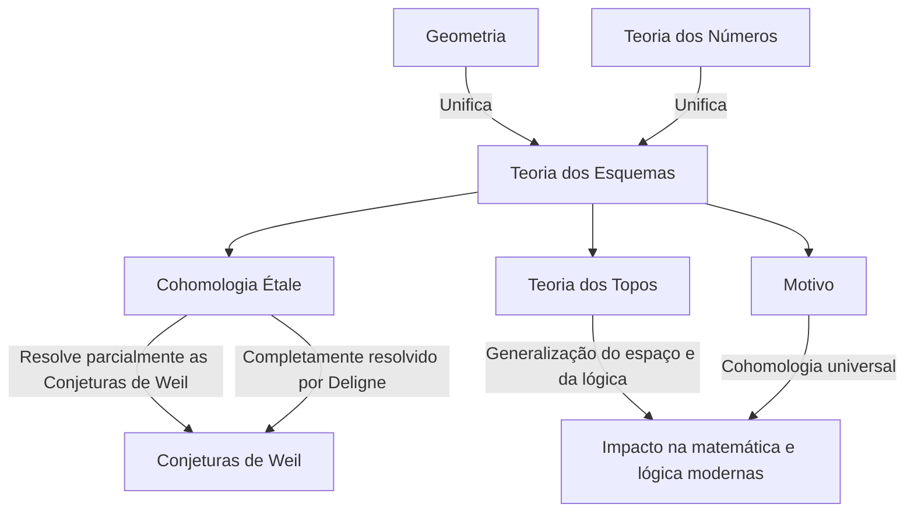

# [Alexander Grothendieck: A Vida e as Conquistas do Maior Matemático do Século XX](https://kenji.blog/pt/p/grothendieck/)

[Alexander Grothendieck](https://kenji.blog/pt/p/grothendieck/) é um dos maiores matemáticos da história que provocou uma mudança de paradigma fundamental na comunidade matemática do final do século XX, particularmente no campo da geometria algébrica. As suas conquistas foram muito além de resolver problemas em aberto individuais; elas reconstruíram fundamentalmente a própria linguagem e o arcabouço conceitual da matemática em si. Neste artigo, forneceremos uma explicação detalhada da sua vida extraordinária e dramática, bem como do seu impacto imensurável na matemática moderna.

## 1. Uma Infância Tumultuada e a Sombra da Guerra

A vida de Grothendieck foi tão única e cheia de dificuldades quanto as suas conquistas matemáticas.

### Pais Anarquistas e Nascimento em Berlim

Nascido em Berlim, Alemanha, em 1928, Grothendieck foi criado por pais anarquistas radicais. O seu pai, Sascha Schapiro, era um judeu nascido na Rússia que fugiu para a Alemanha após perder um braço devido à perseguição durante a Revolução Russa. A sua mãe, Hanka Grothendieck, era uma jornalista alemã. Ambos os pais estavam muito envolvidos no ativismo político, e o jovem Alexander passou parte da sua primeira infância a viver com famílias de acolhimento.

### Vida como Refugiado e em Campos de Internamento

Quando os nazis tomaram o poder na Alemanha em 1933, o seu pai, judeu e anarquista, sentiu que a sua vida corria perigo e fugiu para a França, seguido mais tarde pela sua mãe. Alexander permaneceu com os seus pais de acolhimento na Alemanha até 1939, quando viajou para a França para se juntar aos pais enquanto os passos da guerra se aproximavam.

No entanto, com a eclosão da Segunda Guerra Mundial, o destino da família tomou um rumo sombrio. O seu pai foi enviado para o campo de concentração de Auschwitz, onde pereceu. Alexander e a sua mãe foram internados no campo de Rieucros, em França. Mesmo em condições tão difíceis, diz-se que ele mostrou um vislumbre da sua extraordinária concentração e talento para a matemática na escola do campo. Mais tarde, foi escondido numa casa na aldeia protestante de Le Chambon-sur-Lignon, onde pôde receber o ensino secundário.

## 2. Uma Estreia Chocante no Mundo da Matemática

Após a guerra, Grothendieck começou a dedicar-se seriamente à matemática, mas o seu caminho foi muito pouco convencional.

### Redescobrindo o "Volume" na Universidade de Montpellier

Em 1945, ingressou na Universidade de Montpellier. O nível de ensino matemático ali, na altura, não era necessariamente alto, e insatisfeito com as palestras, tentou definir rigorosamente os conceitos de "comprimento", "área" e "volume" por conta própria. Sem a ajuda de professores, reconstruiu completamente a teoria da "medida de Lebesgue", previamente estabelecida por Henri Lebesgue, inteiramente sozinho. Este episódio demonstra a sua atitude inerente de pensar as coisas a partir dos seus próprios fundamentos, sem depender de conhecimentos existentes.

### A Lenda em Nancy: 14 Problemas Não Resolvidos

Em 1948, mudou-se para Paris, o centro da matemática, e participou no lendário seminário organizado por Henri Cartan e outros na École Normale Supérieure. No entanto, perante uma lacuna no seu conhecimento da matemática de vanguarda, sofreu um revés temporário.

Mudou-se então para a Universidade de Nancy, onde foi orientado por dois matemáticos notáveis, Laurent Schwartz e Jean Dieudonné. Um dia, Schwartz e Dieudonné apresentaram a Grothendieck 14 problemas não resolvidos que tinham ficado em aberto nos seus artigos recentemente publicados.

Para espanto deles, alguns meses depois, Grothendieck regressou e apresentou notas que **resolviam completamente os 14 problemas em aberto** . Ele criou conceitos inteiramente novos, como o "produto tensorial topológico" e o "espaço nuclear", eliminando os problemas pela raiz. Com esta conquista, ganhou instantaneamente fama mundial no campo da análise funcional.

## 3. Reconstruindo a Geometria Algébrica: A Época Dourada no IHÉS

Depois de alcançar o auge da análise funcional, mudou surpreendentemente o seu foco de investigação para campos completamente diferentes: a "geometria algébrica" e a "álgebra homológica".

### O Artigo de Tohoku

O seu artigo "Sur quelques points d'algèbre homologique" (Sobre alguns pontos da álgebra homológica), publicado na revista japonesa *Tohoku Mathematical Journal* em 1957, é um artigo histórico que fundiu a teoria das categorias e a álgebra homológica, estabelecendo o conceito de uma **Categoria [Abel](https://kenji.blog/pt/p/abel/)iana** . Isso possibilitou definir rigorosamente a cohomologia de feixes sobre qualquer espaço topológico.

### A Fundação do IHÉS e EGA/SGA

Em 1958, o Institut des Hautes Études Scientifiques (IHÉS) foi estabelecido em França, e Grothendieck foi recebido como membro fundador e professor na sua divisão de matemática. Os 12 anos seguintes marcaram a sua "Época Dourada".

Juntamente com Jean Dieudonné, Jean-Pierre Serre e outros, embarcou num projeto monumental para reescrever completamente os fundamentos da geometria algébrica. Estes tornaram-se os *Éléments de géométrie algébrique* (comumente conhecidos como **EGA** ). Além disso, os registos dos seminários realizados sob a sua direção foram publicados como o *Séminaire de Géométrie Algébrique* (comumente conhecido como **SGA** ). Estas são obras massivas que abrangem milhares de páginas e continuam a ser lidas hoje como os "textos sagrados" da geometria algébrica moderna.

## 4. Conceitos Matemáticos Revolucionários

A maior contribuição de Grothendieck foi generalizar fundamentalmente os objetos da matemática e fornecer uma nova linguagem que unificou campos aparentemente distintos.

### Teoria dos Esquemas

Tradicionalmente, a geometria algébrica era estudada sobre "corpos" como os números complexos. Grothendieck levou este conceito ao seu limite ao introduzir o conceito de um **Esquema** .

Para um anel comutativo $R$, o conjunto de todos os seus ideais primos dotado de uma topologia e um feixe estrutural é chamado de esquema afim, denotado como $\text{Spec}(R)$.

$$ \text{Spec}(R) = \{ \mathfrak{p} \mid \mathfrak{p} \text{ é um ideal primo de } R \} $$

Isto permitiu que problemas na teoria dos números — como encontrar soluções inteiras para equações — fossem tratados como propriedades geométricas dos espaços.

### Cohomologia Étale e as Conjeturas de Weil

Um dos principais objetivos de Grothendieck era provar as "Conjeturas de Weil" em relação a variedades algébricas sobre corpos finitos. Expandiu o conceito clássico de espaços topológicos e fundou uma teoria inteiramente nova chamada **Cohomologia Étale** . Utilizando esta poderosa arma, provou parte das Conjeturas de Weil, e a parte final foi provada pelo seu brilhante estudante, Pierre Deligne.

### Teoria dos Topos e Motivos

O pensamento de Grothendieck ascendeu ainda mais pela escada da abstração. Criou o conceito de um **Topos** , que generaliza o próprio conceito de espaço.

Além disso, propôs o conceito de um **Motivo** como um objeto universal que integra várias teorias de cohomologia diferentes. A teoria dos motivos ainda não é completamente compreendida hoje e continua a ser um dos maiores temas de exploração na matemática moderna.

## 5. A Sua Filosofia Única: A Analogia do Quebra-Nozes

Grothendieck explicou a sua abordagem matemática usando a analogia de um "quebra-nozes". Ao tentar abrir uma noz dura (um problema difícil), em vez de a golpear com força com um martelo, preferia mergulhar a noz em água, esperar que amolecesse com o tempo e deixar a casca abrir naturalmente. Por outras palavras, preferia **"construir um mar de teoria poderoso e expansivo no qual o problema se dissolve naturalmente"** em vez de o resolver diretamente.

## 6. Dessins d'enfants e Geometria Anabeliana

Entrando na década de 1980, propôs novas teorias que abordavam os mistérios mais profundos da matemática a partir de conceitos muito simples e visuais.

Um destes foi os **"Dessins d'enfants" (Desenhos de crianças)** . Descobriu que a partir de gráficos simples desenhados em superfícies curvas como uma esfera, se podia extrair a ação do grupo de [Galois](https://kenji.blog/pt/p/galois/) absoluto, um objeto altamente misterioso e complexo na teoria dos números.

Além disso, propôs um programa chamado **"Geometria Anabeliana"** . Esta é a surpreendente conjetura de que para certas variedades algébricas, os objetos geométricos e aritméticos originais podem ser completamente reconstruídos apenas a partir dos dados topológicos conhecidos como grupo fundamental.

## 7. Reforma Repentina e o Caminho para a Solidão

Apesar de ter ganho a Medalha Fields em 1966, Grothendieck demitiu-se abruptamente do IHÉS em 1970 em protesto depois de saber que parte do seu financiamento provinha do Ministério das Forças Armadas. Posteriormente, mergulhou em movimentos ambientalistas e antiguerra.

Na década de 1980, escreveu uma enorme memória intitulada *Récoltes et Semailles* (Colheitas e Sementeiras). Em 1991, cortou todo o contacto com a família e os amigos e isolou-se numa pequena aldeia no sopé dos Pirenéus, no sul de França. Até à sua morte, aos 86 anos, em 2014, não se encontrou com ninguém, continuando os seus pensamentos e escritos em completa solidão.

## Conclusão

[Alexander Grothendieck](https://kenji.blog/pt/p/grothendieck/) foi um gigante que trouxe uma paisagem inteiramente nova à disciplina da matemática. Os conceitos que deixou para trás transcendem o mero quadro da matemática, demonstrando as possibilidades de expansão do pensamento lógico humano. O mundo profundo que ele contemplava continua a dar frutos abundantes até hoje.
