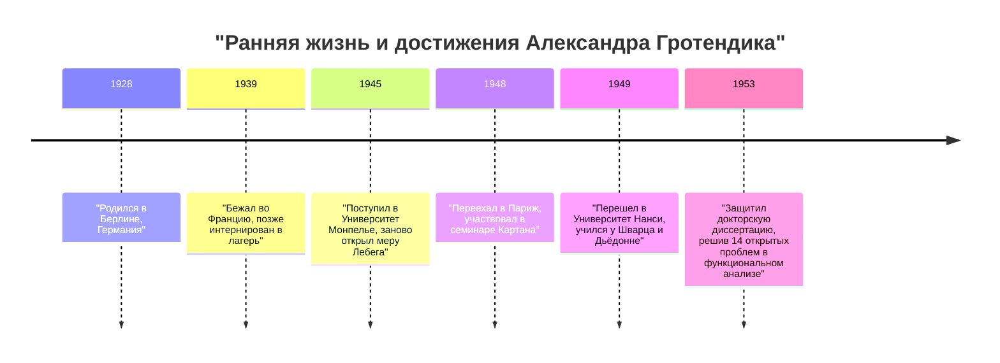
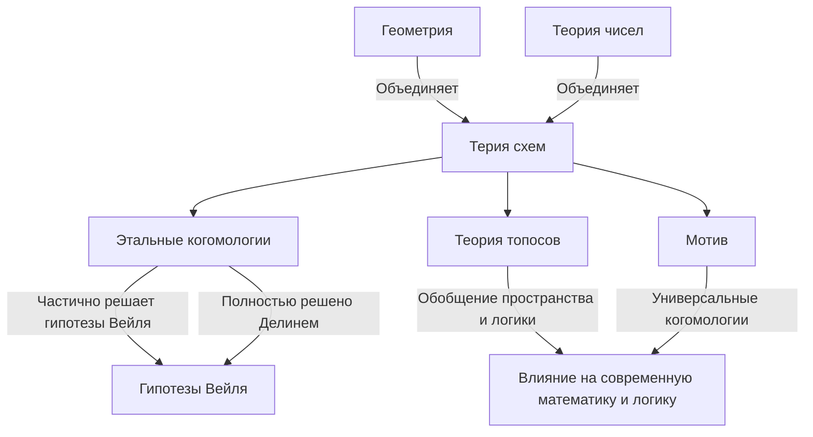

# [[Александр Гротендик](https://kenji.blog/p/grothendieck/): Жизнь и достижения величайшего математика 20-го века](https://kenji.blog/p/grothendieck/)

[Александр Гротендик](https://kenji.blog/p/grothendieck/) — один из величайших математиков в истории, совершивший фундаментальный сдвиг парадигмы в математическом сообществе конца 20-го века, в частности в области алгебраической геометрии. Его достижения вышли далеко за рамки решения отдельных нерешенных задач; они фундаментально перестроили сам язык и концептуальную структуру математики. В этой статье мы подробно расскажем о его необыкновенной и драматичной жизни, а также о его неизмеримом влиянии на современную математику.

## 1. Бурное детство и тень войны

Жизнь Гротендика была такой же уникальной и полной лишений, как и его математические достижения.

### Родители-анархисты и рождение в Берлине

Гротендик родился в Берлине, Германия, в 1928 году и воспитывался радикальными родителями-анархистами. Его отец, Саша Шапиро, был евреем российского происхождения, который бежал в Германию после того, как потерял руку из-за преследований во время русской революции. Его мать, Ханка Гротендик, была немецкой журналисткой. Оба родителя были активно вовлечены в политический активизм, и юный Александр провел часть своего раннего детства в приемных семьях.

### Жизнь беженца и концентрационные лагеря

Когда в 1933 году в Германии к власти пришли нацисты, его отец почувствовал, что его жизнь в опасности, и бежал во Францию, куда позже последовала и его мать. Александр оставался со своими приемными родителями в Германии до 1939 года, когда он отправился во Францию, чтобы присоединиться к родителям по мере приближения войны.

Однако с началом Второй мировой войны судьба семьи приняла мрачный оборот. Его отец был отправлен в концентрационный лагерь Освенцим, где и погиб. Александр и его мать были интернированы в лагерь Рьёкро во Франции. Говорят, что даже в таких суровых условиях он продемонстрировал проблески своей необычайной концентрации и таланта к математике в лагерной школе. Позже его прятали в доме в протестантской деревне Шамбон-сюр-Линьон, где он смог получить среднее образование.

## 2. Шокирующий дебют в математическом мире

После войны Гротендик начал всерьез заниматься математикой, но его путь был весьма нетрадиционным.

### Заново открывая "объем" в Университете Монпелье

В 1945 году он поступил в Университет Монпелье. Уровень математического образования там в то время был не слишком высоким, и, неудовлетворенный лекциями, он попытался строго определить понятия "длина", "площадь" и "объем" самостоятельно. Без помощи преподавателей он полностью воссоздал теорию "меры Лебега", ранее созданную Анри Лебегом, совершенно самостоятельно. Этот эпизод демонстрирует его врожденную склонность продумывать вещи с самых основ, не полагаясь на существующие знания.

### Легенда в Нанси: 14 нерешенных проблем

В 1948 году он переехал в Париж, центр математики, и принял участие в легендарном семинаре, проводимом Анри Картаном и другими в Высшей нормальной школе. Однако, столкнувшись с пробелом в своих знаниях передовой математики, он пережил временную неудачу.

Затем он перешел в Университет Нанси, где его наставниками стали два выдающихся математика, Лоран Шварц и Жан Дьёдонне. Однажды Шварц и Дьёдонне представили Гротендику 14 нерешенных задач, которые остались открытыми в их недавно опубликованных статьях.

К их изумлению, несколько месяцев спустя Гротендик вернулся и представил записи, которые **полностью решали все 14 нерешенных проблем** . Он создал совершенно новые концепции, такие как "топологическое тензорное произведение" и "ядерное пространство", уничтожив проблемы на корню. Благодаря этому достижению он мгновенно приобрел всемирную известность в области функционального анализа.

## 3. Перестройка алгебраической геометрии: Золотой век в IHÉS

Достигнув вершины в функциональном анализе, он неожиданно сменил фокус своих исследований на совершенно другие области: "алгебраическую геометрию" и "гомологическую алгебру".

### Статья Тохоку

Его статья "Sur quelques points d'algèbre homologique" (О некоторых вопросах гомологической алгебры), опубликованная в японском *Tohoku Mathematical Journal* в 1957 году, является исторической работой, которая объединила теорию категорий и гомологическую алгебру, установив концепцию **Абелевой категории** . Это позволило строго определить когомологии пучков над любым топологическим пространством.

### Основание IHÉS и EGA/SGA

В 1958 году во Франции был создан Институт высших научных исследований (IHÉS), и Гротендик был приглашен туда в качестве члена-основателя и профессора математического отдела. Следующие 12 лет стали его "Золотым веком".

Вместе с Жаном Дьёдонне, Жан-Пьером Серром и другими он приступил к монументальному проекту по полному переписыванию основ алгебраической геометрии. Эти труды стали *Éléments de géométrie algébrique* (широко известными как **EGA** ). Кроме того, записи семинаров, проводившихся под его руководством, были опубликованы как *Séminaire de Géométrie Algébrique* (известные как **SGA** ). Это массивные работы объемом в тысячи страниц, которые и сегодня продолжают читать как "священные тексты" современной алгебраической геометрии.

## 4. Революционные математические концепции

Величайшим вкладом Гротендика было фундаментальное обобщение объектов математики и создание нового языка, который объединил, казалось бы, различные области.

### Теория схем

Традиционно алгебраическая геометрия изучалась над "полями", такими как комплексные числа. Гротендик довел эту концепцию до предела, введя понятие **Схемы** .

Для коммутативного кольца $R$ множество всех его простых идеалов, наделенное топологией и структурным пучком, называется аффинной схемой и обозначается как $\text{Spec}(R)$.

$$ \text{Spec}(R) = \{ \mathfrak{p} \mid \mathfrak{p} \text{ — простой идеал кольца } R \} $$

Это позволило рассматривать проблемы теории чисел — такие как нахождение целочисленных решений уравнений — как геометрические свойства пространств.

### Этальные когомологии и гипотезы Вейля

Одной из главных целей Гротендика было доказательство "гипотез Вейля" об алгебраических многообразиях над конечными полями. Он расширил классическую концепцию топологических пространств и основал совершенно новую теорию, называемую **Этальные когомологии** . Используя это мощное оружие, он доказал часть гипотез Вейля, а последняя часть была доказана его блестящим учеником Пьером Делинем.

### Теория топосов и мотивы

Мысли Гротендика поднялись еще выше по лестнице абстракции. Он создал концепцию **Топоса** , которая обобщает само понятие пространства.

Кроме того, он предложил концепцию **Мотива** как универсального объекта, который объединяет различные теории когомологий. Теория мотивов до сих пор не до конца понята и остается одной из величайших тем исследований в современной математике.

## 5. Его уникальная философия: Метафора щелкунчика

Гротендик объяснял свой математический подход с помощью метафоры "щелкунчика". Когда нужно открыть твердый орех (сложную проблему), вместо того чтобы бить по нему молотком, он предпочитал замочить орех в воде, подождать, пока он со временем размягчится, и позволить скорлупе раскрыться естественным образом. Другими словами, он предпочитал **"создавать мощное и обширное море теории, в котором проблема растворяется сама собой"** , а не решать её напрямую.

## 6. Детские рисунки и анабелева геометрия

Вступив в 1980-е годы, он предложил новые теории, которые подходили к глубочайшим загадкам математики начиная с очень простых и наглядных концепций.

Одной из них были **"Детские рисунки" (Dessins d'enfants)** . Он обнаружил, что из простых графов, нарисованных на искривленных поверхностях, таких как сфера, можно извлечь действие абсолютной группы Галуа, чрезвычайно загадочного и сложного объекта в теории чисел.

Кроме того, он предложил программу, названную **"Анабелева геометрия"** . Это поразительная гипотеза о том, что для некоторых алгебраических многообразий исходные геометрические и теоретико-числовые объекты могут быть полностью восстановлены только на основе топологических данных, известных как фундаментальная группа.

## 7. Внезапный уход и путь к одиночеству

Несмотря на получение Филдсовской премии в 1966 году, Гротендик внезапно ушел из IHÉS в 1970 году в знак протеста, узнав, что часть его финансирования исходила от Министерства вооруженных сил. Впоследствии он погрузился в экологические и антивоенные движения.

В 1980-х годах он написал объемные мемуары под названием *Урожаи и посевы* (Récoltes et Semailles). В 1991 году он порвал все связи с семьей и друзьями и уединился в небольшой деревне у подножия Пиренеев на юге Франции. Вплоть до своей смерти в возрасте 86 лет в 2014 году он ни с кем не встречался, продолжая свои размышления и написание трудов в полном одиночестве.

## Заключение

[Александр Гротендик](https://kenji.blog/p/grothendieck/) был гигантом, который привнес совершенно новый ландшафт в дисциплину математики. Концепции, которые он оставил после себя, выходят за рамки просто математики, демонстрируя расширяющиеся возможности человеческого логического мышления. Глубокий мир, в который он всматривался, продолжает приносить богатые плоды и сегодня.
