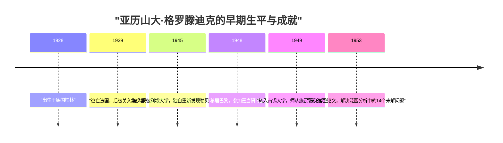
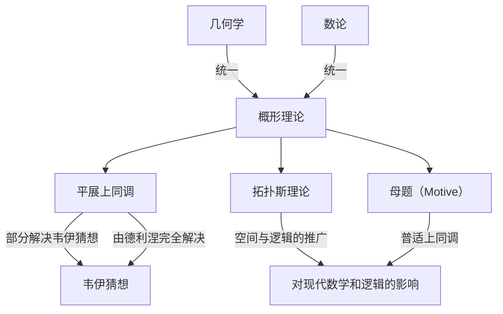

# [[亚历山大·格罗滕迪克](https://kenji.blog/p/grothendieck/)：20世纪最伟大数学家的生平与成就](https://kenji.blog/p/grothendieck/)

[亚历山大·格罗滕迪克](https://kenji.blog/p/grothendieck/)（[Alexander Grothendieck](https://kenji.blog/p/grothendieck/)）是历史上最伟大的数学家之一，他在20世纪后半叶的数学界，特别是在代数几何领域，带来了根本性的范式转变。他的成就远不止于解决个别的未解难题；他从根本上重构了数学本身的语言和概念框架。在本文中，我们将详细解说他非凡而充满戏剧性的生平，以及他对现代数学不可估量的影响。

## 1. 动荡的童年与战争的阴影

格罗滕迪克的生平与他的数学成就一样独一无二，且充满了苦难。

### 无政府主义者父母与在柏林的诞生

格罗滕迪克1928年出生于德国柏林，在激进的无政府主义者父母抚养下长大。他的父亲萨沙·夏皮罗（Sascha Schapiro）是一位出生于俄罗斯的犹太人，在俄国革命期间因遭受迫害失去了一只手臂后逃到了德国。他的母亲汉卡·格罗滕迪克（Hanka Grothendieck）是一位德国记者。他的父母都积极参与政治活动，因此小亚历山大的童年有一段时间是在寄养家庭中度过的。

### 难民生活与集中营

1933年纳粹在德国掌权时，身为犹太人和无政府主义者的父亲感到生命受到威胁，逃往法国，他的母亲后来也跟随前往。亚历山大留在德国的寄养家庭中直到1939年，随着战争的脚步临近，他前往法国与父母团聚。

然而，随着第二次世界大战的爆发，这个家庭的命运急转直下。他的父亲被送往奥斯威辛集中营并死于那里。亚历山大和他的母亲被关押在法国的里约克洛（Rieucros）集中营。据说，即使在如此严酷的环境中，他也在集中营的学校里展现出了异常的注意力和数学天赋。后来，他被隐藏在信奉新教的勒尚邦-叙尔利尼翁（Le Chambon-sur-Lignon）村的一所房子里，在那里他得以接受高中教育。

## 2. 在数学界的震惊亮相

战后，格罗滕迪克开始认真追求数学，但他的道路非常不寻常。

### 在蒙彼利埃大学重新发现“体积”

1945年，他进入蒙彼利埃大学。当时那里的数学教育水平未必很高，他对讲课内容不满意，于是尝试自己严格地定义“长度”、“面积”和“体积”的概念。在没有老师帮助的情况下，他完全依靠自己重新构建了早先由昂利·勒贝格（Henri Lebesgue）建立的“勒贝格测度”理论。这段经历证明了他天生具有从根本上思考问题、不依赖现有知识的态度。

### 南锡的传奇：14个未解决问题

1948年，他前往数学中心巴黎，参加了由昂利·嘉当（Henri Cartan）等人在巴黎高等师范学院主持的传奇研讨会。然而，面对在尖端数学知识上的差距，他遭遇了暂时的挫折。

随后他转入南锡大学，在那里他得到了两位杰出数学家洛朗·施瓦茨（Laurent Schwartz）和让·迪厄多内（Jean Dieudonné）的指导。有一天，施瓦茨和迪厄多内将他们最近发表的论文中留下的14个未解决问题交给了格罗滕迪克。

令他们惊愕的是，几个月后，格罗滕迪克回来并提交了 **彻底解决了14个未解决问题** 的笔记。他创造了诸如“拓扑张量积”和“核空间”等全新概念，从根本上消灭了这些问题。凭借这一成就，他立即在泛函分析领域获得了世界级的声誉。

## 3. 重构代数几何：在 IHÉS 的黄金时代

在达到泛函分析的顶峰后，他令人惊讶地将研究重心转移到了完全不同的领域：“代数几何”和“同调代数”。

### 东北论文

他1957年发表在日本《东北数学杂志》上的论文“关于同调代数的某些问题（Sur quelques points d'algèbre homologique）”，是一篇融合了范畴论和同调代数、确立了 **阿贝尔范畴（Abelian Category）** 概念的历史性论文。这使得在任何拓扑空间上严格定义层的上同调成为可能。

### IHÉS 的创立与 EGA/SGA

1958年，法国高等科学研究所（IHÉS）成立，格罗滕迪克被聘为创始成员兼数学部教授。接下来的12年标志着他的“黄金时代”。

他与让·迪厄多内、让-皮埃尔·塞尔（Jean-Pierre Serre）等人一起，开启了一个重写代数几何基础的宏大项目。这些著作构成了《代数几何基础》（通常被称为 **EGA** ）。此外，在他指导下进行的研讨会的记录被出版为《代数几何研讨会》（通常被称为 **SGA** ）。这些都是长达数千页的巨著，至今仍被作为现代代数几何的“圣典”而阅读。

## 4. 革命性的数学概念

格罗滕迪克最大的贡献是根本性地推广了数学的研究对象，并提供了一种统一了看似不同领域的新语言。

### 概形理论（Scheme Theory）

传统上，代数几何是在复数等“域”上研究的。格罗滕迪克将这一概念推向极限，引入了 **概形（Scheme）** 的概念。

对于一个交换环 $R$，赋予其所有素理想构成的集合以拓扑和结构层，称为仿射概形，记作 $\text{Spec}(R)$。

$$ \text{Spec}(R) = \{ \mathfrak{p} \mid \mathfrak{p} \text{ 是 } R \text{ 的素理想} \} $$

这使得数论中的问题——例如寻找方程的整数解——可以被当作空间的几何性质来处理。

### 平展上同调与韦伊猜想

格罗滕迪克的主要目标之一是证明关于有限域上代数簇的“韦伊猜想”。他扩展了经典的拓扑空间概念，创立了名为 **平展上同调（Étale Cohomology）** 的全新理论。利用这个强大的武器，他证明了韦伊猜想的一部分，而最后的部分则由他的杰出学生皮埃尔·德利涅（Pierre Deligne）证明。

### 拓扑斯理论与母题（Motive）

格罗滕迪克的思想在抽象的阶梯上攀登得更高。他创造了 **拓扑斯（Topos）** 的概念，它推广了空间本身的概念。

此外，他提出了 **母题（Motive）** 的概念，作为一个整合了各种不同的上同调理论的普适对象。母题理论在今天仍未被完全理解，并且仍然是现代数学中最大的探索主题之一。

## 5. 他独特的哲学：胡桃夹子的比喻

格罗滕迪克用“胡桃夹子”的比喻来解释他的数学方法。当试图打开一个坚硬的胡桃（一个难题）时，他不喜欢用锤子猛力敲击，而是更喜欢将胡桃浸泡在水中，等待它随着时间的推移变软，让外壳自然裂开。换句话说，他更喜欢 **“构建一个强大而广阔的理论之海，让问题在其中自然溶解”** ，而不是直接去解决它。

## 6. 儿童画（Dessins d'enfants）与远阿贝尔几何

进入20世纪80年代，他提出了新的理论，从非常简单和直观的概念出发来探讨数学最深层的奥秘。

其中之一是 **“儿童画（Dessins d'enfants）”** 。他发现，从画在球面等曲面上的简单图表中，可以提取出绝对伽罗瓦群的作用，这是数论中一个高度神秘和复杂的对象。

此外，他提出了一个名为 **“远阿贝尔几何（Anabelian Geometry）”** 的计划。这是一个惊人的猜想，即对于某些代数簇，原始的几何和算术对象可以仅从被称为基本群的拓扑数据中完全重建出来。

## 7. 突然退休与走向孤独

尽管在1966年获得了菲尔兹奖，格罗滕迪克在得知研究所的部分资金来自国防部后，于1970年突然从 IHÉS 辞职以示抗议。随后，他投身于环保和反战运动。

在20世纪80年代，他写下了一部庞大的回忆录《收获与播种（Récoltes et Semailles）》。1991年，他切断了与家人和朋友的所有联系，隐居在法国南部比利牛斯山脚下的一个小村庄里。直到他在2014年以86岁高龄去世，他再也没有见过任何人，在完全的孤独中继续他的思考和写作。

## 结论

[亚历山大·格罗滕迪克](https://kenji.blog/p/grothendieck/)是一位将全新的风景带入数学学科的巨人。他留下来的概念超越了单纯的数学框架，展示了人类逻辑思维扩展的可能性。他曾凝视的深邃世界至今仍在结出丰硕的果实。
