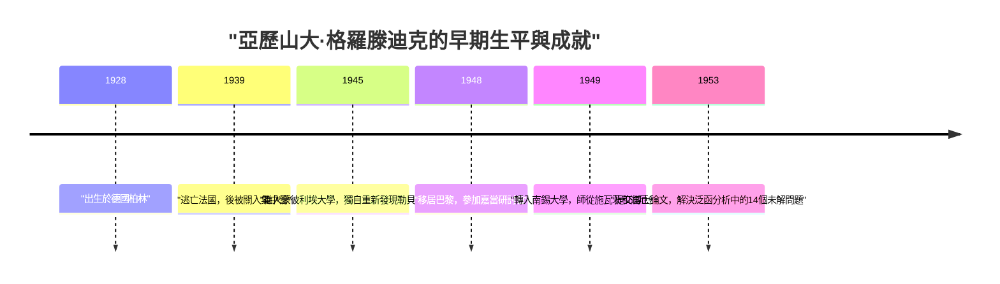
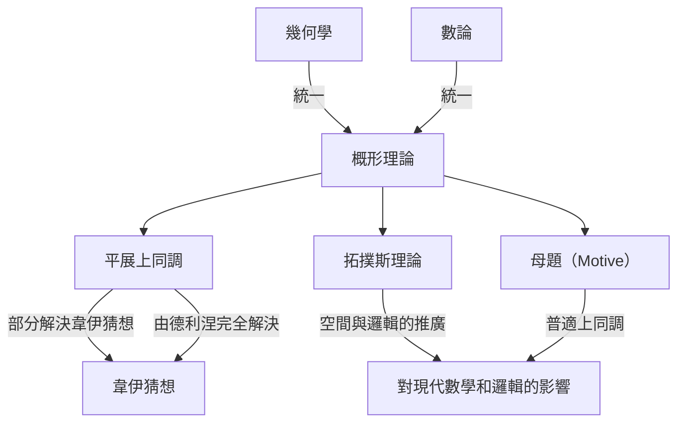

# [[亞歷山大·格羅滕迪克](https://kenji.blog/p/grothendieck/)：20世紀最偉大數學家的生平與成就](https://kenji.blog/p/grothendieck/)

[亞歷山大·格羅滕迪克](https://kenji.blog/p/grothendieck/)（[Alexander Grothendieck](https://kenji.blog/p/grothendieck/)）是歷史上最偉大的數學家之一，他在20世紀後半葉的數學界，特別是在代數幾何領域，帶來了根本性的典範轉移。他的成就遠不止於解決個別的未解難題；他從根本上重構了數學本身的語言和概念框架。在本文中，我們將詳細解說他非凡而充滿戲劇性的生平，以及他對現代數學不可估量的影響。

## 1. 動盪的童年與戰爭的陰影

格羅滕迪克的生平與他的數學成就一樣獨一無二，且充滿了苦難。

### 無政府主義者父母與在柏林的誕生

格羅滕迪克1928年出生於德國柏林，在激進的無政府主義者父母撫養下長大。他的父親薩沙·夏皮羅（Sascha Schapiro）是一位出生於俄羅斯的猶太人，在俄國革命期間因遭受迫害失去了一隻手臂後逃到了德國。他的母親漢卡·格羅滕迪克（Hanka Grothendieck）是一位德國記者。他的父母都積極參與政治活動，因此小亞歷山大的童年有一段時間是在寄養家庭中度過的。

### 難民生活與集中營

1933年納粹在德國掌權時，身為猶太人和無政府主義者的父親感到生命受到威脅，逃往法國，他的母親後來也跟隨前往。亞歷山大留在德國的寄養家庭中直到1939年，隨著戰爭的腳步臨近，他前往法國與父母團聚。

然而，隨著第二次世界大戰的爆發，這個家庭的命運急轉直下。他的父親被送往奧斯威辛集中營並死於那裡。亞歷山大和他的母親被關押在法國的里約克洛（Rieucros）集中營。據說，即使在如此嚴酷的環境中，他也在此集中營的學校裡展現出了異常的注意力和數學天賦。後來，他被隱藏在信奉新教的勒尚邦-敘爾利尼翁（Le Chambon-sur-Lignon）村的一所房子裡，在那裡他得以接受高中教育。

## 2. 在數學界的震驚亮相

戰後，格羅滕迪克開始認真追求數學，但他的道路非常不尋常。

### 在蒙彼利埃大學重新發現「體積」

1945年，他進入蒙彼利埃大學。當時那裡的數學教育水平未必很高，他對講課內容不滿意，於是嘗試自己嚴格地定義「長度」、「面積」和「體積」的概念。在沒有老師幫助的情況下，他完全依靠自己重新構建了早先由昂利·勒貝格（Henri Lebesgue）建立的「勒貝格測度」理論。這段經歷證明了他天生具有從根本上思考問題、不依賴現有知識的態度。

### 南錫的傳奇：14個未解決問題

1948年，他前往數學中心巴黎，參加了由昂利·嘉當（Henri Cartan）等人在巴黎高等師範學院主持的傳奇研討會。然而，面對在尖端數學知識上的差距，他遭遇了暫時的挫折。

隨後他轉入南錫大學，在那裡他得到了兩位傑出數學家洛朗·施瓦茨（Laurent Schwartz）和讓·迪厄多內（Jean Dieudonné）的指導。有一天，施瓦茨和迪厄多內將他們最近發表的論文中留下的14個未解決問題交給了格羅滕迪克。

令他們驚愕的是，幾個月後，格羅滕迪克回來並提交了 **徹底解決了14個未解決問題** 的筆記。他創造了諸如「拓撲張量積」和「核空間」等全新概念，從根本上消滅了這些問題。憑藉這一成就，他立即在泛函分析領域獲得了世界級的聲譽。

## 3. 重構代數幾何：在 IHÉS 的黃金時代

在達到泛函分析的頂峰後，他令人驚訝地將研究重心轉移到了完全不同的領域：「代數幾何」和「同調代數」。

### 東北論文

他1957年發表在日本《東北數學雜誌》上的論文「關於同調代數的某些問題（Sur quelques points d'algèbre homologique）」，是一篇融合了範疇論和同調代數、確立了 **阿貝爾範疇（Abelian Category）** 概念的歷史性論文。這使得在任何拓撲空間上嚴格定義層的上同調成為可能。

### IHÉS 的創立與 EGA/SGA

1958年，法國高等科學研究所（IHÉS）成立，格羅滕迪克被聘為創始成員兼數學部教授。接下來的12年標誌著他的「黃金時代」。

他與讓·迪厄多內、讓-皮埃爾·塞爾（Jean-Pierre Serre）等人一起，開啟了一個重寫代數幾何基礎的宏大項目。這些著作構成了《代數幾何基礎》（通常被稱為 **EGA** ）。此外，在他指導下進行的研討會的記錄被出版為《代數幾何研討會》（通常被稱為 **SGA** ）。這些都是長達數千頁的巨著，至今仍被作為現代代數幾何的「聖典」而閱讀。

## 4. 革命性的數學概念

格羅滕迪克最大的貢獻是根本性地推廣了數學的研究對象，並提供了一種統一了看似不同領域的新語言。

### 概形理論（Scheme Theory）

傳統上，代數幾何是在複數等「域」上研究的。格羅滕迪克將這一概念推向極限，引入了 **概形（Scheme）** 的概念。

對於一個交換環 $R$，賦予其所有質理想構成的集合以拓撲和結構層，稱為仿射概形，記作 $\text{Spec}(R)$。

$$ \text{Spec}(R) = \{ \mathfrak{p} \mid \mathfrak{p} \text{ 是 } R \text{ 的質理想} \} $$

這使得數論中的問題——例如尋找方程的整數解——可以被當作空間的幾何性質來處理。

### 平展上同調與韋伊猜想

格羅滕迪克的主要目標之一是證明關於有限域上代數簇的「韋伊猜想」。他擴展了經典的拓撲空間概念，創立了名為 **平展上同調（Étale Cohomology）** 的全新理論。利用這個強大的武器，他證明了韋伊猜想的一部分，而最後的部分則由他的傑出學生皮埃爾·德利涅（Pierre Deligne）證明。

### 拓撲斯理論與母題（Motive）

格羅滕迪克的思想在抽象的階梯上攀登得更高。他創造了 **拓撲斯（Topos）** 的概念，它推廣了空間本身的概念。

此外，他提出了 **母題（Motive）** 的概念，作為一個整合了各種不同的上同調理論的普適對象。母題理論在今天仍未被完全理解，並且仍然是現代數學中最大的探索主題之一。

## 5. 他獨特的哲學：胡桃夾子的比喻

格羅滕迪克用「胡桃夾子」的比喻來解釋他的數學方法。當試圖打開一個堅硬的胡桃（一個難題）時，他不喜歡用鎚子猛力敲擊，而是更喜歡將胡桃浸泡在水中，等待它隨著時間的推移變軟，讓外殼自然裂開。換句話說，他更喜歡 **「構建一個強大而廣闊的理論之海，讓問題在其中自然溶解」** ，而不是直接去解決它。

## 6. 兒童畫（Dessins d'enfants）與遠阿貝爾幾何

進入20世紀80年代，他提出了新的理論，從非常簡單和直觀的概念出發來探討數學最深層的奧秘。

其中之一是 **「兒童畫（Dessins d'enfants）」** 。他發現，從畫在球面等曲面上的簡單圖表中，可以提取出絕對伽羅瓦群的作用，這是數論中一個高度神秘和複雜的對象。

此外，他提出了一個名為 **「遠阿貝爾幾何（Anabelian Geometry）」** 的計劃。這是一個驚人的猜想，即對於某些代數簇，原始的幾何和算術對象可以僅從被稱為基本群的拓撲數據中完全重建出來。

## 7. 突然退休與走向孤獨

儘管在1966年獲得了菲爾茲獎，格羅滕迪克在得知研究所的部分資金來自國防部後，於1970年突然從 IHÉS 辭職以示抗議。隨後，他投身於環保和反戰運動。

在20世紀80年代，他寫下了一部龐大的回憶錄《收穫與播種（Récoltes et Semailles）》。1991年，他切斷了與家人和朋友的所有聯繫，隱居在法國南部比利牛斯山腳下的一個小村莊裡。直到他在2014年以86歲高齡去世，他再也沒有見過任何人，在完全的孤獨中繼續他的思考和寫作。

## 結論

[亞歷山大·格羅滕迪克](https://kenji.blog/p/grothendieck/)是一位將全新的風景帶入數學學科的巨人。他留下來的概念超越了單純的數學框架，展示了人類邏輯思維擴展的可能性。他曾凝視的深邃世界至今仍在結出豐碩的果實。
