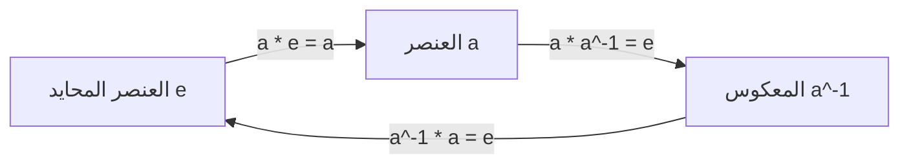
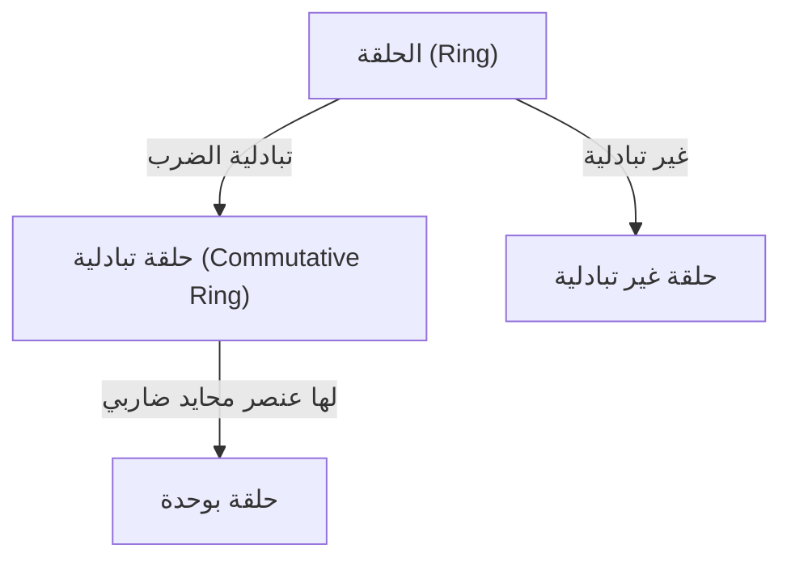
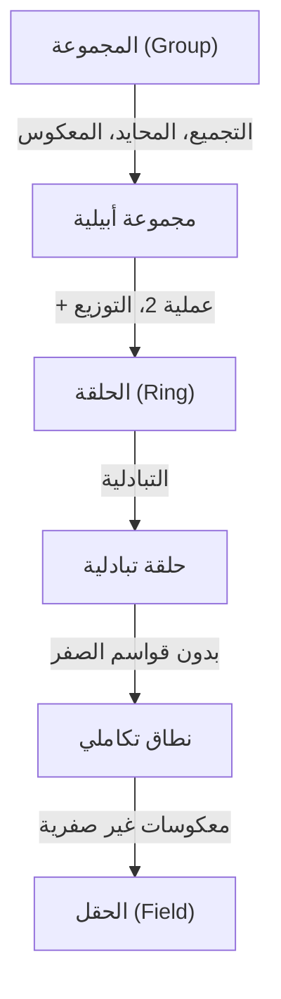

# المجموعات والحلقات والحقول: الجمال في الهياكل الجبرية الحديثة

تطورت الجبر من مجرد حل المعادلات إلى دراسة الهياكل التجريدية.

## 1. العمليات والمجموعات

- **المجموعة (Set)**: تجمع من العناصر (مثل $\mathbb{Z}$).
- **العملية الثنائية (Binary Operation)**: دمج عنصرين لإنتاج ثالث.

---

## 2. المجموعة (Group)

### 2.1. تعريف المجموعة

يجب أن تحقق:
1. **التجميع (Associativity)**: $(a \cdot b) \cdot c = a \cdot (b \cdot c)$
2. **العنصر المحايد (Identity Element)**: $a \cdot e = e \cdot a = a$
3. **العنصر المعكوس (Inverse Element)**: $a \cdot a^{-1} = a^{-1} \cdot a = e$

---

## 3. الحلقة (Ring)

---

## 4. الحقل (Field)

في الحقل يمكنك القسمة بحرية على جميع العناصر غير الصفرية.

---

## 5. التسلسل الهرمي

استكشاف الجبر الحديث هو شكل نقي من التفكير الرياضي الذي يصقل حدسنا المنطقي ويعمل كسلاح نهائي لاكتشاف عوالم غير معروفة. نظريات المجموعات والحلقات والحقول تعادل فهم البناء الأساسي للصرح العظيم للرياضيات. من خلال تذوق جمال الهيكل واكتساب قوة التجريد، سيتغير منظورك للعالم تمامًا. ندعوك للشروع في مغامرة رياضية جديدة غير مقيدة بالأرقام. إنها بداية رحلة لا نهاية لها تدفع حدود الفكر.

استكشاف الجبر الحديث هو شكل نقي من التفكير الرياضي الذي يصقل حدسنا المنطقي ويعمل كسلاح نهائي لاكتشاف عوالم غير معروفة. نظريات المجموعات والحلقات والحقول تعادل فهم البناء الأساسي للصرح العظيم للرياضيات. من خلال تذوق جمال الهيكل واكتساب قوة التجريد، سيتغير منظورك للعالم تمامًا. ندعوك للشروع في مغامرة رياضية جديدة غير مقيدة بالأرقام. إنها بداية رحلة لا نهاية لها تدفع حدود الفكر.

استكشاف الجبر الحديث هو شكل نقي من التفكير الرياضي الذي يصقل حدسنا المنطقي ويعمل كسلاح نهائي لاكتشاف عوالم غير معروفة. نظريات المجموعات والحلقات والحقول تعادل فهم البناء الأساسي للصرح العظيم للرياضيات. من خلال تذوق جمال الهيكل واكتساب قوة التجريد، سيتغير منظورك للعالم تمامًا. ندعوك للشروع في مغامرة رياضية جديدة غير مقيدة بالأرقام. إنها بداية رحلة لا نهاية لها تدفع حدود الفكر.

استكشاف الجبر الحديث هو شكل نقي من التفكير الرياضي الذي يصقل حدسنا المنطقي ويعمل كسلاح نهائي لاكتشاف عوالم غير معروفة. نظريات المجموعات والحلقات والحقول تعادل فهم البناء الأساسي للصرح العظيم للرياضيات. من خلال تذوق جمال الهيكل واكتساب قوة التجريد، سيتغير منظورك للعالم تمامًا. ندعوك للشروع في مغامرة رياضية جديدة غير مقيدة بالأرقام. إنها بداية رحلة لا نهاية لها تدفع حدود الفكر.

استكشاف الجبر الحديث هو شكل نقي من التفكير الرياضي الذي يصقل حدسنا المنطقي ويعمل كسلاح نهائي لاكتشاف عوالم غير معروفة. نظريات المجموعات والحلقات والحقول تعادل فهم البناء الأساسي للصرح العظيم للرياضيات. من خلال تذوق جمال الهيكل واكتساب قوة التجريد، سيتغير منظورك للعالم تمامًا. ندعوك للشروع في مغامرة رياضية جديدة غير مقيدة بالأرقام. إنها بداية رحلة لا نهاية لها تدفع حدود الفكر.

استكشاف الجبر الحديث هو شكل نقي من التفكير الرياضي الذي يصقل حدسنا المنطقي ويعمل كسلاح نهائي لاكتشاف عوالم غير معروفة. نظريات المجموعات والحلقات والحقول تعادل فهم البناء الأساسي للصرح العظيم للرياضيات. من خلال تذوق جمال الهيكل واكتساب قوة التجريد، سيتغير منظورك للعالم تمامًا. ندعوك للشروع في مغامرة رياضية جديدة غير مقيدة بالأرقام. إنها بداية رحلة لا نهاية لها تدفع حدود الفكر.

استكشاف الجبر الحديث هو شكل نقي من التفكير الرياضي الذي يصقل حدسنا المنطقي ويعمل كسلاح نهائي لاكتشاف عوالم غير معروفة. نظريات المجموعات والحلقات والحقول تعادل فهم البناء الأساسي للصرح العظيم للرياضيات. من خلال تذوق جمال الهيكل واكتساب قوة التجريد، سيتغير منظورك للعالم تمامًا. ندعوك للشروع في مغامرة رياضية جديدة غير مقيدة بالأرقام. إنها بداية رحلة لا نهاية لها تدفع حدود الفكر.

استكشاف الجبر الحديث هو شكل نقي من التفكير الرياضي الذي يصقل حدسنا المنطقي ويعمل كسلاح نهائي لاكتشاف عوالم غير معروفة. نظريات المجموعات والحلقات والحقول تعادل فهم البناء الأساسي للصرح العظيم للرياضيات. من خلال تذوق جمال الهيكل واكتساب قوة التجريد، سيتغير منظورك للعالم تمامًا. ندعوك للشروع في مغامرة رياضية جديدة غير مقيدة بالأرقام. إنها بداية رحلة لا نهاية لها تدفع حدود الفكر.

استكشاف الجبر الحديث هو شكل نقي من التفكير الرياضي الذي يصقل حدسنا المنطقي ويعمل كسلاح نهائي لاكتشاف عوالم غير معروفة. نظريات المجموعات والحلقات والحقول تعادل فهم البناء الأساسي للصرح العظيم للرياضيات. من خلال تذوق جمال الهيكل واكتساب قوة التجريد، سيتغير منظورك للعالم تمامًا. ندعوك للشروع في مغامرة رياضية جديدة غير مقيدة بالأرقام. إنها بداية رحلة لا نهاية لها تدفع حدود الفكر.
