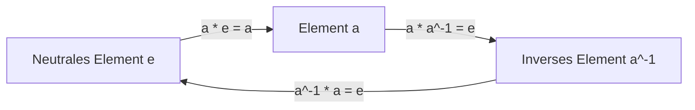
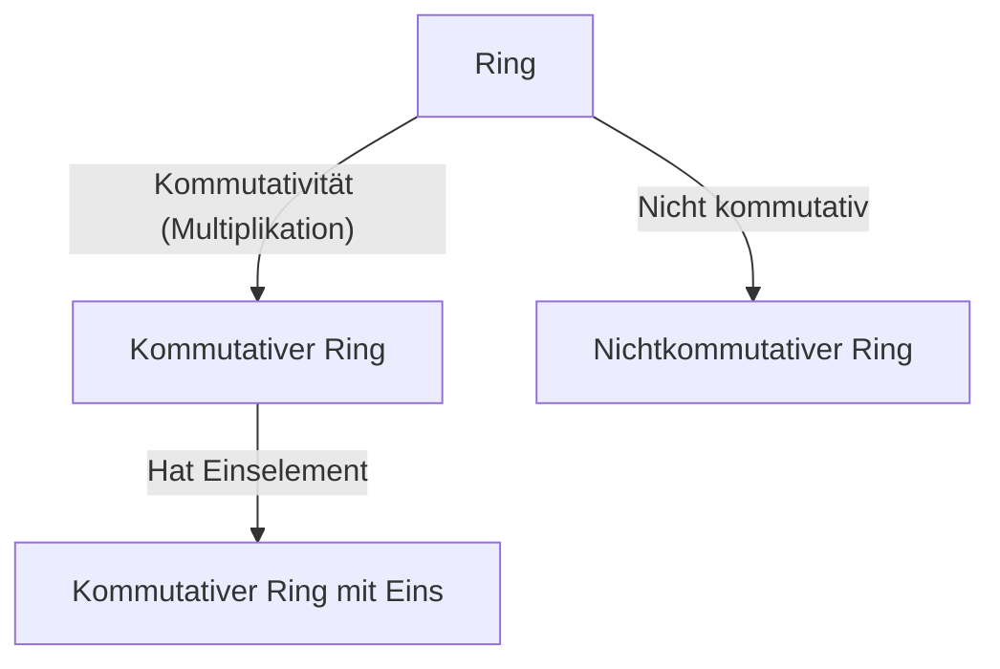
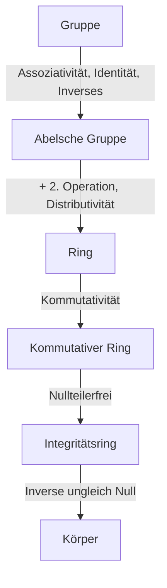

# [Gruppen, Ringe und Körper](https://kenji.blog/de/p/groups-rings-and-fields/): Die Schönheit der „Struktur“ in der modernen Algebra

Für viele von uns ist die „Mathematik“, die wir in der Schule lernen, eine Welt der Addition und Multiplikation von Zahlen, nämlich der „vier Grundrechenarten“. Berechnungen wie $1 + 1 = 2$ und $3 \times 4 = 12$ sind äußerst nützlich.

Die Mathematiker wandten ihre Aufmerksamkeit jedoch allmählich nicht den „Zahlen selbst“ zu, sondern den „'Strukturen', die durch die Eigenschaften der Zahlen und die Rechenregeln entstehen“. Diese „Abstraktion der Struktur“ ist die Essenz der modernen Algebra.

In diesem Artikel führen wir in die drei wichtigen Konzepte „Gruppe“, „Ring“ und „Körper“ ein.

## 1. Operationen und Mengen

Der erste Schritt besteht darin, „Mengen“ und „Operationen“ zu verstehen.
- **Menge (Set)**: Eine Sammlung von Elementen, z.B. $\mathbb{Z}$.
- **Binäre Operation (Binary Operation)**: Die Kombination zweier Elemente zu einem dritten.

---

## 2. Gruppe (Group): Symmetrie und Reversibilität

Eine Gruppe abstrahiert die Eigenschaft der „Reversibilität“.

### 2.1. Strenge Definition einer Gruppe

Eine Menge $G$ mit einer binären Operation $\cdot$ ist eine **Gruppe (Group)**, wenn:
1. **Assoziativgesetz**: $(a \cdot b) \cdot c = a \cdot (b \cdot c)$
2. **Neutrales Element**: $a \cdot e = e \cdot a = a$
3. **Inverses Element**: $a \cdot a^{-1} = a^{-1} \cdot a = e$

Wenn $a \cdot b = b \cdot a$ gilt, ist es eine **kommutative Gruppe** oder **abelsche Gruppe**.

---

## 3. Ring (Ring): Koexistenz von Addition und Multiplikation

Die Abstraktion von „zwei koexistierenden Operationen“ ist der **Ring**.

### 3.1. Definition eines Rings

Ein $(R, +, \cdot)$ ist ein **Ring (Ring)**, wenn:
1. $(R, +)$ eine abelsche Gruppe ist.
2. $(R, \cdot)$ ein Halbgruppe ist.
3. Das Distributivgesetz gilt.

---

## 4. Ideale und Faktorringe

Ein **Ideal** ermöglicht es, einen Ring zu „teilen“, um einen **Faktorring** zu erhalten.

---

## 5. Körper (Field): Die vier Grundrechenarten sind frei

Der **Körper (Field)** ist die reichhaltigste Struktur, in der die Division durch ein Element ungleich Null immer möglich ist.

### 5.1. Definition eines Körpers

Ein kommutativer Ring ist ein Körper, wenn:
1. Er mindestens zwei Elemente hat ($0 \neq 1$).
2. Jedes Element ungleich Null ein multiplikatives Inverses hat.

---

## 6. Moduln und Vektorräume

- **Vektorraum**: Über einem Körper.
- **Modul**: Über einem Ring.

---

## 7. Hierarchie der Strukturen

---

## 8. [Galois](https://kenji.blog/de/p/galois/)-Theorie

Verbindet Gleichungen und Gruppentheorie.

---

## 9. Anwendungen

Kryptographie, Quantenphysik, Fehlerkorrekturcodes.

---

## 10. Fazit

Die abstrakte Algebra offenbart die tiefen Strukturen des Universums.

Die Erforschung der modernen Algebra ist eine reine Form des mathematischen Denkens, die unsere logische Intuition schärft und als ultimative Waffe dient, um unbekannte Welten zu formen. Die Theorien von Gruppen, Ringen und Körpern kommen dem Verständnis der fundamentalen Konstruktion des großen Gebäudes der Mathematik gleich. Wenn Sie die Schönheit der Struktur auskosten und die Kraft der Abstraktion erlangen, wird sich Ihre Perspektive auf die Welt völlig verändern. Wir laden Sie ein, sich auf ein neues mathematisches Abenteuer einzulassen, das nicht an Zahlen gebunden ist. Es ist der Beginn einer endlosen Reise, die die Grenzen des Intellekts verschiebt.

Die Erforschung der modernen Algebra ist eine reine Form des mathematischen Denkens, die unsere logische Intuition schärft und als ultimative Waffe dient, um unbekannte Welten zu formen. Die Theorien von Gruppen, Ringen und Körpern kommen dem Verständnis der fundamentalen Konstruktion des großen Gebäudes der Mathematik gleich. Wenn Sie die Schönheit der Struktur auskosten und die Kraft der Abstraktion erlangen, wird sich Ihre Perspektive auf die Welt völlig verändern. Wir laden Sie ein, sich auf ein neues mathematisches Abenteuer einzulassen, das nicht an Zahlen gebunden ist. Es ist der Beginn einer endlosen Reise, die die Grenzen des Intellekts verschiebt.
