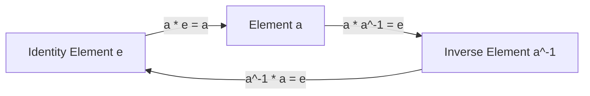
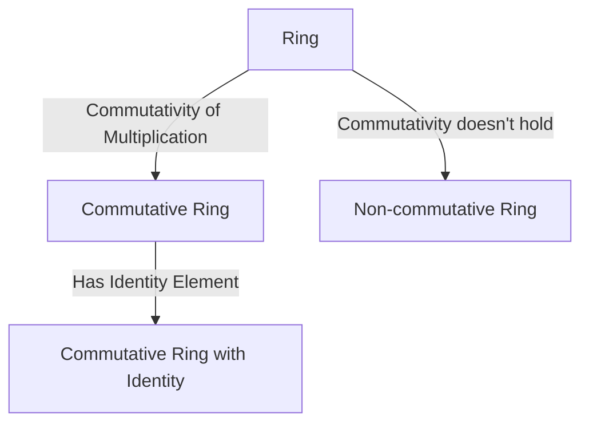
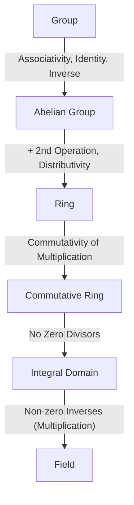

# [Groups, Rings, and Fields](https://kenji.blog/en/p/groups-rings-and-fields/): The Beauty of "Structure" Depicted by Modern Algebra

For many of us, the "mathematics" we first learn in school is a world of adding and multiplying numbers, namely the "four basic operations." Calculations like $1 + 1 = 2$ and $3 \times 4 = 12$ are extremely useful for describing the quantities and sizes of the real world we interact with daily.

However, mathematicians gradually turned their attention not to "numbers themselves," but to the "'structures' created by the properties numbers possess and the rules of calculation (operations)." This "abstraction of structure" is the very essence of modern algebra (abstract algebra).

In this article, we will guide you into the beautiful world of three important concepts that form the foundation of modern algebra: "Group," "Ring," and "Field," intertwining rigorous definitions with intuitive examples.

## 1. Operations and Sets: The First Step Toward Abstraction

The first step to understanding modern algebra is to grasp the concepts of "sets" and "operations."

- **Set**: A collection of elements satisfying certain conditions. For example, the set of all integers $\mathbb{Z}$ or the set of all real numbers $\mathbb{R}$.
- **Binary Operation**: The operation of taking two elements from a set and combining them according to a specific rule to produce another element of the same set. Addition $(+)$ and multiplication $(\times)$ are typical examples.

In algebra, it does not matter what the specific "numbers" are (whether they are integers, real numbers, matrices, or functions). We focus only on the **rules (structures)**: "what kind of operations are defined on that set, and what laws those operations satisfy."

By having this perspective, you can see through the fact that completely different mathematical objects (numbers, geometric transformations, polynomials, etc.) actually possess the same "algebraic structure."

---

## 2. Group: Extracting Symmetry and Reversibility

Among algebraic structures, the simplest yet most widely applied is the "group." A group abstracts the property (reversibility or symmetry) that "you can perform a certain operation and then reverse it."

### 2.1. Rigorous Definition of a Group

Given a non-empty set $G$ and a binary operation $\cdot$ on it (called a "product" for convenience, though not necessarily ordinary multiplication), the pair $(G, \cdot)$ is called a **Group** if it satisfies the following three axioms (rules).

1. **Associativity**
   For any $a, b, c \in G$,
   $$ (a \cdot b) \cdot c = a \cdot (b \cdot c) $$
   holds. (The result is the same even if the order of calculation is changed.)

2. **Existence of Identity Element**
   There exists a special element $e \in G$ such that for any $a \in G$,
   $$ a \cdot e = e \cdot a = a $$
   holds. (An element like "zero" or "one" that leaves nothing changed when the operation is performed.)

3. **Existence of Inverse Element**
   For any element $a \in G$, there exists an element $a^{-1} \in G$ such that
   $$ a \cdot a^{-1} = a^{-1} \cdot a = e $$
   holds. (An element that cancels out the operation and returns to the original state.)

Furthermore, a group in which $a \cdot b = b \cdot a$ (commutative law) holds for any $a, b \in G$ is called a **Commutative Group** or **[Abel](https://kenji.blog/en/p/abel/)ian Group**.

### 2.2. Concrete Examples and Visualization of Groups

**Example 1: Addition of Integers**
The combination of the set of integers $\mathbb{Z}$ and addition $(+)$ forms an [Abel](https://kenji.blog/en/p/abel/)ian group.
- Associativity: $(a + b) + c = a + (b + c)$
- Identity element: $0$ (because $a + 0 = 0 + a = a$)
- Inverse element: The inverse of $a$ is $-a$ (because $a + (-a) = 0$)

**Example 2: Symmetric Group (Permutations and Ghost Leg)**
The set of permutations (rearrangements) of numbers also forms a group. Let's consider, for example, the permutations of three numbers 1, 2, 3 (like a Ghost Leg game). If we take the continuous execution of permutations as the "operation," this satisfies associativity. The permutation of "doing nothing" is the identity element, and "tracing in reverse order" corresponds to the inverse element. Such a group is called a "Symmetric Group."

---

## 3. Ring: Coexistence of Addition and Multiplication

A group was a structure concerning one operation (e.g., addition only). However, the integers we are familiar with have not only addition but also "multiplication." The abstraction of this "structure where two operations coexist and cooperate with each other" is the **Ring**.

### 3.1. Rigorous Definition of a Ring

Given a non-empty set $R$ and two binary operations $+$ (addition) and $\cdot$ (multiplication), the tuple $(R, +, \cdot)$ satisfying the following axioms is called a **Ring**.

1. **$(R, +)$ is a commutative group ([Abel](https://kenji.blog/en/p/abel/)ian group)**
   That is, associativity, identity element (written as $0$), inverse element (written as $-a$), and the commutative law hold for addition.
2. **$(R, \cdot)$ is a semigroup**
   Associativity holds for multiplication.
   $$ (a \cdot b) \cdot c = a \cdot (b \cdot c) $$
3. **Distributivity holds**
   This is the rule connecting addition and multiplication. For any $a, b, c \in R$,
   $$ a \cdot (b + c) = (a \cdot b) + (a \cdot c) $$
   $$ (a + b) \cdot c = (a \cdot c) + (b \cdot c) $$

Furthermore, a ring in which the commutative law for multiplication $a \cdot b = b \cdot a$ holds is called a **Commutative Ring**. Also, a ring having an identity element for multiplication (written as $1$, $a \cdot 1 = 1 \cdot a = a$) is called a **Ring with Identity**.

### 3.2. Concrete Examples of Rings

**Example 1: Ring of Integers**
The set of integers $\mathbb{Z}$ forms a commutative ring with respect to ordinary addition and multiplication.

**Example 2: Matrix Ring**
The set of $n \times n$ real matrices forms a ring with respect to matrix addition and multiplication. However, since matrix multiplication generally does not satisfy the commutative law ($AB \neq BA$), this is a prime example of a non-commutative ring.

---

## 4. Ideals and Quotient Rings: The Idea of "Dividing" a Ring

A very important concept in ring theory is the **Ideal**. It generalizes the properties held by "all even numbers" or "all multiples of 3" in integers.

### 4.1. Definition of an Ideal

A subset $I$ of a ring $R$ is called a (two-sided) ideal of $R$ if it satisfies the following conditions:
1. $I$ is a subgroup of $R$ with respect to addition. (i.e., closed under subtraction)
2. For any $r \in R$ and $x \in I$, $r \cdot x \in I$ and $x \cdot r \in I$ hold. (Absorption property)

### 4.2. Quotient Ring

Using an ideal $I$, one can construct a new ring $R/I$ by "dividing" the original ring $R$ by $I$. This is called a **Quotient Ring**.
For example, the quotient ring $\mathbb{Z}/n\mathbb{Z}$ obtained by dividing the integer ring $\mathbb{Z}$ by the ideal $n\mathbb{Z}$ "all multiples of $n$" represents the "world of remainders when divided by $n$". This allows us to algebraically treat finite cyclic structures, like the dial of a clock.

---

## 5. Field: A World Where the Four Basic Operations Can Be Performed Freely

In the world of rings, addition, subtraction (additive inverse), and multiplication can be performed freely, but "division" is not always possible. For instance, in the integer ring $\mathbb{Z}$, the operation of dividing by $2$ is not closed because the result is not always an integer.

The **Field** is the richest structure where even this "division (division by non-zero elements)" can be performed freely, meaning "all four basic operations are complete."

### 5.1. Rigorous Definition of a Field

A commutative ring $(F, +, \cdot)$ satisfying the following conditions is called a **Field**.

1. **$F$ has at least two elements ($0$ and $1$, where $0 \neq 1$).**
2. **All elements except $0$ have an inverse with respect to multiplication.**
   That is, for any $a \in F$ ($a \neq 0$), there exists some $a^{-1} \in F$ such that
   $$ a \cdot a^{-1} = 1 $$
   holds.

### 5.2. Concrete Examples and Expansion of Fields

**Example 1: Field of Rational Numbers, Real Numbers, Complex Numbers**
The rational numbers $\mathbb{Q}$, real numbers $\mathbb{R}$, and complex numbers $\mathbb{C}$ all form fields. These are spaces where division by non-zero is freely possible.

**Example 2: Finite Field ([Galois](https://kenji.blog/en/p/galois/) Field)**
Fields with a finite number of elements also exist, and are called **Finite Fields** or **[Galois](https://kenji.blog/en/p/galois/) Fields**.
The quotient ring $\mathbb{Z}/p\mathbb{Z}$ modulo a prime $p$ actually forms a field (it is crucial that $p$ is a prime).
This space, where all four basic operations can be fully defined even with a finite number of elements, is essential as a foundation for digital signal processing and cryptography.

---

## 6. Modules and Vector Spaces

Once rings and fields are understood, we arrive at another important algebraic structure.

- **Vector Space**: A space defined over a field $F$, where addition of vectors and multiplication by elements of the field (scalars) are defined. It is the star of linear algebra.
- **Module**: Generalizes the scalars of a vector space from a field to a "ring." Since rings do not allow division, modules exhibit more complex behavior than vector spaces, but they appear everywhere in modern mathematics, such as algebraic topology and representation theory.

---

## 7. Hierarchy of Structures and Homomorphisms

The relationship between groups, rings, and fields has a hierarchical structure where the sets are restricted as the conditions (axioms) become stricter.

A "shape-preserving mapping" between these structures is called a **Homomorphism**. For example, a group homomorphism $f: G \to H$ satisfies $f(a \cdot b) = f(a) \cdot f(b)$, guaranteeing that the result of an operation in the original space matches the result of the operation in the target space. This idea of "preserving structure" is the central philosophy of algebra.

---

## 8. [Galois Theory](https://kenji.blog/en/p/galois-theory/): The Beautiful Intersection of Equations and Groups

Further beyond field theory is **[Galois Theory](https://kenji.blog/en/p/galois-theory/)**, which can be considered the monumental achievement of algebra. The brilliant French mathematician [Évariste Galois](https://kenji.blog/en/p/galois/) fused group theory and field theory to clarify the "conditions under which equations can be solved algebraically."

When considering the field extension (splitting field) that contains all the roots of an equation, the structure of the automorphism group ([Galois](https://kenji.blog/en/p/galois/) group) of that field completely determines the properties of the equation's roots. The long-standing conundrum that "there is no general solution formula for equations of degree 5 or higher ([Abel](https://kenji.blog/en/p/abel/)-Ruffini theorem)" was elegantly proven by showing that the [Galois](https://kenji.blog/en/p/galois/) group lacks a specific property (solvability).

---

## 9. Applications: Why Abstract?

"Why build mathematics solely on rules called axioms, straying from numbers?"
The answer is, **by abstracting, we can realize that seemingly completely different phenomena actually possess the same structure**.

1. **[Crypto](https://kenji.blog/en/p/cryptocurrency-and-bitcoin/)graphy and Finite Fields**
   The reason we can securely communicate over the Internet is thanks to technologies like RSA and elliptic curve cryptography. These directly apply the properties of algebraic structures like "finite fields" and "groups" (such as the difficulty of the discrete logarithm problem) rather than real numbers.

2. **Physics and Group Theory**
   In modern physics, especially particle physics and quantum mechanics, "group theory" is the language for describing the laws of the universe. The symmetries of particles and conservation laws (like the law of conservation of energy) are mathematically proven as properties of the "symmetric groups" or "Lie groups" possessed by physical systems.

3. **Error Correcting Codes**
   "Error-correcting codes" are used to restore data when it is corrupted by noise in CDs, DVDs, QR codes, and communications with deep space probes. The theory of polynomial rings over finite fields and vector spaces is used here as well.

4. **From Geometry to Algebraic Geometry**
   Geometry, which investigates the properties of shapes, can also be reduced to investigating the properties of "rings," which are collections of polynomials (Algebraic Geometry). The proof of [Fermat's Last Theorem](https://kenji.blog/en/p/fermats-last-theorem/) would not have been possible without the development of advanced ring and field theory.

---

## 10. Conclusion: The Infinite World Created by Rules

The fundamental concepts of modern algebra—groups, rings, and fields—start from just a few lines of "rules (axioms)." However, by combining and deducing from these simple rules, a mathematically rich and vast world unfolds beyond imagination.

Pursuing the beauty of logic and structure purely, untethered by physical "quantities." That is the real thrill of modern algebra, and at the same time, it serves as a powerful tool fundamentally supporting our universe and advanced information society.

For those who will study abstract algebra from now on, please try to be conscious of "from which rule (axiom) is this theorem derived?" An intellectual joy akin to solving a complex puzzle awaits you there.
