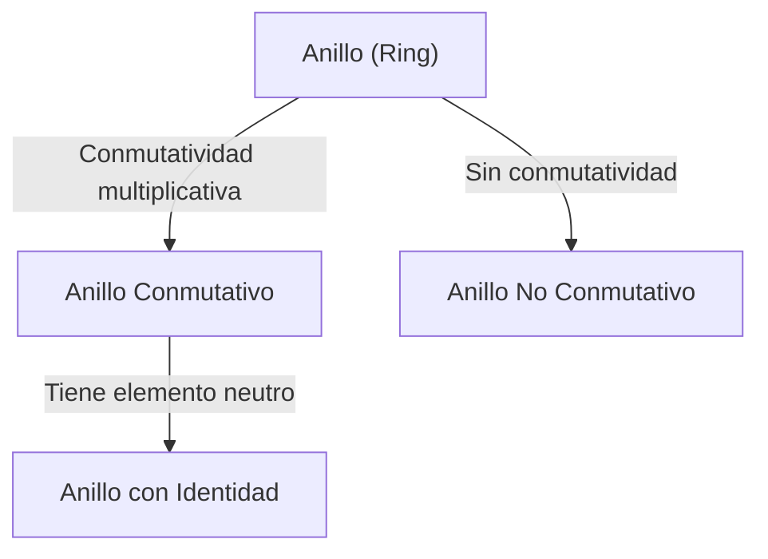
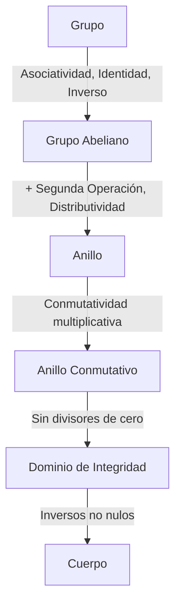

# [Grupos, Anillos y Cuerpos](https://kenji.blog/es/p/groups-rings-and-fields/): La Belleza de la "Estructura" Descrita por el Álgebra Moderna

Para muchos de nosotros, las "matemáticas" que aprendemos primero en la escuela son un mundo de suma y multiplicación de números, es decir, las "cuatro operaciones básicas". Cálculos como $1 + 1 = 2$ y $3 \times 4 = 12$ son extremadamente útiles para describir las cantidades y tamaños del mundo real con el que interactuamos diariamente.

Sin embargo, los matemáticos dirigieron gradualmente su atención no a los "números en sí", sino a las "'estructuras' creadas por las propiedades que poseen los números y las reglas de cálculo (operaciones)". Esta "abstracción de la estructura" es la verdadera esencia del álgebra moderna (álgebra abstracta).

En este artículo, te guiaremos al hermoso mundo de tres conceptos importantes que forman la base del álgebra moderna: "Grupo", "Anillo" y "Cuerpo", entrelazando definiciones rigurosas con ejemplos intuitivos.

## 1. Operaciones y Conjuntos: El Primer Paso Hacia la Abstracción

El primer paso para entender el álgebra moderna es comprender los conceptos de "conjuntos" y "operaciones".

- **Conjunto (Set)**: Una colección de elementos que satisfacen ciertas condiciones. Por ejemplo, el conjunto de todos los números enteros $\mathbb{Z}$ o el conjunto de todos los números reales $\mathbb{R}$.
- **Operación Binaria (Binary Operation)**: La operación de tomar dos elementos de un conjunto y combinarlos de acuerdo con una regla específica para producir otro elemento del mismo conjunto. La suma $(+)$ y la multiplicación $(\times)$ son ejemplos típicos.

En álgebra, no importa cuáles sean los "números" específicos (ya sean enteros, números reales, matrices o funciones). Nos centramos solo en las **reglas (estructuras)**: "qué tipo de operaciones están definidas en ese conjunto, y qué leyes satisfacen esas operaciones".

Al tener esta perspectiva, puedes ver a través del hecho de que objetos matemáticos completamente diferentes (números, transformaciones geométricas, polinomios, etc.) poseen en realidad la misma "estructura algebraica".

---

## 2. Grupo (Group): Extrayendo la Simetría y Reversibilidad

Entre las estructuras algebraicas, la más simple pero más ampliamente aplicada es el "grupo". Un grupo abstrae la propiedad (reversibilidad o simetría) de que "puedes realizar cierta operación y luego revertirla".

### 2.1. Definición Rigurosa de un Grupo

Dado un conjunto no vacío $G$ y una operación binaria $\cdot$ en él (llamada "producto" por conveniencia, aunque no necesariamente multiplicación ordinaria), el par $(G, \cdot)$ se llama **Grupo (Group)** si satisface los siguientes tres axiomas (reglas).

1. **Asociatividad (Associativity)**
   Para cualesquiera $a, b, c \in G$,
   $$ (a \cdot b) \cdot c = a \cdot (b \cdot c) $$
   se cumple.

2. **Existencia del Elemento Neutro (Identity Element)**
   Existe un elemento especial $e \in G$ tal que para cualquier $a \in G$,
   $$ a \cdot e = e \cdot a = a $$
   se cumple.

3. **Existencia del Elemento Inverso (Inverse Element)**
   Para cualquier elemento $a \in G$, existe un elemento $a^{-1} \in G$ tal que
   $$ a \cdot a^{-1} = a^{-1} \cdot a = e $$
   se cumple.

Además, un grupo en el que $a \cdot b = b \cdot a$ se cumple para cualesquiera $a, b \in G$ se llama **Grupo Conmutativo** o **Grupo [Abel](https://kenji.blog/es/p/abel/)iano**.

### 2.2. Ejemplos Concretos de Grupos

**Ejemplo 1: Suma de Enteros**
La combinación del conjunto de enteros $\mathbb{Z}$ y la suma $(+)$ forma un grupo abeliano.

**Ejemplo 2: Grupo Simétrico**
El conjunto de permutaciones de números también forma un grupo.

---

## 3. Anillo (Ring): Coexistencia de Suma y Multiplicación

La abstracción de esta "estructura donde dos operaciones coexisten" es el **Anillo**.

### 3.1. Definición Rigurosa de un Anillo

Dado un conjunto no vacío $R$ y dos operaciones binarias $+$ y $\cdot$, se llama **Anillo (Ring)** si:

1. **$(R, +)$ es un grupo conmutativo**
2. **$(R, \cdot)$ es un semigrupo**
3. **Se cumple la Distributividad**
   $$ a \cdot (b + c) = (a \cdot b) + (a \cdot c) $$
   $$ (a + b) \cdot c = (a \cdot c) + (b \cdot c) $$

---

## 4. Ideales y Anillos Cociente

Un concepto muy importante en la teoría de anillos es el **Ideal**.

### 4.1. Definición de Ideal

Un subconjunto $I$ de un anillo $R$ es un ideal si es un subgrupo de $(R, +)$ y absorbe la multiplicación por elementos de $R$.

---

## 5. Cuerpo (Field): Un Mundo Donde las Cuatro Operaciones Básicas son Libres

El **Cuerpo (Field)** es la estructura más rica donde incluso la "división" se puede realizar libremente.

### 5.1. Definición de un Cuerpo

Un anillo conmutativo $(F, +, \cdot)$ es un **Cuerpo (Field)** si:
1. $F$ tiene al menos dos elementos ($0 \neq 1$).
2. Todo elemento excepto $0$ tiene un inverso multiplicativo.

### 5.2. Ejemplos de Cuerpos

Los números racionales $\mathbb{Q}$, reales $\mathbb{R}$ y complejos $\mathbb{C}$ son cuerpos. También existen los **Cuerpos Finitos ([Galois](https://kenji.blog/es/p/galois/) Fields)**.

---

## 6. Módulos y Espacios Vectoriales

- **Espacio Vectorial**: Definido sobre un cuerpo $F$.
- **Módulo**: Generaliza los escalares de un cuerpo a un "anillo".

---

## 7. Jerarquía de Estructuras

---

## 8. Teoría de [Galois](https://kenji.blog/es/p/galois/)

Fusionó la teoría de grupos y la teoría de cuerpos para aclarar "cuándo las ecuaciones pueden resolverse algebraicamente".

---

## 9. Aplicaciones: ¿Por qué abstraer?

1. Criptografía y Cuerpos Finitos ([RSA](https://kenji.blog/es/p/modern-cryptography-public-key-hash-signature/)).
2. Física y Teoría de Grupos (simetrías de partículas).
3. Códigos de corrección de errores (DVD, QR).
4. Geometría Algebraica (Teorema de [Fermat](https://kenji.blog/es/p/fermat/)).

---

## 10. Conclusión

Los conceptos de grupo, anillo y cuerpo comienzan desde pocas reglas, pero crean un vasto mundo matemático.
