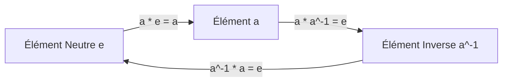
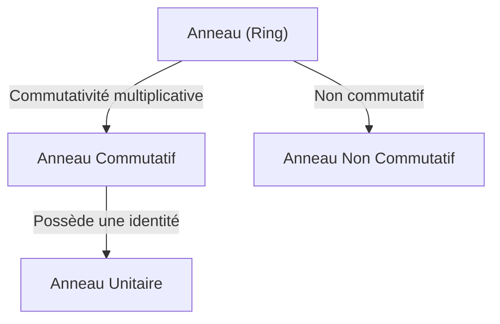
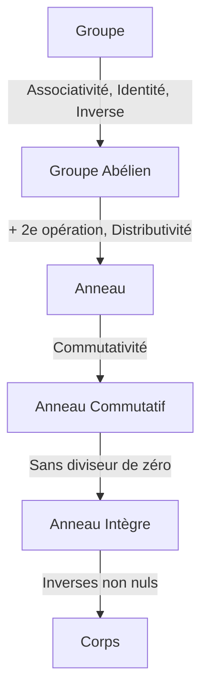

# Groupes, Anneaux et Corps : La Beauté de la « Structure » Décrite par l'Algèbre Moderne

Pour beaucoup d'entre nous, les « mathématiques » que nous apprenons à l'école sont un monde d'addition et de multiplication, c'est-à-dire les « quatre opérations fondamentales ». Les calculs tels que $1 + 1 = 2$ et $3 \times 4 = 12$ sont utiles pour décrire le monde réel.

Cependant, les mathématiciens ont progressivement porté leur attention sur les « structures » créées par les opérations. Cette « abstraction de la structure » est l'essence même de l'algèbre moderne (algèbre abstraite).

Dans cet article, nous présenterons trois concepts fondamentaux : le « Groupe », l'« Anneau » et le « Corps ».

## 1. Opérations et Ensembles

La première étape consiste à comprendre les « ensembles » et les « opérations ».
- **Ensemble (Set)** : Une collection d'éléments, par exemple l'ensemble des entiers $\mathbb{Z}$.
- **Opération binaire (Binary Operation)** : La combinaison de deux éléments pour en produire un troisième.

En algèbre, on se concentre sur les **règles (structures)**.

---

## 2. Groupe (Group) : Symétrie et Réversibilité

Un groupe abstrait la propriété de « réversibilité ».

### 2.1. Définition rigoureuse d'un groupe

Un ensemble non vide $G$ avec une opération binaire $\cdot$ est un **Groupe (Group)** s'il satisfait trois axiomes :
1. **Associativité** : $(a \cdot b) \cdot c = a \cdot (b \cdot c)$
2. **Élément neutre** : $a \cdot e = e \cdot a = a$
3. **Élément inverse** : $a \cdot a^{-1} = a^{-1} \cdot a = e$

Un groupe où $a \cdot b = b \cdot a$ est appelé **Groupe commutatif** ou **Groupe abélien**.

---

## 3. Anneau (Ring) : Coexistence de l'Addition et de la Multiplication

L'abstraction de la « coexistence de deux opérations » est l'**Anneau**.

### 3.1. Définition d'un Anneau

Un triplet $(R, +, \cdot)$ est un **Anneau (Ring)** si :
1. $(R, +)$ est un groupe abélien.
2. $(R, \cdot)$ est un demi-groupe.
3. La distributivité s'applique.

---

## 4. Idéaux et Anneaux Quotients

Un **Idéal** permet de « diviser » un anneau pour créer un **Anneau Quotient**.

---

## 5. Corps (Field) : Les Quatre Opérations Sont Possibles

Le **Corps (Field)** est la structure la plus riche, où la division par un élément non nul est toujours possible.

### 5.1. Définition d'un Corps

Un anneau commutatif est un Corps si :
1. Il a au moins deux éléments ($0 \neq 1$).
2. Tout élément non nul a un inverse multiplicatif.

Exemples : $\mathbb{Q}$, $\mathbb{R}$, $\mathbb{C}$, et les **Corps Finis (Galois Fields)**.

---

## 6. Modules et Espaces Vectoriels

- **Espace Vectoriel** : Sur un corps.
- **Module** : Sur un anneau.

---

## 7. Hiérarchie des Structures

---

## 8. Théorie de Galois

Lien magnifique entre les équations algébriques et la théorie des groupes.

---

## 9. Applications

La cryptographie (RSA), la physique quantique, les codes correcteurs d'erreurs, la géométrie algébrique.

---

## 10. Conclusion

L'algèbre abstraite révèle les structures profondes de l'univers.

L'exploration de l'algèbre moderne est une forme pure de pensée mathématique qui aiguise notre intuition logique et sert d'arme ultime pour façonner des mondes inconnus. Les théories des groupes, des anneaux et des corps équivalent à comprendre la construction fondamentale du grand édifice des mathématiques. En savourant la beauté de la structure et en acquérant le pouvoir de l'abstraction, votre perspective sur le monde sera entièrement transformée. Nous vous invitons à vous lancer dans une nouvelle aventure mathématique non liée par les nombres. C'est le début d'un voyage sans fin qui repousse les limites de l'intellect.

L'exploration de l'algèbre moderne est une forme pure de pensée mathématique qui aiguise notre intuition logique et sert d'arme ultime pour façonner des mondes inconnus. Les théories des groupes, des anneaux et des corps équivalent à comprendre la construction fondamentale du grand édifice des mathématiques. En savourant la beauté de la structure et en acquérant le pouvoir de l'abstraction, votre perspective sur le monde sera entièrement transformée. Nous vous invitons à vous lancer dans une nouvelle aventure mathématique non liée par les nombres. C'est le début d'un voyage sans fin qui repousse les limites de l'intellect.
