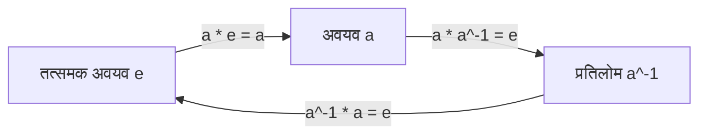
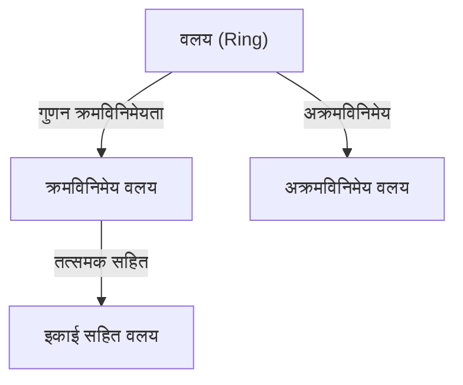
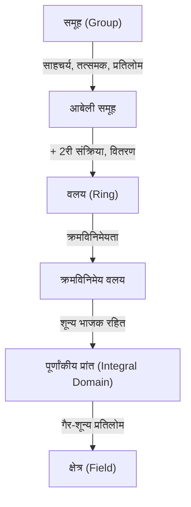

# [[समूह, वलय और क्षेत्र](https://kenji.blog/hi/p/groups-rings-and-fields/): आधुनिक बीजगणित का परिचय](https://kenji.blog/p/groups-rings-and-fields/)

गणित में, 'बीजगणित' 'संरचना' के अध्ययन में विकसित हुआ है।

## 1. संक्रियाएं और समुच्चय

- **समुच्चय (Set)**: तत्वों का संग्रह।
- **द्विआधारी संक्रिया (Binary Operation)**: दो तत्वों का संयोजन।

---

## 2. समूह (Group)

1. **साहचर्य (Associativity)**: $(a \cdot b) \cdot c = a \cdot (b \cdot c)$
2. **तत्समक अवयव (Identity Element)**: $a \cdot e = e \cdot a = a$
3. **प्रतिलोम अवयव (Inverse Element)**: $a \cdot a^{-1} = a^{-1} \cdot a = e$

---

## 3. वलय (Ring)

---

## 4. क्षेत्र (Field)

जहाँ भाग हमेशा संभव है।

---

## 5. पदानुक्रम

आधुनिक बीजगणित की खोज गणितीय सोच का एक शुद्ध रूप है जो हमारे तार्किक अंतर्ज्ञान को निखारता है और अज्ञात दुनिया को गढ़ने के लिए अंतिम हथियार के रूप में कार्य करता है। [समूह, वलय और क्षेत्र](https://kenji.blog/hi/p/groups-rings-and-fields/) के सिद्धांत गणित की भव्य इमारत के मौलिक निर्माण को समझने के बराबर हैं। संरचना की सुंदरता का स्वाद चखकर और अमूर्तन की शक्ति प्राप्त करके, दुनिया के प्रति आपका दृष्टिकोण पूरी तरह से बदल जाएगा। हम आपको संख्याओं से मुक्त एक नए गणितीय रोमांच पर शुरू करने के लिए आमंत्रित करते हैं। यह बुद्धि की सीमाओं को धकेलने वाली एक अंतहीन यात्रा की शुरुआत है।

आधुनिक बीजगणित की खोज गणितीय सोच का एक शुद्ध रूप है जो हमारे तार्किक अंतर्ज्ञान को निखारता है और अज्ञात दुनिया को गढ़ने के लिए अंतिम हथियार के रूप में कार्य करता है। [समूह, वलय और क्षेत्र](https://kenji.blog/hi/p/groups-rings-and-fields/) के सिद्धांत गणित की भव्य इमारत के मौलिक निर्माण को समझने के बराबर हैं। संरचना की सुंदरता का स्वाद चखकर और अमूर्तन की शक्ति प्राप्त करके, दुनिया के प्रति आपका दृष्टिकोण पूरी तरह से बदल जाएगा। हम आपको संख्याओं से मुक्त एक नए गणितीय रोमांच पर शुरू करने के लिए आमंत्रित करते हैं। यह बुद्धि की सीमाओं को धकेलने वाली एक अंतहीन यात्रा की शुरुआत है।

आधुनिक बीजगणित की खोज गणितीय सोच का एक शुद्ध रूप है जो हमारे तार्किक अंतर्ज्ञान को निखारता है और अज्ञात दुनिया को गढ़ने के लिए अंतिम हथियार के रूप में कार्य करता है। [समूह, वलय और क्षेत्र](https://kenji.blog/hi/p/groups-rings-and-fields/) के सिद्धांत गणित की भव्य इमारत के मौलिक निर्माण को समझने के बराबर हैं। संरचना की सुंदरता का स्वाद चखकर और अमूर्तन की शक्ति प्राप्त करके, दुनिया के प्रति आपका दृष्टिकोण पूरी तरह से बदल जाएगा। हम आपको संख्याओं से मुक्त एक नए गणितीय रोमांच पर शुरू करने के लिए आमंत्रित करते हैं। यह बुद्धि की सीमाओं को धकेलने वाली एक अंतहीन यात्रा की शुरुआत है।

आधुनिक बीजगणित की खोज गणितीय सोच का एक शुद्ध रूप है जो हमारे तार्किक अंतर्ज्ञान को निखारता है और अज्ञात दुनिया को गढ़ने के लिए अंतिम हथियार के रूप में कार्य करता है। [समूह, वलय और क्षेत्र](https://kenji.blog/hi/p/groups-rings-and-fields/) के सिद्धांत गणित की भव्य इमारत के मौलिक निर्माण को समझने के बराबर हैं। संरचना की सुंदरता का स्वाद चखकर और अमूर्तन की शक्ति प्राप्त करके, दुनिया के प्रति आपका दृष्टिकोण पूरी तरह से बदल जाएगा। हम आपको संख्याओं से मुक्त एक नए गणितीय रोमांच पर शुरू करने के लिए आमंत्रित करते हैं। यह बुद्धि की सीमाओं को धकेलने वाली एक अंतहीन यात्रा की शुरुआत है।

आधुनिक बीजगणित की खोज गणितीय सोच का एक शुद्ध रूप है जो हमारे तार्किक अंतर्ज्ञान को निखारता है और अज्ञात दुनिया को गढ़ने के लिए अंतिम हथियार के रूप में कार्य करता है। [समूह, वलय और क्षेत्र](https://kenji.blog/hi/p/groups-rings-and-fields/) के सिद्धांत गणित की भव्य इमारत के मौलिक निर्माण को समझने के बराबर हैं। संरचना की सुंदरता का स्वाद चखकर और अमूर्तन की शक्ति प्राप्त करके, दुनिया के प्रति आपका दृष्टिकोण पूरी तरह से बदल जाएगा। हम आपको संख्याओं से मुक्त एक नए गणितीय रोमांच पर शुरू करने के लिए आमंत्रित करते हैं। यह बुद्धि की सीमाओं को धकेलने वाली एक अंतहीन यात्रा की शुरुआत है।

आधुनिक बीजगणित की खोज गणितीय सोच का एक शुद्ध रूप है जो हमारे तार्किक अंतर्ज्ञान को निखारता है और अज्ञात दुनिया को गढ़ने के लिए अंतिम हथियार के रूप में कार्य करता है। [समूह, वलय और क्षेत्र](https://kenji.blog/hi/p/groups-rings-and-fields/) के सिद्धांत गणित की भव्य इमारत के मौलिक निर्माण को समझने के बराबर हैं। संरचना की सुंदरता का स्वाद चखकर और अमूर्तन की शक्ति प्राप्त करके, दुनिया के प्रति आपका दृष्टिकोण पूरी तरह से बदल जाएगा। हम आपको संख्याओं से मुक्त एक नए गणितीय रोमांच पर शुरू करने के लिए आमंत्रित करते हैं। यह बुद्धि की सीमाओं को धकेलने वाली एक अंतहीन यात्रा की शुरुआत है।

आधुनिक बीजगणित की खोज गणितीय सोच का एक शुद्ध रूप है जो हमारे तार्किक अंतर्ज्ञान को निखारता है और अज्ञात दुनिया को गढ़ने के लिए अंतिम हथियार के रूप में कार्य करता है। [समूह, वलय और क्षेत्र](https://kenji.blog/hi/p/groups-rings-and-fields/) के सिद्धांत गणित की भव्य इमारत के मौलिक निर्माण को समझने के बराबर हैं। संरचना की सुंदरता का स्वाद चखकर और अमूर्तन की शक्ति प्राप्त करके, दुनिया के प्रति आपका दृष्टिकोण पूरी तरह से बदल जाएगा। हम आपको संख्याओं से मुक्त एक नए गणितीय रोमांच पर शुरू करने के लिए आमंत्रित करते हैं। यह बुद्धि की सीमाओं को धकेलने वाली एक अंतहीन यात्रा की शुरुआत है।
