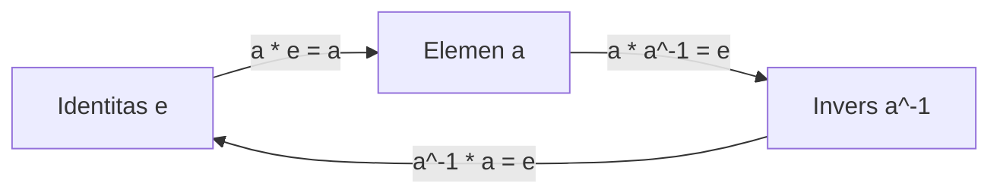
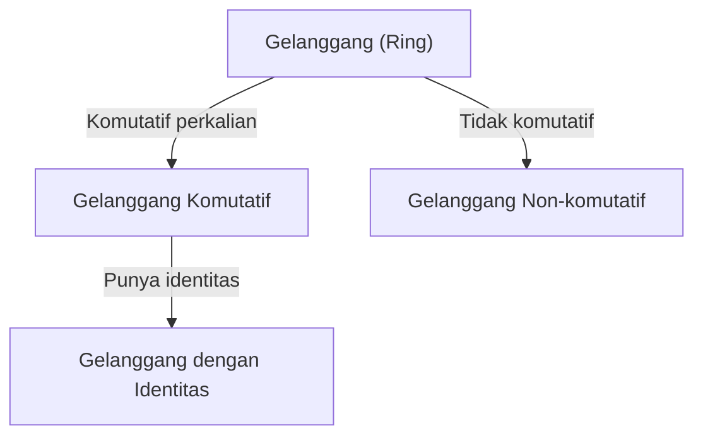
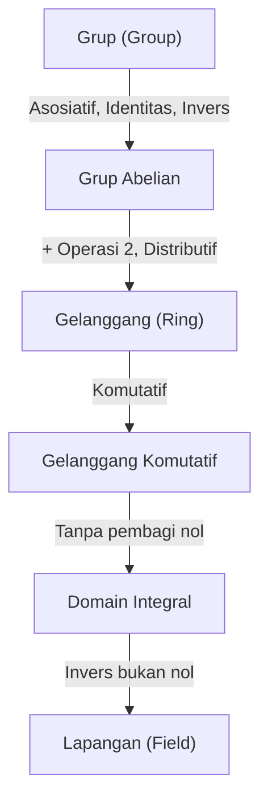

# [Grup, Gelanggang, dan Lapangan: Pengantar Aljabar Modern](https://kenji.blog/p/groups-rings-and-fields/)

Dalam matematika, 'aljabar' berevolusi menjadi studi tentang 'struktur'.

## 1. Operasi dan Himpunan

- **Himpunan (Set)**: Koleksi elemen.
- **Operasi Biner (Binary Operation)**: Menggabungkan dua elemen.

---

## 2. Grup (Group)

1. **Asosiatif**: $(a \cdot b) \cdot c = a \cdot (b \cdot c)$
2. **Elemen Identitas**: $a \cdot e = e \cdot a = a$
3. **Elemen Invers**: $a \cdot a^{-1} = a^{-1} \cdot a = e$

---

## 3. Gelanggang (Ring)

---

## 4. Lapangan (Field)

Di mana pembagian selalu bisa dilakukan.

---

## 5. Hierarki

Eksplorasi aljabar modern adalah bentuk murni dari pemikiran matematis yang mengasah intuisi logis kita dan berfungsi sebagai senjata pamungkas untuk mengukir dunia yang tidak diketahui. Teori grup, gelanggang, dan lapangan sama dengan memahami konstruksi fundamental dari bangunan megah matematika. Dengan menikmati keindahan struktur dan memperoleh kekuatan abstraksi, perspektif Anda terhadap dunia akan sepenuhnya berubah. Kami mengundang Anda untuk memulai petualangan matematis baru yang tidak terikat oleh angka. Ini adalah awal dari perjalanan tanpa akhir yang mendorong batas-batas kecerdasan.

Eksplorasi aljabar modern adalah bentuk murni dari pemikiran matematis yang mengasah intuisi logis kita dan berfungsi sebagai senjata pamungkas untuk mengukir dunia yang tidak diketahui. Teori grup, gelanggang, dan lapangan sama dengan memahami konstruksi fundamental dari bangunan megah matematika. Dengan menikmati keindahan struktur dan memperoleh kekuatan abstraksi, perspektif Anda terhadap dunia akan sepenuhnya berubah. Kami mengundang Anda untuk memulai petualangan matematis baru yang tidak terikat oleh angka. Ini adalah awal dari perjalanan tanpa akhir yang mendorong batas-batas kecerdasan.

Eksplorasi aljabar modern adalah bentuk murni dari pemikiran matematis yang mengasah intuisi logis kita dan berfungsi sebagai senjata pamungkas untuk mengukir dunia yang tidak diketahui. Teori grup, gelanggang, dan lapangan sama dengan memahami konstruksi fundamental dari bangunan megah matematika. Dengan menikmati keindahan struktur dan memperoleh kekuatan abstraksi, perspektif Anda terhadap dunia akan sepenuhnya berubah. Kami mengundang Anda untuk memulai petualangan matematis baru yang tidak terikat oleh angka. Ini adalah awal dari perjalanan tanpa akhir yang mendorong batas-batas kecerdasan.

Eksplorasi aljabar modern adalah bentuk murni dari pemikiran matematis yang mengasah intuisi logis kita dan berfungsi sebagai senjata pamungkas untuk mengukir dunia yang tidak diketahui. Teori grup, gelanggang, dan lapangan sama dengan memahami konstruksi fundamental dari bangunan megah matematika. Dengan menikmati keindahan struktur dan memperoleh kekuatan abstraksi, perspektif Anda terhadap dunia akan sepenuhnya berubah. Kami mengundang Anda untuk memulai petualangan matematis baru yang tidak terikat oleh angka. Ini adalah awal dari perjalanan tanpa akhir yang mendorong batas-batas kecerdasan.

Eksplorasi aljabar modern adalah bentuk murni dari pemikiran matematis yang mengasah intuisi logis kita dan berfungsi sebagai senjata pamungkas untuk mengukir dunia yang tidak diketahui. Teori grup, gelanggang, dan lapangan sama dengan memahami konstruksi fundamental dari bangunan megah matematika. Dengan menikmati keindahan struktur dan memperoleh kekuatan abstraksi, perspektif Anda terhadap dunia akan sepenuhnya berubah. Kami mengundang Anda untuk memulai petualangan matematis baru yang tidak terikat oleh angka. Ini adalah awal dari perjalanan tanpa akhir yang mendorong batas-batas kecerdasan.

Eksplorasi aljabar modern adalah bentuk murni dari pemikiran matematis yang mengasah intuisi logis kita dan berfungsi sebagai senjata pamungkas untuk mengukir dunia yang tidak diketahui. Teori grup, gelanggang, dan lapangan sama dengan memahami konstruksi fundamental dari bangunan megah matematika. Dengan menikmati keindahan struktur dan memperoleh kekuatan abstraksi, perspektif Anda terhadap dunia akan sepenuhnya berubah. Kami mengundang Anda untuk memulai petualangan matematis baru yang tidak terikat oleh angka. Ini adalah awal dari perjalanan tanpa akhir yang mendorong batas-batas kecerdasan.
