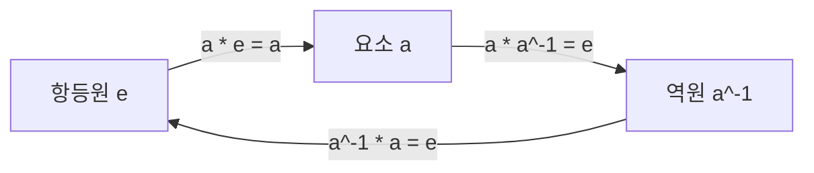
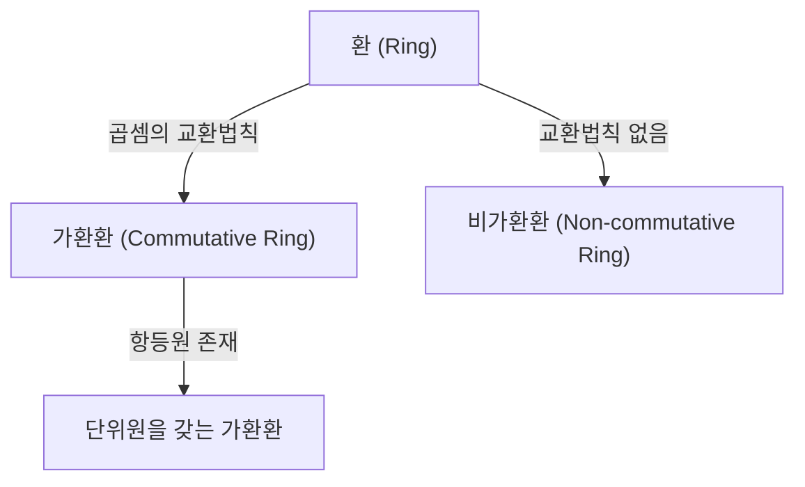
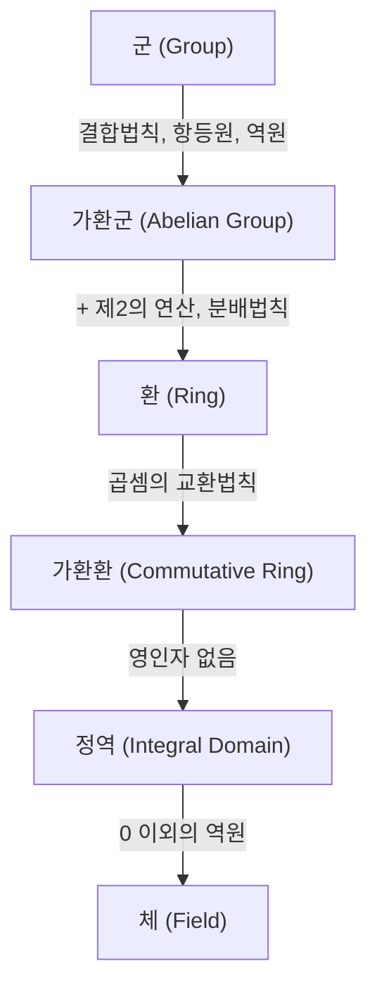

# [군, 환, 체](https://kenji.blog/ko/p/groups-rings-and-fields/): 단순한 수를 넘어 '구조' 자체를 추상화하는 현대 대수학의 입문

우리 대부분이 학교에서 처음 배우는 '수학'은 숫자를 더하고 곱하는, 즉 '사칙연산'의 세계입니다. $1 + 1 = 2$ 나 $3 \times 4 = 12$ 와 같은 계산은 일상적인 양과 크기를 설명하는 데 매우 유용합니다.

그러나 수학자들은 점차 '수 자체'가 아니라 '수가 가진 성질이나 계산 규칙(연산)이 만들어내는 구조'에 주목하기 시작했습니다. 이 '구조의 추상화'야말로 현대 대수학(추상 대수학)의 진수입니다.

본 기사에서는 현대 대수학의 기초가 되는 '군(Group)', '환(Ring)', '체(Field)'의 세 가지 중요한 개념에 대해 직관적인 예와 엄밀한 정의를 교차하며 자세히 해설합니다.

## 1. 연산과 집합: 추상화를 위한 첫걸음

현대 대수학을 이해하기 위한 첫걸음은 '집합'과 '연산'이라는 개념을 이해하는 것입니다.
- **집합 (Set)**: 어떠한 조건을 만족하는 요소들의 모임. 예: 모든 정수의 집합 $\mathbb{Z}$.
- **이항 연산 (Binary Operation)**: 집합에서 두 요소를 꺼내 규칙에 따라 결합하여 같은 집합의 다른 요소를 만들어내는 조작.

대수학에서는 **규칙(구조)** 에만 주목합니다.

---

## 2. 군 (Group): 대칭성과 가역성의 추출

'어떤 조작을 하고 그것을 원래대로 되돌릴 수 있다'는 성질을 추상화한 것이 '군'입니다.

### 2.1. 군의 엄밀한 정의

집합 $G$ 와 이항 연산 $\cdot$ 에 대해 다음 공리를 만족하면 **군 (Group)** 이라고 합니다.
1. **결합법칙**: $(a \cdot b) \cdot c = a \cdot (b \cdot c)$
2. **항등원**: $a \cdot e = e \cdot a = a$
3. **역원**: $a \cdot a^{-1} = a^{-1} \cdot a = e$

교환법칙 $a \cdot b = b \cdot a$ 가 성립하면 **가환군** 또는 **아벨 군** 이라고 합니다.

---

## 3. 환 (Ring): 덧셈과 곱셈의 공존

두 가지 연산이 공존하는 구조가 **환 (Ring)** 입니다.

### 3.1. 환의 정의

$(R, +, \cdot)$ 가 다음을 만족하면 **환** 입니다.
1. $(R, +)$ 은 아벨 군이다.
2. $(R, \cdot)$ 은 반군이다 (결합법칙).
3. **분배법칙** 이 성립한다.

---

## 4. 이디얼과 잉여환

**이디얼 (Ideal)** 은 환을 '나누어' **잉여환** 을 구성하는 데 사용됩니다.

---

## 5. 체 (Field): 사칙연산이 자유로운 세계

'나눗셈(0이 아닌 요소로 나누기)'까지 자유로운 구조가 **체 (Field)** 입니다.

### 5.1. 체의 정의

가환환이 다음 조건을 만족하면 **체** 입니다.
1. $0 \neq 1$ 인 최소 두 개의 요소를 갖는다.
2. $0$ 을 제외한 모든 요소가 곱셈에 대한 역원을 갖는다.

---

## 6. 가군 (Module) 과 벡터 공간

- **벡터 공간**: 체 위에서 정의.
- **가군**: 환 위에서 정의.

---

## 7. 구조의 계층

---

## 8. 갈루아 이론

방정식과 군론의 아름다운 교차점.

---

## 9. 응용

암호 이론 (RSA), 물리학과 군론, 오류 정정 부호 등.

---

## 10. 맺음말

추상 대수학은 우주와 정보 사회를 지탱하는 강력한 도구입니다.

현대 대수학의 탐구는 우리의 논리적 직관을 연마하고 미지의 세계를 개척하기 위한 궁극적인 무기 역할을 하는 순수한 형태의 수학적 사고입니다. [군, 환, 체](https://kenji.blog/ko/p/groups-rings-and-fields/)의 이론은 수학이라는 거대한 건축물의 근본적인 구조를 이해하는 것과 같습니다. 구조의 아름다움을 음미하고 추상화의 힘을 얻음으로써 세상을 바라보는 관점이 완전히 바뀔 것입니다. 숫자에 얽매이지 않는 새로운 수학적 모험으로 여러분을 초대합니다. 그것은 지성의 한계를 넓히는 끝없는 여정의 시작입니다.

현대 대수학의 탐구는 우리의 논리적 직관을 연마하고 미지의 세계를 개척하기 위한 궁극적인 무기 역할을 하는 순수한 형태의 수학적 사고입니다. [군, 환, 체](https://kenji.blog/ko/p/groups-rings-and-fields/)의 이론은 수학이라는 거대한 건축물의 근본적인 구조를 이해하는 것과 같습니다. 구조의 아름다움을 음미하고 추상화의 힘을 얻음으로써 세상을 바라보는 관점이 완전히 바뀔 것입니다. 숫자에 얽매이지 않는 새로운 수학적 모험으로 여러분을 초대합니다. 그것은 지성의 한계를 넓히는 끝없는 여정의 시작입니다.

현대 대수학의 탐구는 우리의 논리적 직관을 연마하고 미지의 세계를 개척하기 위한 궁극적인 무기 역할을 하는 순수한 형태의 수학적 사고입니다. [군, 환, 체](https://kenji.blog/ko/p/groups-rings-and-fields/)의 이론은 수학이라는 거대한 건축물의 근본적인 구조를 이해하는 것과 같습니다. 구조의 아름다움을 음미하고 추상화의 힘을 얻음으로써 세상을 바라보는 관점이 완전히 바뀔 것입니다. 숫자에 얽매이지 않는 새로운 수학적 모험으로 여러분을 초대합니다. 그것은 지성의 한계를 넓히는 끝없는 여정의 시작입니다.

현대 대수학의 탐구는 우리의 논리적 직관을 연마하고 미지의 세계를 개척하기 위한 궁극적인 무기 역할을 하는 순수한 형태의 수학적 사고입니다. [군, 환, 체](https://kenji.blog/ko/p/groups-rings-and-fields/)의 이론은 수학이라는 거대한 건축물의 근본적인 구조를 이해하는 것과 같습니다. 구조의 아름다움을 음미하고 추상화의 힘을 얻음으로써 세상을 바라보는 관점이 완전히 바뀔 것입니다. 숫자에 얽매이지 않는 새로운 수학적 모험으로 여러분을 초대합니다. 그것은 지성의 한계를 넓히는 끝없는 여정의 시작입니다.

현대 대수학의 탐구는 우리의 논리적 직관을 연마하고 미지의 세계를 개척하기 위한 궁극적인 무기 역할을 하는 순수한 형태의 수학적 사고입니다. [군, 환, 체](https://kenji.blog/ko/p/groups-rings-and-fields/)의 이론은 수학이라는 거대한 건축물의 근본적인 구조를 이해하는 것과 같습니다. 구조의 아름다움을 음미하고 추상화의 힘을 얻음으로써 세상을 바라보는 관점이 완전히 바뀔 것입니다. 숫자에 얽매이지 않는 새로운 수학적 모험으로 여러분을 초대합니다. 그것은 지성의 한계를 넓히는 끝없는 여정의 시작입니다.

현대 대수학의 탐구는 우리의 논리적 직관을 연마하고 미지의 세계를 개척하기 위한 궁극적인 무기 역할을 하는 순수한 형태의 수학적 사고입니다. [군, 환, 체](https://kenji.blog/ko/p/groups-rings-and-fields/)의 이론은 수학이라는 거대한 건축물의 근본적인 구조를 이해하는 것과 같습니다. 구조의 아름다움을 음미하고 추상화의 힘을 얻음으로써 세상을 바라보는 관점이 완전히 바뀔 것입니다. 숫자에 얽매이지 않는 새로운 수학적 모험으로 여러분을 초대합니다. 그것은 지성의 한계를 넓히는 끝없는 여정의 시작입니다.

현대 대수학의 탐구는 우리의 논리적 직관을 연마하고 미지의 세계를 개척하기 위한 궁극적인 무기 역할을 하는 순수한 형태의 수학적 사고입니다. [군, 환, 체](https://kenji.blog/ko/p/groups-rings-and-fields/)의 이론은 수학이라는 거대한 건축물의 근본적인 구조를 이해하는 것과 같습니다. 구조의 아름다움을 음미하고 추상화의 힘을 얻음으로써 세상을 바라보는 관점이 완전히 바뀔 것입니다. 숫자에 얽매이지 않는 새로운 수학적 모험으로 여러분을 초대합니다. 그것은 지성의 한계를 넓히는 끝없는 여정의 시작입니다.

현대 대수학의 탐구는 우리의 논리적 직관을 연마하고 미지의 세계를 개척하기 위한 궁극적인 무기 역할을 하는 순수한 형태의 수학적 사고입니다. [군, 환, 체](https://kenji.blog/ko/p/groups-rings-and-fields/)의 이론은 수학이라는 거대한 건축물의 근본적인 구조를 이해하는 것과 같습니다. 구조의 아름다움을 음미하고 추상화의 힘을 얻음으로써 세상을 바라보는 관점이 완전히 바뀔 것입니다. 숫자에 얽매이지 않는 새로운 수학적 모험으로 여러분을 초대합니다. 그것은 지성의 한계를 넓히는 끝없는 여정의 시작입니다.

현대 대수학의 탐구는 우리의 논리적 직관을 연마하고 미지의 세계를 개척하기 위한 궁극적인 무기 역할을 하는 순수한 형태의 수학적 사고입니다. [군, 환, 체](https://kenji.blog/ko/p/groups-rings-and-fields/)의 이론은 수학이라는 거대한 건축물의 근본적인 구조를 이해하는 것과 같습니다. 구조의 아름다움을 음미하고 추상화의 힘을 얻음으로써 세상을 바라보는 관점이 완전히 바뀔 것입니다. 숫자에 얽매이지 않는 새로운 수학적 모험으로 여러분을 초대합니다. 그것은 지성의 한계를 넓히는 끝없는 여정의 시작입니다.

현대 대수학의 탐구는 우리의 논리적 직관을 연마하고 미지의 세계를 개척하기 위한 궁극적인 무기 역할을 하는 순수한 형태의 수학적 사고입니다. [군, 환, 체](https://kenji.blog/ko/p/groups-rings-and-fields/)의 이론은 수학이라는 거대한 건축물의 근본적인 구조를 이해하는 것과 같습니다. 구조의 아름다움을 음미하고 추상화의 힘을 얻음으로써 세상을 바라보는 관점이 완전히 바뀔 것입니다. 숫자에 얽매이지 않는 새로운 수학적 모험으로 여러분을 초대합니다. 그것은 지성의 한계를 넓히는 끝없는 여정의 시작입니다.
