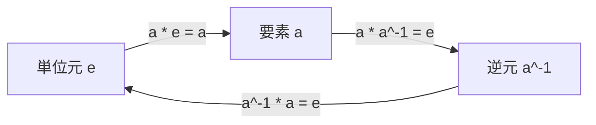
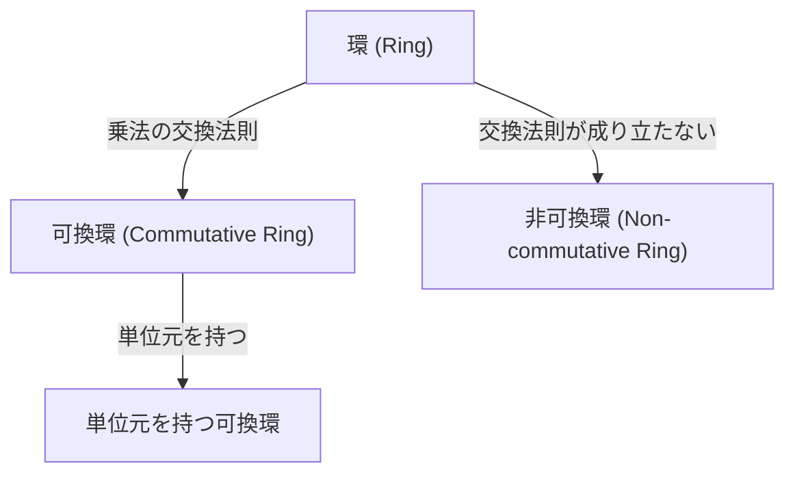
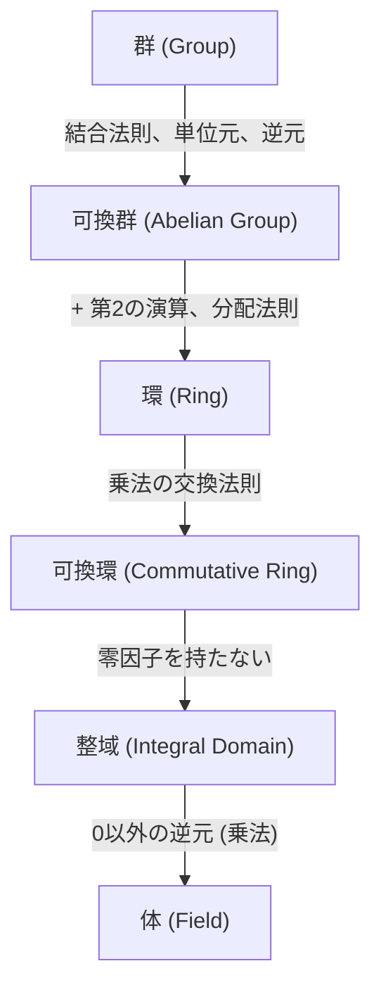

# [群・環・体](https://kenji.blog/p/groups-rings-and-fields/)：現代代数学が描く「構造」の美しさ

私たちの多くが学校で最初に学ぶ「数学」は、数を足したり掛けたりすること、つまり「四則演算」の世界です。$1 + 1 = 2$ や $3 \times 4 = 12$ といった計算は、私たちが日常的に触れる現実世界の量や大きさを記述するのに非常に役立ちます。

しかし、数学者たちは次第に「数そのもの」ではなく、「数が持つ性質や、計算のルール（演算）が作り出す『構造』」に目を向けるようになりました。この「構造の抽象化」こそが、現代代数学（抽象代数学）の真髄です。

この記事では、現代代数学の基礎をなす３つの重要な概念、「群 (Group)」「環 (Ring)」「体 (Field)」について、厳密な定義と直感的な例を交えながら、その美しい世界へとご案内します。

## 1. 演算と集合：抽象化への第一歩

現代代数学を理解するための第一歩は、「集合」と「演算」という概念を理解することです。

- **集合 (Set)**：何らかの条件を満たす要素の集まり。例えば、すべての整数の集合 $\mathbb{Z}$ や、すべての実数の集合 $\mathbb{R}$ などです。
- **二項演算 (Binary Operation)**：集合の中から2つの要素を取り出し、特定のルールに従って組み合わせて、同じ集合の別の要素を作り出す操作のことです。足し算 $(+)$ や掛け算 $(\times)$ がその代表例です。

代数学では、具体的な「数」が何であるか（整数なのか、実数なのか、それとも行列や関数なのか）は問題にしません。「その集合に対して、どのような演算が定義されており、その演算がどのような法則を満たすか」という **ルール (構造)** にのみ着目します。

この視点を持つことで、全く異なる数学的対象（数、図形の変換、多項式など）が、実は同じ「代数的構造」を持っていることを見抜くことができます。

---

## 2. 群 (Group)：対称性と可逆性の抽出

代数構造の中で、最もシンプルでありながら最も応用範囲が広いのが「群」です。群は、「ある操作を行い、それを元に戻すことができる」という性質（可逆性や対称性）を抽象化したものです。

### 2.1. 群の厳密な定義

空でない集合 $G$ と、その上の二項演算 $\cdot$ （便宜上「積」と呼びますが、通常の掛け算とは限りません）が与えられたとき、以下の３つの公理（ルール）を満たす場合、組 $(G, \cdot)$ を **群 (Group)** と呼びます。

1. **結合法則 (Associativity)**
   任意の $a, b, c \in G$ について、
   $$ (a \cdot b) \cdot c = a \cdot (b \cdot c) $$
   が成り立つ。（計算の順序を変えても結果は同じ）

2. **単位元の存在 (Identity Element)**
   ある特別な要素 $e \in G$ が存在し、任意の $a \in G$ に対して、
   $$ a \cdot e = e \cdot a = a $$
   となる。（操作を行っても何も変化しない「ゼロ」や「１」のような要素）

3. **逆元の存在 (Inverse Element)**
   任意の要素 $a \in G$ に対して、ある要素 $a^{-1} \in G$ が存在し、
   $$ a \cdot a^{-1} = a^{-1} \cdot a = e $$
   となる。（操作を打ち消して元に戻す要素）

さらに、任意の $a, b \in G$ について $a \cdot b = b \cdot a$ （交換法則）が成り立つ群を、 **可換群 (Commutative Group)** または **[アーベル](https://kenji.blog/p/abel/)群 ([Abel](https://kenji.blog/p/abel/)ian Group)** と呼びます。

### 2.2. 群の具体例と視覚化

**例1：整数の足し算**
整数の集合 $\mathbb{Z}$ と加法 $(+)$ の組み合わせは、[アーベル](https://kenji.blog/p/abel/)群をなします。
- 結合法則： $(a + b) + c = a + (b + c)$
- 単位元： $0$ （なぜなら $a + 0 = 0 + a = a$）
- 逆元： $a$ に対する逆元は $-a$ （なぜなら $a + (-a) = 0$）

**例2：対称群（あみだくじと置換）**
数字の並び替え（置換）の集合も、群をなします。例えば、1, 2, 3 という3つの数字の並び替え（あみだくじのようなもの）を考えてみましょう。並び替えを続けて行うことを「演算」とすると、これは結合法則を満たします。「何もしない」並び替えが単位元であり、並び替えを「逆順にたどる」ことが逆元に相当します。このような群を「対称群 (Symmetric Group)」と呼びます。

---

## 3. 環 (Ring)：足し算と掛け算の共存

群は１つの演算（例えば足し算だけ）に関する構造でした。しかし、私たちがよく知る整数には、足し算だけでなく「掛け算」もあります。この「２つの演算が共存し、互いに協調しあう構造」を抽象化したのが **環 (Ring)** です。

### 3.1. 環の厳密な定義

空でない集合 $R$ と、２つの二項演算 $+$ (加法) と $\cdot$ (乗法) が与えられたとき、以下の公理を満たす組 $(R, +, \cdot)$ を **環 (Ring)** と呼びます。

1. **$(R, +)$ は可換群 ([アーベル](https://kenji.blog/p/abel/)群) である**
   つまり、加法について結合法則、単位元（$0$ と書く）、逆元（$-a$ と書く）、交換法則が成り立つ。
2. **$(R, \cdot)$ は半群である**
   乗法について結合法則が成り立つ。
   $$ (a \cdot b) \cdot c = a \cdot (b \cdot c) $$
3. **分配法則 (Distributivity) が成り立つ**
   加法と乗法を繋ぐルールです。任意の $a, b, c \in R$ について、
   $$ a \cdot (b + c) = (a \cdot b) + (a \cdot c) $$
   $$ (a + b) \cdot c = (a \cdot c) + (b \cdot c) $$

さらに、乗法について交換法則 $a \cdot b = b \cdot a$ が成り立つ環を **可換環 (Commutative Ring)** と呼びます。また、乗法についての単位元（$1$ と書く、$a \cdot 1 = 1 \cdot a = a$）を持つ環を **単位元を持つ環** と呼びます。

### 3.2. 環の具体例

**例1：整数環**
整数の集合 $\mathbb{Z}$ は、通常の足し算と掛け算について可換環をなします。

**例2：行列環**
$n \times n$ の実数行列の集合は、行列の加法と乗法について環をなします。しかし、行列の積は一般に交換法則を満たさない（$AB \neq BA$）ため、これは非可換環の代表例です。

---

## 4. イデアルと剰余環：環を「割る」という発想

環論において非常に重要な概念が **イデアル (Ideal)** です。整数において「偶数全体」や「3の倍数全体」が持つ性質を一般化したものです。

### 4.1. イデアルの定義

環 $R$ の部分集合 $I$ が以下の条件を満たすとき、$I$ を $R$ の（両側）イデアルと呼びます。
1. $I$ は加法について $R$ の部分群である。（つまり、差について閉じている）
2. 任意の $r \in R$ と $x \in I$ について、$r \cdot x \in I$ かつ $x \cdot r \in I$ となる。（吸収律）

### 4.2. 剰余環 (Quotient Ring)

イデアル $I$ を用いると、元の環 $R$ を $I$ で「割った」新しい環 $R/I$ を構成できます。これを **剰余環** と呼びます。
例えば、整数環 $\mathbb{Z}$ を、「$n$ の倍数全体」というイデアル $n\mathbb{Z}$ で割った剰余環 $\mathbb{Z}/n\mathbb{Z}$ は、「$n$ で割った余りの世界」を表します。これにより、時計の文字盤のような有限の巡回的な構造を代数的に扱うことができます。

---

## 5. 体 (Field)：四則演算が自由にできる世界

環の世界では、足し算、引き算（加法の逆元）、掛け算までは自由にできますが、「割り算」が常にできるとは限りません。例えば、整数環 $\mathbb{Z}$ において、$2$ で割るという操作は、結果が整数にならないため閉じていません。

この「割り算（ゼロ以外の要素による除法）」までもが自由にできる、つまり「四則演算がすべて完備された最も豊かな構造」が **体 (Field)** です。

### 5.1. 体の厳密な定義

可換環 $(F, +, \cdot)$ であり、以下の条件を満たすものを **体 (Field)** と呼びます。

1. **$F$ は少なくとも２つの要素（$0$ と $1$ で、$0 \neq 1$）を持つ。**
2. **$0$ を除くすべての要素が、乗法について逆元を持つ。**
   つまり、任意の $a \in F$ ($a \neq 0$) に対して、ある $a^{-1} \in F$ が存在し、
   $$ a \cdot a^{-1} = 1 $$
   が成り立つ。

### 5.2. 体の具体例と広がり

**例1：有理数体、実数体、複素数体**
有理数 $\mathbb{Q}$、実数 $\mathbb{R}$、複素数 $\mathbb{C}$ はすべて体をなします。これらはゼロ以外で自由に割り算ができる空間です。

**例2：有限体 ([ガロア](https://kenji.blog/p/galois/)体)**
要素の数が有限個しかない体も存在し、**有限体 (Finite Field)** または **[ガロア](https://kenji.blog/p/galois/)体 ([Galois](https://kenji.blog/p/galois/) Field)** と呼ばれます。
素数 $p$ を法とする剰余環 $\mathbb{Z}/p\mathbb{Z}$ は、実は体をなします（$p$ が素数であることが重要です）。
有限個の要素でも四則演算が完全に定義できるこの空間は、デジタル信号処理や暗号理論の基礎として不可欠です。

---

## 6. 加群 (Module) とベクトル空間 (Vector Space)

環と体を理解すると、もう一つの重要な代数構造に到達します。

- **ベクトル空間 (Vector Space)**：体 $F$ 上で定義された空間で、ベクトルの足し算と、体の要素（スカラー）による掛け算が定義されています。線形代数学の主役です。
- **加群 (Module)**：ベクトル空間のスカラーを、体ではなく「環」に一般化したものです。環は割り算ができないため、加群はベクトル空間よりも複雑な振る舞いをしますが、代数的トポロジーや表現論など、現代数学の至る所で現れます。

---

## 7. 構造の階層と準同型写像

群、環、体の関係性は、条件（公理）が厳しくなるにつれて集合が限定されていく階層構造を持っています。

これらの構造間の「形を保つ写像」を **準同型写像 (Homomorphism)** と呼びます。例えば群の準同型写像 $f: G \to H$ は、$f(a \cdot b) = f(a) \cdot f(b)$ を満たし、元の空間での演算結果が、写し先の空間での演算結果と一致することを保証します。この「構造を保つ」という考え方こそが、代数学の中心的な哲学です。

---

## 8. [ガロア理論](https://kenji.blog/p/galois-theory/)：方程式と群の美しい交差点

体論のさらに先にあるのが、代数学の金字塔とも言える **[ガロア理論](https://kenji.blog/p/galois-theory/) (Galois Theory)** です。フランスの天才数学者[エヴァリスト・ガロア](https://kenji.blog/p/galois/)は、「方程式が代数的に解けるための条件」を明らかにするために、群論と体論を融合させました。

ある方程式の解をすべて含むような体の拡大（最小分解体）を考えたとき、その体の自己同型群（[ガロア](https://kenji.blog/p/galois/)群）の構造が、方程式の解の性質を完全に決定づけます。「5次以上の方程式には一般的な解の公式が存在しない（アーベル-ルフィニの定理）」という長年の難問も、[ガロア](https://kenji.blog/p/galois/)群が特定の性質（可解性）を持たないことを示すことでエレガントに証明されました。

---

## 9. 応用：なぜ抽象化するのか？

「なぜわざわざ数から離れて、公理というルールだけで数学を組み立てるのか？」
その答えは、**抽象化することで、まったく異なるように見える事象が、実は同じ構造を持っていることに気づけるから**です。

1. **暗号理論と有限体**
   私たちがインターネットで安全に通信できるのは、[RSA](https://kenji.blog/p/modern-cryptography-public-key-hash-signature/)暗号や楕円曲線暗号といった技術のおかげです。これらは実数ではなく、「有限体」や「群」という代数構造の性質（離散対数問題の難しさなど）を直接応用しています。

2. **物理学と群論**
   現代物理学、特に素粒子物理学や量子力学において、「群論」は宇宙の法則を記述する言語です。粒子の対称性や保存則（エネルギー保存の法則など）は、物理系が持つ「対称群」や「リー群 (Lie Group)」の性質として数学的に証明されます。

3. **誤り訂正符号**
   CDやDVD、QRコード、深宇宙探査機との通信などにおいて、データがノイズで壊れた際にそれを復元する「誤り訂正符号」。ここでも有限体上の多項式環やベクトル空間の理論が使われています。

4. **幾何学から代数幾何学へ**
   図形の性質を調べる幾何学も、多項式の集まりである「環」の性質を調べることに帰着できます（代数幾何学）。[フェルマーの最終定理](https://kenji.blog/p/fermats-last-theorem/)の証明も、この高度な環論や体論の発展なしにはあり得ませんでした。

---

## 10. おわりに：ルールが創り出す無限の世界

[群・環・体](https://kenji.blog/p/groups-rings-and-fields/)という現代代数学の基礎概念は、たった数行の「ルール（公理）」から出発します。しかし、そのシンプルなルールを組み合わせ、演繹していくことで、想像を絶するほど豊かで広大な数学の世界が広がっていきます。

現実の「量」に縛られず、論理と構造の美しさを純粋に追求する。それが現代代数学の醍醐味であり、同時に私たちの住む宇宙や高度情報化社会を根底で支える強力な道具となっているのです。

これから抽象代数学を学ぶ方は、ぜひ「この定理は、どのルール（公理）から導かれているのか？」を意識してみてください。そこには、複雑なパズルを解き明かすような知的な喜びが待っているはずです。
