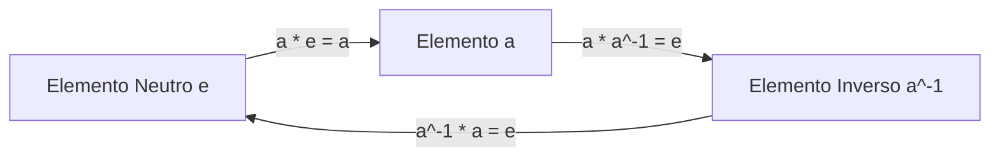
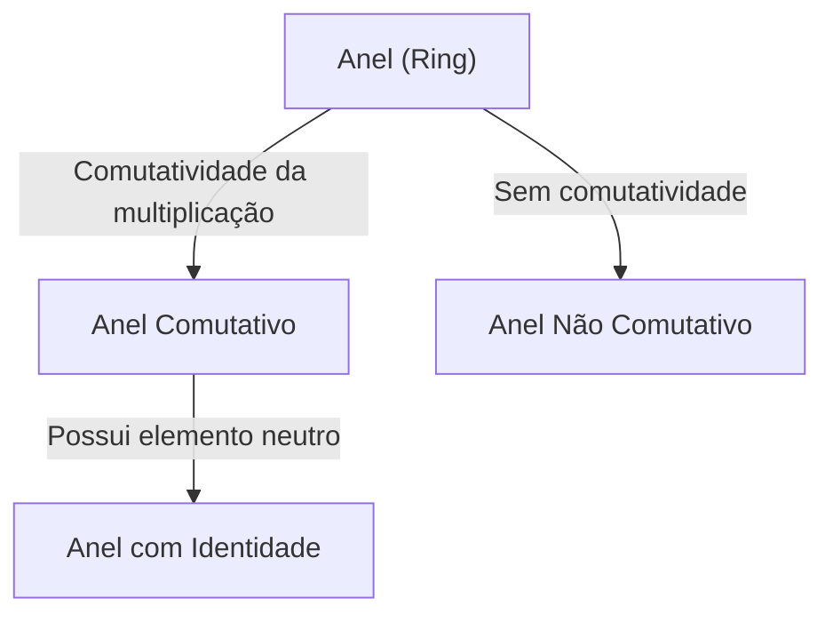
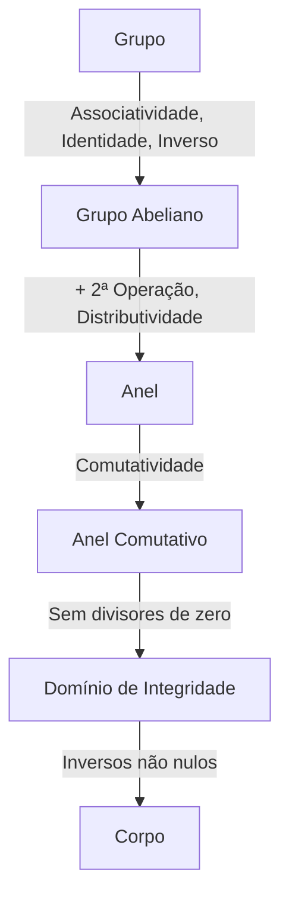

# [Grupos, Anéis e Corpos](https://kenji.blog/pt/p/groups-rings-and-fields/): A Beleza da "Estrutura" Descrita pela Álgebra Moderna

Para muitos de nós, a "matemática" que aprendemos primeiro na escola é um mundo de adição e multiplicação de números, ou seja, as "quatro operações básicas".

No entanto, os matemáticos gradualmente voltaram sua atenção não para os "números em si", mas para as "'estruturas' criadas pelas operações". Essa "abstração de estrutura" é a própria essência da álgebra moderna (álgebra abstrata).

Neste artigo, guiaremos você ao belo mundo de três conceitos importantes: "Grupo", "Anel" e "Corpo".

## 1. Operações e Conjuntos

O primeiro passo é entender os conceitos de "conjuntos" e "operações".
- **Conjunto (Set)**: Uma coleção de elementos (ex: $\mathbb{Z}$).
- **Operação Binária (Binary Operation)**: Combinação de dois elementos.

---

## 2. Grupo (Group): Extraindo Simetria e Reversibilidade

Um grupo abstrai a propriedade de "reversibilidade".

### 2.1. Definição Rigorosa de um Grupo

Dado um conjunto $G$ e uma operação $\cdot$, é um **Grupo (Group)** se:
1. **Associatividade**: $(a \cdot b) \cdot c = a \cdot (b \cdot c)$
2. **Elemento Neutro**: $a \cdot e = e \cdot a = a$
3. **Elemento Inverso**: $a \cdot a^{-1} = a^{-1} \cdot a = e$

Se $a \cdot b = b \cdot a$ for válido, é um **Grupo Comutativo** ou **Grupo [Abel](https://kenji.blog/pt/p/abel/)iano**.

---

## 3. Anel (Ring): Coexistência de Adição e Multiplicação

A abstração desta "estrutura onde duas operações coexistem" é o **Anel**.

### 3.1. Definição de um Anel

$(R, +, \cdot)$ é um **Anel (Ring)** se:
1. $(R, +)$ é um grupo comutativo.
2. $(R, \cdot)$ é um semigrupo.
3. Vale a distributividade.

---

## 4. Ideais e Anéis Quocientes

Um **Ideal** permite "dividir" um anel para criar um **Anel Quociente**.

---

## 5. Corpo (Field): Onde as Quatro Operações São Livres

O **Corpo (Field)** é a estrutura mais rica onde a "divisão" é sempre possível.

### 5.1. Definição de Corpo

Um anel comutativo é um **Corpo** se tiver inversos para todos os elementos não nulos ($0 \neq 1$).

---

## 6. Módulos e Espaços Vetoriais

- **Espaço Vetorial**: Sobre um corpo.
- **Módulo**: Sobre um anel.

---

## 7. Hierarquia das Estruturas

---

## 8. [Teoria de Galois](https://kenji.blog/pt/p/galois-theory/)

## 9. Aplicações (Criptografia, Física)

## 10. Conclusão

A exploração da álgebra moderna é uma forma pura de pensamento matemático que aprimora nossa intuição lógica e serve como a arma definitiva para esculpir mundos desconhecidos. As teorias de grupos, anéis e corpos são equivalentes a compreender a construção fundamental do grande edifício da matemática. Ao saborear a beleza da estrutura e adquirir o poder da abstração, sua perspectiva de mundo será totalmente transformada. Convidamos você a embarcar em uma nova aventura matemática desvinculada dos números. É o começo de uma jornada sem fim que expande os limites do intelecto.

A exploração da álgebra moderna é uma forma pura de pensamento matemático que aprimora nossa intuição lógica e serve como a arma definitiva para esculpir mundos desconhecidos. As teorias de grupos, anéis e corpos são equivalentes a compreender a construção fundamental do grande edifício da matemática. Ao saborear a beleza da estrutura e adquirir o poder da abstração, sua perspectiva de mundo será totalmente transformada. Convidamos você a embarcar em uma nova aventura matemática desvinculada dos números. É o começo de uma jornada sem fim que expande os limites do intelecto.

A exploração da álgebra moderna é uma forma pura de pensamento matemático que aprimora nossa intuição lógica e serve como a arma definitiva para esculpir mundos desconhecidos. As teorias de grupos, anéis e corpos são equivalentes a compreender a construção fundamental do grande edifício da matemática. Ao saborear a beleza da estrutura e adquirir o poder da abstração, sua perspectiva de mundo será totalmente transformada. Convidamos você a embarcar em uma nova aventura matemática desvinculada dos números. É o começo de uma jornada sem fim que expande os limites do intelecto.
