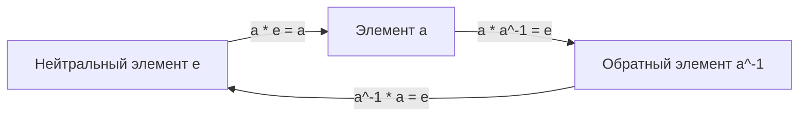
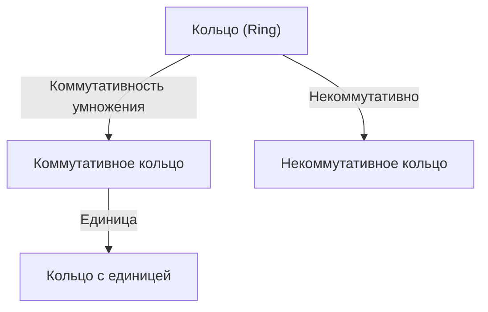
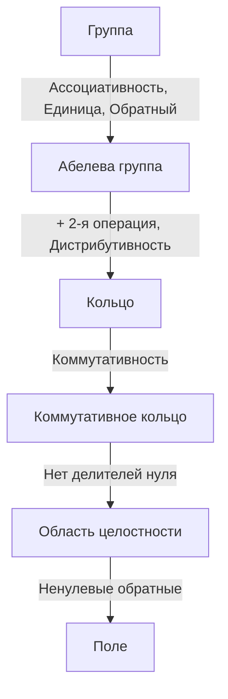

# Группы, Кольца и Поля: Введение в современную алгебру

Математика, которую мы изучаем в школе, — это мир чисел и арифметики. Но математики обратили внимание на «структуры», создаваемые операциями. Это суть абстрактной алгебры.

## 1. Операции и Множества

- **Множество (Set)**: Коллекция элементов (например, $\mathbb{Z}$).
- **Бинарная операция (Binary Operation)**: Комбинация двух элементов.

---

## 2. Группа (Group)

### 2.1. Определение группы

Множество $G$ с операцией $\cdot$ — это **Группа (Group)**, если:
1. **Ассоциативность**: $(a \cdot b) \cdot c = a \cdot (b \cdot c)$
2. **Нейтральный элемент**: $a \cdot e = e \cdot a = a$
3. **Обратный элемент**: $a \cdot a^{-1} = a^{-1} \cdot a = e$

Абелева группа, если $a \cdot b = b \cdot a$.

---

## 3. Кольцо (Ring)

### 3.1. Определение кольца

$(R, +, \cdot)$ — это **Кольцо (Ring)**, если:
1. $(R, +)$ — абелева группа.
2. $(R, \cdot)$ — полугруппа.
3. Выполняется дистрибутивность.

---

## 4. Идеалы и факторкольца

---

## 5. Поле (Field)

**Поле (Field)** — структура, где возможно деление на ненулевые элементы.

---

## 6. Модули и векторные пространства

---

## 7. Иерархия

---

## 8. Теория Галуа
## 9. Приложения (Криптография, Физика)
## 10. Заключение

Исследование современной алгебры — это чистая форма математического мышления, которая оттачивает нашу логическую интуицию и служит высшим оружием для создания неизведанных миров. Теории групп, колец и полей равносильны пониманию фундаментальной конструкции великого здания математики. Наслаждаясь красотой структуры и обретая силу абстракции, ваш взгляд на мир полностью изменится. Мы приглашаем вас отправиться в новое математическое приключение, не привязанное к числам. Это начало бесконечного путешествия, расширяющего границы интеллекта.

Исследование современной алгебры — это чистая форма математического мышления, которая оттачивает нашу логическую интуицию и служит высшим оружием для создания неизведанных миров. Теории групп, колец и полей равносильны пониманию фундаментальной конструкции великого здания математики. Наслаждаясь красотой структуры и обретая силу абстракции, ваш взгляд на мир полностью изменится. Мы приглашаем вас отправиться в новое математическое приключение, не привязанное к числам. Это начало бесконечного путешествия, расширяющего границы интеллекта.

Исследование современной алгебры — это чистая форма математического мышления, которая оттачивает нашу логическую интуицию и служит высшим оружием для создания неизведанных миров. Теории групп, колец и полей равносильны пониманию фундаментальной конструкции великого здания математики. Наслаждаясь красотой структуры и обретая силу абстракции, ваш взгляд на мир полностью изменится. Мы приглашаем вас отправиться в новое математическое приключение, не привязанное к числам. Это начало бесконечного путешествия, расширяющего границы интеллекта.

Исследование современной алгебры — это чистая форма математического мышления, которая оттачивает нашу логическую интуицию и служит высшим оружием для создания неизведанных миров. Теории групп, колец и полей равносильны пониманию фундаментальной конструкции великого здания математики. Наслаждаясь красотой структуры и обретая силу абстракции, ваш взгляд на мир полностью изменится. Мы приглашаем вас отправиться в новое математическое приключение, не привязанное к числам. Это начало бесконечного путешествия, расширяющего границы интеллекта.

Исследование современной алгебры — это чистая форма математического мышления, которая оттачивает нашу логическую интуицию и служит высшим оружием для создания неизведанных миров. Теории групп, колец и полей равносильны пониманию фундаментальной конструкции великого здания математики. Наслаждаясь красотой структуры и обретая силу абстракции, ваш взгляд на мир полностью изменится. Мы приглашаем вас отправиться в новое математическое приключение, не привязанное к числам. Это начало бесконечного путешествия, расширяющего границы интеллекта.
