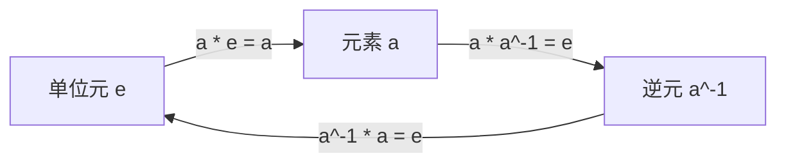
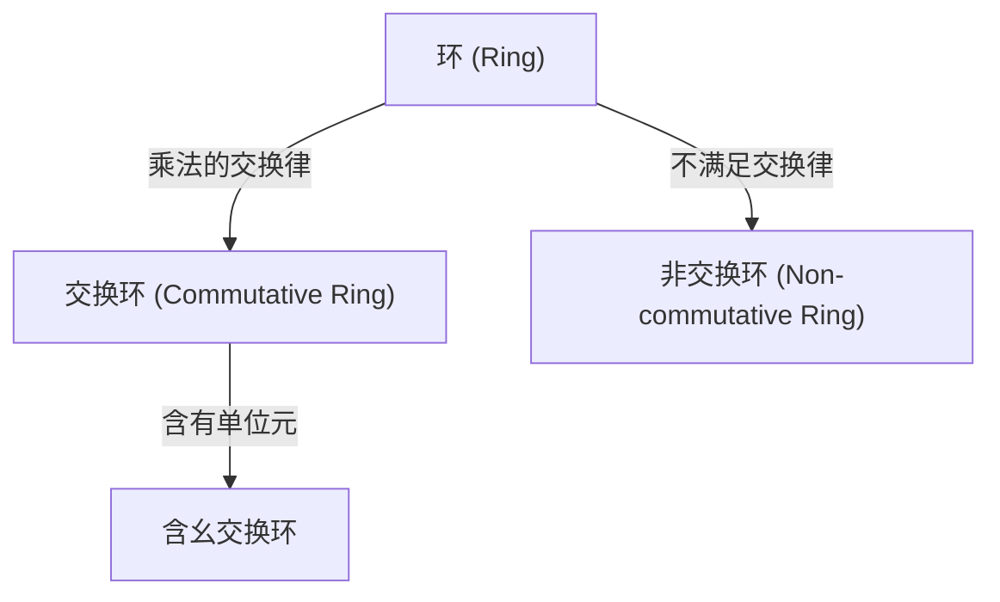
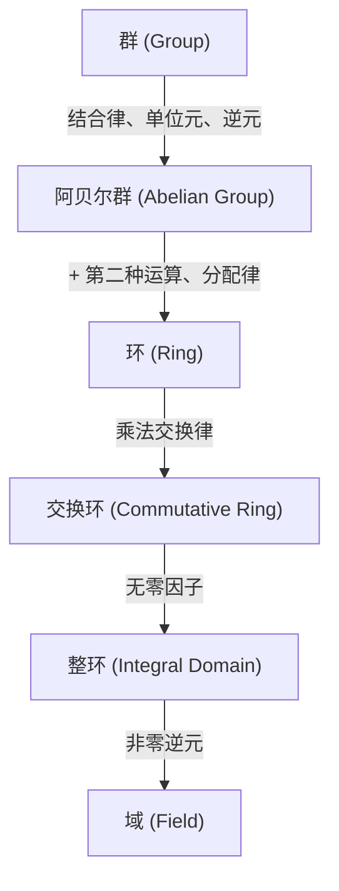

# [[群、环、域](https://kenji.blog/p/groups-rings-and-fields/)：不仅仅是数字，更是抽象“结构”本身的现代代数入门](https://kenji.blog/p/groups-rings-and-fields/)

我们大多数人在学校最先学到的“数学”是数字的加减乘除，也就是“四则运算”的世界。像 $1 + 1 = 2$ 或 $3 \times 4 = 12$ 这样的计算，对于描述我们日常接触的现实世界的数量和大小非常有用。

然而，数学家们逐渐不再关注“数字本身”，而是关注“数字所具有的性质和计算规则（运算）所创造的‘结构’”。这种“结构的抽象化”正是现代代数（抽象代数）的精髓。

在本文中，我们将为您详细介绍现代代数基础中的三个重要概念：“群 (Group)”、“环 (Ring)”和“域 (Field)”，并结合直观的例子和严格的定义。

## 1. 运算与集合：抽象化的第一步

理解现代代数的第一步是理解“集合”和“运算”的概念。

- **集合 (Set)**：满足某种条件的元素的聚集。例如，所有整数的集合 $\mathbb{Z}$，或所有实数的集合 $\mathbb{R}$。
- **二元运算 (Binary Operation)**：从集合中取出两个元素，根据特定规则组合它们，并产生同一个集合中的另一个元素的操作。加法 $(+)$ 和乘法 $(\times)$ 就是典型的例子。

在代数中，具体的“数字”是什么（是整数、实数、矩阵还是函数）并不重要。我们只关注**规则（结构）**：“在这个集合上定义了什么运算，并且该运算满足什么法则”。

---

## 2. 群 (Group)：提取对称性与可逆性

在代数结构中，最简单且应用最广泛的是“群”。群抽象化了“可以进行某种操作并将其还原”的性质（可逆性或对称性）。

### 2.1. 群的严格定义

给定一个非空集合 $G$ 和其上的二元运算 $\cdot$，如果满足以下三个公理，则组 $(G, \cdot)$ 称为 **群 (Group)**。

1. **结合律 (Associativity)**：对任意 $a, b, c \in G$，有 $(a \cdot b) \cdot c = a \cdot (b \cdot c)$。
2. **单位元的存在 (Identity Element)**：存在特殊元素 $e \in G$，使得对任意 $a \in G$，有 $a \cdot e = e \cdot a = a$。
3. **逆元的存在 (Inverse Element)**：对任意 $a \in G$，存在元素 $a^{-1} \in G$，使得 $a \cdot a^{-1} = a^{-1} \cdot a = e$。

如果满足交换律 $a \cdot b = b \cdot a$，则称为 **交换群** 或 **阿贝尔群 (Abelian Group)**。

---

## 3. 环 (Ring)：加法与乘法的共存

抽象化“两种运算共存”的结构就是 **环 (Ring)**。

### 3.1. 环的严格定义

给定非空集合 $R$ 和两种二元运算 $+$（加法）与 $\cdot$（乘法），如果满足以下公理，则组 $(R, +, \cdot)$ 称为 **环 (Ring)**。

1. $(R, +)$ 是阿贝尔群。
2. $(R, \cdot)$ 是半群（满足结合律）。
3. 满足分配律。

---

## 4. 理想与商环

**理想 (Ideal)** 是环的一个重要概念，可用于构造 **商环**。

---

## 5. 域 (Field)：四则运算自由的世界

在环中不一定能进行“除法”。而“除法（除以非零元素）”也能自由进行的结构就是 **域 (Field)**。

### 5.1. 域的严格定义

如果交换环满足以下条件，则称为 **域**：
1. 至少有两个元素（$0 \neq 1$）。
2. 除了 $0$ 以外的所有元素都有乘法逆元。

---

## 6. 模 (Module) 与向量空间 (Vector Space)

- **向量空间**：定义在域上。
- **模**：定义在环上。

---

## 7. 结构的层级

---

## 8. 伽罗瓦理论

群论与域论的优美结合。

---

## 9. 应用与结论

抽象代数是支撑宇宙和信息社会的强大工具。

探索现代代数是数学思维的纯粹形式，它磨练了我们的逻辑直觉，并作为雕刻未知世界的终极武器。群、环和域的理论相当于理解数学宏伟建筑的基础构造。通过品味结构之美并获得抽象的力量，你对世界的看法将完全改变。我们邀请您踏上不受数字束缚的新的数学冒险。这是一段突破智力极限的无尽旅程的开始。

探索现代代数是数学思维的纯粹形式，它磨练了我们的逻辑直觉，并作为雕刻未知世界的终极武器。群、环和域的理论相当于理解数学宏伟建筑的基础构造。通过品味结构之美并获得抽象的力量，你对世界的看法将完全改变。我们邀请您踏上不受数字束缚的新的数学冒险。这是一段突破智力极限的无尽旅程的开始。

探索现代代数是数学思维的纯粹形式，它磨练了我们的逻辑直觉，并作为雕刻未知世界的终极武器。群、环和域的理论相当于理解数学宏伟建筑的基础构造。通过品味结构之美并获得抽象的力量，你对世界的看法将完全改变。我们邀请您踏上不受数字束缚的新的数学冒险。这是一段突破智力极限的无尽旅程的开始。

探索现代代数是数学思维的纯粹形式，它磨练了我们的逻辑直觉，并作为雕刻未知世界的终极武器。群、环和域的理论相当于理解数学宏伟建筑的基础构造。通过品味结构之美并获得抽象的力量，你对世界的看法将完全改变。我们邀请您踏上不受数字束缚的新的数学冒险。这是一段突破智力极限的无尽旅程的开始。

探索现代代数是数学思维的纯粹形式，它磨练了我们的逻辑直觉，并作为雕刻未知世界的终极武器。群、环和域的理论相当于理解数学宏伟建筑的基础构造。通过品味结构之美并获得抽象的力量，你对世界的看法将完全改变。我们邀请您踏上不受数字束缚的新的数学冒险。这是一段突破智力极限的无尽旅程的开始。

探索现代代数是数学思维的纯粹形式，它磨练了我们的逻辑直觉，并作为雕刻未知世界的终极武器。群、环和域的理论相当于理解数学宏伟建筑的基础构造。通过品味结构之美并获得抽象的力量，你对世界的看法将完全改变。我们邀请您踏上不受数字束缚的新的数学冒险。这是一段突破智力极限的无尽旅程的开始。

探索现代代数是数学思维的纯粹形式，它磨练了我们的逻辑直觉，并作为雕刻未知世界的终极武器。群、环和域的理论相当于理解数学宏伟建筑的基础构造。通过品味结构之美并获得抽象的力量，你对世界的看法将完全改变。我们邀请您踏上不受数字束缚的新的数学冒险。这是一段突破智力极限的无尽旅程的开始。

探索现代代数是数学思维的纯粹形式，它磨练了我们的逻辑直觉，并作为雕刻未知世界的终极武器。群、环和域的理论相当于理解数学宏伟建筑的基础构造。通过品味结构之美并获得抽象的力量，你对世界的看法将完全改变。我们邀请您踏上不受数字束缚的新的数学冒险。这是一段突破智力极限的无尽旅程的开始。

探索现代代数是数学思维的纯粹形式，它磨练了我们的逻辑直觉，并作为雕刻未知世界的终极武器。群、环和域的理论相当于理解数学宏伟建筑的基础构造。通过品味结构之美并获得抽象的力量，你对世界的看法将完全改变。我们邀请您踏上不受数字束缚的新的数学冒险。这是一段突破智力极限的无尽旅程的开始。

探索现代代数是数学思维的纯粹形式，它磨练了我们的逻辑直觉，并作为雕刻未知世界的终极武器。群、环和域的理论相当于理解数学宏伟建筑的基础构造。通过品味结构之美并获得抽象的力量，你对世界的看法将完全改变。我们邀请您踏上不受数字束缚的新的数学冒险。这是一段突破智力极限的无尽旅程的开始。

探索现代代数是数学思维的纯粹形式，它磨练了我们的逻辑直觉，并作为雕刻未知世界的终极武器。群、环和域的理论相当于理解数学宏伟建筑的基础构造。通过品味结构之美并获得抽象的力量，你对世界的看法将完全改变。我们邀请您踏上不受数字束缚的新的数学冒险。这是一段突破智力极限的无尽旅程的开始。

探索现代代数是数学思维的纯粹形式，它磨练了我们的逻辑直觉，并作为雕刻未知世界的终极武器。群、环和域的理论相当于理解数学宏伟建筑的基础构造。通过品味结构之美并获得抽象的力量，你对世界的看法将完全改变。我们邀请您踏上不受数字束缚的新的数学冒险。这是一段突破智力极限的无尽旅程的开始。

探索现代代数是数学思维的纯粹形式，它磨练了我们的逻辑直觉，并作为雕刻未知世界的终极武器。群、环和域的理论相当于理解数学宏伟建筑的基础构造。通过品味结构之美并获得抽象的力量，你对世界的看法将完全改变。我们邀请您踏上不受数字束缚的新的数学冒险。这是一段突破智力极限的无尽旅程的开始。

探索现代代数是数学思维的纯粹形式，它磨练了我们的逻辑直觉，并作为雕刻未知世界的终极武器。群、环和域的理论相当于理解数学宏伟建筑的基础构造。通过品味结构之美并获得抽象的力量，你对世界的看法将完全改变。我们邀请您踏上不受数字束缚的新的数学冒险。这是一段突破智力极限的无尽旅程的开始。

探索现代代数是数学思维的纯粹形式，它磨练了我们的逻辑直觉，并作为雕刻未知世界的终极武器。群、环和域的理论相当于理解数学宏伟建筑的基础构造。通过品味结构之美并获得抽象的力量，你对世界的看法将完全改变。我们邀请您踏上不受数字束缚的新的数学冒险。这是一段突破智力极限的无尽旅程的开始。

探索现代代数是数学思维的纯粹形式，它磨练了我们的逻辑直觉，并作为雕刻未知世界的终极武器。群、环和域的理论相当于理解数学宏伟建筑的基础构造。通过品味结构之美并获得抽象的力量，你对世界的看法将完全改变。我们邀请您踏上不受数字束缚的新的数学冒险。这是一段突破智力极限的无尽旅程的开始。

探索现代代数是数学思维的纯粹形式，它磨练了我们的逻辑直觉，并作为雕刻未知世界的终极武器。群、环和域的理论相当于理解数学宏伟建筑的基础构造。通过品味结构之美并获得抽象的力量，你对世界的看法将完全改变。我们邀请您踏上不受数字束缚的新的数学冒险。这是一段突破智力极限的无尽旅程的开始。
