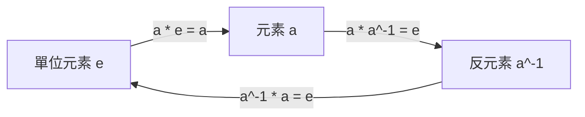
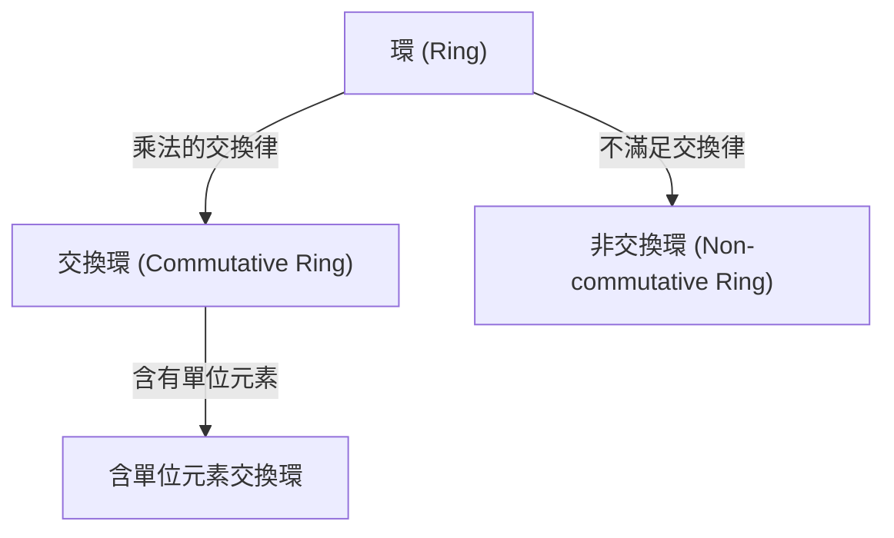
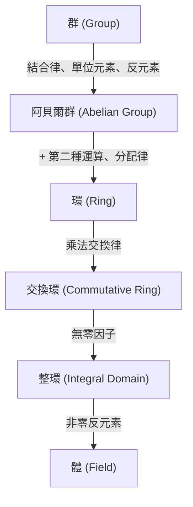

# [[群、環、體](https://kenji.blog/zh-tw/p/groups-rings-and-fields/)：不僅僅是數字，更是抽象「結構」本身的現代代數入門](https://kenji.blog/p/groups-rings-and-fields/)

我們大多數人在學校最先學到的「數學」是數字的加減乘除，也就是「四則運算」的世界。像 $1 + 1 = 2$ 或 $3 \times 4 = 12$ 這樣的計算，對於描述我們日常接觸的現實世界的數量和大小非常有用。

然而，數學家們逐漸不再關注「數字本身」，而是關注「數字所具有的性質和計算規則（運算）所創造的『結構』」。這種「結構的抽象化」正是現代代數（抽象代數）的精髓。

在本文中，我們將為您詳細介紹現代代數基礎中的三個重要概念：「群 (Group)」、「環 (Ring)」和「體 (Field)」，並結合直觀的例子和嚴格的定義。

## 1. 運算與集合：抽象化的第一步

理解現代代數的第一步是理解「集合」和「運算」的概念。

- **集合 (Set)**：滿足某種條件的元素的聚集。例如，所有整數的集合 $\mathbb{Z}$，或所有實數的集合 $\mathbb{R}$。
- **二元運算 (Binary Operation)**：從集合中取出兩個元素，根據特定規則組合它們，並產生同一個集合中的另一個元素的操作。加法 $(+)$ 和乘法 $(\times)$ 就是典型的例子。

在代數中，具體的「數字」是什麼（是整數、實數、矩陣還是函數）並不重要。我們只關注**規則（結構）**：「在這個集合上定義了什麼運算，並且該運算滿足什麼法則」。

---

## 2. 群 (Group)：提取對稱性與可逆性

在代數結構中，最簡單且應用最廣泛的是「群」。群抽象化了「可以進行某種操作並將其還原」的性質（可逆性或對稱性）。

### 2.1. 群的嚴格定義

給定一個非空集合 $G$ 和其上的二元運算 $\cdot$，如果滿足以下三個公理，則組 $(G, \cdot)$ 稱為 **群 (Group)**。

1. **結合律 (Associativity)**：對任意 $a, b, c \in G$，有 $(a \cdot b) \cdot c = a \cdot (b \cdot c)$。
2. **單位元素的存在 (Identity Element)**：存在特殊元素 $e \in G$，使得對任意 $a \in G$，有 $a \cdot e = e \cdot a = a$。
3. **反元素的存在 (Inverse Element)**：對任意 $a \in G$，存在元素 $a^{-1} \in G$，使得 $a \cdot a^{-1} = a^{-1} \cdot a = e$。

如果滿足交換律 $a \cdot b = b \cdot a$，則稱為 **交換群** 或 **阿貝爾群 (Abelian Group)**。

---

## 3. 環 (Ring)：加法與乘法的共存

抽象化「兩種運算共存」的結構就是 **環 (Ring)**。

### 3.1. 環的嚴格定義

給定非空集合 $R$ 和兩種二元運算 $+$（加法）與 $\cdot$（乘法），如果滿足以下公理，則組 $(R, +, \cdot)$ 稱為 **環 (Ring)**。

1. $(R, +)$ 是阿貝爾群。
2. $(R, \cdot)$ 是半群（滿足結合律）。
3. 滿足分配律。

---

## 4. 理想與商環

**理想 (Ideal)** 是環的一個重要概念，可用於構造 **商環**。

---

## 5. 體 (Field)：四則運算自由的世界

在環中不一定能進行「除法」。而「除法（除以非零元素）」也能自由進行的結構就是 **體 (Field)**。

### 5.1. 體的嚴格定義

如果交換環滿足以下條件，則稱為 **體**：
1. 至少有兩個元素（$0 \neq 1$）。
2. 除了 $0$ 以外的所有元素都有乘法反元素。

---

## 6. 模 (Module) 與向量空間 (Vector Space)

- **向量空間**：定義在體上。
- **模**：定義在環上。

---

## 7. 結構的層級

---

## 8. 伽羅瓦理論

群論與體論的優美結合。

---

## 9. 應用與結論

抽象代數是支撐宇宙和資訊社會的強大工具。

探索現代代數是數學思維的純粹形式，它磨練了我們的邏輯直覺，並作為雕刻未知世界的終極武器。群、環和體的理論相當於理解數學宏偉建築的基礎構造。透過品味結構之美並獲得抽象的力量，你對世界的看法將完全改變。我們邀請您踏上不受數字束縛的新的數學冒險。這是一段突破智力極限的無盡旅程的開始。

探索現代代數是數學思維的純粹形式，它磨練了我們的邏輯直覺，並作為雕刻未知世界的終極武器。群、環和體的理論相當於理解數學宏偉建築的基礎構造。透過品味結構之美並獲得抽象的力量，你對世界的看法將完全改變。我們邀請您踏上不受數字束縛的新的數學冒險。這是一段突破智力極限的無盡旅程的開始。

探索現代代數是數學思維的純粹形式，它磨練了我們的邏輯直覺，並作為雕刻未知世界的終極武器。群、環和體的理論相當於理解數學宏偉建築的基礎構造。透過品味結構之美並獲得抽象的力量，你對世界的看法將完全改變。我們邀請您踏上不受數字束縛的新的數學冒險。這是一段突破智力極限的無盡旅程的開始。

探索現代代數是數學思維的純粹形式，它磨練了我們的邏輯直覺，並作為雕刻未知世界的終極武器。群、環和體的理論相當於理解數學宏偉建築的基礎構造。透過品味結構之美並獲得抽象的力量，你對世界的看法將完全改變。我們邀請您踏上不受數字束縛的新的數學冒險。這是一段突破智力極限的無盡旅程的開始。

探索現代代數是數學思維的純粹形式，它磨練了我們的邏輯直覺，並作為雕刻未知世界的終極武器。群、環和體的理論相當於理解數學宏偉建築的基礎構造。透過品味結構之美並獲得抽象的力量，你對世界的看法將完全改變。我們邀請您踏上不受數字束縛的新的數學冒險。這是一段突破智力極限的無盡旅程的開始。

探索現代代數是數學思維的純粹形式，它磨練了我們的邏輯直覺，並作為雕刻未知世界的終極武器。群、環和體的理論相當於理解數學宏偉建築的基礎構造。透過品味結構之美並獲得抽象的力量，你對世界的看法將完全改變。我們邀請您踏上不受數字束縛的新的數學冒險。這是一段突破智力極限的無盡旅程的開始。

探索現代代數是數學思維的純粹形式，它磨練了我們的邏輯直覺，並作為雕刻未知世界的終極武器。群、環和體的理論相當於理解數學宏偉建築的基礎構造。透過品味結構之美並獲得抽象的力量，你對世界的看法將完全改變。我們邀請您踏上不受數字束縛的新的數學冒險。這是一段突破智力極限的無盡旅程的開始。

探索現代代數是數學思維的純粹形式，它磨練了我們的邏輯直覺，並作為雕刻未知世界的終極武器。群、環和體的理論相當於理解數學宏偉建築的基礎構造。透過品味結構之美並獲得抽象的力量，你對世界的看法將完全改變。我們邀請您踏上不受數字束縛的新的數學冒險。這是一段突破智力極限的無盡旅程的開始。

探索現代代數是數學思維的純粹形式，它磨練了我們的邏輯直覺，並作為雕刻未知世界的終極武器。群、環和體的理論相當於理解數學宏偉建築的基礎構造。透過品味結構之美並獲得抽象的力量，你對世界的看法將完全改變。我們邀請您踏上不受數字束縛的新的數學冒險。這是一段突破智力極限的無盡旅程的開始。

探索現代代數是數學思維的純粹形式，它磨練了我們的邏輯直覺，並作為雕刻未知世界的終極武器。群、環和體的理論相當於理解數學宏偉建築的基礎構造。透過品味結構之美並獲得抽象的力量，你對世界的看法將完全改變。我們邀請您踏上不受數字束縛的新的數學冒險。這是一段突破智力極限的無盡旅程的開始。

探索現代代數是數學思維的純粹形式，它磨練了我們的邏輯直覺，並作為雕刻未知世界的終極武器。群、環和體的理論相當於理解數學宏偉建築的基礎構造。透過品味結構之美並獲得抽象的力量，你對世界的看法將完全改變。我們邀請您踏上不受數字束縛的新的數學冒險。這是一段突破智力極限的無盡旅程的開始。

探索現代代數是數學思維的純粹形式，它磨練了我們的邏輯直覺，並作為雕刻未知世界的終極武器。群、環和體的理論相當於理解數學宏偉建築的基礎構造。透過品味結構之美並獲得抽象的力量，你對世界的看法將完全改變。我們邀請您踏上不受數字束縛的新的數學冒險。這是一段突破智力極限的無盡旅程的開始。

探索現代代數是數學思維的純粹形式，它磨練了我們的邏輯直覺，並作為雕刻未知世界的終極武器。群、環和體的理論相當於理解數學宏偉建築的基礎構造。透過品味結構之美並獲得抽象的力量，你對世界的看法將完全改變。我們邀請您踏上不受數字束縛的新的數學冒險。這是一段突破智力極限的無盡旅程的開始。

探索現代代數是數學思維的純粹形式，它磨練了我們的邏輯直覺，並作為雕刻未知世界的終極武器。群、環和體的理論相當於理解數學宏偉建築的基礎構造。透過品味結構之美並獲得抽象的力量，你對世界的看法將完全改變。我們邀請您踏上不受數字束縛的新的數學冒險。這是一段突破智力極限的無盡旅程的開始。

探索現代代數是數學思維的純粹形式，它磨練了我們的邏輯直覺，並作為雕刻未知世界的終極武器。群、環和體的理論相當於理解數學宏偉建築的基礎構造。透過品味結構之美並獲得抽象的力量，你對世界的看法將完全改變。我們邀請您踏上不受數字束縛的新的數學冒險。這是一段突破智力極限的無盡旅程的開始。

探索現代代數是數學思維的純粹形式，它磨練了我們的邏輯直覺，並作為雕刻未知世界的終極武器。群、環和體的理論相當於理解數學宏偉建築的基礎構造。透過品味結構之美並獲得抽象的力量，你對世界的看法將完全改變。我們邀請您踏上不受數字束縛的新的數學冒險。這是一段突破智力極限的無盡旅程的開始。

探索現代代數是數學思維的純粹形式，它磨練了我們的邏輯直覺，並作為雕刻未知世界的終極武器。群、環和體的理論相當於理解數學宏偉建築的基礎構造。透過品味結構之美並獲得抽象的力量，你對世界的看法將完全改變。我們邀請您踏上不受數字束縛的新的數學冒險。這是一段突破智力極限的無盡旅程的開始。
