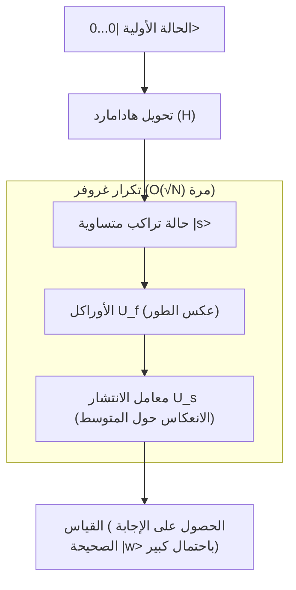

## 1. مقدمة: الحدود الكلاسيكية لمشاكل البحث وصعود الحواسيب الكمومية

في علوم الكمبيوتر الحديثة، يعد "البحث" واحداً من أهم المهام الأساسية. سواء كان ذلك البحث عن معلومات عميل معين من قاعدة بيانات، إيجاد أفضل [مسار](/ar/p/windows-%E3%81%A7%D9%85%D8%B3%D8%A7%D8%B1%E3%81%AE%E9%80%9A%E3%81%A3%E3%81%9F%D9%85%D9%84%D9%81-%D8%AA%D9%86%D9%81%D9%8A%D8%B0%D9%8A%E3%81%AE%E5%A0%B4%E6%89%80%E3%82%92%E8%A6%8B%E3%81%A4%E3%81%91%E3%82%8B%E6%96%B9%E6%B3%95/) عبر شبكة واسعة، أو فك تشفير مفتاح عبر الهجوم بالقوة العمياء، فإن كفاءة [خوارزميات البحث](/ar/p/search-algorithms-linear-binary-hash-table-principles/) ترتبط ارتباطاً مباشراً بأداء جميع الأنظمة.

بشكل خاص، عندما تكون البيانات غير منظمة (غير مرتبة أو خالية من أي نمط)، يُطلق على ذلك "مشكلة البحث في قاعدة البيانات غير المهيكلة". على سبيل المثال، لنفترض وجود N من الصناديق في صف واحد، ويحتوي صندوق واحد فقط على الجائزة. جميع الصناديق تبدو متطابقة من الخارج، ولا يمكنك معرفة ما بداخلها حتى تفتحها. في هذه الحالة، عدد المحاولات المطلوبة للكمبيوتر الكلاسيكي (الكمبيوتر الذي نستخدمه في حياتنا اليومية) للعثور على الجائزة هو N محاولة في أسوأ الحالات، و N/2 في المتوسط. أي أن التعقيد الحسابي (التعقيد الزمني) يتناسب مع عدد البيانات N، ويُعبر عنه بـ $O(N)$.

إذا كان N صغيراً، فلا مشكلة في خوارزمية $O(N)$، ولكن عندما يصبح N رقماً فلكياً مثل الملايين، المليارات، أو حتى $2^{128}$ و $2^{256}$، فلن يتمكن الكمبيوتر الكلاسيكي من إكمال البحث حتى لو استغرق الأمر عمر الكون. هذا هو الحد الفيزيائي والرياضي في البحث غير المهيكل الكلاسيكي.

ومع ذلك، أدى ظهور "الحواسيب الكمومية"، التي تستخدم الخصائص الغريبة لميكانيكا الكم (التراكب، التشابك، والتداخل) كموارد حسابية، إلى إظهار إمكانية تجاوز هذا الحد. في عام 1996، نشر لوف غروفر (Lov Grover)، الذي كان يعمل في مختبرات بيل (Bell Labs)، خوارزمية رائدة يمكنها تنفيذ البحث في قاعدة بيانات غير مهيكلة بتعقيد حسابي قدره $O(\sqrt{N})$. وهذه هي "خوارزمية غروفر" (Grover's Algorithm).

التقليل في التعقيد الحسابي من $O(N)$ إلى $O(\sqrt{N})$ يُسمى "التسريع التربيعي" (Quadratic Speedup). للوهلة الأولى، قد يبدو تأثيره أقل من "التسريع الأسي" (Exponential Speedup) لتحليل العوامل الأولية الذي تقدمه خوارزمية شور ([Shor](/ar/p/shors-algorithm-and-rsa-breaking/)'s Algorithm). ومع ذلك، نظراً لأن البحث غير المهيكل يظهر كمهمة فرعية في كل مشكلة تقريباً، فإن نطاق تطبيق خوارزمية غروفر واسع للغاية، ولها تأثير حاسم على مشاكل التحسين التوافقي، التعلم الآلي، وخاصة أمان تقنيات التشفير الحديثة (التشفير بالمفتاح المتماثل).

في هذا المقال، سنشرح بعمق وبشكل شامل لماذا وكيف تسرع خوارزمية غروفر البحث، بدءاً من أساسياتها الرياضية إلى تنفيذ الدوائر الكمومية، وصولاً إلى تأثيرها على المجتمع.

## 2. أساسيات ميكانيكا الكم: التراكب وسعة الاحتمال

لفهم خوارزمية غروفر، من الضروري أولاً فهم الطريقة الأساسية لتمثيل المعلومات الكمومية. في حين أن أصغر وحدة للمعلومات في الكمبيوتر الكلاسيكي هي "البت" (Bit) التي تتخذ إما حالة "0" أو "1"، فإن أصغر وحدة للمعلومات في الكمبيوتر الكمومي تُسمى "الكيوبت" (Qubit).

أهم ميزة للكيوبت هي خاصية "التراكب" (Superposition)، حيث يمكنه أن يتخذ حالتي "0" و "1" في وقت واحد. من الناحية الرياضية، يتم تمثيل حالة الكيوبت الواحد $|\psi\rangle$ كتركيبة خطية للحالات الأساسية $|0\rangle$ و $|1\rangle$ على النحو التالي:

$$ |\psi\rangle = \alpha|0\rangle + \beta|1\rangle $$

هنا، $\alpha$ و $\beta$ هما عددان مركبان، ويُطلق عليهما "سعة الاحتمال" (Probability Amplitude). عند قياس الكيوبت، يكون احتمال الحصول على الحالة $|0\rangle$ هو $|\alpha|^2$، واحتمال الحصول على الحالة $|1\rangle$ هو $|\beta|^2$. نظراً لأن مجموع الاحتمالات يجب أن يكون 1، يجب أن يتحقق شرط التسوية التالي:

$$ |\alpha|^2 + |\beta|^2 = 1 $$

عند ترتيب n من الكيوبتات، يكون بُعد فضاء الحالة هو $2^n$. على سبيل المثال، يمكن تمثيل حالة 3 كيوبتات كتراكب لـ $2^3 = 8$ حالات أساسية:

$$ |\psi\rangle = \alpha_0|000\rangle + \alpha_1|001\rangle + \dots + \alpha_7|111\rangle $$

تقوم خوارزمية غروفر بتهيئة جميع هذه الحالات الممكنة البالغ عددها $2^n$ (جميع مرشحي البحث) بسعة احتمال متساوية، وتستخدم "التداخل الكمومي" (Quantum Interference) لتضخيم سعة الاحتمال للحالة الصحيحة فقط، مما يسمح بالحصول على الإجابة الصحيحة باحتمالية عالية عند القياس. تُسمى هذه العملية "تضخيم السعة" (Amplitude Amplification).

## 3. صياغة المشكلة: ما هو الأوراكل (Oracle)؟

في خوارزمية غروفر، تُصاغ مشكلة البحث رياضياً على النحو التالي.

لنفترض أن فهرس هدف البحث هو $x \in \{0, 1\}^n$. إجمالي عدد العناصر هو $N = 2^n$. لنفكر في دالة $f(x)$ تعيد القيمة $1$ فقط إذا كان الإدخال $x$ هو الفهرس الصحيح (الهدف)، وتعيد القيمة $0$ في جميع الحالات الأخرى.

- في حالة الهدف: $f(x) = 1$
- في غير حالة الهدف: $f(x) = 0$

هدفنا هو العثور على $x$ (الذي سنطلق عليه $w$) بحيث يكون $f(x) = 1$ عن طريق تقييم الدالة $f(x)$. في الخوارزمية الكلاسيكية، لا يوجد خيار سوى تقييم الدالة $f(x)$ للعديد من قيم $x$ وتكرار العملية حتى نحصل على النتيجة $1$.

في الحوسبة الكمومية، يُطلق على المعامل الصندوق الأسود (Black-box Operator) الذي يُقيم هذه الدالة $f(x)$ اسم "الأوراكل الكمومي" (Quantum Oracle). يطبق الأوراكل $U_f$ التحويل الوحدوي التالي على الحالة الكمومية:

$$ U_f |x\rangle |y\rangle = |x\rangle |y \oplus f(x)\rangle $$

هنا، $|y\rangle$ هو كيوبت مساعد (Ancilla Qubit)، و $\oplus$ تمثل الجمع بنموذج 2 (XOR).

في خوارزمية غروفر، تُستخدم تقنية تسمى "ارتداد الطور" (Phase Kickback) حيث يتم تهيئة الكيوبت المساعد $|y\rangle$ إلى الحالة $|-\rangle = \frac{1}{\sqrt{2}}(|0\rangle - |1\rangle)$ قبل تطبيق الأوراكل. وبفضل ذلك، يتم تبسيط تأثير الأوراكل على النحو التالي:

$$ U_f |x\rangle = (-1)^{f(x)} |x\rangle $$

بمعنى آخر، يقوم الأوراكل $U_f$ بعكس طور (إشارة) الحالة الصحيحة $|w\rangle$ فقط، ويترك أطوار الحالات الأخرى كما هي دون تغيير.

- في حالة الإجابة الصحيحة: $U_f |w\rangle = -|w\rangle$
- في حالة الإجابة الخاطئة: $U_f |x\rangle = |x\rangle \quad (x \neq w)$

عند تمثيله كمصفوفة، يكون $U_f$ مصفوفة قُطرية، حيث تكون العناصر القُطرية المقابلة لفهرس الإجابة الصحيحة هي $-1$ فقط، بينما تكون العناصر الأخرى كلها $1$.

## 4. آلية تكرار غروفر (Grover Iteration)

تتكون خوارزمية غروفر من الخطوات الرئيسية الأربع التالية:

1. **التهيئة (Initialization)**
2. **عكس الطور بواسطة الأوراكل (Oracle Phase Flip)**
3. **الانعكاس حول المتوسط (Inversion About the Mean / Diffusion Operator)**
4. **القياس (Measurement)**

يُطلق على الجمع بين الخطوة 2 والخطوة 3 اسم "تكرار غروفر" (Grover Iteration)، وبتكراره العدد الأمثل من المرات، يتم تعظيم سعة الاحتمال للحالة الصحيحة.



### 4.1 التهيئة

أولاً، يتم تهيئة جميع الكيوبتات البالغ عددها n إلى الحالة $|0\rangle$. بعد ذلك، يتم تطبيق بوابة هادامارد (Hadamard Gate, $H$) على كل كيوبت لإنشاء حالة تراكب متساوية $|s\rangle$ حيث يكون لجميع الحالات سعة احتمال متساوية.

$$ |s\rangle = H^{\otimes n} |0\rangle^{\otimes n} = \frac{1}{\sqrt{N}} \sum_{x=0}^{N-1} |x\rangle $$

في هذه الحالة، يكون احتمال ملاحظة جميع الحالات متساوياً وهو $1/N$. وسعة الاحتمال لجميع الحالات هي $\frac{1}{\sqrt{N}}$.

### 4.2 عكس الطور بواسطة الأوراكل

يتم تطبيق الأوراكل $U_f$ على حالة التراكب المتساوية $|s\rangle$. كما ذُكر سابقاً، تُعكس علامة (طور) سعة الاحتمال للحالة الصحيحة $|w\rangle$ فقط.

$$ U_f |s\rangle = \frac{1}{\sqrt{N}} \sum_{x \neq w} |x\rangle - \frac{1}{\sqrt{N}} |w\rangle $$

بفضل هذه العملية، تُصبح سعة الإجابة الصحيحة سالبة، لكن الاحتمال (مربع القيمة المطلقة للسعة) لا يتغير. لذلك، عند القياس في هذه المرحلة، يظل احتمال العثور على الإجابة الصحيحة $1/N$. وهنا تأتي الحاجة للخطوة التالية.

### 4.3 معامل الانتشار (الانعكاس حول المتوسط)

بعد ذلك، يتم تطبيق معامل الانتشار (Diffusion Operator) $U_s$. يقوم هذا المعامل بعكس سعة الاحتمال لكل حالة بناءً على "القيمة المتوسطة" لسعات الاحتمال لجميع الحالات.

رياضياً، يُعرّف $U_s$ على النحو التالي:

$$ U_s = 2|s\rangle\langle s| - I $$

هنا، $I$ هي مصفوفة الوحدة. دعونا نفهم بشكل بديهي ما يحدث عند تطبيق هذا المعامل.

1. بعد تطبيق الأوراكل، تصبح سعة الإجابة الصحيحة سالبة، بينما تظل سعات الإجابات الخاطئة موجبة.
2. نتيجة لذلك، تصبح "القيمة المتوسطة" لجميع السعات أصغر قليلاً من القيمة الأصلية $\frac{1}{\sqrt{N}}$.
3. سعات الإجابات الخاطئة (الموجبة) أكبر من هذه القيمة المتوسطة الجديدة، لذا عند عكسها بالنسبة للمتوسط، تصبح **أصغر** من قيمتها الأصلية.
4. من ناحية أخرى، تقع سعة الإجابة الصحيحة (السالبة) أسفل بكثير من المتوسط (الموجب)، لذا عند عكسها بالنسبة للمتوسط، فإنها **تخترق الاتجاه الموجب** وتصبح أكبر من القيمة الأصلية.

نتيجة لذلك، تتضاءل سعات الاحتمال للإجابات الخاطئة، وتتضخم سعة الاحتمال للإجابة الصحيحة. يُعرّف زوج الأوراكل ومعامل الانتشار ($U_s U_f$) بأنه تكرار غروفر واحد (Grover Operator, $G$).

$$ G = U_s U_f $$

### 4.4 التفسير الهندسي واشتقاق عدد التكرارات

يمكن تمثيل تكرار غروفر هندسياً بشكل جميل كحركة دورانية على مستوى ثنائي الأبعاد.

نعتبر فضاء الحالة كمستوى ثنائي الأبعاد يتكون من متجهين متعامدين: الحالة الصحيحة $|w\rangle$ وحالة التراكب المتساوي لجميع الحالات الخاطئة $|s'\rangle$.

$$ |s'\rangle = \frac{1}{\sqrt{N-1}} \sum_{x \neq w} |x\rangle $$

يمكن التعبير عن الحالة الأولية $|s\rangle$ كمتجه مائل على هذا المستوى بزاوية $\theta$ من $|s'\rangle$ باتجاه $|w\rangle$.

$$ |s\rangle = \sin\theta |w\rangle + \cos\theta |s'\rangle $$

هنا، $\sin\theta = \frac{1}{\sqrt{N}}$. عندما يكون $N$ كبيراً بما يكفي، يمكن تقريبه إلى $\theta \approx \frac{1}{\sqrt{N}}$.

لقد تم إثبات رياضياً أن تطبيق تكرار غروفر $G$ مرة واحدة يعادل تدوير متجه الحالة على هذا المستوى الثنائي الأبعاد بزاوية $2\theta$ باتجاه $|w\rangle$.

وبالتالي، تصبح الحالة $|\psi_k\rangle$ بعد إجراء $k$ تكرارات على النحو التالي:

$$ |\psi_k\rangle = G^k |s\rangle = \sin((2k+1)\theta) |w\rangle + \cos((2k+1)\theta) |s'\rangle $$

هدفنا هو تقريب متجه الحالة قدر الإمكان إلى الحالة الصحيحة $|w\rangle$، أي جعل $\sin((2k+1)\theta) \approx 1$. وهذا يعني أن الزاوية تصبح $\pi/2$ (90 درجة).

$$ (2k+1)\theta \approx \frac{\pi}{2} $$

بتعويض $\theta \approx \frac{1}{\sqrt{N}}$ وحل المعادلة بالنسبة لـ $k$:

$$ k \approx \frac{\pi}{4}\sqrt{N} $$

هذا هو الأساس الرياضي الذي يجعل التعقيد الحسابي لخوارزمية غروفر $O(\sqrt{N})$. من المثير للاهتمام أنه إذا زادت عدد التكرارات أكثر من اللازم، سيتجاوز المتجه الحالة $|w\rangle$، وسينخفض احتمال الحصول على الإجابة الصحيحة بدلاً من زيادته. لذلك، من الضروري إيقاف التكرار عند العدد الأمثل بالضبط.

## 5. التنفيذ بلغة Python باستخدام Qiskit

دعونا نؤكد عمل الخوارزمية ليس فقط نظرياً، بل من خلال كتابة دائرة كمومية بالفعل. سنستخدم "Qiskit"، وهو إطار عمل مفتوح المصدر للحوسبة الكمومية تقدمه شركة IBM.

لتبسيط الأمر، سنفترض هنا أن $N=4$ ($n=2$ كيوبت). ونعين الإجابة الصحيحة لتكون $w = |11\rangle$ (الفهرس 3). عدد التكرارات المطلوبة هو $\frac{\pi}{4}\sqrt{4} \approx 1.57$، لذا يجب أن يعطي تكرار واحد احتمالاً عالياً بما يكفي.

```python
from qiskit import QuantumCircuit
from qiskit_aer import AerSimulator
from qiskit.visualization import plot_histogram
import matplotlib.pyplot as plt
import numpy as np

# عدد الكيوبتات
n = 2

# تهيئة الدائرة (2 كيوبت + 2 بت كلاسيكي للقياس)
qc = QuantumCircuit(n, n)

# 1. التهيئة: تطبيق بوابة هادامارد
qc.h([0, 1])
qc.barrier()

# 2. الأوراكل: عكس طور |11> (يمكن تحقيقه باستخدام بوابة CZ)
# يتم ضرب -1 في حالة |11> فقط
qc.cz(0, 1)
qc.barrier()

# 3. معامل الانتشار
# H -> X -> CZ -> X -> H
qc.h([0, 1])
qc.x([0, 1])
qc.cz(0, 1)
qc.x([0, 1])
qc.h([0, 1])
qc.barrier()

# 4. القياس
qc.measure([0, 1], [0, 1])

# رسم الدائرة (يمكن عرضه في الجهاز الطرفي أو Jupyter)
print(qc.draw())

# التنفيذ على جهاز المحاكاة
simulator = AerSimulator()
result = simulator.run(qc, shots=1000).result()
counts = result.get_counts()

print("\nنتيجة القياس:", counts)
# مثل {'11': 1000}، سنحصل على الإجابة الصحيحة بنسبة 100%
```

في هذا المثال البسيط، قمنا ببناء الأوراكل ومعامل الانتشار باستخدام مجموعة من البوابات الأساسية (H, X, CZ). عندما يكون $N=4$، نظرياً يمكننا الحصول على الإجابة الصحيحة $|11\rangle$ باحتمال 100% بتكرار واحد. يمكنك استشعار قوة "التوازي" و"التداخل" التي تمتلكها الدوائر الكمومية مباشرة من الكود.

عندما يزداد الحجم، يصبح تصميم الأوراكل وتنفيذ بوابات التحكم المتعددة (مثل Multi-Controlled Toffoli) في معامل الانتشار أكثر تعقيداً، لكن الهيكل الأساسي يظل كما هو بغض النظر عن عدد الكيوبتات التي تتم إضافتها.

## 6. التهديد الذي تشكله خوارزمية غروفر لتقنيات التشفير

خوارزمية غروفر لا تقتصر على كونها لغزاً رياضياً أو بحثاً مجرداً في قواعد البيانات؛ بل إنها تشكل تهديداً ملموساً جداً للأمن السيبراني في العالم الحقيقي. يتأثر بشكل خاص "التشفير بالمفتاح المتماثل" (Symmetric-key cryptography)، الممثل بـ AES (معيار التشفير المتقدم)، و "دوال التجزئة" مثل SHA-256.

### التأثير على التشفير بالمفتاح المتماثل
في أنظمة التشفير مثل AES-128، يبلغ طول المفتاح 128 بتاً، وهناك $2^{128}$ تركيبة ممكنة للمفاتيح. عند تنفيذ هجوم القوة العمياء (Brute-force attack) باستخدام كمبيوتر كلاسيكي، يتطلب الأمر في أسوأ الحالات $2^{128}$ عملية حسابية. وبما أن هذا يتطلب وقتاً يتجاوز عمر الكون، حتى باستخدام أجهزة الكمبيوتر العملاقة الحالية، فإنه يُعتبر "آمناً" من الناحية العملية.

ومع ذلك، إذا استخدم المهاجم حاسوباً كمومياً واسع النطاق يتحمل الأخطاء (FTQC: Fault-Tolerant Quantum Computer) وقام بتطبيق خوارزمية غروفر، متخذاً دالة التشفير كأوراكل، فإن التعقيد الحسابي للبحث عن المفتاح الصحيح سينخفض بشكل كبير إلى $O(\sqrt{2^{128}}) = O(2^{64})$.

$2^{64}$ عملية حسابية هي نطاق يمكن تنفيذه في وقت معقول (من أسابيع إلى شهور) حتى باستخدام مجموعات الحوسبة الكلاسيكية الحديثة. أي أنه مع ظهور الحواسيب الكمومية، لن يعد التشفير ذو المفتاح بطول 128 بتاً آمناً بعد الآن.

### الانتقال إلى التشفير ما بعد الكمومي والتدابير المضادة
الإجراء المضاد لهذا التهديد بسيط جداً من حيث المبدأ: مضاعفة طول المفتاح.

إذا استخدمنا AES-256، فستكون مساحة المفاتيح $2^{256}$. حتى إذا تم تطبيق خوارزمية غروفر، فإن الحسابات المطلوبة ستكون $\sqrt{2^{256}} = 2^{128}$، مما يعني الحفاظ على قوة تعادل AES-128 على أجهزة الكمبيوتر الكلاسيكية.

لذلك، فإن المنظمات الموحدة مثل NIST (المعهد الوطني للمعايير والتقنية بالولايات المتحدة) والوكالات الأمنية في مختلف البلدان، وفي ظل توقعها للتهديد الكمومي المستقبلي، توصي بشدة "باستخدام طول مفتاح 256 بتاً أو أكثر" لتشغيل التشفير بالمفتاح المتماثل. ينطبق الأمر نفسه على دوال التجزئة، حيث تتراجع مقاومة SHA-256 لهجمات التصادم (Collision attacks) وهجمات ما قبل الصورة (Pre-image attacks)، لذلك يجري العمل على الانتقال إلى SHA-384 و SHA-512.

بهذه الطريقة، تُعد خوارزمية غروفر، جنباً إلى جنب مع خوارزمية شور التي تبطل التشفير بالمفتاح العام (مثل RSA و [ECC](/ar/p/elliptic-curve-cryptography-math-cpp/))، نقطة تحول كبرى في تاريخ أمن المعلومات.

## 7. التطبيقات والتطور: مستقبل خوارزمية غروفر

لا تقتصر خوارزمية غروفر على البحث غير المهيكل، بل يجري البحث في تطبيقاتها وامتداداتها في مجالات مختلفة.

- **التطبيق على مسائل NP-Complete مثل مشكلة قابلية الإرضاء (SAT)**: منهجيات تسرّع البحث عن مساحة الحلول في مسائل التحسين التوافقي باستخدام تكرار غروفر. ويجري تطوير طرق هجينة تجمع بين الخوارزميات الكلاسيكية الاستدلالية (Heuristic) والخوارزميات الكمومية.
- **التعلم الآلي الكمومي (QML)**: أبحاث تهدف إلى تسريع عملية التعلم من خلال تطبيق آلية تضخيم السعة في حساب المسافات بين نقاط البيانات وتحسين التجميع (Clustering).
- **المشي الكمومي (Quantum Walk)**: خوارزميات بحث للبيانات ذات الهيكل الأكبر، مثل مشاكل البحث على الرسوم البيانية (Graphs). يمكن اعتبارها تعميماً لخوارزمية غروفر، وتُعتبر واعدة في تطبيقات مثل تحليل الشبكات.

## 8. الخاتمة: القيمة الحقيقية وحدود الحوسبة الكمومية

خوارزمية غروفر هي مثال رئيسي يوضح كيف يمكن للكمبيوتر الكمومي أن يُظهر تفوقاً واضحاً على الكمبيوتر الكلاسيكي. هذا التسريع التربيعي الذي يقلص المهام التي تتطلب $O(N)$ كلاسيكياً إلى $O(\sqrt{N})$، يُظهر تأثيره الهائل مع تضخم حجم البيانات.

من ناحية أخرى، من الضروري أن ندرك أن خوارزمية غروفر ليست عصاً سحرية. هناك إشارات إلى أن التسريع النظري قد لا يتحقق إذا كان بناء الأوراكل بحد ذاته ينطوي على تكلفة حسابية كبيرة، أو إذا كانت هناك اختناقات في قراءة البيانات (تطبيق ذاكرة الوصول العشوائي الكمومية qRAM). علاوة على ذلك، عند الأخذ في الاعتبار النفقات الإضافية لتصحيح الأخطاء الكمومية، هناك حاجة إلى العديد من الاختراقات (Breakthroughs) في كل من الأجهزة والبرامج لتحقيق أداء يتجاوز الأجهزة الكلاسيكية في الواقع.

ومع ذلك، فإن الجمال النظري وتأثير هذه الخوارزمية لا يزالان ثابتين. ببراعتها في التلاعب بالمفهوم غير البديهي "لسعة الاحتمال" وتضخيم الإجابة الصحيحة ببراعة من وسط بحر من الضوضاء، يمكن القول إنها تمثل جوهر الذكاء البشري الذي يوضح كيف يمكننا استغلال قوانين الطبيعة (ميكانيكا الكم) وتطويعها كموارد حسابية.

بالنسبة لمهندسي وباحثي المستقبل، يجب أن يكون الفهم العميق لآلية خوارزمية غروفر سلاحاً قوياً للنجاة في عصر الحوسبة الكمومية القادم. عالم علم المعلومات الكمومية لا يزال في بداياته، وقد لا يكون اليوم الذي تكتشف فيه خوارزميات غير معروفة أخرى بعيداً.
