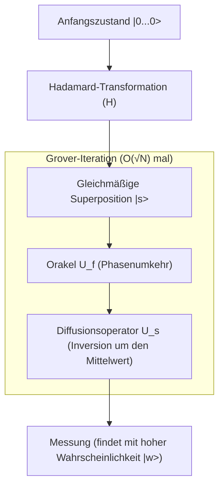

## 1. Einleitung: Klassische Grenzen von Suchproblemen und der Aufstieg von Quantencomputern

In der modernen Informatik ist die "Suche" eine der grundlegendsten und wichtigsten Aufgaben. Ob das Suchen bestimmter Kundeninformationen aus einer Datenbank, das Finden der optimalen Route durch ein riesiges Netzwerk oder das Brute-Force-Knacken eines kryptographischen Schlüssels - die Effizienz von [Suchalgorithmen](/de/p/search-algorithms-linear-binary-hash-table-principles/) ist direkt an die Leistung eines jeden Systems gekoppelt.

Besonders wenn die Daten keine Struktur aufweisen (unsortiert, keine Regelmäßigkeit), nennt man dies das "Suchproblem in einer unstrukturierten Datenbank". Angenommen, es gibt N Schachteln in einer Reihe, und nur in einer davon ist ein Gewinn. Die Schachteln sehen alle gleich aus, und man weiß erst, was drin ist, wenn man sie öffnet. In diesem Fall benötigt ein klassischer Computer (die Art, die wir heute täglich benutzen), im schlimmsten Fall N Versuche und im Durchschnitt N/2 Versuche, um den Gewinn zu finden. Das bedeutet, dass die zeitliche Komplexität (Zeitkomplexität) proportional zur Datenmenge N ist und als $O(N)$ ausgedrückt wird.

Wenn N klein ist, ist ein $O(N)$-Algorithmus kein Problem. Wenn N jedoch astronomische Zahlen wie Millionen, Hunderte von Millionen oder sogar $2^{128}$ und $2^{256}$ erreicht, kann ein klassischer Computer die Suche selbst dann nicht abschließen, wenn er bis zum Ende der Lebensdauer des Universums rechnet. Dies ist die physikalische und mathematische Grenze in der klassischen unstrukturierten Suche.

Mit dem Aufkommen von "Quantencomputern", die die seltsamen Eigenschaften der Quantenmechanik (Superposition, Verschränkung, Interferenz) als Rechenressourcen nutzen, wurde jedoch die Möglichkeit aufgezeigt, diese Grenze zu durchbrechen. Im Jahr 1996 veröffentlichte Lov Grover von den Bell Laboratories einen bahnbrechenden Algorithmus, der eine unstrukturierte Datenbanksuchen mit einer Komplexität von $O(\sqrt{N})$ durchführen kann. Dies ist "Grovers Algorithmus" (Grover's Algorithm).

Die Reduzierung der Komplexität von $O(N)$ auf $O(\sqrt{N})$ wird als "quadratische Beschleunigung" (Quadratic Speedup) bezeichnet. Auf den ersten Blick mag die Auswirkung im Vergleich zur exponentiellen Beschleunigung (Exponential Speedup) bei der Primfaktorzerlegung durch Shors Algorithmus klein erscheinen. Da die unstrukturierte Suche jedoch als Teilaufgabe in fast allen Problemen auftritt, ist der Anwendungsbereich von Grovers Algorithmus extrem breit und hat einen entscheidenden Einfluss auf kombinatorische Optimierungsprobleme, maschinelles Lernen und insbesondere auf die Sicherheit der modernen Kryptographie (Symmetrische Verschlüsselung).

In diesem Artikel werden wir eingehend untersuchen, warum und wie dieser Grover-Algorithmus die Suche beschleunigt, von seinen mathematischen Grundlagen über die Implementierung in Quantenschaltungen bis hin zu seinen Auswirkungen auf die Gesellschaft.

## 2. Grundlagen der Quantenmechanik: Superposition und Wahrscheinlichkeitsamplitude

Um Grovers Algorithmus zu verstehen, muss man zunächst die grundlegenden Methoden der Darstellung von Quanteninformation verstehen. Während die kleinste Informationseinheit in einem klassischen Computer ein "Bit" ist, das entweder den Zustand "0" oder "1" annehmen kann, wird die kleinste Informationseinheit in einem Quantencomputer als "Qubit" (Quantenbit) bezeichnet.

Das wichtigste Merkmal eines Qubits ist die Eigenschaft der "Superposition", bei der es die Zustände "0" und "1" gleichzeitig annehmen kann. Mathematisch wird der Zustand $|\psi\rangle$ eines Qubits als Linearkombination der Basiszustände $|0\rangle$ und $|1\rangle$ wie folgt ausgedrückt:

$$ |\psi\rangle = \alpha|0\rangle + \beta|1\rangle $$

Hier sind $\alpha$ und $\beta$ komplexe Zahlen und werden "Wahrscheinlichkeitsamplituden" (Probability Amplitudes) genannt. Wenn ein Qubit gemessen wird, ist die Wahrscheinlichkeit, den Zustand $|0\rangle$ zu erhalten, $|\alpha|^2$, und die Wahrscheinlichkeit, den Zustand $|1\rangle$ zu erhalten, ist $|\beta|^2$. Da sich die Wahrscheinlichkeiten zu 1 addieren müssen, muss die folgende Normierungsbedingung erfüllt sein:

$$ |\alpha|^2 + |\beta|^2 = 1 $$

Wenn n Qubits nebeneinander liegen, beträgt die Dimension des Zustandsraums $2^n$. Zum Beispiel kann ein 3-Qubit-Zustand als Superposition von $2^3 = 8$ Basiszuständen dargestellt werden.

$$ |\psi\rangle = \alpha_0|000\rangle + \alpha_1|001\rangle + \dots + \alpha_7|111\rangle $$

Grovers Algorithmus hat den Mechanismus, alle $2^n$ möglichen Zustände (alle Kandidaten der Suche) mit gleicher Wahrscheinlichkeitsamplitude zu initialisieren und Quanteninterferenz (Quantum Interference) zu nutzen, um nur die Wahrscheinlichkeitsamplitude des korrekten Zustands zu verstärken, so dass man bei der Messung mit hoher Wahrscheinlichkeit die richtige Antwort erhält. Dieser Prozess wird als "Amplitudenverstärkung" (Amplitude Amplification) bezeichnet.

## 3. Formulierung des Problems: Was ist ein Orakel (Oracle)?

In Grovers Algorithmus wird das Suchproblem mathematisch wie folgt formuliert.

Sei der Index des Suchziels $x \in \{0, 1\}^n$. Die Gesamtzahl der Elemente ist $N = 2^n$. Betrachten wir eine Funktion $f(x)$, die nur dann $1$ zurückgibt, wenn die Eingabe $x$ der Index der richtigen Antwort (das Ziel) ist, andernfalls gibt sie $0$ zurück.

- Bei einem Ziel: $f(x) = 1$
- Wenn nicht das Ziel: $f(x) = 0$

Unser Ziel ist es, durch Auswertung der Funktion $f(x)$ ein $x$ (nennen wir es $w$) zu finden, für das $f(x) = 1$ gilt. Bei klassischen Algorithmen bleibt nichts anderes übrig, als $f(x)$ für verschiedene $x$ auszuwerten (Abfragen) und dies zu wiederholen, bis das Ergebnis $1$ ist.

Im Quantencomputing wird ein Black-Box-Operator, der diese Funktion $f(x)$ auswertet, als "Quanten-Orakel" (Quantum Oracle) bezeichnet. Das Orakel $U_f$ führt die folgende unitäre Transformation auf dem Quantenzustand aus:

$$ U_f |x\rangle |y\rangle = |x\rangle |y \oplus f(x)\rangle $$

Hier ist $|y\rangle$ das Hilfs-Qubit (Ancilla-Bit), und $\oplus$ steht für die Modulo-2-Addition (XOR).

Grovers Algorithmus verwendet eine Technik namens "Phase Kickback" (Phasenrückstoß), bei der das Hilfs-Qubit $|y\rangle$ auf den Zustand $|-\rangle = \frac{1}{\sqrt{2}}(|0\rangle - |1\rangle)$ initialisiert und auf das Orakel angewendet wird. Dies vereinfacht die Wirkung des Orakels wie folgt:

$$ U_f |x\rangle = (-1)^{f(x)} |x\rangle $$

Mit anderen Worten führt das Orakel $U_f$ die Operation durch, nur die Phase (das Vorzeichen) des korrekten Zustands $|w\rangle$ umzukehren und die Phasen der anderen Zustände unverändert zu lassen.

- Bei der richtigen Antwort: $U_f |w\rangle = -|w\rangle$
- Bei der falschen Antwort: $U_f |x\rangle = |x\rangle \quad (x \neq w)$

Als Matrix ausgedrückt, wird $U_f$ zu einer Diagonalmatrix, bei der nur die Diagonalkomponenten, die dem Index der richtigen Antwort entsprechen, $-1$ sind, und alle anderen $1$ sind.

## 4. Mechanismus der Grover-Iteration (Grover Iteration)

Grovers Algorithmus besteht aus den folgenden vier Hauptschritten:

1. **Initialisierung (Initialization)**
2. **Phasenumkehr durch das Orakel (Oracle Phase Flip)**
3. **Inversion um den Mittelwert (Inversion About the Mean / Diffusion Operator)**
4. **Messung (Measurement)**

Die Kombination der Schritte 2 und 3 wird "Grover-Iteration" genannt. Durch die Wiederholung in der optimalen Anzahl maximiert sie die Wahrscheinlichkeitsamplitude des korrekten Zustands.



### 4.1 Initialisierung

Zuerst werden alle n Qubits im Zustand $|0\rangle$ initialisiert. Als nächstes wird ein Hadamard-Gatter (Hadamard Gate, $H$) auf jedes Qubit angewendet, um einen gleichmäßigen Superpositionszustand $|s\rangle$ zu erzeugen, bei dem alle Zustände die gleiche Wahrscheinlichkeitsamplitude haben.

$$ |s\rangle = H^{\otimes n} |0\rangle^{\otimes n} = \frac{1}{\sqrt{N}} \sum_{x=0}^{N-1} |x\rangle $$

In diesem Zustand ist die Wahrscheinlichkeit, einen beliebigen Zustand zu beobachten, mit $1/N$ gleich. Alle Wahrscheinlichkeitsamplituden sind $\frac{1}{\sqrt{N}}$.

### 4.2 Phasenumkehr durch das Orakel

Das Orakel $U_f$ wird auf den gleichmäßigen Superpositionszustand $|s\rangle$ angewendet. Wie bereits erwähnt, wird nur das Vorzeichen (die Phase) der Wahrscheinlichkeitsamplitude des korrekten Zustands $|w\rangle$ umgekehrt.

$$ U_f |s\rangle = \frac{1}{\sqrt{N}} \sum_{x \neq w} |x\rangle - \frac{1}{\sqrt{N}} |w\rangle $$

Durch diese Operation wird nur die Amplitude der richtigen Antwort negativ, aber die Wahrscheinlichkeit (das Quadrat des Betrags der Amplitude) ändert sich nicht. Daher ist die Wahrscheinlichkeit, die richtige Antwort zu diesem Zeitpunkt durch eine Messung zu finden, immer noch $1/N$. Hier ist der nächste Schritt erforderlich.

### 4.3 Diffusionsoperator (Inversion um den Mittelwert)

Als nächstes wird der Diffusionsoperator (Diffusion Operator) $U_s$ angewendet. Dieser Operator führt eine Operation aus, um die Wahrscheinlichkeitsamplitude jedes Zustands basierend auf dem "Mittelwert" der Wahrscheinlichkeitsamplituden aller Zustände zu invertieren.

Mathematisch ist $U_s$ wie folgt definiert:

$$ U_s = 2|s\rangle\langle s| - I $$

Hier ist $I$ die Einheitsmatrix. Versuchen wir intuitiv zu verstehen, was passiert, wenn dieser Operator angewendet wird.

1. Nach Anwendung des Orakels wird die Amplitude der richtigen Antwort negativ, während die Amplituden der falschen Antworten positiv bleiben.
2. Dadurch wird der "Mittelwert" aller Amplituden etwas kleiner als das ursprüngliche $\frac{1}{\sqrt{N}}$.
3. Die Amplituden der falschen Antworten (positiv) sind größer als dieser neue Mittelwert, also werden sie, wenn sie um den Mittelwert invertiert werden, **kleiner** als ihr ursprünglicher Wert.
4. Andererseits liegt die Amplitude der richtigen Antwort (negativ) weit unter dem Mittelwert (positiv), so dass sie, wenn sie um den Mittelwert invertiert wird, **deutlich ins Positive durchschlägt**, größer als ihr ursprünglicher Wert.

Infolgedessen verringert sich die Wahrscheinlichkeitsamplitude für die falschen Antworten, und die Wahrscheinlichkeitsamplitude für die richtige Antwort wird verstärkt. Dieses Paar aus Orakel und Diffusionsoperator ($U_s U_f$) wird als eine Grover-Iteration (Grover Operator, $G$) definiert.

$$ G = U_s U_f $$

### 4.4 Geometrische Interpretation und Ableitung der Anzahl der Iterationen

Die Grover-Iteration kann sehr schön geometrisch als Rotationsbewegung auf einer 2D-Ebene dargestellt werden.

Betrachten wir den Zustandsraum als eine 2D-Ebene, die von zwei orthogonalen Vektoren aufgespannt wird: dem korrekten Zustand $|w\rangle$ und $|s'\rangle$, der gleichmäßigen Superposition aller falschen Zustände.

$$ |s'\rangle = \frac{1}{\sqrt{N-1}} \sum_{x \neq w} |x\rangle $$

Der Anfangszustand $|s\rangle$ kann als Vektor auf dieser Ebene dargestellt werden, der um den Winkel $\theta$ von $|s'\rangle$ in Richtung $|w\rangle$ geneigt ist.

$$ |s\rangle = \sin\theta |w\rangle + \cos\theta |s'\rangle $$

Hier ist $\sin\theta = \frac{1}{\sqrt{N}}$. Wenn $N$ ausreichend groß ist, kann dies als $\theta \approx \frac{1}{\sqrt{N}}$ genähert werden.

Es ist mathematisch bewiesen, dass eine einmalige Anwendung der Grover-Iteration $G$ einer Rotation des Zustandsvektors auf dieser 2D-Ebene um einen Winkel $2\theta$ in Richtung $|w\rangle$ entspricht.

Daher sieht der Zustand $|\psi_k\rangle$ nach $k$ Iterationen wie folgt aus:

$$ |\psi_k\rangle = G^k |s\rangle = \sin((2k+1)\theta) |w\rangle + \cos((2k+1)\theta) |s'\rangle $$

Unser Ziel ist es, den Zustandsvektor so nah wie möglich an den korrekten Zustand $|w\rangle$ zu bringen, d.h. $\sin((2k+1)\theta) \approx 1$. Dies bedeutet, dass der Winkel $\pi/2$ (90 Grad) beträgt.

$$ (2k+1)\theta \approx \frac{\pi}{2} $$

Wenn man $\theta \approx \frac{1}{\sqrt{N}}$ einsetzt und nach $k$ auflöst, erhält man:

$$ k \approx \frac{\pi}{4}\sqrt{N} $$

Dies ist die mathematische Grundlage dafür, dass die Rechenkomplexität von Grovers Algorithmus $O(\sqrt{N})$ ist. Interessanterweise dreht sich der Vektor, wenn man die Anzahl der Iterationen zu stark erhöht, an $|w\rangle$ vorbei, und die Wahrscheinlichkeit, die richtige Antwort zu erhalten, sinkt wieder. Daher müssen die Iterationen genau nach der optimalen Anzahl gestoppt werden.

## 5. Implementierung in Python mit Qiskit

Lassen Sie uns nicht nur die Theorie betrachten, sondern tatsächlich eine Quantenschaltung schreiben, um das Verhalten des Algorithmus zu sehen. Wir verwenden "Qiskit", ein Open-Source-Framework für Quantencomputer von IBM.

Der Einfachheit halber betrachten wir den Fall $N=4$ ($n=2$ Qubits). Wir setzen die richtige Antwort auf $w = |11\rangle$ (Index 3). Die erforderliche Anzahl von Iterationen ist $\frac{\pi}{4}\sqrt{4} \approx 1.57$, also sollte 1 Iteration ausreichen, um eine ausreichend hohe Wahrscheinlichkeit zu erhalten.

```python
from qiskit import QuantumCircuit
from qiskit_aer import AerSimulator
from qiskit.visualization import plot_histogram
import matplotlib.pyplot as plt
import numpy as np

# Anzahl der Qubits
n = 2

# Initialisierung der Schaltung (2 Qubits + 2 klassische Bits für die Messung)
qc = QuantumCircuit(n, n)

# 1. Initialisierung: Anwendung von Hadamard-Gattern
qc.h([0, 1])
qc.barrier()

# 2. Orakel: Phase von |11> umkehren (erreichbar mit CZ-Gatter)
# Multipliziere mit -1 nur für |11>
qc.cz(0, 1)
qc.barrier()

# 3. Diffusionsoperator
# H -> X -> CZ -> X -> H
qc.h([0, 1])
qc.x([0, 1])
qc.cz(0, 1)
qc.x([0, 1])
qc.h([0, 1])
qc.barrier()

# 4. Messung
qc.measure([0, 1], [0, 1])

# Darstellung der Schaltung (im Terminal oder in Jupyter möglich)
print(qc.draw())

# Ausführung auf dem Simulator
simulator = AerSimulator()
result = simulator.run(qc, shots=1000).result()
counts = result.get_counts()

print("\nMessresultat:", counts)
# Wie bei {'11': 1000}, erhält man mit 100% Wahrscheinlichkeit die richtige Antwort
```

In diesem einfachen Beispiel haben wir das Orakel und den Diffusionsoperator mit Kombinationen von Basisgattern (H, X, CZ) aufgebaut. Bei $N=4$ wird die richtige Antwort $|11\rangle$ nach nur einer Iteration theoretisch mit 100%iger Wahrscheinlichkeit erhalten. Man kann die Kraft der "Parallelität" und "Interferenz", die Quantenschaltungen besitzen, direkt aus dem Code spüren.

Mit zunehmender Skalierung wird das Design des Orakels und die Implementierung von multikontrollierten Gattern für den Diffusionsoperator (wie Multi-Controlled Toffoli) komplexer, aber die grundlegende Struktur bleibt dieselbe, unabhängig davon, wie viele Qubits hinzugefügt werden.

## 6. Die Bedrohung der Kryptographie durch Grovers Algorithmus

Grovers Algorithmus ist nicht nur ein mathematisches Puzzle oder eine abstrakte Datenbanksuchmaschine, sondern stellt eine sehr konkrete Bedrohung für die Cybersicherheit in der realen Welt dar. Besonders betroffen sind die "symmetrische Kryptographie" (Symmetric-key cryptography), vertreten durch AES (Advanced Encryption Standard), und "Hash-Funktionen" wie SHA-256.

### Auswirkungen auf die Symmetrische Kryptographie

Bei Verschlüsselungsmethoden wie AES-128 beträgt die Schlüssellänge 128 Bit, was $2^{128}$ mögliche Schlüsselkombinationen bedeutet. Bei einem Brute-Force-Angriff mit einem klassischen Computer sind im schlimmsten Fall $2^{128}$ Berechnungen erforderlich. Dies würde selbst mit modernen Supercomputern länger als das Alter des Universums dauern, weshalb es in der Praxis als "sicher" gilt.

Wenn jedoch ein Angreifer einen groß angelegten, fehlertoleranten Quantencomputer (FTQC) verwendet und Grovers Algorithmus anwendet, wobei er die kryptographische Funktion als Orakel behandelt, wird die Berechnung zum Finden des korrekten Schlüssels drastisch auf $O(\sqrt{2^{128}}) = O(2^{64})$ reduziert.

$2^{64}$ Operationen sind in einer realistischen Zeit (Wochen bis Monate) selbst auf heutigen klassischen Computerclustern durchführbar. Das bedeutet, dass mit dem Aufkommen von Quantencomputern Chiffren mit einem 128-Bit-Schlüssel nicht mehr als sicher angesehen werden können.

### Übergang zur Post-Quanten-Kryptographie (PQC) und Gegenmaßnahmen

Die Gegenmaßnahme gegen diese Bedrohung ist im Prinzip sehr einfach: Man verdoppelt einfach die Schlüssellänge.

Wenn man AES-256 verwendet, ist der Schlüsselraum $2^{256}$. Selbst mit Grovers Algorithmus wäre die erforderliche Komplexität $\sqrt{2^{256}} = 2^{128}$, was bedeutet, dass die gleiche Stärke wie bei AES-128 auf einem klassischen Computer erhalten bleibt.

Daher empfehlen Standardisierungsorganisationen wie das NIST (National Institute of Standards and Technology) in den USA und Sicherheitsbehörden verschiedener Länder angesichts der zukünftigen Quantenbedrohung nachdrücklich die "Verwendung von Schlüssellängen von 256 Bit oder mehr" für den Betrieb symmetrischer Kryptographie. Ähnliches gilt für Hash-Funktionen: Da der Widerstand gegen Kollisions- und Preimage-Angriffe für SHA-256 abnimmt, ist ein Übergang zu SHA-384 und SHA-512 im Gange.

Somit ist Grovers Algorithmus neben Shors Algorithmus, der asymmetrische Kryptographie (RSA und [ECC](/de/p/elliptic-curve-cryptography-math-cpp/)) schwächt, ein Algorithmus, der einen wichtigen Wendepunkt in der Geschichte der Informationssicherheit markiert.

## 7. Anwendungen und Entwicklung: Die Zukunft von Grovers Algorithmus

Grovers Algorithmus ist nicht auf die unstrukturierte Suche beschränkt; seine Anwendungen und Erweiterungen in verschiedenen Bereichen werden intensiv erforscht.

- **Anwendung auf NP-vollständige Probleme wie das Erfüllbarkeitsproblem (SAT)**: Bei der Erkundung des Lösungsraums von kombinatorischen Optimierungsproblemen ist dies ein Ansatz, um die Suche mithilfe von Grover-Iterationen zu beschleunigen. Es werden hybride Methoden entwickelt, die heuristische klassische Algorithmen und Quantenalgorithmen kombinieren.
- **Quanten-Maschinelles Lernen (QML)**: Forschung zur Beschleunigung von Lernprozessen durch Anwendung von Amplitudenverstärkungsmechanismen bei der Entfernungsberechnung zwischen Datenpunkten oder der Optimierung von Clustering.
- **Quanten-Spaziergang (Quantum Walk)**: [Suchalgorithmen](/de/p/search-algorithms-linear-binary-hash-table-principles/) für stärker strukturierte Daten, wie z.B. Suchprobleme auf Graphen. Sie können als Verallgemeinerung von Grovers Algorithmus angesehen werden und sind vielversprechend für die Netzwerkanalyse.

## 8. Fazit: Der wahre Wert und die Grenzen des Quantencomputings

Grovers Algorithmus ist ein Paradebeispiel dafür, wie Quantencomputer einen klaren Vorteil gegenüber klassischen Computern zeigen können. Die quadratische Beschleunigung, die eine klassisch mit $O(N)$ verbundene Aufgabe auf $O(\sqrt{N})$ reduziert, entfaltet eine enorme Wirkung, wenn die Datenmengen gigantisch werden.

Andererseits muss man auch verstehen, dass Grovers Algorithmus kein magischer Zauberstab ist. Es wurde darauf hingewiesen, dass die theoretische Beschleunigung möglicherweise nicht erreicht wird, wenn die Konstruktion des Orakels selbst hohe Rechenkosten verursacht oder wenn es einen Engpass beim Lesen von Daten gibt (Implementierung von Quanten-RAM, qRAM). Berücksichtigt man zudem den Overhead der Quantenfehlerkorrektur (Quantum Error Correction), sind noch viele Durchbrüche in Hardware und Software nötig, um die Leistung klassischer Computer tatsächlich zu übertreffen.

Doch die theoretische Schönheit und die enormen Auswirkungen bleiben unbestreitbar. Dieser Algorithmus, der das kontraintuitive Konzept der Wahrscheinlichkeitsamplitude geschickt manipuliert, um nur die richtige Antwort brillant aus einem Meer von Rauschen zu verstärken, kann als ein Meisterwerk der menschlichen Intelligenz bezeichnet werden, das zeigt, wie die Menschheit die Gesetze der Natur (Quantenmechanik) als Rechenressource zähmen kann.

Für zukünftige Ingenieure und Forscher sollte ein tiefes Verständnis des Mechanismus von Grovers Algorithmus eine mächtige Waffe sein, um im kommenden Zeitalter des Quantencomputings zu bestehen. Die Welt der Quanteninformationswissenschaft hat gerade erst begonnen, und der Tag, an dem weitere, noch unbekannte Algorithmen entdeckt werden, ist vielleicht gar nicht mehr so fern.
