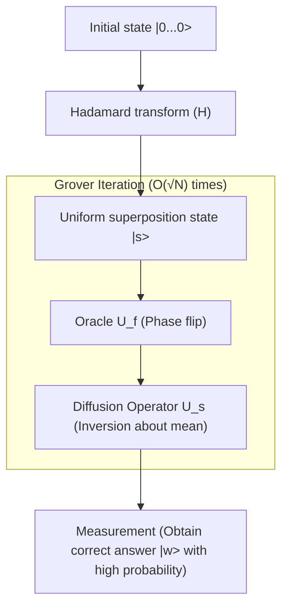

## 1. Introduction: The Classical Limits of Search Problems and the Rise of Quantum Computers

In modern computer science, "search" is one of the most fundamental and important tasks. Whether it's finding specific customer information from a database, finding the optimal route through a vast network, or brute-forcing cryptographic keys, the efficiency of [search algorithms](/en/p/search-algorithms-linear-binary-hash-table-principles/) directly ties to the performance of any system.

In particular, when data lacks any structure (unsorted, no regularity), this is called an "unstructured database search problem." For example, suppose there are N boxes lined up, and only one of them contains a prize. All boxes look identical on the outside, and you won't know the contents until you open them. In this case, the number of attempts a classical computer (the computers we use everyday) needs to find the prize is N times in the worst case, and N/2 times on average. In other words, the computational complexity (time complexity) is proportional to the number of data items N, expressed as $O(N)$.

If N is small, an $O(N)$ algorithm is fine, but when N becomes an astronomical number like millions, hundreds of millions, or even $2^{128}$ or $2^{256}$, a classical computer would not be able to complete the search even if it spent the entire lifespan of the universe. This is the physical and mathematical limit in classical unstructured search.

However, the advent of "quantum computers," which utilize the bizarre properties of quantum mechanics (superposition, entanglement, interference) as computational resources, showed the potential to break through this limit. In 1996, Lov Grover, who belonged to Bell Labs, published a groundbreaking algorithm that could perform unstructured database searches with a complexity of $O(\sqrt{N})$. This is "Grover's Algorithm".

The reduction in complexity from $O(N)$ to $O(\sqrt{N})$ is called "Quadratic Speedup." At first glance, the impact might seem small compared to the exponential speedup of prime factorization by Shor's Algorithm. However, because unstructured search appears as a subtask in virtually all problems, the application range of Grover's algorithm is extremely broad, and it has a decisive impact on combinatorial optimization problems, machine learning, and especially the security of modern cryptographic techniques (symmetric-key cryptography).

In this article, we will delve thoroughly into why and how this Grover's algorithm accelerates search, from its mathematical foundations to quantum circuit implementation, and even its impact on society.

## 2. Fundamentals of Quantum Mechanics: Superposition and Probability Amplitude

To understand Grover's algorithm, we must first understand the basic representation of quantum information. While the smallest unit of information in classical computers is the "Bit," which takes a state of either "0" or "1", the smallest unit of information in quantum computers is called a "Qubit" (Quantum bit).

The greatest feature of a qubit is that it has the property of "Superposition," allowing it to take the states of "0" and "1" simultaneously. Mathematically, the state of one qubit $|\psi\rangle$ is represented as a linear combination of the basis states $|0\rangle$ and $|1\rangle$ as follows:

$$ |\psi\rangle = \alpha|0\rangle + \beta|1\rangle $$

Here, $\alpha$ and $\beta$ are complex numbers, and are called "Probability Amplitudes." When the qubit is observed, the probability of obtaining state $|0\rangle$ is $|\alpha|^2$, and the probability of obtaining state $|1\rangle$ is $|\beta|^2$. Since the probabilities must sum to 1, the following normalization condition must be satisfied:

$$ |\alpha|^2 + |\beta|^2 = 1 $$

When n qubits are lined up, the dimension of the state space becomes $2^n$. For example, a 3-qubit state can be represented as a superposition of $2^3 = 8$ basis states:

$$ |\psi\rangle = \alpha_0|000\rangle + \alpha_1|001\rangle + \dots + \alpha_7|111\rangle $$

Grover's algorithm initializes all these $2^n$ possible states (all candidates to be searched) with equal probability amplitudes, and uses Quantum Interference to amplify only the probability amplitude of the correct state, possessing a mechanism to obtain the correct answer with a high probability upon observation. This process is called "Amplitude Amplification".

## 3. Problem Formulation: What is an Oracle?

In Grover's algorithm, the search problem is mathematically formulated as follows.

Let the index of the search target be $x \in \{0, 1\}^n$. The total number of elements is $N = 2^n$. Consider a function $f(x)$, and assume this function returns $1$ only when the input $x$ is the correct index (target), and returns $0$ otherwise.

- If target: $f(x) = 1$
- If not target: $f(x) = 0$

Our goal is to find an $x$ (let this be $w$) such that $f(x) = 1$ by evaluating the function $f(x)$. In classical algorithms, there is no choice but to evaluate (query) $f(x)$ for various $x$ and repeat attempts until the result is $1$.

In quantum computation, a black-box-like operator that evaluates this function $f(x)$ is called a "Quantum Oracle." The oracle $U_f$ applies the following unitary transformation to a quantum state:

$$ U_f |x\rangle |y\rangle = |x\rangle |y \oplus f(x)\rangle $$

Here, $|y\rangle$ is an auxiliary qubit (ancilla bit), and $\oplus$ represents modulo 2 addition (XOR).

Grover's algorithm uses a technique (Phase Kickback) where the auxiliary qubit $|y\rangle$ is initialized to the state $|-\rangle = \frac{1}{\sqrt{2}}(|0\rangle - |1\rangle)$ and applied to the oracle. This simplifies the action of the oracle as follows:

$$ U_f |x\rangle = (-1)^{f(x)} |x\rangle $$

In other words, the oracle $U_f$ performs an operation that inverts only the phase (sign) of the correct state $|w\rangle$, while leaving the phases of all other states as they are.

- If correct: $U_f |w\rangle = -|w\rangle$
- If incorrect: $U_f |x\rangle = |x\rangle \quad (x \neq w)$

Expressed as a matrix, $U_f$ becomes a diagonal matrix where only the diagonal element corresponding to the correct index is $-1$, and all others are $1$.

## 4. The Mechanism of Grover Iteration

Grover's algorithm consists of the following 4 main steps:

1. **Initialization**
2. **Oracle Phase Flip**
3. **Inversion About the Mean / Diffusion Operator**
4. **Measurement**

The combination of Step 2 and Step 3 is called the "Grover Iteration", and by repeating this the optimal number of times, the probability amplitude of the correct state is maximized.



### 4.1 Initialization

First, initialize all n qubits to the $|0\rangle$ state. Next, apply a Hadamard Gate ($H$) to each qubit to create a uniform superposition state $|s\rangle$ where all states have equal probability amplitudes.

$$ |s\rangle = H^{\otimes n} |0\rangle^{\otimes n} = \frac{1}{\sqrt{N}} \sum_{x=0}^{N-1} |x\rangle $$

In this state, the probability of observing any state is equal at $1/N$. The probability amplitudes are all $\frac{1}{\sqrt{N}}$.

### 4.2 Oracle Phase Flip

Apply the oracle $U_f$ to the uniform superposition state $|s\rangle$. As mentioned earlier, only the sign (phase) of the probability amplitude of the correct state $|w\rangle$ is inverted.

$$ U_f |s\rangle = \frac{1}{\sqrt{N}} \sum_{x \neq w} |x\rangle - \frac{1}{\sqrt{N}} |w\rangle $$

By this operation, only the amplitude of the correct answer becomes negative, but the probability (the square of the absolute value of the amplitude) has not changed. Therefore, a measurement at this point still yields a $1/N$ probability of finding the correct answer. Here is where the next step is required.

### 4.3 Diffusion Operator (Inversion About the Mean)

Next, apply the Diffusion Operator $U_s$. This operator performs an operation that inverts the probability amplitude of each state with respect to the "mean value" of the probability amplitudes of all states.

Mathematically, $U_s$ is defined as follows:

$$ U_s = 2|s\rangle\langle s| - I $$

Here, $I$ is the identity matrix. Let's intuitively understand what happens when this operator is applied.

1. After the oracle is applied, the amplitude of the correct answer is negative, and the amplitudes of incorrect answers remain positive.
2. Because of this, the "mean value" of all amplitudes becomes slightly smaller than the original $\frac{1}{\sqrt{N}}$.
3. The amplitudes of incorrect answers (positive) are larger than this new mean value, so when inverted across the mean, they become **smaller** than their original values.
4. On the other hand, the amplitude of the correct answer (negative) is far below the mean value (positive), so when inverted across the mean, it swings much higher and **breaks through in the positive direction**.

As a result, the probability amplitudes of the incorrect answers decrease, and the probability amplitude of the correct answer is amplified. This pair of the oracle and diffusion operator ($U_s U_f$) is defined as 1 Grover Iteration (Grover Operator, $G$).

$$ G = U_s U_f $$

### 4.4 Geometric Interpretation and Derivation of Iteration Count

Grover's iteration can be very beautifully and geometrically represented as a rotational motion on a 2D plane.

Consider the state space as a 2D plane spanned by two orthogonal vectors: the correct state $|w\rangle$, and $|s'\rangle$, which is a uniform superposition of all incorrect states.

$$ |s'\rangle = \frac{1}{\sqrt{N-1}} \sum_{x \neq w} |x\rangle $$

The initial state $|s\rangle$ can be represented on this plane as a vector tilted from $|s'\rangle$ towards $|w\rangle$ by an angle $\theta$.

$$ |s\rangle = \sin\theta |w\rangle + \cos\theta |s'\rangle $$

Here, $\sin\theta = \frac{1}{\sqrt{N}}$. If $N$ is sufficiently large, we can approximate $\theta \approx \frac{1}{\sqrt{N}}$.

It has been mathematically proven that applying the Grover iteration $G$ once is equivalent to rotating the state vector on this 2D plane towards $|w\rangle$ by an angle of $2\theta$.

Therefore, the state $|\psi_k\rangle$ after $k$ iterations is as follows:

$$ |\psi_k\rangle = G^k |s\rangle = \sin((2k+1)\theta) |w\rangle + \cos((2k+1)\theta) |s'\rangle $$

Our goal is to bring the state vector as close to the correct state $|w\rangle$ as possible, that is, to make $\sin((2k+1)\theta) \approx 1$. This means the angle becomes $\pi/2$ (90 degrees).

$$ (2k+1)\theta \approx \frac{\pi}{2} $$

Substituting $\theta \approx \frac{1}{\sqrt{N}}$ and solving for $k$:

$$ k \approx \frac{\pi}{4}\sqrt{N} $$

This is the mathematical basis for why the computational complexity of Grover's algorithm is $O(\sqrt{N})$. Interestingly, if you increase the number of iterations too much, the vector will pass $|w\rangle$, and the probability of getting the correct answer will actually decrease. Therefore, you need to stop iterating at exactly the optimal number of times.

## 5. Implementation in Python Using Qiskit

Let's not just stick to theory, but actually write a quantum circuit and see how the algorithm works. We will use "Qiskit", an open-source quantum computing framework provided by IBM.

Here, for simplicity, we consider the case where $N=4$ ($n=2$ qubits). We set the correct answer to $w = |11\rangle$ (index 3). The required number of iterations is $\frac{\pi}{4}\sqrt{4} \approx 1.57$, so one iteration should yield a sufficiently high probability.

```python
from qiskit import QuantumCircuit
from qiskit_aer import AerSimulator
from qiskit.visualization import plot_histogram
import matplotlib.pyplot as plt
import numpy as np

# Number of qubits
n = 2

# Circuit initialization (2 qubits + 2 classical bits for measurement)
qc = QuantumCircuit(n, n)

# 1. Initialization: Apply Hadamard gates
qc.h([0, 1])
qc.barrier()

# 2. Oracle: Invert the phase of |11> (Can be realized with a CZ gate)
# Multiply by -1 only in the case of |11>
qc.cz(0, 1)
qc.barrier()

# 3. Diffusion operator
# H -> X -> CZ -> X -> H
qc.h([0, 1])
qc.x([0, 1])
qc.cz(0, 1)
qc.x([0, 1])
qc.h([0, 1])
qc.barrier()

# 4. Measurement
qc.measure([0, 1], [0, 1])

# Draw the circuit (can be viewed in terminal or Jupyter)
print(qc.draw())

# Execution on simulator
simulator = AerSimulator()
result = simulator.run(qc, shots=1000).result()
counts = result.get_counts()

print("\nMeasurement results:", counts)
# A correct answer is obtained with 100% probability, e.g., {'11': 1000}
```

In this simple example, we constructed the oracle and diffusion operator with a combination of basic gates (H, X, CZ). For $N=4$, theoretically, a single iteration yields the correct $|11\rangle$ with 100% probability. You can directly feel the power of "parallelism" and "interference" possessed by quantum circuits from the code.

As the scale grows, designing the oracle and implementing the diffusion operator's multi-controlled gates (like Multi-Controlled Toffoli) becomes more complex, but the basic structure remains the same no matter how much the number of qubits increases.

## 6. The Threat Grover's Algorithm Poses to Cryptography

Grover's algorithm goes beyond mere mathematical puzzles or abstract database searches, posing highly concrete threats to real-world cybersecurity. Particularly affected are "Symmetric-key cryptography" represented by AES (Advanced Encryption Standard), and "Hash functions" such as SHA-256.

### Impact on Symmetric-Key Cryptography
In encryption schemes like AES-128, the key length is 128 bits, and there are $2^{128}$ possible key combinations. When conducting a brute-force attack with a classical computer, it requires at worst $2^{128}$ computations. This would take much longer than the age of the universe even using current supercomputers, making it considered "secure" for practical use.

However, if an attacker uses a large-scale Fault-Tolerant Quantum Computer (FTQC) and applies Grover's algorithm, treating the cryptographic function as an oracle, the computational complexity to search for the correct key is drastically reduced to $O(\sqrt{2^{128}}) = O(2^{64})$.

$2^{64}$ operations is on a scale that is executable in a realistic amount of time (weeks to months) even by modern classical computer clusters. In other words, with the emergence of quantum computers, cryptography with a 128-bit key length can no longer be said to be secure.

### Transition and Countermeasures for Post-Quantum Cryptography
The countermeasure to this threat is, in principle, very simple: double the key length.

If AES-256 is used, the key space becomes $2^{256}$. Even if Grover's algorithm is applied, the required computational complexity becomes $\sqrt{2^{256}} = 2^{128}$, which means it retains strength equivalent to AES-128 on classical computers.

For this reason, standardizing organizations such as NIST (National Institute of Standards and Technology) and security agencies around the world strongly recommend "using a key length of 256 bits or more" in the operation of symmetric-key cryptography, anticipating future quantum threats. The same applies to hash functions; as resistance to collision attacks and preimage attacks against SHA-256 decreases, the transition to SHA-384 and SHA-512 is underway.

In this way, Grover's algorithm, along with Shor's algorithm which neutralizes public-key cryptography (RSA and [ECC](/en/p/elliptic-curve-cryptography-math-cpp/)), is an algorithm that marks a significant turning point in the history of information security.

## 7. Applications and Evolution: The Future of Grover's Algorithm

Grover's algorithm is not limited to unstructured searches; its applications and extensions to various fields are being researched.

- **Application to NP-complete problems such as the Boolean Satisfiability Problem (SAT)**: Approaches that utilize Grover iterations to accelerate searches in the solution space of combinatorial optimization problems. Development of hybrid methods combining heuristic classical algorithms with quantum algorithms is progressing.
- **Quantum Machine Learning (QML)**: Research aiming to accelerate the learning process by applying amplitude amplification mechanisms to distance calculations between data points and clustering optimization.
- **Quantum Walk**: [Search algorithms](/en/p/search-algorithms-linear-binary-hash-table-principles/) for data with more structure, such as search problems on graphs. It can be seen as a generalization of Grover's algorithm and is viewed as promising for network analysis, etc.

## 8. Conclusion: The True Value and Limits of Quantum Computing

Grover's algorithm is a prime example demonstrating that quantum computers can show a clear superiority over classical computers. The quadratic speedup, which shortens a task requiring $O(N)$ classically to $O(\sqrt{N})$, exerts an immense effect as the data volume becomes massive.

On the other hand, it is also necessary to understand that Grover's algorithm is not a magic wand. It has been pointed out that if constructing the oracle itself incurs large computational costs, or if there is a bottleneck in data loading (implementing Quantum RAM, qRAM), the theoretical speedup may not be obtained. Additionally, considering the overhead of quantum error correction, many hardware and software breakthroughs are still needed to actually surpass the performance of classical computers.

However, its theoretical beauty and the magnitude of its impact are unshakable. This algorithm, which skillfully manipulates the unintuitive concept of probability amplitudes to vividly amplify only the correct answer from a sea of noise, can be said to be a crystallization of human intellect showing how humans can tame the laws of nature (quantum mechanics) as computational resources.

For future engineers and researchers, deeply understanding the mechanics of Grover's algorithm will undoubtedly become a powerful weapon for surviving the coming era of quantum computing. The world of quantum information science has only just begun, and the day when further unknown algorithms are discovered may not be too far off.
