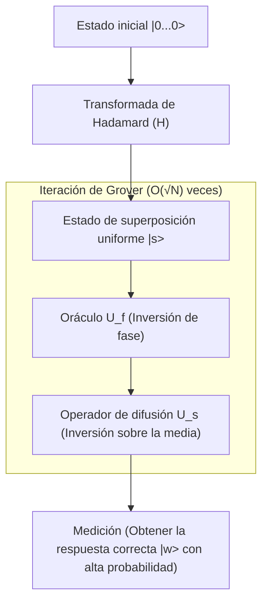

## 1. Introducción: Los límites clásicos de los problemas de búsqueda y el auge de la computación cuántica

En la informática moderna, la "búsqueda" es una de las tareas más básicas e importantes. Ya sea encontrar información de un cliente específico en una base de datos, encontrar la ruta óptima en una vasta red o descifrar una clave criptográfica por fuerza bruta, la eficiencia de los [algoritmos de búsqueda](/es/p/search-algorithms-linear-binary-hash-table-principles/) está directamente relacionada con el rendimiento de cualquier sistema.

Particularmente, cuando los datos no tienen estructura (no están ordenados, no hay regularidad), se denomina el "problema de búsqueda en bases de datos no estructuradas". Por ejemplo, supongamos que hay N cajas alineadas, y solo una de ellas contiene el premio. Todas las cajas se ven idénticas por fuera, y no puedes saber el contenido hasta que las abras. En este caso, el número de intentos que un ordenador clásico (los ordenadores que usamos cotidianamente hoy) necesita para encontrar el premio es, en el peor de los casos, N veces, y en promedio N/2 veces. Es decir, la complejidad computacional (complejidad temporal) es proporcional a la cantidad de datos N, denotada como $O(N)$.

Si N es pequeño, un algoritmo $O(N)$ no es un problema, pero cuando N se convierte en un número astronómico como millones, miles de millones, o incluso $2^{128}$ o $2^{256}$, un ordenador clásico no podría completar la búsqueda ni aunque gastase el tiempo equivalente a la vida del universo. Este es el límite físico y matemático de la búsqueda clásica no estructurada.

Sin embargo, con la llegada de los "ordenadores cuánticos", que utilizan las extrañas propiedades de la mecánica cuántica (superposición, entrelazamiento e interferencia) como recursos computacionales, se demostró la posibilidad de superar este límite. En 1996, Lov Grover, que trabajaba en los Laboratorios Bell, publicó un algoritmo innovador que puede ejecutar la búsqueda en bases de datos no estructuradas con una complejidad de $O(\sqrt{N})$. Este es el "Algoritmo de Grover" (Grover's Algorithm).

La reducción de la complejidad computacional de $O(N)$ a $O(\sqrt{N})$ se denomina "Aceleración Cuadrática" (Quadratic Speedup). A primera vista, el impacto puede parecer pequeño en comparación con la aceleración exponencial (Exponential Speedup) de la factorización de números primos mediante el algoritmo de Shor (Shor's Algorithm). Sin embargo, dado que las búsquedas no estructuradas aparecen como subtareas en toda clase de problemas, el rango de aplicaciones del algoritmo de Grover es extremadamente amplio, y tiene un impacto decisivo en problemas de optimización combinatoria, aprendizaje automático y, especialmente, en la seguridad de la criptografía moderna (criptografía de clave simétrica).

En este artículo, profundizaremos en por qué y cómo el algoritmo de Grover acelera las búsquedas, desde sus fundamentos matemáticos hasta su implementación en circuitos cuánticos, e incluso su impacto en la sociedad.

## 2. Fundamentos de la Mecánica Cuántica: Superposición y Amplitud de Probabilidad

Para entender el algoritmo de Grover, primero debemos comprender cómo se representa la información cuántica de forma básica. Mientras que la unidad mínima de información de un ordenador clásico es el "Bit", que toma el estado de "0" o "1", la unidad mínima de información de un ordenador cuántico se llama "Qubit" (Qubit).

La mayor característica de un qubit es su propiedad de "Superposición" (Superposition), que le permite tomar simultáneamente los estados "0" y "1". Matemáticamente, el estado de un qubit $|\psi\rangle$ se expresa como una combinación lineal de los estados base $|0\rangle$ y $|1\rangle$:

$$ |\psi\rangle = \alpha|0\rangle + \beta|1\rangle $$

Aquí, $\alpha$ y $\beta$ son números complejos y se denominan "Amplitudes de Probabilidad" (Probability Amplitude). Cuando se observa el qubit, la probabilidad de obtener el estado $|0\rangle$ es $|\alpha|^2$, y la probabilidad de obtener el estado $|1\rangle$ es $|\beta|^2$. Dado que la suma de las probabilidades debe ser 1, se debe cumplir la siguiente condición de normalización:

$$ |\alpha|^2 + |\beta|^2 = 1 $$

Si alineamos n qubits, la dimensión del espacio de estados se convierte en $2^n$. Por ejemplo, el estado de 3 qubits se puede expresar como una superposición de $2^3 = 8$ estados base.

$$ |\psi\rangle = \alpha_0|000\rangle + \alpha_1|001\rangle + \dots + \alpha_7|111\rangle $$

El algoritmo de Grover tiene un mecanismo que inicializa todos estos $2^n$ estados posibles (todos los candidatos objetivo de búsqueda) con amplitudes de probabilidad iguales, y utiliza la interferencia cuántica (Quantum Interference) para amplificar solo la amplitud de probabilidad del estado correcto, obteniendo así la respuesta correcta con alta probabilidad al medir. A este proceso se le llama "Amplificación de Amplitud" (Amplitude Amplification).

## 3. Formulación del Problema: ¿Qué es un Oráculo (Oracle)?

En el algoritmo de Grover, el problema de búsqueda se formula matemáticamente de la siguiente manera.

Supongamos que el índice del objetivo de búsqueda es $x \in \{0, 1\}^n$. El número total de elementos es $N = 2^n$. Consideremos una función $f(x)$, la cual devuelve $1$ solo cuando la entrada $x$ es el índice correcto (el objetivo), y devuelve $0$ en caso contrario.

- En caso de ser el objetivo: $f(x) = 1$
- En cualquier otro caso: $f(x) = 0$

Nuestro propósito es evaluar la función $f(x)$ para encontrar el $x$ tal que $f(x) = 1$ (llamémoslo $w$). En los algoritmos clásicos, no tenemos más remedio que evaluar (consultar) $f(x)$ para varios $x$ y repetir la prueba hasta que el resultado sea $1$.

En computación cuántica, el operador de caja negra que evalúa esta función $f(x)$ se llama "Oráculo Cuántico" (Quantum Oracle). El oráculo $U_f$ realiza la siguiente transformación unitaria sobre el estado cuántico:

$$ U_f |x\rangle |y\rangle = |x\rangle |y \oplus f(x)\rangle $$

Aquí, $|y\rangle$ es un qubit auxiliar (ancilla bit), y $\oplus$ representa la adición módulo 2 (XOR).

En el algoritmo de Grover, se utiliza una técnica donde el qubit auxiliar $|y\rangle$ se inicializa en el estado $|-\rangle = \frac{1}{\sqrt{2}}(|0\rangle - |1\rangle)$ antes de aplicarlo al oráculo (retroceso de fase: Phase Kickback). Con esto, la acción del oráculo se simplifica de la siguiente manera:

$$ U_f |x\rangle = (-1)^{f(x)} |x\rangle $$

Es decir, el oráculo $U_f$ invierte la fase (signo) solo del estado correcto $|w\rangle$, y deja intacta la fase del resto de los estados.

- Caso correcto: $U_f |w\rangle = -|w\rangle$
- Caso incorrecto: $U_f |x\rangle = |x\rangle \quad (x \neq w)$

Expresado como matriz, $U_f$ es una matriz diagonal donde solo el componente diagonal correspondiente al índice correcto es $-1$, y todos los demás son $1$.

## 4. El Mecanismo de la Iteración de Grover (Grover Iteration)

El algoritmo de Grover se compone de los siguientes 4 pasos principales.

1. **Inicialización (Initialization)**
2. **Inversión de Fase por el Oráculo (Oracle Phase Flip)**
3. **Inversión sobre la Media (Inversion About the Mean / Diffusion Operator)**
4. **Medición (Measurement)**

La combinación de los pasos 2 y 3 se denomina "Iteración de Grover" (Grover Iteration), y repitiendo esto el número óptimo de veces, se maximiza la amplitud de probabilidad del estado correcto.



### 4.1 Inicialización

Primero, inicializamos todos los n qubits en el estado $|0\rangle$. A continuación, aplicamos una puerta de Hadamard (Hadamard Gate, $H$) a cada qubit, creando un estado de superposición uniforme $|s\rangle$ donde todos los estados tienen amplitudes de probabilidad iguales.

$$ |s\rangle = H^{\otimes n} |0\rangle^{\otimes n} = \frac{1}{\sqrt{N}} \sum_{x=0}^{N-1} |x\rangle $$

En este estado, la probabilidad de observar todos los estados es igual, $1/N$. Todas las amplitudes de probabilidad son $\frac{1}{\sqrt{N}}$.

### 4.2 Inversión de Fase por el Oráculo

Aplicamos el oráculo $U_f$ al estado de superposición uniforme $|s\rangle$. Como se mencionó antes, solo se invierte el signo (fase) de la amplitud de probabilidad del estado correcto $|w\rangle$.

$$ U_f |s\rangle = \frac{1}{\sqrt{N}} \sum_{x \neq w} |x\rangle - \frac{1}{\sqrt{N}} |w\rangle $$

Mediante esta operación, solo la amplitud correcta se vuelve negativa, pero la probabilidad (el cuadrado del valor absoluto de la amplitud) no cambia. Por tanto, en este punto la probabilidad de encontrar la respuesta correcta al medir sigue siendo $1/N$. Por eso es necesario el siguiente paso.

### 4.3 Operador de Difusión (Inversión sobre la Media)

A continuación, aplicamos el operador de difusión (Diffusion Operator) $U_s$. Este operador invierte la amplitud de probabilidad de cada estado tomando como referencia el "valor medio" de las amplitudes de todos los estados.

Matemáticamente, $U_s$ se define de la siguiente manera:

$$ U_s = 2|s\rangle\langle s| - I $$

Aquí, $I$ es la matriz identidad. Intentemos entender intuitivamente qué sucede al aplicar este operador:

1. Tras aplicar el oráculo, la amplitud correcta es negativa y las amplitudes incorrectas siguen siendo positivas.
2. Como resultado, el "valor medio" de todas las amplitudes se vuelve ligeramente menor que el original $\frac{1}{\sqrt{N}}$.
3. Dado que las amplitudes incorrectas (positivas) son mayores que este nuevo valor medio, al invertirse respecto a la media se vuelven **más pequeñas** que su valor original.
4. Por otro lado, la amplitud correcta (negativa) está muy por debajo de la media (positiva), así que al invertirse respecto a la media se vuelve mucho más grande y **se dispara fuertemente en dirección positiva**.

En consecuencia, la amplitud de probabilidad de los estados incorrectos disminuye, y la amplitud de probabilidad del estado correcto se amplifica. Definimos este par del oráculo y el operador de difusión ($U_s U_f$) como una Iteración de Grover (Grover Operator, $G$).

$$ G = U_s U_f $$

### 4.4 Interpretación Geométrica y Deducción del Número de Iteraciones

La iteración de Grover se puede expresar geométrica y hermosamente como una rotación en un plano bidimensional.

Podemos considerar el espacio de estados como un plano bidimensional generado por dos vectores ortogonales: el estado correcto $|w\rangle$ y el estado $|s'\rangle$, que es la superposición uniforme de todos los estados incorrectos.

$$ |s'\rangle = \frac{1}{\sqrt{N-1}} \sum_{x \neq w} |x\rangle $$

El estado inicial $|s\rangle$ se puede representar como un vector en este plano inclinado hacia $|w\rangle$ desde $|s'\rangle$ un ángulo $\theta$.

$$ |s\rangle = \sin\theta |w\rangle + \cos\theta |s'\rangle $$

Aquí, $\sin\theta = \frac{1}{\sqrt{N}}$. Si $N$ es suficientemente grande, podemos aproximar $\theta \approx \frac{1}{\sqrt{N}}$.

Se ha demostrado matemáticamente que aplicar una iteración de Grover $G$ una vez es equivalente a rotar el vector de estado en este plano bidimensional un ángulo $2\theta$ en dirección a $|w\rangle$.

Por lo tanto, el estado $|\psi_k\rangle$ tras realizar $k$ iteraciones será el siguiente:

$$ |\psi_k\rangle = G^k |s\rangle = \sin((2k+1)\theta) |w\rangle + \cos((2k+1)\theta) |s'\rangle $$

Nuestro objetivo es acercar el vector de estado lo más posible al estado correcto $|w\rangle$, es decir, hacer que $\sin((2k+1)\theta) \approx 1$. Esto significa que el ángulo será $\pi/2$ (90 grados).

$$ (2k+1)\theta \approx \frac{\pi}{2} $$

Sustituyendo $\theta \approx \frac{1}{\sqrt{N}}$ y resolviendo para $k$, obtenemos:

$$ k \approx \frac{\pi}{4}\sqrt{N} $$

Esta es la base matemática por la cual la complejidad del algoritmo de Grover es $O(\sqrt{N})$. Curiosamente, si aumentamos demasiado el número de iteraciones, el vector sobrepasará $|w\rangle$, y la probabilidad de obtener la respuesta correcta en cambio disminuirá. Por lo tanto, debemos detener las iteraciones exactamente en el número óptimo.

## 5. Implementación en Python usando Qiskit

Además de la teoría, escribamos un circuito cuántico y verifiquemos el comportamiento del algoritmo en la práctica. Utilizaremos "Qiskit", el marco de computación cuántica de código abierto proporcionado por IBM.

Aquí, para simplificar, consideraremos el caso de $N=4$ (qubits $n=2$). Establecemos la respuesta correcta como $w = |11\rangle$ (índice 3). El número necesario de iteraciones es $\frac{\pi}{4}\sqrt{4} \approx 1.57$, por lo que una iteración debería darnos una probabilidad suficientemente alta.

```python
from qiskit import QuantumCircuit
from qiskit_aer import AerSimulator
from qiskit.visualization import plot_histogram
import matplotlib.pyplot as plt
import numpy as np

# Número de qubits
n = 2

# Inicialización del circuito (2 qubits + 2 bits clásicos para medición)
qc = QuantumCircuit(n, n)

# 1. Inicialización: Aplicar puerta Hadamard
qc.h([0, 1])
qc.barrier()

# 2. Oráculo: Invertir la fase de |11> (Se puede lograr con una puerta CZ)
# Multiplicar por -1 solo en el caso de |11>
qc.cz(0, 1)
qc.barrier()

# 3. Operador de difusión
# H -> X -> CZ -> X -> H
qc.h([0, 1])
qc.x([0, 1])
qc.cz(0, 1)
qc.x([0, 1])
qc.h([0, 1])
qc.barrier()

# 4. Medición
qc.measure([0, 1], [0, 1])

# Dibujar el circuito (se puede ver en la terminal o en Jupyter)
print(qc.draw())

# Ejecución en el simulador
simulator = AerSimulator()
result = simulator.run(qc, shots=1000).result()
counts = result.get_counts()

print("\nResultados de medición:", counts)
# Se obtiene la respuesta correcta con 100% de probabilidad, como {'11': 1000}
```

En este simple ejemplo, construimos el oráculo y el operador de difusión mediante una combinación de puertas básicas (H, X, CZ). En el caso de $N=4$, teóricamente se obtiene la respuesta correcta $|11\rangle$ con un 100% de probabilidad en una sola iteración. Se puede sentir directamente desde el código el poder del "paralelismo" y la "interferencia" que poseen los circuitos cuánticos.

A medida que aumenta la escala, el diseño del oráculo y la implementación de las puertas multicontrol (como Multi-Controlled Toffoli) para el operador de difusión se vuelven más complejos, pero la estructura básica es la misma sin importar cuántos qubits se añadan.

## 6. La amenaza del algoritmo de Grover a la criptografía

El algoritmo de Grover va más allá de ser un simple rompecabezas matemático o una búsqueda abstracta de base de datos; plantea una amenaza extremadamente tangible para la ciberseguridad del mundo real. Particularmente afectados se ven la "Criptografía de clave simétrica" (Symmetric-key cryptography), representada por AES (Advanced Encryption Standard), y las "funciones hash" como SHA-256.

### Impacto en la criptografía de clave simétrica
En esquemas de encriptación como AES-128, la longitud de la clave es de 128 bits, y existen $2^{128}$ posibles combinaciones de claves. Al realizar un ataque de fuerza bruta (brute-force attack) con un ordenador clásico, se requieren como máximo $2^{128}$ cálculos. Dado que esto tardaría mucho más que la edad del universo incluso con las supercomputadoras actuales, se considera prácticamente "seguro".

Sin embargo, si un atacante utiliza un ordenador cuántico a gran escala y tolerante a fallos (FTQC: Fault-Tolerant Quantum Computer) y aplica el algoritmo de Grover tratando la función criptográfica como un oráculo, la complejidad para buscar la clave correcta se reduce drásticamente a $O(\sqrt{2^{128}}) = O(2^{64})$.

$2^{64}$ operaciones es una escala ejecutable en un tiempo razonable (de semanas a meses) incluso para los clústeres computacionales clásicos modernos. En otras palabras, con la aparición de los ordenadores cuánticos, los cifrados con una longitud de clave de 128 bits ya no pueden considerarse seguros.

### Transición a la criptografía poscuántica (Post-Quantum Cryptography) y contramedidas
La solución a esta amenaza es, en principio, muy simple: solo hay que duplicar la longitud de la clave.

Si usamos AES-256, el espacio de la clave es $2^{256}$. Incluso aplicando el algoritmo de Grover, la complejidad necesaria sería $\sqrt{2^{256}} = 2^{128}$, lo que significa que mantendría la misma fuerza que AES-128 en ordenadores clásicos.

Por lo tanto, organismos de estandarización como el NIST (Instituto Nacional de Patrones y Tecnología de EE. UU.) y las agencias de seguridad de varios países, previniendo la amenaza cuántica futura, recomiendan encarecidamente el uso de "una longitud de clave de 256 bits o más" para las operaciones de cifrado de clave simétrica. Lo mismo ocurre con las funciones hash, ya que la resistencia a los ataques de colisión y de preimagen contra SHA-256 disminuirá, por lo que se está avanzando hacia la transición a SHA-384 y SHA-512.

De este modo, el algoritmo de Grover, junto con el algoritmo de Shor que neutraliza la criptografía de clave pública (RSA y [ECC](/es/p/elliptic-curve-cryptography-math-cpp/)), es un algoritmo que marca un importante punto de inflexión en la historia de la seguridad de la información.

## 7. Aplicaciones y Desarrollos: El futuro del Algoritmo de Grover

El algoritmo de Grover no se limita a búsquedas no estructuradas; se investigan sus aplicaciones y extensiones a diversos campos.

- **Aplicación a problemas NP-completos como el Problema de Satisfactibilidad Booleana (SAT)**: Enfoques que utilizan la iteración de Grover para acelerar la búsqueda del espacio de soluciones en problemas de optimización combinatoria. Avanza el desarrollo de métodos híbridos que combinan algoritmos heurísticos clásicos y algoritmos cuánticos.
- **Aprendizaje Automático Cuántico (QML)**: Investigaciones que buscan acelerar los procesos de aprendizaje aplicando el mecanismo de amplificación de amplitud en el cálculo de distancias entre puntos de datos y la optimización del clustering.
- **Caminatas Cuánticas (Quantum Walk)**: [Algoritmos de búsqueda](/es/p/search-algorithms-linear-binary-hash-table-principles/) para datos con mayor estructura, como problemas de búsqueda en grafos. Puede verse como una generalización del algoritmo de Grover y es prometedor para análisis de redes, entre otros.

## 8. Conclusión: El Verdadero Valor y los Límites de la Computación Cuántica

El algoritmo de Grover es un ejemplo representativo en el que un ordenador cuántico puede demostrar una superioridad clara frente a un ordenador clásico. La aceleración cuadrática, que reduce una tarea que requiere clásicamente $O(N)$ a $O(\sqrt{N})$, muestra un efecto inmenso a medida que la cantidad de datos se vuelve enorme.

Por otro lado, es necesario entender que el algoritmo de Grover no es una varita mágica. Se ha señalado que cuando la construcción del oráculo en sí misma conlleva un gran costo computacional, o si existe un cuello de botella en la lectura de los datos (implementación de RAM cuántica, qRAM), es posible que no se obtenga la aceleración teórica. Además, teniendo en cuenta la sobrecarga de la corrección de errores cuánticos, aún se requieren muchos avances de hardware y software para lograr un rendimiento que supere al de los ordenadores clásicos en la práctica.

Sin embargo, su belleza teórica y la magnitud de su impacto permanecen inquebrantables. Al manipular hábilmente el concepto poco intuitivo de la amplitud de probabilidad y amplificar vívidamente solo la respuesta correcta en medio de un mar de ruido, este algoritmo puede considerarse la cristalización de la inteligencia humana al mostrar cómo los humanos pueden domesticar las leyes de la naturaleza (la mecánica cuántica) como recursos computacionales.

Para los ingenieros e investigadores del futuro, comprender a fondo el mecanismo del algoritmo de Grover será sin duda una poderosa arma para sobrevivir en la inminente era de la computación cuántica. El mundo de las ciencias de la información cuántica apenas acaba de comenzar, y el día en que se descubran algoritmos aún más desconocidos puede no estar tan lejos.
