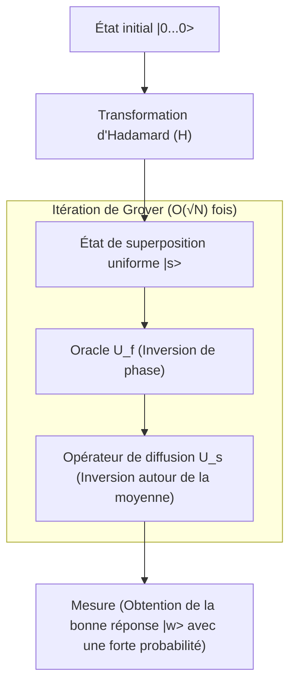

## 1. Introduction : Les limites classiques des problèmes de recherche et l'avènement des ordinateurs quantiques

Dans l'informatique moderne, la « recherche » est l'une des tâches les plus fondamentales et les plus importantes. Qu'il s'agisse de trouver des informations spécifiques sur un client dans une base de données, de découvrir l'itinéraire optimal dans un vaste réseau, ou de déchiffrer des clés cryptographiques par force brute, l'efficacité d'un algorithme de recherche est directement liée à la performance de tout système.

En particulier, lorsque les données ne possèdent aucune structure (non triées, sans régularité), on parle de « problème de recherche dans une base de données non structurée ». Par exemple, supposons qu'il y ait N boîtes alignées, et qu'une seule contienne le prix. Toutes les boîtes ont la même apparence, et il est impossible de savoir ce qu'elles contiennent sans les ouvrir. Dans ce cas, le nombre d'essais nécessaires pour qu'un ordinateur classique (les ordinateurs que nous utilisons quotidiennement aujourd'hui) trouve le prix est de N dans le pire des cas, et de N/2 en moyenne. En d'autres termes, la complexité (complexité temporelle) est proportionnelle au nombre de données N, ce qui s'écrit $O(N)$.

Si N est petit, un algorithme en $O(N)$ ne pose pas de problème, mais lorsque N devient un nombre astronomique tel que des millions, des centaines de millions, voire $2^{128}$ ou $2^{256}$, un ordinateur classique ne pourrait pas terminer la recherche même en y consacrant toute la durée de vie de l'univers. C'est la limite physique et mathématique de la recherche non structurée classique.

Cependant, avec l'apparition des « ordinateurs quantiques », qui utilisent les propriétés étranges de la mécanique quantique (superposition, intrication, interférence) comme ressources de calcul, la possibilité de dépasser cette limite a été démontrée. En 1996, Lov Grover, alors chercheur aux laboratoires Bell, a publié un algorithme révolutionnaire capable d'effectuer une recherche dans une base de données non structurée avec une complexité de $O(\sqrt{N})$. C'est ce qu'on appelle « l'Algorithme de Grover » (Grover's Algorithm).

La réduction de la complexité de $O(N)$ à $O(\sqrt{N})$ est appelée « Accélération Quadratique » (Quadratic Speedup). À première vue, l'impact peut sembler moindre par rapport à l'accélération exponentielle (Exponential Speedup) de la factorisation en nombres premiers grâce à l'algorithme de Shor. Cependant, comme la recherche non structurée apparaît comme sous-tâche dans presque tous les problèmes, le champ d'application de l'algorithme de Grover est extrêmement vaste, avec un impact décisif sur les problèmes d'optimisation combinatoire, l'apprentissage automatique, et en particulier sur la sécurité de la cryptographie moderne (cryptographie à clé symétrique).

Dans cet article, nous allons expliquer en profondeur pourquoi et comment cet algorithme de Grover accélère la recherche, en partant de ses bases mathématiques jusqu'à son implémentation dans des circuits quantiques, et même son impact sur la société.

## 2. Fondamentaux de la mécanique quantique : Superposition et Amplitude de probabilité

Pour comprendre l'algorithme de Grover, il faut d'abord comprendre comment l'information quantique est fondamentalement représentée. Alors que la plus petite unité d'information d'un ordinateur classique est le « bit », qui prend l'état « 0 » ou « 1 », l'unité minimale d'information d'un ordinateur quantique est appelée « bit quantique » (Qubit).

La caractéristique principale d'un qubit est sa propriété de « superposition » (Superposition), qui lui permet de prendre les états « 0 » et « 1 » simultanément. Mathématiquement, l'état $|\psi\rangle$ d'un qubit est représenté comme une combinaison linéaire des états de base $|0\rangle$ et $|1\rangle$ :

$$ |\psi\rangle = \alpha|0\rangle + \beta|1\rangle $$

Ici, $\alpha$ et $\beta$ sont des nombres complexes appelés « amplitudes de probabilité » (Probability Amplitude). Lorsqu'on observe le qubit, la probabilité d'obtenir l'état $|0\rangle$ est de $|\alpha|^2$, et la probabilité d'obtenir l'état $|1\rangle$ est de $|\beta|^2$. La somme des probabilités devant être égale à 1, la condition de normalisation suivante doit être satisfaite :

$$ |\alpha|^2 + |\beta|^2 = 1 $$

Lorsqu'on aligne n qubits, la dimension de l'espace des états devient $2^n$. Par exemple, l'état de 3 qubits peut être représenté comme une superposition de $2^3 = 8$ états de base :

$$ |\psi\rangle = \alpha_0|000\rangle + \alpha_1|001\rangle + \dots + \alpha_7|111\rangle $$

L'algorithme de Grover initialise ces $2^n$ états possibles (tous les candidats de la recherche) avec des amplitudes de probabilité égales, et utilise l'interférence quantique (Quantum Interference) pour amplifier uniquement l'amplitude de probabilité de l'état correspondant à la bonne réponse, offrant ainsi un mécanisme pour obtenir la bonne réponse avec une probabilité élevée lors de l'observation. Ce processus est appelé « Amplification d'Amplitude » (Amplitude Amplification).

## 3. Formulation du problème : Qu'est-ce qu'un Oracle ?

Dans l'algorithme de Grover, le problème de recherche est formulé mathématiquement de la manière suivante.

Soit l'index de la cible de recherche $x \in \{0, 1\}^n$. Le nombre total d'éléments est $N = 2^n$. Considérons une fonction $f(x)$ qui renvoie $1$ uniquement lorsque l'entrée $x$ est l'index de la bonne réponse (la cible), et $0$ sinon.

- Si c'est la cible : $f(x) = 1$
- Si ce n'est pas la cible : $f(x) = 0$

Notre objectif est de trouver le $x$ (que nous appellerons $w$) tel que $f(x) = 1$ en évaluant la fonction $f(x)$. Dans un algorithme classique, il n'y a pas d'autre choix que d'évaluer (interroger) $f(x)$ pour différents $x$ et de répéter l'opération jusqu'à ce que le résultat soit $1$.

En informatique quantique, l'opérateur de type boîte noire qui évalue cette fonction $f(x)$ est appelé un « Oracle Quantique » (Quantum Oracle). L'oracle $U_f$ applique la transformation unitaire suivante à un état quantique :

$$ U_f |x\rangle |y\rangle = |x\rangle |y \oplus f(x)\rangle $$

Ici, $|y\rangle$ est un qubit auxiliaire (ancilla bit), et $\oplus$ représente l'addition modulo 2 (XOR).

Dans l'algorithme de Grover, nous utilisons une technique (kickback de phase : Phase Kickback) consistant à initialiser le qubit auxiliaire $|y\rangle$ à l'état $|-\rangle = \frac{1}{\sqrt{2}}(|0\rangle - |1\rangle)$ avant de l'appliquer à l'oracle. Ainsi, l'action de l'oracle se simplifie de la manière suivante :

$$ U_f |x\rangle = (-1)^{f(x)} |x\rangle $$

En d'autres termes, l'oracle $U_f$ effectue une opération qui inverse uniquement la phase (le signe) de l'état correct $|w\rangle$, et laisse la phase des autres états inchangée.

- Si correct : $U_f |w\rangle = -|w\rangle$
- Si incorrect : $U_f |x\rangle = |x\rangle \quad (x \neq w)$

Représenté sous forme de matrice, $U_f$ est une matrice diagonale dont seul l'élément diagonal correspondant à l'index correct est $-1$, et tous les autres sont $1$.

## 4. Le mécanisme de l'itération de Grover (Grover Iteration)

L'algorithme de Grover se compose des quatre étapes principales suivantes :

1. **Initialisation (Initialization)**
2. **Inversion de phase par l'oracle (Oracle Phase Flip)**
3. **Inversion autour de la moyenne (Inversion About the Mean / Diffusion Operator)**
4. **Mesure (Measurement)**

La combinaison de l'étape 2 et de l'étape 3 est appelée une « itération de Grover » (Grover Iteration). En répétant cela le nombre optimal de fois, l'amplitude de probabilité de l'état correct est maximisée.



### 4.1 Initialisation

Tout d'abord, les n qubits sont tous initialisés à l'état $|0\rangle$. Ensuite, une porte de Hadamard (Hadamard Gate, $H$) est appliquée à chaque qubit, créant un état de superposition uniforme $|s\rangle$ où tous les états ont la même amplitude de probabilité.

$$ |s\rangle = H^{\otimes n} |0\rangle^{\otimes n} = \frac{1}{\sqrt{N}} \sum_{x=0}^{N-1} |x\rangle $$

Dans cet état, la probabilité d'observer n'importe quel état est égale à $1/N$. Toutes les amplitudes de probabilité sont $\frac{1}{\sqrt{N}}$.

### 4.2 Inversion de phase par l'oracle

L'oracle $U_f$ est appliqué à l'état de superposition uniforme $|s\rangle$. Comme mentionné précédemment, seul le signe (la phase) de l'amplitude de probabilité de l'état correct $|w\rangle$ est inversé.

$$ U_f |s\rangle = \frac{1}{\sqrt{N}} \sum_{x \neq w} |x\rangle - \frac{1}{\sqrt{N}} |w\rangle $$

Par cette opération, seule l'amplitude de la bonne réponse devient négative, mais la probabilité (le carré de la valeur absolue de l'amplitude) n'a pas changé. Par conséquent, lors d'une mesure à ce stade, la probabilité de trouver la bonne réponse reste de $1/N$. C'est pourquoi l'étape suivante est nécessaire.

### 4.3 Opérateur de diffusion (Inversion autour de la moyenne)

Ensuite, l'opérateur de diffusion (Diffusion Operator) $U_s$ est appliqué. Cet opérateur effectue une opération qui inverse l'amplitude de probabilité de chaque état par rapport à la « moyenne » des amplitudes de probabilité de tous les états.

Mathématiquement, $U_s$ est défini comme suit :

$$ U_s = 2|s\rangle\langle s| - I $$

Ici, $I$ est la matrice identité. Comprenons intuitivement ce qui se passe lorsqu'on applique cet opérateur :

1. Après l'application de l'oracle, l'amplitude de la bonne réponse devient négative, et les amplitudes des mauvaises réponses restent positives.
2. De ce fait, la « moyenne » de toutes les amplitudes devient légèrement inférieure à la valeur initiale $\frac{1}{\sqrt{N}}$.
3. Les amplitudes des mauvaises réponses (positives) étant plus grandes que cette nouvelle moyenne, si on les inverse par rapport à la moyenne, elles deviennent **plus petites** que leur valeur initiale.
4. En revanche, l'amplitude de la bonne réponse (négative) se situant bien en dessous de la moyenne (positive), son inversion par rapport à la moyenne la fait remonter et **dépasser largement dans la direction positive**.

En conséquence, l'amplitude de probabilité des mauvaises réponses diminue et celle de la bonne réponse est amplifiée. Cette paire constituée de l'oracle et de l'opérateur de diffusion ($U_s U_f$) définit une itération de Grover (Grover Operator, $G$).

$$ G = U_s U_f $$

### 4.4 Interprétation géométrique et déduction du nombre d'itérations

L'itération de Grover peut être représentée de manière très élégante et géométrique comme une rotation dans un plan bidimensionnel.

Considérons l'espace des états comme un plan bidimensionnel sous-tendu par deux vecteurs orthogonaux : l'état correct $|w\rangle$ et $|s'\rangle$, qui est la superposition uniforme de tous les états incorrects.

$$ |s'\rangle = \frac{1}{\sqrt{N-1}} \sum_{x \neq w} |x\rangle $$

L'état initial $|s\rangle$ peut être représenté dans ce plan comme un vecteur incliné d'un angle $\theta$ par rapport à $|s'\rangle$ vers la direction de $|w\rangle$.

$$ |s\rangle = \sin\theta |w\rangle + \cos\theta |s'\rangle $$

Ici, $\sin\theta = \frac{1}{\sqrt{N}}$. Lorsque $N$ est suffisamment grand, on peut approximer par $\theta \approx \frac{1}{\sqrt{N}}$.

Il est mathématiquement prouvé qu'appliquer une itération de Grover $G$ équivaut à faire tourner le vecteur d'état dans ce plan bidimensionnel d'un angle $2\theta$ en direction de $|w\rangle$.

Par conséquent, l'état $|\psi_k\rangle$ après $k$ itérations est le suivant :

$$ |\psi_k\rangle = G^k |s\rangle = \sin((2k+1)\theta) |w\rangle + \cos((2k+1)\theta) |s'\rangle $$

Notre objectif est de rapprocher autant que possible le vecteur d'état de l'état correct $|w\rangle$, c'est-à-dire d'obtenir $\sin((2k+1)\theta) \approx 1$. Cela signifie que l'angle devient $\pi/2$ (90 degrés).

$$ (2k+1)\theta \approx \frac{\pi}{2} $$

En substituant $\theta \approx \frac{1}{\sqrt{N}}$ et en résolvant pour $k$, on obtient :

$$ k \approx \frac{\pi}{4}\sqrt{N} $$

C'est le fondement mathématique qui explique pourquoi la complexité de l'algorithme de Grover est de $O(\sqrt{N})$. Fait intéressant, si le nombre d'itérations est trop élevé, le vecteur dépassera $|w\rangle$ et la probabilité d'obtenir la bonne réponse diminuera. Il est donc crucial d'arrêter les itérations exactement au nombre optimal de fois.

## 5. Implémentation en Python avec Qiskit

Au-delà de la théorie, écrivons un circuit quantique réel pour vérifier le comportement de l'algorithme. Nous utiliserons « Qiskit », un framework de calcul quantique open source fourni par IBM.

Pour simplifier, nous considérerons le cas où $N=4$ ($n=2$ qubits). Nous définissons la bonne réponse comme $w = |11\rangle$ (index 3). Le nombre d'itérations nécessaire étant $\frac{\pi}{4}\sqrt{4} \approx 1.57$, une seule itération devrait suffire pour obtenir une probabilité très élevée.

```python
from qiskit import QuantumCircuit
from qiskit_aer import AerSimulator
from qiskit.visualization import plot_histogram
import matplotlib.pyplot as plt
import numpy as np

# Nombre de qubits
n = 2

# Initialisation du circuit (2 qubits quantiques + 2 bits classiques pour la mesure)
qc = QuantumCircuit(n, n)

# 1. Initialisation : appliquer la porte Hadamard
qc.h([0, 1])
qc.barrier()

# 2. Oracle : inverser la phase de |11> (réalisable avec une porte CZ)
# Multiplier par -1 uniquement dans le cas de |11>
qc.cz(0, 1)
qc.barrier()

# 3. Opérateur de diffusion
# H -> X -> CZ -> X -> H
qc.h([0, 1])
qc.x([0, 1])
qc.cz(0, 1)
qc.x([0, 1])
qc.h([0, 1])
qc.barrier()

# 4. Mesure
qc.measure([0, 1], [0, 1])

# Dessiner le circuit (visible dans le terminal ou Jupyter)
print(qc.draw())

# Exécution avec le simulateur
simulator = AerSimulator()
result = simulator.run(qc, shots=1000).result()
counts = result.get_counts()

print("\nRésultats de la mesure :", counts)
# On obtient la bonne réponse avec 100% de probabilité, par exemple {'11': 1000}
```

Dans cet exemple simple, nous avons construit l'oracle et l'opérateur de diffusion à l'aide de combinaisons de portes de base (H, X, CZ). Dans le cas où $N=4$, une seule itération permet d'obtenir la bonne réponse $|11\rangle$ avec une probabilité théorique de 100 %. Vous pouvez ressentir directement la puissance du « parallélisme » et de « l'interférence » du circuit quantique à travers ce code.

Au fur et à mesure que l'échelle augmente, la conception de l'oracle et l'implémentation de portes multi-contrôlées pour l'opérateur de diffusion (comme la porte de Toffoli multi-contrôlée) deviennent plus complexes, mais la structure de base reste la même, quel que soit le nombre de qubits.

## 6. La menace de l'algorithme de Grover pour la cryptographie

L'algorithme de Grover ne se limite pas à des énigmes mathématiques ou à des recherches abstraites dans des bases de données ; il constitue une menace très concrète pour la cybersécurité du monde réel. Sont particulièrement touchées la « cryptographie à clé symétrique » (Symmetric-key cryptography), représentée par AES (Advanced Encryption Standard), et les « fonctions de hachage » telles que SHA-256.

### Impact sur la cryptographie à clé symétrique
Dans une méthode de chiffrement comme AES-128, la longueur de la clé est de 128 bits, ce qui signifie qu'il y a $2^{128}$ combinaisons de clés possibles. Si une attaque par force brute est menée avec un ordinateur classique, $2^{128}$ calculs sont nécessaires dans le pire des cas. Même avec les supercalculateurs actuels, cela prendrait bien plus de temps que l'âge de l'univers, ce qui le rend fonctionnellement « sûr » en pratique.

Cependant, si un attaquant utilise un ordinateur quantique tolérant aux pannes à grande échelle (FTQC : Fault-Tolerant Quantum Computer) et applique l'algorithme de Grover en traitant la fonction de chiffrement comme un oracle, la complexité pour trouver la clé correcte est considérablement réduite à $O(\sqrt{2^{128}}) = O(2^{64})$.

$2^{64}$ opérations est une échelle réalisable dans un délai raisonnable (de quelques semaines à quelques mois) même pour des clusters d'ordinateurs classiques modernes. En d'autres termes, avec l'avènement des ordinateurs quantiques, les chiffrements utilisant une clé de 128 bits ne peuvent plus être considérés comme sûrs.

### Transition vers la cryptographie post-quantique et contre-mesures
La contre-mesure à cette menace est, en principe, extrêmement simple. Il suffit de doubler la longueur de la clé.

Si l'on utilise AES-256, l'espace des clés devient $2^{256}$. Même en appliquant l'algorithme de Grover, la complexité requise sera de $\sqrt{2^{256}} = 2^{128}$, ce qui signifie qu'il conservera une force équivalente à celle d'AES-128 sur un ordinateur classique.

Par conséquent, les organismes de normalisation tels que le NIST (Institut national des normes et de la technologie américain) et les agences de sécurité de divers pays recommandent fortement « d'utiliser une longueur de clé de 256 bits ou plus » pour l'utilisation de la cryptographie à clé symétrique, en prévision des futures menaces quantiques. Il en va de même pour les fonctions de hachage : la résistance aux attaques par collision ou aux attaques de pré-image sur SHA-256 étant diminuée, une transition vers SHA-384 et SHA-512 est en cours.

Ainsi, l'algorithme de Grover, avec l'algorithme de Shor (qui neutralise la cryptographie à clé publique comme RSA et [ECC](/fr/p/elliptic-curve-cryptography-math-cpp/)), est un algorithme qui marque un tournant majeur dans l'histoire de la sécurité de l'information.

## 7. Applications et développements : L'avenir de l'algorithme de Grover

L'algorithme de Grover ne se limite pas à la recherche non structurée, et son application et son extension à divers domaines sont à l'étude.

- **Application aux problèmes NP-complets tels que le problème de satisfaisabilité booléenne (SAT)** : Des approches qui utilisent l'itération de Grover pour accélérer la recherche dans l'espace des solutions des problèmes d'optimisation combinatoire. Le développement de méthodes hybrides combinant des algorithmes heuristiques classiques et des algorithmes quantiques est en cours.
- **Apprentissage automatique quantique (QML)** : Recherches visant à accélérer les processus d'apprentissage en appliquant le mécanisme d'amplification d'amplitude pour calculer la distance entre les points de données et optimiser le regroupement (clustering).
- **Marches quantiques (Quantum Walk)** : [Algorithmes de recherche](/fr/p/search-algorithms-linear-binary-hash-table-principles/) pour des données plus structurées, tels que les problèmes de recherche sur des graphes. Ils peuvent être considérés comme une généralisation de l'algorithme de Grover et sont jugés prometteurs pour l'analyse de réseaux, etc.

## 8. Conclusion : La véritable valeur et les limites de l'informatique quantique

L'algorithme de Grover est un excellent exemple où les ordinateurs quantiques peuvent démontrer une nette supériorité sur les ordinateurs classiques. L'accélération quadratique, qui réduit une tâche nécessitant classiquement $O(N)$ à $O(\sqrt{N})$, devient extrêmement efficace à mesure que le volume de données augmente.

Cependant, il faut également comprendre que l'algorithme de Grover n'est pas une baguette magique. Il a été souligné que l'accélération théorique pourrait ne pas être atteinte si la construction de l'oracle elle-même est coûteuse en calcul, ou s'il existe des goulots d'étranglement dans le chargement des données (implémentation de RAM quantique, qRAM). De plus, compte tenu de la surcharge liée à la correction des erreurs quantiques, de nombreuses percées matérielles et logicielles sont encore nécessaires pour atteindre concrètement des performances supérieures à celles des ordinateurs classiques.

Néanmoins, la beauté théorique et l'ampleur de son impact restent inébranlables. Cet algorithme, qui manipule habilement le concept contre-intuitif des amplitudes de probabilité pour amplifier brillamment la seule bonne réponse dans une mer de bruit, est la cristallisation de l'intelligence humaine, montrant comment l'homme peut apprivoiser les lois de la nature (la mécanique quantique) pour en faire des ressources informatiques.

[Pour les ingénieurs](/fr/p/prompt-engineering-for-engineers/) et chercheurs de demain, une compréhension approfondie du mécanisme de l'algorithme de Grover constituera sans aucun doute une arme puissante pour survivre dans l'ère de l'informatique quantique à venir. Le monde de la science de l'information quantique n'en est qu'à ses débuts, et le jour où de nouveaux algorithmes inconnus seront découverts n'est peut-être pas si lointain.
