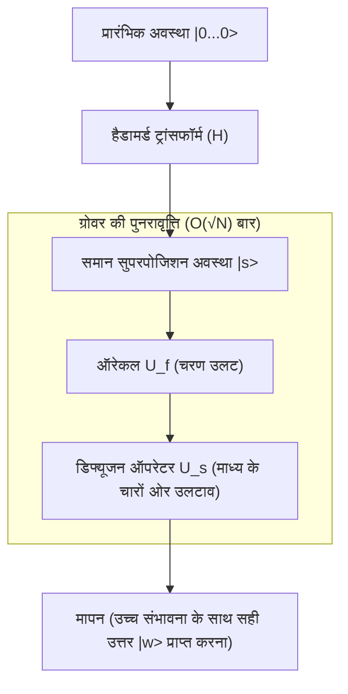

## 1. परिचय: खोज समस्याओं की शास्त्रीय सीमाएं और क्वांटम कंप्यूटर का उदय

आधुनिक कंप्यूटर विज्ञान में, "खोज" (सर्च) सबसे बुनियादी और महत्वपूर्ण कार्यों में से एक है। डेटाबेस से विशिष्ट ग्राहक जानकारी खोजना, एक विशाल नेटवर्क में इष्टतम मार्ग (ऑप्टिमल रूट) खोजना, या क्रूर बल (ब्रूट फोर्स) द्वारा एन्क्रिप्शन कुंजी (एन्क्रिप्शन की) को डिक्रिप्ट करना, [खोज एल्गोरिदम](/hi/p/search-algorithms-linear-binary-hash-table-principles/) की दक्षता किसी भी प्रणाली के प्रदर्शन से सीधे जुड़ी होती है।

विशेष रूप से, जब डेटा में कोई संरचना नहीं होती (कोई क्रम नहीं, कोई नियमितता नहीं), तो इसे "असंरचित डेटाबेस खोज समस्या" कहा जाता है। उदाहरण के लिए, मान लें कि N बक्से एक पंक्ति में हैं, और उनमें से केवल एक में इनाम है। सभी बक्से बाहर से एक जैसे दिखते हैं, और आप तब तक नहीं जान सकते कि अंदर क्या है जब तक आप उन्हें खोलते नहीं। इस मामले में, एक शास्त्रीय कंप्यूटर (वह कंप्यूटर जिसका हम वर्तमान में प्रतिदिन उपयोग करते हैं) को इनाम खोजने के लिए सबसे खराब स्थिति में N बार, और औसतन N/2 बार प्रयास करने की आवश्यकता होती है। दूसरे शब्दों में, कम्प्यूटेशनल जटिलता (समय जटिलता) डेटा की संख्या N के समानुपाती होती है, और इसे $O(N)$ के रूप में व्यक्त किया जाता है।

यदि N छोटा है, तो $O(N)$ एल्गोरिदम ठीक है, लेकिन यदि N लाखों, करोड़ों, या यहाँ तक कि खगोलीय संख्याओं जैसे $2^{128}$ या $2^{256}$ तक पहुँच जाता है, तो एक शास्त्रीय कंप्यूटर ब्रह्मांड के जीवनकाल में भी खोज पूरी नहीं कर पाएगा। यह शास्त्रीय असंरचित खोज में एक भौतिक और गणितीय सीमा है।

हालाँकि, "क्वांटम कंप्यूटर" के आगमन से इस सीमा को तोड़ने की संभावना दिखाई गई, जो कम्प्यूटेशनल संसाधनों के रूप में क्वांटम यांत्रिकी के अजीबोगरीब गुणों (सुपरपोजिशन, एंटैंगलमेंट, और इंटरफेरेंस) का उपयोग करते हैं। 1996 में, बेल लैब्स के एक शोधकर्ता लव ग्रोवर (Lov Grover) ने एक अभूतपूर्व एल्गोरिदम प्रकाशित किया जो असंरचित डेटाबेस खोजों को $O(\sqrt{N})$ जटिलता के साथ कर सकता है। इसे "ग्रोवर का एल्गोरिदम" कहा जाता है।

$O(N)$ से $O(\sqrt{N})$ तक की कम्प्यूटेशनल जटिलता में इस कमी को "द्विघाती त्वरण (Quadratic Speedup)" कहा जाता है। पहली नज़र में, शोर के एल्गोरिदम (Shor's Algorithm) द्वारा प्राइम फैक्टराइजेशन के घातीय त्वरण (Exponential Speedup) की तुलना में इसका प्रभाव कम लग सकता है। हालाँकि, चूंकि असंरचित खोज हर समस्या के उप-कार्य के रूप में प्रकट होती है, ग्रोवर के एल्गोरिदम का अनुप्रयोग क्षेत्र बेहद विस्तृत है, और इसका कॉम्बिनेटरियल ऑप्टिमाइजेशन समस्याओं, मशीन लर्निंग और विशेष रूप से आधुनिक क्रिप्टोग्राफी (सिमेट्रिक-की क्रिप्टोग्राफी) की सुरक्षा पर निर्णायक प्रभाव पड़ता है।

इस लेख में, हम गहराई से जानेंगे कि ग्रोवर का एल्गोरिदम खोजों को क्यों और कैसे गति देता है, इसके गणितीय आधार से लेकर क्वांटम सर्किट कार्यान्वयन और यहां तक कि समाज पर इसके प्रभाव तक।

## 2. क्वांटम यांत्रिकी की मूल बातें: सुपरपोजिशन और संभाव्यता आयाम (Probability Amplitude)

ग्रोवर के एल्गोरिदम को समझने के लिए, आपको पहले यह समझना होगा कि क्वांटम जानकारी को कैसे दर्शाया जाता है। जबकि शास्त्रीय कंप्यूटर में जानकारी की सबसे छोटी इकाई "बिट" है, जो "0" या "1" की स्थिति ले सकती है, क्वांटम कंप्यूटर में जानकारी की सबसे छोटी इकाई को "क्वांटम बिट (Qubit)" कहा जाता है।

क्वाबिट्स की सबसे बड़ी विशेषता उनका "सुपरपोजिशन (Superposition)" का गुण है, जो उन्हें एक ही समय में "0" और "1" दोनों अवस्थाओं में रहने की अनुमति देता है। गणितीय रूप से, एक क्वाबिट की अवस्था $|\psi\rangle$ को आधार अवस्थाओं $|0\rangle$ और $|1\rangle$ के रैखिक संयोजन के रूप में व्यक्त किया जा सकता है:

$$ |\psi\rangle = \alpha|0\rangle + \beta|1\rangle $$

यहाँ, $\alpha$ और $\beta$ सम्मिश्र संख्याएँ (Complex numbers) हैं, और इन्हें "संभाव्यता आयाम (Probability Amplitude)" कहा जाता है। जब क्वाबिट को मापा (देखा) जाता है, तो अवस्था $|0\rangle$ प्राप्त करने की संभावना $|\alpha|^2$ होती है, और अवस्था $|1\rangle$ प्राप्त करने की संभावना $|\beta|^2$ होती है। चूँकि संभावनाओं का योग 1 होना चाहिए, उन्हें निम्नलिखित सामान्यीकरण स्थिति (Normalization condition) को पूरा करना होगा:

$$ |\alpha|^2 + |\beta|^2 = 1 $$

जब n क्वाबिट्स को एक साथ रखा जाता है, तो अवस्था स्थान (State space) का आयाम $2^n$ हो जाता है। उदाहरण के लिए, 3-क्वाबिट अवस्था को $2^3 = 8$ आधार अवस्थाओं के सुपरपोजिशन के रूप में दर्शाया जा सकता है:

$$ |\psi\rangle = \alpha_0|000\rangle + \alpha_1|001\rangle + \dots + \alpha_7|111\rangle $$

ग्रोवर के एल्गोरिदम का तंत्र यह है कि यह समान संभाव्यता आयाम के साथ सभी $2^n$ संभावित अवस्थाओं (खोजे जाने वाले सभी उम्मीदवारों) को इनिशियलाइज़ करता है, और केवल सही अवस्था के संभाव्यता आयाम को बढ़ाने के लिए क्वांटम इंटरफेरेंस (Quantum Interference) का उपयोग करता है, जिससे यह सुनिश्चित होता है कि मापने पर सही उत्तर उच्च संभावना के साथ प्राप्त हो। इस प्रक्रिया को "आयाम प्रवर्धन (Amplitude Amplification)" कहा जाता है।

## 3. समस्या का सूत्रीकरण: ऑरेकल (Oracle) क्या है?

ग्रोवर के एल्गोरिदम में, खोज समस्या को गणितीय रूप से निम्नानुसार तैयार किया गया है।

मान लें कि खोज लक्ष्य का इंडेक्स $x \in \{0, 1\}^n$ है। तत्वों की कुल संख्या $N = 2^n$ है। फ़ंक्शन $f(x)$ पर विचार करें, जो केवल तभी $1$ देता है जब इनपुट $x$ सही इंडेक्स (लक्ष्य) हो, और अन्यथा $0$ देता है।

- लक्ष्य के मामले में: $f(x) = 1$
- गैर-लक्ष्य के मामले में: $f(x) = 0$

हमारा उद्देश्य फ़ंक्शन $f(x)$ का मूल्यांकन करके एक ऐसा $x$ खोजना है जिसके लिए $f(x) = 1$ हो (मान लें कि यह $w$ है)। शास्त्रीय एल्गोरिदम में, एकमात्र तरीका विभिन्न $x$ के लिए $f(x)$ का मूल्यांकन (क्वेरी) करना है और परिणाम $1$ होने तक परीक्षण दोहराना है।

क्वांटम कंप्यूटिंग में, एक ब्लैक-बॉक्स ऑपरेटर जो इस फ़ंक्शन $f(x)$ का मूल्यांकन करता है, उसे "क्वांटम ऑरेकल (Quantum Oracle)" कहा जाता है। ऑरेकल $U_f$ क्वांटम अवस्था पर निम्नलिखित एकात्मक परिवर्तन (Unitary transformation) करता है:

$$ U_f |x\rangle |y\rangle = |x\rangle |y \oplus f(x)\rangle $$

यहाँ, $|y\rangle$ एक सहायक क्वाबिट (एंसिला बिट) है, और $\oplus$ मॉड्यूलो-2 जोड़ (XOR) को दर्शाता है।

ग्रोवर के एल्गोरिदम में, सहायक क्वाबिट $|y\rangle$ को अवस्था $|-\rangle = \frac{1}{\sqrt{2}}(|0\rangle - |1\rangle)$ में इनिशियलाइज़ करने और इसे ऑरेकल पर लागू करने की तकनीक (फेज़ किकबैक: Phase Kickback) का उपयोग किया जाता है। यह ऑरेकल की क्रिया को निम्नानुसार सरल करता है:

$$ U_f |x\rangle = (-1)^{f(x)} |x\rangle $$

दूसरे शब्दों में, ऑरेकल $U_f$ केवल सही अवस्था $|w\rangle$ के चरण (चिह्न) को उलट देता है, और अन्य अवस्थाओं के चरण को अपरिवर्तित छोड़ देता है।

- सही उत्तर के मामले में: $U_f |w\rangle = -|w\rangle$
- गलत उत्तर के मामले में: $U_f |x\rangle = |x\rangle \quad (x \neq w)$

एक मैट्रिक्स के रूप में, $U_f$ एक विकर्ण मैट्रिक्स (Diagonal matrix) है जहाँ सही इंडेक्स के अनुरूप केवल विकर्ण घटक $-1$ है, और बाकी सभी $1$ हैं।

## 4. ग्रोवर की पुनरावृत्ति (Grover Iteration) का तंत्र

ग्रोवर के एल्गोरिदम में चार मुख्य चरण होते हैं:

1. **आरंभीकरण (Initialization)**
2. **ऑरेकल द्वारा चरण उलटना (Oracle Phase Flip)**
3. **माध्य के चारों ओर उलटाव (Inversion About the Mean / Diffusion Operator)**
4. **मापन (Measurement)**

चरण 2 और 3 के संयोजन को "ग्रोवर की पुनरावृत्ति (Grover Iteration)" कहा जाता है, और इसे इष्टतम संख्या में दोहराकर, सही अवस्था के संभाव्यता आयाम को अधिकतम किया जाता है।



### 4.1 आरंभीकरण

सबसे पहले, सभी n क्वाबिट्स अवस्था $|0\rangle$ में इनिशियलाइज़ किए जाते हैं। इसके बाद, प्रत्येक क्वाबिट पर एक हैडामर्ड गेट (Hadamard Gate, $H$) लागू किया जाता है, जिससे एक समान सुपरपोजिशन अवस्था $|s\rangle$ बनती है जहाँ सभी अवस्थाओं का संभाव्यता आयाम समान होता है।

$$ |s\rangle = H^{\otimes n} |0\rangle^{\otimes n} = \frac{1}{\sqrt{N}} \sum_{x=0}^{N-1} |x\rangle $$

इस स्थिति में, सभी अवस्थाओं को देखने (मापने) की संभावना $1/N$ पर समान है। सभी संभाव्यता आयाम $\frac{1}{\sqrt{N}}$ हैं।

### 4.2 ऑरेकल द्वारा चरण उलटना

ऑरेकल $U_f$ समान सुपरपोजिशन अवस्था $|s\rangle$ पर लागू होता है। जैसा कि पहले उल्लेख किया गया है, केवल सही अवस्था $|w\rangle$ के संभाव्यता आयाम का चिह्न (चरण) उलट जाता है।

$$ U_f |s\rangle = \frac{1}{\sqrt{N}} \sum_{x \neq w} |x\rangle - \frac{1}{\sqrt{N}} |w\rangle $$

इस ऑपरेशन के कारण केवल सही उत्तर का आयाम ऋणात्मक हो जाता है, लेकिन संभावना (आयाम के निरपेक्ष मान का वर्ग) नहीं बदलती है। इसलिए, इस बिंदु पर माप में सही उत्तर खोजने की संभावना अभी भी $1/N$ है। यहीं से अगला कदम आवश्यक हो जाता है।

### 4.3 डिफ्यूजन ऑपरेटर (माध्य के चारों ओर उलटाव)

इसके बाद, डिफ्यूजन ऑपरेटर $U_s$ लागू किया जाता है। यह ऑपरेटर सभी अवस्थाओं के संभाव्यता आयामों के "माध्य (Mean)" मान के संदर्भ में प्रत्येक अवस्था के संभाव्यता आयाम को उलट देता है।

गणितीय रूप से, $U_s$ को निम्नानुसार परिभाषित किया गया है:

$$ U_s = 2|s\rangle\langle s| - I $$

जहाँ $I$ आइडेंटिटी मैट्रिक्स (Identity matrix) है। आइए सहजता से समझें कि जब इस ऑपरेटर को लागू किया जाता है तो क्या होता है।

1. ऑरेकल लागू होने के बाद, सही उत्तर का आयाम ऋणात्मक हो जाता है, और गलत उत्तरों के आयाम धनात्मक रहते हैं।
2. परिणामस्वरूप, सभी आयामों का "माध्य" मान मूल $\frac{1}{\sqrt{N}}$ से थोड़ा छोटा हो जाता है।
3. चूँकि गलत उत्तर का आयाम (धनात्मक) इस नए माध्य से बड़ा है, जब इसे माध्य के संदर्भ में उलटा जाता है, तो यह अपने मूल मान से **छोटा** हो जाता है।
4. दूसरी ओर, चूँकि सही उत्तर का आयाम (ऋणात्मक) माध्य (धनात्मक) से काफी नीचे है, जब इसे माध्य के संदर्भ में उलटा जाता है, तो यह धनात्मक दिशा में **मूल मान से काफी ऊपर चला जाता है**।

परिणामस्वरूप, गलत उत्तरों का संभाव्यता आयाम कम हो जाता है, और सही उत्तर का संभाव्यता आयाम बढ़ जाता है। ऑरेकल और डिफ्यूजन ऑपरेटर ($U_s U_f$) की इस जोड़ी को एक ग्रोवर पुनरावृत्ति (Grover Operator, $G$) के रूप में परिभाषित किया गया है।

$$ G = U_s U_f $$

### 4.4 ज्यामितीय व्याख्या और पुनरावृत्तियों की संख्या की व्युत्पत्ति

ग्रोवर की पुनरावृत्ति को दो-आयामी तल पर घूर्णी गति (Rotational motion) के रूप में बहुत ही खूबसूरती से और ज्यामितीय रूप से दर्शाया जा सकता है।

हम अवस्था स्थान (State space) को दो लंबवत वैक्टर द्वारा फैले 2D तल के रूप में मान सकते हैं: सही अवस्था $|w\rangle$ और $|s'\rangle$, जो सभी गलत अवस्थाओं का एक समान सुपरपोजिशन है।

$$ |s'\rangle = \frac{1}{\sqrt{N-1}} \sum_{x \neq w} |x\rangle $$

प्रारंभिक अवस्था $|s\rangle$ को इस तल पर एक वेक्टर के रूप में दर्शाया जा सकता है जो $|s'\rangle$ से कोण $\theta$ द्वारा $|w\rangle$ की दिशा में झुका हुआ है।

$$ |s\rangle = \sin\theta |w\rangle + \cos\theta |s'\rangle $$

यहाँ, $\sin\theta = \frac{1}{\sqrt{N}}$ है। जब $N$ काफी बड़ा होता है, तो हम $\theta \approx \frac{1}{\sqrt{N}}$ का अनुमान लगा सकते हैं।

गणितीय रूप से यह सिद्ध किया गया है कि ग्रोवर की पुनरावृत्ति $G$ को एक बार लागू करना इस 2D तल पर अवस्था वेक्टर को कोण $2\theta$ से $|w\rangle$ की दिशा में घुमाने के बराबर है।

इसलिए, $k$ पुनरावृत्तियों के बाद की अवस्था $|\psi_k\rangle$ इस प्रकार होगी:

$$ |\psi_k\rangle = G^k |s\rangle = \sin((2k+1)\theta) |w\rangle + \cos((2k+1)\theta) |s'\rangle $$

हमारा लक्ष्य अवस्था वेक्टर को सही अवस्था $|w\rangle$ के जितना संभव हो करीब लाना है, यानी $\sin((2k+1)\theta) \approx 1$ बनाना है। इसका मतलब है कि कोण $\pi/2$ (90 डिग्री) हो जाना चाहिए।

$$ (2k+1)\theta \approx \frac{\pi}{2} $$

$\theta \approx \frac{1}{\sqrt{N}}$ को प्रतिस्थापित करने और $k$ के लिए हल करने पर,

$$ k \approx \frac{\pi}{4}\sqrt{N} $$

यही गणितीय आधार है कि ग्रोवर के एल्गोरिदम की कम्प्यूटेशनल जटिलता $O(\sqrt{N})$ क्यों है। दिलचस्प बात यह है कि यदि आप पुनरावृत्तियों की संख्या बहुत अधिक बढ़ाते हैं, तो वेक्टर $|w\rangle$ को पार कर जाएगा, और सही उत्तर प्राप्त करने की संभावना वास्तव में कम हो जाएगी। इसलिए, पुनरावृत्ति को ठीक इष्टतम संख्या में रोकना आवश्यक है।

## 5. Qiskit का उपयोग करके Python में कार्यान्वयन

सिद्धांत के अलावा, आइए वास्तव में एक क्वांटम सर्किट लिखें और देखें कि एल्गोरिदम कैसे काम करता है। हम "Qiskit" का उपयोग करेंगे, जो IBM द्वारा प्रदान किया गया एक ओपन-सोर्स क्वांटम कंप्यूटिंग फ्रेमवर्क है।

सरलता के लिए, आइए $N=4$ ($n=2$ क्वाबिट्स) के मामले पर विचार करें। हमने सही उत्तर $w = |11\rangle$ (इंडेक्स 3) के रूप में निर्धारित किया है। आवश्यक पुनरावृत्तियों की संख्या $\frac{\pi}{4}\sqrt{4} \approx 1.57$ है, इसलिए हमें 1 पुनरावृत्ति के साथ पर्याप्त उच्च संभावना मिलनी चाहिए।

```python
from qiskit import QuantumCircuit
from qiskit_aer import AerSimulator
from qiskit.visualization import plot_histogram
import matplotlib.pyplot as plt
import numpy as np

# क्वाबिट्स की संख्या
n = 2

# सर्किट आरंभीकरण (2 क्वाबिट + माप के लिए 2 शास्त्रीय बिट)
qc = QuantumCircuit(n, n)

# 1. आरंभीकरण: हैडामर्ड गेट लागू करें
qc.h([0, 1])
qc.barrier()

# 2. ऑरेकल: |11> के चरण को उल्टा करें (CZ गेट के साथ संभव)
# केवल |11> के मामले में -1 से गुणा करें
qc.cz(0, 1)
qc.barrier()

# 3. डिफ्यूजन ऑपरेटर
# H -> X -> CZ -> X -> H
qc.h([0, 1])
qc.x([0, 1])
qc.cz(0, 1)
qc.x([0, 1])
qc.h([0, 1])
qc.barrier()

# 4. मापन
qc.measure([0, 1], [0, 1])

# सर्किट आरेखित करें (टर्मिनल या जुपिटर में देखा जा सकता है)
print(qc.draw())

# सिमुलेटर पर निष्पादन
simulator = AerSimulator()
result = simulator.run(qc, shots=1000).result()
counts = result.get_counts()

print("\nमाप परिणाम:", counts)
# {'11': 1000} की तरह, 100% संभावना के साथ सही उत्तर प्राप्त होता है
```

इस सरल उदाहरण में, हमने बुनियादी गेट्स (H, X, CZ) के संयोजन का उपयोग करके ऑरेकल और डिफ्यूजन ऑपरेटर का निर्माण किया। $N=4$ के मामले में, सैद्धांतिक रूप से सही उत्तर $|11\rangle$ 1 पुनरावृत्ति में 100% की संभावना के साथ प्राप्त किया जा सकता है। आप सीधे कोड से क्वांटम सर्किट की "समानांतरता (Parallelism)" और "हस्तक्षेप (Interference)" की शक्ति को महसूस कर सकते हैं।

जैसे-जैसे पैमाना बड़ा होता जाता है, ऑरेकल का डिज़ाइन और डिफ्यूजन ऑपरेटर का कार्यान्वयन (मल्टी-नियंत्रित टोफोली गेट्स आदि का उपयोग करके) अधिक जटिल हो जाता है, लेकिन बुनियादी संरचना वही रहती है चाहे कितने भी क्वाबिट्स बढ़ाए जाएं।

## 6. ग्रोवर के एल्गोरिदम द्वारा क्रिप्टोग्राफी के लिए खतरा

ग्रोवर का एल्गोरिदम केवल एक गणितीय पहेली या अमूर्त डेटाबेस खोज नहीं है; यह वास्तविक दुनिया की साइबर सुरक्षा के लिए एक बहुत ही विशिष्ट खतरा पैदा करता है। यह विशेष रूप से AES (एडवांस्ड एन्क्रिप्शन स्टैंडर्ड) जैसे "सिमेट्रिक-की क्रिप्टोग्राफी (Symmetric-key cryptography)" और SHA-256 जैसे "हैश फ़ंक्शंस" को प्रभावित करता है।

### सिमेट्रिक-की क्रिप्टोग्राफी पर प्रभाव
AES-128 जैसी एन्क्रिप्शन पद्धति में, कुंजी की लंबाई 128 बिट है, जिसका अर्थ है कि $2^{128}$ संभावित कुंजी संयोजन हैं। शास्त्रीय कंप्यूटर पर क्रूर-बल (ब्रूट-फोर्स) हमले का उपयोग करते हुए, सबसे खराब स्थिति में $2^{128}$ गणनाओं की आवश्यकता होती है। यह वर्तमान सुपर कंप्यूटरों का उपयोग करके भी ब्रह्मांड की आयु से कहीं अधिक समय लेगा, इसलिए इसे व्यावहारिक रूप से "सुरक्षित" माना जाता है।

हालाँकि, यदि कोई हमलावर बड़े पैमाने पर और दोष-सहिष्णु क्वांटम कंप्यूटर (FTQC: Fault-Tolerant Quantum Computer) का उपयोग करता है और ग्रोवर के एल्गोरिदम को लागू करता है, तो एन्क्रिप्शन फ़ंक्शन को ऑरेकल के रूप में मानकर सही कुंजी खोजने की गणना जटिलता नाटकीय रूप से कम होकर $O(\sqrt{2^{128}}) = O(2^{64})$ रह जाती है।

$2^{64}$ गणना एक ऐसा पैमाना है जिसे आधुनिक शास्त्रीय कंप्यूटर क्लस्टर पर यथार्थवादी समय (कुछ हफ्तों से लेकर कुछ महीनों) में निष्पादित किया जा सकता है। दूसरे शब्दों में, क्वांटम कंप्यूटर के आगमन के साथ, 128-बिट कुंजियों वाले एन्क्रिप्शन को अब सुरक्षित नहीं कहा जा सकता है।

### पोस्ट-क्वांटम क्रिप्टोग्राफी में संक्रमण और प्रतिकार
सिद्धांत रूप में, इस खतरे के खिलाफ उपाय बहुत सरल है: बस कुंजी की लंबाई दोगुनी करें।

यदि AES-256 का उपयोग किया जाता है, तो कुंजी का स्थान $2^{256}$ है। ग्रोवर के एल्गोरिदम को लागू करने पर भी, आवश्यक संगणना $\sqrt{2^{256}} = 2^{128}$ होगी, जिसका अर्थ है कि यह एक शास्त्रीय कंप्यूटर पर AES-128 के समान ताकत बनाए रखेगा।

इसलिए, NIST (राष्ट्रीय मानक और प्रौद्योगिकी संस्थान, अमेरिका) और विभिन्न देशों की सुरक्षा एजेंसियों जैसे मानकीकरण निकाय भविष्य के क्वांटम खतरों की प्रत्याशा में सिमेट्रिक-की क्रिप्टोग्राफी के लिए "256 बिट या उससे अधिक की कुंजी लंबाई" का उपयोग करने की दृढ़ता से अनुशंसा कर रहे हैं। हैश फ़ंक्शंस के लिए भी यही सच है, जहाँ SHA-384 और SHA-512 में संक्रमण चल रहा है क्योंकि SHA-256 की टक्कर (Collision) हमलों और प्री-इमेज हमलों के प्रति प्रतिरोधकता कम हो जाती है।

इस तरह, ग्रोवर का एल्गोरिदम सूचना सुरक्षा के इतिहास में एक प्रमुख महत्वपूर्ण मोड़ (Turning point) है, जो शोर (Shor) के एल्गोरिदम के साथ मिलकर सार्वजनिक-कुंजी क्रिप्टोग्राफी (RSA और [ECC](/hi/p/elliptic-curve-cryptography-math-cpp/)) को निष्क्रिय कर देता है।

## 7. अनुप्रयोग और विकास: ग्रोवर के एल्गोरिदम का भविष्य

ग्रोवर का एल्गोरिदम केवल असंरचित खोज तक सीमित नहीं है, और विभिन्न क्षेत्रों में इसके अनुप्रयोगों और एक्सटेंशन पर शोध किया जा रहा है।

- **NP-संपूर्ण समस्याओं जैसे कि संतुष्टि समस्याओं (SAT) के लिए अनुप्रयोग**: कॉम्बिनेटरियल ऑप्टिमाइजेशन समस्याओं के समाधान स्थान की खोज करते समय खोज को तेज करने के लिए ग्रोवर की पुनरावृत्ति का उपयोग करने का दृष्टिकोण। अनुमानी (Heuristic) शास्त्रीय एल्गोरिदम और क्वांटम एल्गोरिदम के संयोजन से हाइब्रिड तरीके विकसित किए जा रहे हैं।
- **क्वांटम मशीन लर्निंग (QML)**: डेटा बिंदुओं के बीच दूरी की गणना करने या क्लस्टरिंग को अनुकूलित करने में, सीखने की प्रक्रिया को तेज करने के लिए आयाम प्रवर्धन के तंत्र को लागू करने पर शोध।
- **क्वांटम वॉक (Quantum Walk)**: ग्राफ़ पर खोज समस्याओं जैसे अधिक संरचना वाले डेटा के लिए [खोज एल्गोरिदम](/hi/p/search-algorithms-linear-binary-hash-table-principles/)। इसे ग्रोवर के एल्गोरिदम के सामान्यीकरण के रूप में देखा जा सकता है और यह नेटवर्क विश्लेषण के लिए आशाजनक माना जाता है।

## 8. निष्कर्ष: क्वांटम कंप्यूटिंग का वास्तविक मूल्य और सीमाएँ

ग्रोवर का एल्गोरिदम इस बात का एक प्रमुख उदाहरण है कि क्वांटम कंप्यूटर शास्त्रीय कंप्यूटरों पर स्पष्ट लाभ कैसे प्रदर्शित कर सकते हैं। $O(N)$ की शास्त्रीय आवश्यकता वाले कार्यों को $O(\sqrt{N})$ तक कम करने का द्विघाती त्वरण, डेटा की मात्रा बढ़ने पर अपना प्रभाव महत्वपूर्ण रूप से दिखाता है।

दूसरी ओर, यह समझना आवश्यक है कि ग्रोवर का एल्गोरिदम कोई जादू की छड़ी नहीं है। यह बताया गया है कि यदि ऑरेकल के निर्माण में ही उच्च कम्प्यूटेशनल लागत शामिल है, या यदि डेटा लोडिंग (क्वांटम रैम, qRAM कार्यान्वयन) में कोई बाधा (Bottleneck) है, तो सैद्धांतिक त्वरण प्राप्त नहीं हो सकता है। इसके अलावा, क्वांटम त्रुटि सुधार (Quantum error correction) के ओवरहेड को देखते हुए, शास्त्रीय कंप्यूटरों से वास्तव में बेहतर प्रदर्शन करने के लिए अभी भी कई हार्डवेयर और सॉफ़्टवेयर सफलताओं की आवश्यकता है।

हालाँकि, इसकी सैद्धांतिक सुंदरता और प्रभाव निर्विवाद हैं। संभाव्यता आयाम की गैर-सहज (Non-intuitive) अवधारणा में चतुराई से हेरफेर करके शोर (Noise) के समुद्र से केवल सही उत्तर को शानदार ढंग से बढ़ाने वाला यह एल्गोरिदम, मानव बुद्धि के क्रिस्टलीकरण का प्रतिनिधित्व करता है, जो यह दर्शाता है कि मनुष्य प्राकृतिक नियमों (क्वांटम यांत्रिकी) को एक कम्प्यूटेशनल संसाधन के रूप में कैसे उपयोग कर सकते हैं।

भविष्य के इंजीनियरों और शोधकर्ताओं के लिए, ग्रोवर के एल्गोरिदम के तंत्र की गहरी समझ आने वाले क्वांटम कंप्यूटिंग युग में जीवित रहने के लिए एक शक्तिशाली हथियार होगी। क्वांटम सूचना विज्ञान की दुनिया अभी शुरू हुई है, और वह दिन दूर नहीं जब और भी अज्ञात क्वांटम एल्गोरिदम खोजे जाएंगे।
