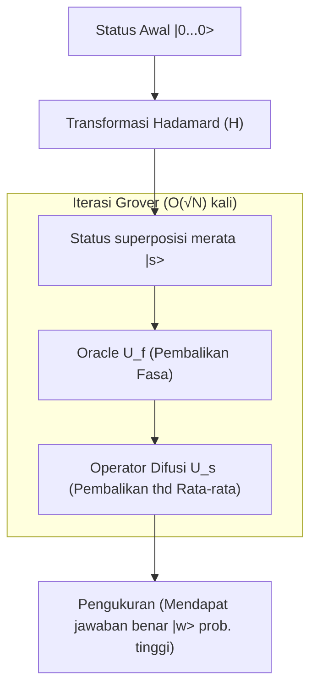

## 1. Pendahuluan: Batasan Klasik pada Masalah Pencarian dan Kemunculan Komputer Kuantum

Dalam ilmu komputer modern, "pencarian" adalah salah satu tugas yang paling dasar dan penting. Mulai dari mencari informasi pelanggan tertentu di database, menemukan rute optimal di jaringan yang luas, hingga meretas kunci kriptografi dengan brute-force, efisiensi [algoritma pencarian](/id/p/search-algorithms-linear-binary-hash-table-principles/) terhubung langsung dengan kinerja seluruh sistem.

Khususnya, jika data tidak memiliki struktur sama sekali (tidak diurutkan, tidak berpola), masalah ini disebut "masalah pencarian pada database tidak terstruktur". Misalnya, ada N buah kotak berjajar, dan hanya salah satunya yang berisi hadiah. Penampilan luar semua kotak sama persis, dan Anda tidak akan tahu isinya sampai membukanya. Dalam hal ini, komputer klasik (komputer yang biasa kita gunakan sehari-hari) akan membutuhkan jumlah percobaan rata-rata N/2 kali, dan dalam skenario terburuk N kali, untuk menemukan kotak yang berisi hadiah. Artinya, kompleksitas komputasinya (kompleksitas waktu) berbanding lurus dengan jumlah data N, dan ditulis sebagai $O(N)$.

Jika N kecil, algoritma $O(N)$ tidak masalah. Namun, jika N mencapai jutaan, ratusan juta, atau bahkan angka astronomis seperti $2^{128}$ atau $2^{256}$, komputer klasik tidak akan mampu menyelesaikan pencarian bahkan jika membutuhkan waktu hingga akhir usia alam semesta. Ini adalah batas fisik dan matematis dari pencarian tidak terstruktur secara klasik.

Namun, dengan kemunculan "komputer kuantum", yang memanfaatkan sifat aneh dari mekanika kuantum (superposisi, keterikatan, dan interferensi) sebagai sumber daya komputasi, batasan ini berpotensi untuk ditembus. Pada tahun 1996, Lov Grover, yang saat itu bekerja di Bell Labs, mempublikasikan sebuah algoritma terobosan yang mampu melakukan pencarian database tidak terstruktur dengan kompleksitas waktu $O(\sqrt{N})$. Inilah yang disebut "Algoritma Grover (Grover's Algorithm)".

Pengurangan kompleksitas dari $O(N)$ menjadi $O(\sqrt{N})$ disebut "percepatan kuadrat (Quadratic Speedup)". Pada pandangan pertama, dampaknya mungkin terasa kecil dibandingkan percepatan eksponensial (Exponential Speedup) dari algoritma Shor untuk faktorisasi bilangan prima. Namun, karena pencarian tidak terstruktur muncul sebagai subtugas di berbagai masalah, cakupan aplikasi algoritma Grover sangat luas. Ini berdampak signifikan terhadap masalah optimisasi kombinatorial, pembelajaran mesin, dan yang paling krusial, keamanan teknologi kriptografi modern (kriptografi kunci simetris).

Dalam artikel ini, kami akan membahas secara mendalam mengapa dan bagaimana Algoritma Grover mempercepat proses pencarian, mulai dari dasar matematikanya hingga implementasi sirkuit kuantum, serta dampaknya terhadap masyarakat.

## 2. Dasar-dasar Mekanika Kuantum: Superposisi dan Amplitudo Probabilitas

Untuk memahami algoritma Grover, pertama-tama kita perlu memahami metode representasi dasar dari informasi kuantum. Pada komputer klasik, unit terkecil informasi adalah "Bit" yang mengambil kondisi "0" atau "1". Pada komputer kuantum, unit terkecilnya disebut "Qubit (Quantum Bit)".

Ciri utama dari qubit adalah sifat "Superposisi (Superposition)", di mana qubit bisa berada pada keadaan "0" dan "1" secara bersamaan. Secara matematis, status suatu qubit $|\psi\rangle$ dinyatakan sebagai kombinasi linear dari status basis $|0\rangle$ dan $|1\rangle$:

$$ |\psi\rangle = \alpha|0\rangle + \beta|1\rangle $$

Di sini, $\alpha$ dan $\beta$ adalah bilangan kompleks, dan disebut "Amplitudo Probabilitas (Probability Amplitude)". Ketika sebuah qubit diamati, probabilitas untuk mendapatkan status $|0\rangle$ adalah $|\alpha|^2$, dan untuk status $|1\rangle$ adalah $|\beta|^2$. Karena total probabilitas harus bernilai 1, maka kondisi normalisasi berikut harus terpenuhi:

$$ |\alpha|^2 + |\beta|^2 = 1 $$

Jika kita menyusun n buah qubit, dimensi ruang statusnya menjadi $2^n$. Misalnya, status 3 qubit bisa direpresentasikan sebagai superposisi dari $2^3 = 8$ basis status.

$$ |\psi\rangle = \alpha_0|000\rangle + \alpha_1|001\rangle + \dots + \alpha_7|111\rangle $$

Algoritma Grover menggunakan mekanisme di mana ke-$2^n$ probabilitas ini (semua kemungkinan target pencarian) diinisialisasi dengan amplitudo probabilitas yang sama, kemudian menggunakan interferensi kuantum (Quantum Interference) untuk memperkuat amplitudo probabilitas dari kondisi jawaban yang benar saja, sehingga jawaban yang benar akan diperoleh dengan probabilitas tinggi saat diamati. Proses ini disebut "Amplifikasi Amplitudo (Amplitude Amplification)".

## 3. Formulasi Masalah: Apa itu Oracle?

Pada algoritma Grover, masalah pencarian diformulasikan secara matematis sebagai berikut:

Misalkan indeks yang menjadi target pencarian adalah $x \in \{0, 1\}^n$. Jumlah total elemennya adalah $N = 2^n$. Misalkan ada fungsi $f(x)$ yang mengembalikan nilai $1$ hanya jika input $x$ adalah indeks yang benar (target), dan $0$ pada kasus lainnya.

- Untuk target: $f(x) = 1$
- Bukan target: $f(x) = 0$

Tujuan kita adalah mengevaluasi fungsi $f(x)$ guna menemukan $x$ (mari kita sebut $w$) yang menghasilkan $f(x) = 1$. Dalam algoritma klasik, tidak ada cara lain selain mencoba berbagai kemungkinan $x$ satu per satu (kueri) sampai hasil $1$ didapat.

Pada komputasi kuantum, operator mirip *black box* yang mengevaluasi fungsi $f(x)$ ini disebut "Oracle Kuantum (Quantum Oracle)". Oracle $U_f$ melakukan transformasi uniter terhadap status kuantum sebagai berikut:

$$ U_f |x\rangle |y\rangle = |x\rangle |y \oplus f(x)\rangle $$

Di sini, $|y\rangle$ adalah qubit bantu (ancilla bit), dan $\oplus$ merupakan penjumlahan modulo 2 (XOR).

Dalam algoritma Grover, ada teknik yang digunakan di mana qubit bantu $|y\rangle$ diinisialisasi ke status $|-\rangle = \frac{1}{\sqrt{2}}(|0\rangle - |1\rangle)$ lalu diaplikasikan ke Oracle (teknik *Phase Kickback*). Hasilnya, kerja dari Oracle disederhanakan menjadi:

$$ U_f |x\rangle = (-1)^{f(x)} |x\rangle $$

Dengan kata lain, Oracle $U_f$ membalikkan fasa (tanda) pada status jawaban yang benar $|w\rangle$, sementara status lainnya dibiarkan apa adanya.

- Jika jawaban benar: $U_f |w\rangle = -|w\rangle$
- Jika jawaban salah: $U_f |x\rangle = |x\rangle \quad (x \neq w)$

Jika direpresentasikan dalam matriks, $U_f$ menjadi matriks diagonal di mana hanya komponen diagonal dari indeks jawaban benar yang bernilai $-1$, dan yang lainnya $1$.

## 4. Mekanisme Iterasi Grover (Grover Iteration)

Algoritma Grover terdiri dari 4 langkah utama berikut:

1. **Inisialisasi (Initialization)**
2. **Pembalikan Fasa oleh Oracle (Oracle Phase Flip)**
3. **Pembalikan terhadap Nilai Rata-rata (Inversion About the Mean / Diffusion Operator)**
4. **Pengukuran (Measurement)**

Kombinasi langkah 2 dan 3 disebut "Iterasi Grover (Grover Iteration)". Dengan mengulang langkah ini beberapa kali secara optimal, amplitudo probabilitas dari status jawaban yang benar akan dimaksimalkan.



### 4.1 Inisialisasi

Pertama-tama, inisialisasi semua n qubit ke status $|0\rangle$. Kemudian terapkan Gerbang Hadamard (Hadamard Gate, $H$) ke setiap qubit untuk menciptakan status superposisi merata $|s\rangle$ di mana semua status memiliki amplitudo probabilitas yang sama.

$$ |s\rangle = H^{\otimes n} |0\rangle^{\otimes n} = \frac{1}{\sqrt{N}} \sum_{x=0}^{N-1} |x\rangle $$

Pada status ini, probabilitas untuk mengamati semua status adalah sama, yaitu $1/N$. Semua amplitudo probabilitas bernilai $\frac{1}{\sqrt{N}}$.

### 4.2 Pembalikan Fasa oleh Oracle

Terapkan Oracle $U_f$ ke status superposisi $|s\rangle$. Seperti yang dijelaskan sebelumnya, hanya tanda (fasa) amplitudo probabilitas jawaban benar $|w\rangle$ yang akan dibalik.

$$ U_f |s\rangle = \frac{1}{\sqrt{N}} \sum_{x \neq w} |x\rangle - \frac{1}{\sqrt{N}} |w\rangle $$

Operasi ini hanya membuat amplitudo dari jawaban benar menjadi negatif, namun nilai probabilitasnya (kuadrat absolut amplitudo) tidak berubah. Jadi pada titik ini probabilitas mendapatkan jawaban benar tetap $1/N$. Karenanya kita perlu langkah selanjutnya.

### 4.3 Operator Difusi (Pembalikan terhadap Rata-rata)

Berikutnya kita terapkan Operator Difusi (Diffusion Operator) $U_s$. Operasi ini membalikkan amplitudo probabilitas setiap status menggunakan "nilai rata-rata" amplitudo seluruh status sebagai titik pusatnya.

Secara matematis, $U_s$ didefinisikan sebagai:

$$ U_s = 2|s\rangle\langle s| - I $$

Di sini $I$ adalah matriks identitas. Mari kita coba memahaminya secara intuitif.

1. Setelah Oracle diterapkan, amplitudo jawaban benar menjadi minus, sementara yang lain positif.
2. Rata-rata seluruh amplitudo pun menjadi sedikit lebih kecil dari awal $\frac{1}{\sqrt{N}}$.
3. Karena amplitudo jawaban yang salah (positif) lebih besar dari rata-rata baru ini, ketika dibalikkan thd rata-rata nilainya akan menjadi **lebih kecil**.
4. Sebaliknya, amplitudo jawaban yang benar (minus) berada jauh di bawah nilai rata-rata (positif). Maka ketika dibalik, nilainya melesat tajam dan menjadi **jauh lebih besar** (positif).

Hasilnya, probabilitas jawaban salah akan turun dan jawaban benar akan dikuatkan. Pasangan (Oracle dan Difusi) ini $U_s U_f$ adalah satu "Iterasi Grover" (Grover Operator, $G$).

$$ G = U_s U_f $$

### 4.4 Interpretasi Geometris dan Perhitungan Jumlah Iterasi

Iterasi Grover dapat direpresentasikan secara elegan dalam geometri rotasi di bidang 2 dimensi.

Bayangkan ruang status sebagai bidang 2D yang dibentuk oleh dua vektor ortogonal: status jawaban benar $|w\rangle$ dan $|s'\rangle$ yang merupakan superposisi merata dari semua jawaban salah.

$$ |s'\rangle = \frac{1}{\sqrt{N-1}} \sum_{x \neq w} |x\rangle $$

Status awal $|s\rangle$ dapat direpresentasikan di bidang ini sebagai vektor yang miring dari $|s'\rangle$ ke arah $|w\rangle$ dengan sudut $\theta$.

$$ |s\rangle = \sin\theta |w\rangle + \cos\theta |s'\rangle $$

Di mana $\sin\theta = \frac{1}{\sqrt{N}}$. Jika $N$ cukup besar, bisa didekati dengan $\theta \approx \frac{1}{\sqrt{N}}$.

Secara matematis telah dibuktikan bahwa mengaplikasikan iterasi Grover $G$ satu kali sama dengan merotasi vektor status pada bidang 2D tersebut ke arah $|w\rangle$ sebesar $2\theta$.

Maka status setelah $k$ iterasi, yaitu $|\psi_k\rangle$, menjadi:

$$ |\psi_k\rangle = G^k |s\rangle = \sin((2k+1)\theta) |w\rangle + \cos((2k+1)\theta) |s'\rangle $$

Tujuan kita adalah mendekatkan vektor ke $|w\rangle$ sedekat mungkin, yaitu membuat $\sin((2k+1)\theta) \approx 1$. Hal ini berarti sudutnya menjadi $\pi/2$ (90 derajat).

$$ (2k+1)\theta \approx \frac{\pi}{2} $$

Jika $\theta \approx \frac{1}{\sqrt{N}}$ disubstitusikan lalu kita pecahkan untuk $k$, didapat:

$$ k \approx \frac{\pi}{4}\sqrt{N} $$

Inilah bukti matematika mengapa algoritma Grover kompleksitasnya menjadi $O(\sqrt{N})$. Menariknya, jika iterasi dilakukan terlalu banyak, vektornya akan melewati $|w\rangle$ dan malah mengurangi probabilitas untuk mendapatkan jawaban benar. Jadi kita harus menghentikan iterasi pada jumlah yang optimal.

## 5. Implementasi di Python Menggunakan Qiskit

Sekarang mari kita lihat praktiknya menggunakan "Qiskit", *framework* kuantum *open source* milik IBM.

Demi kesederhanaan, mari kita gunakan $N=4$ ($n=2$ qubit). Misal jawabannya adalah $w = |11\rangle$ (indeks 3). Jumlah iterasi yang dibutuhkan adalah $\frac{\pi}{4}\sqrt{4} \approx 1.57$, artinya dengan 1 iterasi kita akan mendapatkan probabilitas yang sangat tinggi.

```python
from qiskit import QuantumCircuit
from qiskit_aer import AerSimulator
from qiskit.visualization import plot_histogram
import matplotlib.pyplot as plt
import numpy as np

# Jumlah qubit
n = 2

# Inisialisasi sirkuit (2 qubit kuantum + 2 bit klasik untuk pengukuran)
qc = QuantumCircuit(n, n)

# 1. Inisialisasi: Terapkan Hadamard Gate
qc.h([0, 1])
qc.barrier()

# 2. Oracle: Membalikkan fasa |11> (Bisa menggunakan CZ gate)
# Kalikan -1 hanya pada |11>
qc.cz(0, 1)
qc.barrier()

# 3. Operator Difusi
# H -> X -> CZ -> X -> H
qc.h([0, 1])
qc.x([0, 1])
qc.cz(0, 1)
qc.x([0, 1])
qc.h([0, 1])
qc.barrier()

# 4. Pengukuran
qc.measure([0, 1], [0, 1])

# Menggambar sirkuit (dapat dilihat di terminal/Jupyter)
print(qc.draw())

# Eksekusi di simulator
simulator = AerSimulator()
result = simulator.run(qc, shots=1000).result()
counts = result.get_counts()

print("\nHasil Pengukuran:", counts)
# Akan memperoleh {'11': 1000}, probabilitas 100% untuk jawaban benar
```

Pada contoh sederhana ini, kita membuat Oracle dan operator difusi hanya menggunakan *gate* dasar (H, X, CZ). Untuk $N=4$, secara teoritis satu kali iterasi akan menjamin 100% peluang mendapatkan $|11\rangle$. Dari kode di atas, Anda bisa langsung merasakan kekuatan dari "Paralelisme" dan "Interferensi" sirkuit kuantum.

Jika skalanya lebih besar, mendesain Oracle maupun Multi-Controlled Toffoli akan makin rumit, tapi prinsip dasarnya akan tetap sama berapapun jumlah qubitnya.

## 6. Ancaman Algoritma Grover terhadap Kriptografi

Algoritma Grover bukan cuma teka-teki matematis. Ia adalah ancaman dunia nyata bagi *cyber security*, terutama bagi kriptografi kunci simetris (seperti AES) maupun fungsi hash (seperti SHA-256).

### Dampak pada Kriptografi Kunci Simetris
Pada enkripsi AES-128, panjang kunci adalah 128-bit, sehingga ada $2^{128}$ kemungkinan. Komputer klasik butuh maksimal $2^{128}$ operasi *brute-force*, sehingga waktu yang dibutuhkan melebihi usia alam semesta, makanya dibilang "aman" secara praktis.

Namun, jika *hacker* memakai *Fault-Tolerant Quantum Computer* (FTQC) skala besar dengan algoritma Grover, dengan fungsi enkripsi sebagai Oracle, waktu pencariannya tinggal $O(\sqrt{2^{128}}) = O(2^{64})$.

Proses komputasi sebesar $2^{64}$ bisa diselesaikan di waktu yang realistis (beberapa minggu/bulan) walau hanya memakai *cluster* komputer klasik *high-end* modern. Jadi jika komputer kuantum ini benar-benar terwujud, kunci 128-bit tidak lagi aman.

### Migrasi ke Kriptografi Pasca-Kuantum (Post-Quantum Cryptography)
Solusinya sebenarnya sangat sederhana secara prinsip: Gandakan panjang kuncinya.

Jika kita pakai AES-256, maka ruang kuncinya $2^{256}$. Dengan algoritma Grover, perhitungannya jadi $\sqrt{2^{256}} = 2^{128}$, yang sama kuatnya dengan AES-128 di hadapan komputer klasik.

Itu sebabnya lembaga standardisasi seperti NIST mulai mengharuskan "pemakaian kunci minimal 256-bit". Hal yang sama juga berlaku untuk fungsi *hash*, migrasi ke SHA-384 atau SHA-512 sedang digalakkan karena ketahanan SHA-256 melemah.

Seperti algoritma Shor yang melumpuhkan kriptografi kunci publik (RSA/[ECC](/id/p/elliptic-curve-cryptography-math-cpp/)), algoritma Grover adalah tonggak sejarah yang krusial di dunia keamanan informasi.

## 7. Aplikasi dan Perkembangan: Masa Depan Algoritma Grover

Algoritma Grover tidak cuma untuk mencari *database* tak beraturan, banyak bidang lain yang dikembangkan berdasarkannya.

- **Penerapan di soal *NP-Complete* (seperti SAT)**: Proses pencarian ruang jawaban optimalisasi kombinatorial bisa dipercepat pakai iterasi Grover. Pendekatan gabungan algoritma kuantum dan klasik/heuristik sedang marak.
- **Quantum Machine Learning (QML)**: Modifikasi amplifikasi amplitudo dalam optimasi jarak (*clustering*) agar proses *learning* lebih cepat.
- **Quantum Walk**: Generalisasi algoritma Grover buat data yang berstruktur seperti *graph*, yang diproyeksi ampuh buat analisis jaringan.

## 8. Kesimpulan: Potensi dan Batasan Komputasi Kuantum

Algoritma Grover adalah contoh sempurna keunggulan mutlak komputer kuantum atas komputer klasik. Memangkas proses *O(N)* jadi *O(√N)* adalah efek dramatis yang luar biasa saat mengurus miliaran data.

Namun kita harus paham bahwa Grover bukan "tongkat sihir". Bisa saja pembuatan Oracle ternyata amat berat, atau terkendala sewaktu meload data (QRAM bottleneck), alhasil kecepatannya tidak sesuai bayangan ideal teori. *Overhead* untuk perbaikan *error* (QEC) juga berarti masih ada jalan panjang yang harus dilalui oleh terobosan *hardware* maupun *software*.

Terlepas dari itu, nilai estetika teoritis dari memanipulasi *probabilitas* dan memancing kemunculan jawaban tepat di tengah samudra kekacauan ini begitu apik. Ia membuktikan betapa indahnya ketika manusia sanggup mengontrol hukum alam (*Mekanika Kuantum*) untuk komputasi.

Bagi insinyur dan peneliti masa depan, pemahaman tajam soal cara kerja algoritma ini adalah senjata vital menyambut Era Kuantum. Sains informasi kuantum baru saja lahir, dan algoritma *super* selanjutnya barangkali segera menyusul dalam waktu dekat.
