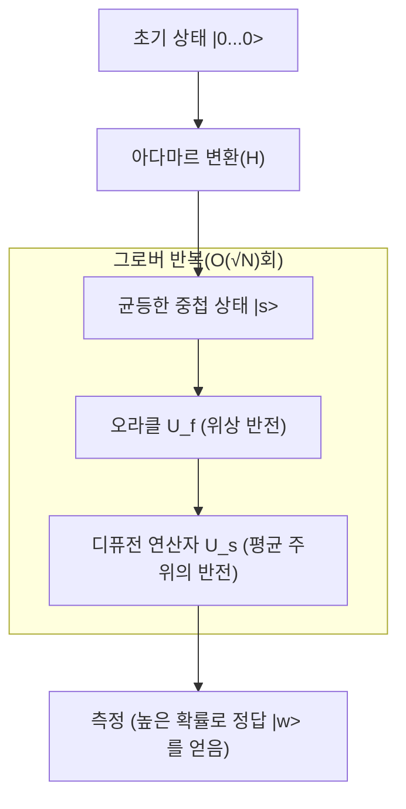

## 1. 서론: 검색 문제의 고전적 한계와 양자 컴퓨터의 대두

현대 컴퓨터 과학에서 '검색'은 가장 기본적이고 중요한 작업 중 하나입니다. 데이터베이스에서 특정 고객 정보를 찾아내거나, 광대한 네트워크 속에서 최적의 경로를 찾거나, 암호 키를 무차별 대입으로 해독하는 등 검색 알고리즘의 효율성은 모든 시스템의 성능과 직결됩니다.

특히 데이터가 아무런 구조도 가지지 않을 때(정렬되어 있지 않거나 규칙성이 없는 경우) 이를 '비구조화 데이터베이스 검색 문제'라고 부릅니다. 예를 들어 N개의 상자가 늘어서 있고, 그중 단 하나에만 당첨이 들어 있다고 합시다. 상자의 겉모습은 모두 같으며, 열어보기 전까지는 내용물을 알 수 없습니다. 이 경우 고전적인 컴퓨터(현재 우리가 일상적으로 사용하는 컴퓨터)가 당첨을 찾기 위해 필요한 시도 횟수는 최악의 경우 N번, 평균적으로 N/2번이 됩니다. 즉, 계산량(시간 [복잡도](/ko/p/time-space-complexity-big-o-notation-examples/))은 데이터 수 N에 비례하며 $O(N)$ 으로 표현됩니다.

N이 작다면 $O(N)$ 알고리즘으로도 문제없지만, N이 수백만, 수억, 심지어 $2^{128}$ 이나 $2^{256}$ 과 같이 천문학적인 숫자가 되면 고전 컴퓨터로는 우주의 수명이 다할 때까지의 시간을 들여도 검색을 완료할 수 없게 됩니다. 이것이 고전적인 비구조화 검색에 있어서의 물리적이자 수학적인 한계입니다.

하지만 양자 역학의 기묘한 성질(중첩, 얽힘, 간섭)을 계산 자원으로 이용하는 '양자 컴퓨터'의 등장으로 이 한계를 돌파할 가능성이 제시되었습니다. 1996년, 벨 연구소에 소속되어 있던 로브 그로버(Lov Grover)는 비구조화 데이터베이스 검색을 $O(\sqrt{N})$ 의 계산량으로 실행할 수 있는 획기적인 알고리즘을 발표했습니다. 이것이 '그로버 알고리즘(Grover's Algorithm)'입니다.

$O(N)$ 에서 $O(\sqrt{N})$ 으로의 계산량 감소는 '이차적 가속(Quadratic Speedup)'이라고 불립니다. 언뜻 보면 쇼어 알고리즘(Shor's Algorithm)에 의한 소인수 분해의 지수함수적 가속(Exponential Speedup)에 비해 임팩트가 작게 느껴질지도 모릅니다. 하지만 비구조화 검색은 모든 문제의 하위 작업으로 나타나기 때문에 그로버 알고리즘의 응용 범위는 매우 넓으며, 조합 최적화 문제, 기계 학습, 그리고 특히 현대 암호 기술(대칭키 암호)의 안전성에 결정적인 영향을 미칩니다.

본 기사에서는 이 그로버 알고리즘이 왜, 그리고 어떻게 검색을 고속화하는지, 그 수학적 기초부터 양자 회로의 구현, 나아가 사회에 미치는 영향까지 철저하게 파고들어 해설합니다.

## 2. 양자 역학의 기초: 중첩과 확률 진폭

그로버 알고리즘을 이해하려면 먼저 양자 정보의 기본적인 표현 방법을 이해해야 합니다. 고전 컴퓨터의 정보의 최소 단위가 '0'이나 '1' 중 하나의 상태를 취하는 '비트(Bit)'인 반면, 양자 컴퓨터의 정보의 최소 단위는 '양자 비트(Qubit, 큐비트)'라고 불립니다.

양자 비트의 가장 큰 특징은 '0'과 '1'의 상태를 동시에 취할 수 있는 '중첩(Superposition)'의 성질을 갖는 것입니다. 수학적으로 1개의 양자 비트 상태 $|\psi\rangle$ 는 기저 상태 $|0\rangle$ 와 $|1\rangle$ 의 선형 결합으로 다음과 같이 표현됩니다.

$$ |\psi\rangle = \alpha|0\rangle + \beta|1\rangle $$

여기서 $\alpha$ 와 $\beta$ 는 복소수이며 '확률 진폭(Probability Amplitude)'이라고 불립니다. 양자 비트를 관측했을 때 상태 $|0\rangle$ 을 얻을 확률은 $|\alpha|^2$, 상태 $|1\rangle$ 을 얻을 확률은 $|\beta|^2$ 가 됩니다. 확률의 합은 1이 되어야 하므로 다음의 규격화 조건을 만족해야 합니다.

$$ |\alpha|^2 + |\beta|^2 = 1 $$

n개의 양자 비트를 나열한 경우, 상태 공간의 차원은 $2^n$ 이 됩니다. 예를 들어 3 양자 비트의 상태는 $2^3 = 8$ 개의 기저 상태의 중첩으로 표현할 수 있습니다.

$$ |\psi\rangle = \alpha_0|000\rangle + \alpha_1|001\rangle + \dots + \alpha_7|111\rangle $$

그로버 알고리즘은 이 $2^n$ 개의 가능한 모든 상태(검색 대상의 전체 후보)를 동일한 확률 진폭으로 초기화하고, 양자 간섭(Quantum Interference)을 이용하여 정답이 되는 상태의 확률 진폭만을 증폭시킴으로써, 관측 시 높은 확률로 정답을 얻는 메커니즘을 가지고 있습니다. 이 과정을 '진폭 증폭(Amplitude Amplification)'이라고 부릅니다.

## 3. 문제의 정식화: 오라클(Oracle)이란 무엇인가

그로버 알고리즘에서 검색 문제는 다음과 같이 수학적으로 정식화됩니다.

검색 대상의 인덱스를 $x \in \{0, 1\}^n$ 이라고 합시다. 전체 요소 수는 $N = 2^n$ 입니다. 함수 $f(x)$ 를 고려할 때, 이 함수는 입력 $x$ 가 정답 인덱스(타깃)인 경우에만 $1$ 을 반환하고 그 외의 경우에는 $0$ 을 반환한다고 가정합니다.

- 타깃인 경우: $f(x) = 1$
- 타깃이 아닌 경우: $f(x) = 0$

우리의 목적은 함수 $f(x)$ 를 평가함으로써 $f(x) = 1$ 이 되는 $x$(이를 $w$ 라고 합시다)를 찾아내는 것입니다. 고전적인 알고리즘에서는 $f(x)$ 를 다양한 $x$ 에 대해 평가(쿼리)하고 결과가 $1$ 이 될 때까지 시도를 반복할 수밖에 없습니다.

양자 계산에서 이 함수 $f(x)$ 의 평가를 수행하는 블랙박스적인 연산자를 '양자 오라클(Quantum Oracle)'이라고 부릅니다. 오라클 $U_f$ 는 양자 상태에 대해 다음과 같은 유니터리 변환을 수행합니다.

$$ U_f |x\rangle |y\rangle = |x\rangle |y \oplus f(x)\rangle $$

여기서 $|y\rangle$ 는 보조 양자 비트(안실라 비트, Ancilla Bit), $\oplus$ 는 모듈로 2 덧셈(XOR)을 나타냅니다.

그로버 알고리즘에서는 보조 양자 비트 $|y\rangle$ 를 상태 $|-\rangle = \frac{1}{\sqrt{2}}(|0\rangle - |1\rangle)$ 로 초기화하여 오라클에 적용하는 기법(위상 킥백: Phase Kickback)을 사용합니다. 이를 통해 오라클의 작용은 다음과 같이 단순화됩니다.

$$ U_f |x\rangle = (-1)^{f(x)} |x\rangle $$

즉, 오라클 $U_f$ 는 정답 상태 $|w\rangle$ 의 위상(부호)만을 반전시키고, 나머지 상태의 위상은 그대로 두는 조작을 수행합니다.

- 정답인 경우: $U_f |w\rangle = -|w\rangle$
- 오답인 경우: $U_f |x\rangle = |x\rangle \quad (x \neq w)$

행렬로 표현하면 $U_f$ 는 대각 행렬이 되며, 정답 인덱스에 해당하는 대각 성분만 $-1$, 나머지는 모두 $1$ 이 됩니다.

## 4. 그로버 반복(Grover Iteration)의 메커니즘

그로버 알고리즘은 다음의 4가지 주요 단계로 구성됩니다.

1. **초기화(Initialization)**
2. **오라클에 의한 위상 반전(Oracle Phase Flip)**
3. **평균값 주위의 반전(Inversion About the Mean / Diffusion Operator)**
4. **측정(Measurement)**

단계 2와 단계 3의 조합을 '그로버 반복(Grover Iteration)'이라고 부르며, 이를 최적의 횟수만큼 반복함으로써 정답 상태의 확률 진폭을 극대화합니다.



### 4.1 초기화

먼저 n개의 양자 비트를 모두 $|0\rangle$ 상태로 초기화합니다. 다음으로 각 양자 비트에 아다마르 게이트(Hadamard Gate, $H$)를 적용하여, 모든 상태가 동일한 확률 진폭을 가지는 균등한 중첩 상태 $|s\rangle$ 를 만듭니다.

$$ |s\rangle = H^{\otimes n} |0\rangle^{\otimes n} = \frac{1}{\sqrt{N}} \sum_{x=0}^{N-1} |x\rangle $$

이 상태에서는 모든 상태를 관측할 확률이 $1/N$ 로 동일합니다. 확률 진폭은 모두 $\frac{1}{\sqrt{N}}$ 입니다.

### 4.2 오라클에 의한 위상 반전

균등한 중첩 상태 $|s\rangle$ 에 대해 오라클 $U_f$ 를 적용합니다. 앞서 말했듯이 정답 상태 $|w\rangle$ 의 확률 진폭 부호(위상)만 반전됩니다.

$$ U_f |s\rangle = \frac{1}{\sqrt{N}} \sum_{x \neq w} |x\rangle - \frac{1}{\sqrt{N}} |w\rangle $$

이 조작으로 인해 정답의 진폭만이 마이너스가 되지만, 확률(진폭 절댓값의 제곱)은 변하지 않았습니다. 따라서 이 시점의 측정에서 정답을 찾을 확률은 여전히 $1/N$ 그대로입니다. 여기서 다음 단계가 필요합니다.

### 4.3 디퓨전 연산자(평균값 주위의 반전)

다음으로 디퓨전 연산자(Diffusion Operator) $U_s$ 를 적용합니다. 이 연산자는 각 상태의 확률 진폭을 모든 상태의 확률 진폭 '평균값'을 기준으로 반전시키는 조작을 수행합니다.

수학적으로 $U_s$ 는 다음과 같이 정의됩니다.

$$ U_s = 2|s\rangle\langle s| - I $$

여기서 $I$ 는 단위 행렬입니다. 이 연산자를 적용하면 어떤 일이 일어나는지 직관적으로 이해해 봅시다.

1. 오라클 적용 후 정답의 진폭은 마이너스가 되고, 오답의 진폭은 플러스 그대로입니다.
2. 이로 인해 전체 진폭의 '평균값'은 원래의 $\frac{1}{\sqrt{N}}$ 보다 약간 작아집니다.
3. 오답의 진폭(플러스)은 이 새로운 평균값보다 크기 때문에 평균값을 기준으로 반전하면 원래 값보다 **작아집니다**.
4. 반면 정답의 진폭(마이너스)은 평균값(플러스)보다 훨씬 아래에 있기 때문에 평균값을 기준으로 반전하면 원래 값보다 훨씬 크게 **플러스 방향으로 솟구칩니다**.

결과적으로 오답의 확률 진폭이 감소하고 정답의 확률 진폭이 증폭됩니다. 이 오라클과 디퓨전 연산자의 쌍($U_s U_f$)을 1회의 그로버 반복(Grover Operator, $G$)으로 정의합니다.

$$ G = U_s U_f $$

### 4.4 기하학적 해석과 반복 횟수의 도출

그로버 반복은 2차원 평면상의 회전 운동으로 매우 아름답게 기하학적으로 표현될 수 있습니다.

상태 공간을 정답 상태 $|w\rangle$ 와 모든 오답 상태의 균등한 중첩인 $|s'\rangle$ 이라는 두 개의 직교하는 벡터로 구성된 2차원 평면으로 생각합니다.

$$ |s'\rangle = \frac{1}{\sqrt{N-1}} \sum_{x \neq w} |x\rangle $$

초기 상태 $|s\rangle$ 는 이 평면상에서 $|s'\rangle$ 로부터 각도 $\theta$ 만큼 $|w\rangle$ 방향으로 기울어진 벡터로 표현할 수 있습니다.

$$ |s\rangle = \sin\theta |w\rangle + \cos\theta |s'\rangle $$

여기서 $\sin\theta = \frac{1}{\sqrt{N}}$ 입니다. $N$ 이 충분히 크다면 $\theta \approx \frac{1}{\sqrt{N}}$ 으로 근사할 수 있습니다.

그로버 반복 $G$ 를 1회 적용하는 것은 이 2차원 평면상에서 상태 벡터를 각도 $2\theta$ 만큼 $|w\rangle$ 방향으로 회전시키는 것과 같다는 것이 수학적으로 증명되어 있습니다.

따라서 $k$ 번의 반복을 수행한 후의 상태 $|\psi_k\rangle$ 는 다음과 같이 됩니다.

$$ |\psi_k\rangle = G^k |s\rangle = \sin((2k+1)\theta) |w\rangle + \cos((2k+1)\theta) |s'\rangle $$

우리의 목표는 상태 벡터를 최대한 정답 상태 $|w\rangle$ 에 가깝게 하는 것, 즉 $\sin((2k+1)\theta) \approx 1$ 로 만드는 것입니다. 이는 각도가 $\pi/2$(90도)가 되는 것을 의미합니다.

$$ (2k+1)\theta \approx \frac{\pi}{2} $$

$\theta \approx \frac{1}{\sqrt{N}}$ 을 대입하여 $k$ 에 대해 풀면,

$$ k \approx \frac{\pi}{4}\sqrt{N} $$

이것이 그로버 알고리즘의 계산량이 $O(\sqrt{N})$ 이 되는 수학적 근거입니다. 흥미롭게도 반복 횟수를 너무 늘리면 벡터가 $|w\rangle$ 를 지나쳐버려 정답을 얻을 확률이 반대로 떨어지게 됩니다. 따라서 정확히 최적의 횟수만큼만 반복을 멈춰야 합니다.

## 5. Qiskit을 이용한 Python에서의 구현

이론뿐만 아니라 실제로 양자 회로를 작성하여 알고리즘의 동작을 확인해 봅시다. IBM이 제공하는 오픈소스 양자 계산 프레임워크인 'Qiskit'을 사용합니다.

여기서는 간단히 하기 위해 $N=4$ ($n=2$ 양자 비트)인 경우를 생각합니다. 정답을 $w = |11\rangle$ (인덱스 3)으로 설정합니다. 필요한 반복 횟수는 $\frac{\pi}{4}\sqrt{4} \approx 1.57$ 이므로, 1회의 반복으로 충분히 높은 확률을 얻을 수 있을 것입니다.

```python
from qiskit import QuantumCircuit
from qiskit_aer import AerSimulator
from qiskit.visualization import plot_histogram
import matplotlib.pyplot as plt
import numpy as np

# 양자 비트 수
n = 2

# 회로 초기화 (2 양자 비트 + 측정용 2 고전 비트)
qc = QuantumCircuit(n, n)

# 1. 초기화: 아다마르 게이트를 적용
qc.h([0, 1])
qc.barrier()

# 2. 오라클: |11> 의 위상을 반전시킨다 (CZ 게이트로 구현 가능)
# |11> 인 경우에만 -1 을 곱한다
qc.cz(0, 1)
qc.barrier()

# 3. 디퓨전 연산자
# H -> X -> CZ -> X -> H
qc.h([0, 1])
qc.x([0, 1])
qc.cz(0, 1)
qc.x([0, 1])
qc.h([0, 1])
qc.barrier()

# 4. 측정
qc.measure([0, 1], [0, 1])

# 회로 그리기 (터미널이나 Jupyter에서 확인 가능)
print(qc.draw())

# 시뮬레이터에서 실행
simulator = AerSimulator()
result = simulator.run(qc, shots=1000).result()
counts = result.get_counts()

print("\n측정 결과:", counts)
# {'11': 1000} 과 같이, 100%의 확률로 정답을 얻을 수 있다
```

이 간단한 예에서는 오라클과 디퓨전 연산자를 기본 게이트(H, X, CZ)의 조합으로 구축했습니다. $N=4$ 인 경우 1번의 반복으로 이론상 100% 확률로 정답 $|11\rangle$ 을 얻을 수 있습니다. 양자 회로가 가진 '병렬성'과 '간섭'의 힘을 코드에서 직접 느낄 수 있습니다.

규모가 커지면 오라클의 설계나 디퓨전 연산자의 다중 제어 게이트(Multi-Controlled Toffoli 등) 구현이 복잡해지지만, 기본적인 구조는 양자 비트 수가 얼마나 늘어나든 동일합니다.

## 6. 그로버 알고리즘이 가져오는 암호 기술에 대한 위협

그로버 알고리즘은 단순한 수학적 퍼즐이나 추상적인 데이터베이스 검색에 머물지 않고, 현실 세계의 사이버 보안에 대해 매우 구체적인 위협을 가져옵니다. 특히 영향을 받는 것이 AES(Advanced Encryption Standard)로 대표되는 '대칭키 암호(Symmetric-key cryptography)'나 SHA-256 등의 '해시 함수'입니다.

### 대칭키 암호에 미치는 영향
AES-128과 같은 암호 방식에서는 키 길이가 128비트이며, 가능한 키의 조합은 $2^{128}$ 가지 존재합니다. 고전 컴퓨터로 무차별 대입 공격(브루트 포스 공격)을 할 경우 최악의 상황에서 $2^{128}$ 번의 계산이 필요합니다. 이는 현재의 슈퍼컴퓨터를 이용해도 우주의 나이를 아득히 뛰어넘는 시간이 소요되기 때문에 실용적으로 '안전하다'고 간주됩니다.

하지만 공격자가 대규모의 오류 내성을 가진 양자 컴퓨터(FTQC: Fault-Tolerant Quantum Computer)를 이용하고 그로버 알고리즘을 적용할 경우, 암호 함수를 오라클로 취급함으로써 정답 키를 검색하는 계산량이 $O(\sqrt{2^{128}}) = O(2^{64})$ 로까지 극적으로 감소합니다.

$2^{64}$ 번의 연산은 현대의 고전적인 컴퓨터 클러스터에서도 현실적인 시간(몇 주에서 몇 달) 내에 실행 가능한 규모입니다. 즉, 양자 컴퓨터의 출현으로 인해 128비트의 키 길이를 가진 암호는 더 이상 안전하다고 할 수 없게 됩니다.

### 양자 내성 암호(포스트 양자 암호)로의 전환과 대책
이 위협에 대한 대책은 원리적으로 매우 간단합니다. 키 길이를 두 배로 늘리면 됩니다.

만약 AES-256을 사용한다면 키 공간은 $2^{256}$ 이 됩니다. 그로버 알고리즘을 적용해도 필요한 계산량은 $\sqrt{2^{256}} = 2^{128}$ 이 되며, 이는 고전 컴퓨터에서의 AES-128과 동등한 강도를 유지한다는 것을 의미합니다.

그렇기 때문에 NIST(미국 국립표준기술연구소)를 비롯한 표준화 기구나 각국의 보안 기관은 미래의 양자 위협을 내다보고 대칭키 암호 운용에 있어 '256비트 이상의 키 길이를 사용할 것'을 강력히 권장하고 있습니다. 해시 함수에 대해서도 마찬가지로 SHA-256에 대한 충돌 공격이나 역상 공격 내성이 저하되므로, SHA-384나 SHA-512로의 전환이 추진되고 있습니다.

이처럼 그로버 알고리즘은 공개키 암호(RSA나 [ECC](/ko/p/elliptic-curve-cryptography-math-cpp/))를 무력화하는 쇼어 알고리즘과 더불어 정보 보안 역사에 있어 중대한 전환점이 되는 알고리즘인 것입니다.

## 7. 응용과 발전: 그로버 알고리즘의 미래

그로버 알고리즘은 비구조화 검색에 국한되지 않고, 다양한 분야로의 응용 및 확장이 연구되고 있습니다.

- **충족 가능성 문제(SAT) 등의 NP-완전 문제에 대한 적용**: 조합 최적화 문제의 해 공간을 탐색할 때 그로버 반복을 이용해 탐색을 가속하는 접근 방식. 휴리스틱한 고전 알고리즘과 양자 알고리즘을 결합한 하이브리드 기법의 개발이 진행 중입니다.
- **양자 기계 학습(QML)**: 데이터 포인트 간의 거리 계산이나 클러스터링의 최적화에서 진폭 증폭의 메커니즘을 응용해 학습 과정을 고속화하는 연구.
- **양자 워크(Quantum Walk)**: 그래프 상의 검색 문제 등 구조를 가진 데이터에 대한 검색 알고리즘. 그로버 알고리즘의 일반화로 여길 수 있으며 네트워크 분석 등에서 유망하게 평가받고 있습니다.

## 8. 결론: 양자 계산의 진가와 한계

그로버 알고리즘은 양자 컴퓨터가 고전 컴퓨터에 대해 명확한 우위를 보여줄 수 있는 대표적인 예입니다. 고전적으로 $O(N)$ 이 필요한 작업을 $O(\sqrt{N})$ 으로 단축하는 이차적 가속은 데이터양이 방대해질수록 그 효과를 절대적으로 발휘합니다.

한편으로 그로버 알고리즘이 마법의 지팡이는 아니라는 점도 이해해야 합니다. 오라클 구축 자체에 큰 계산 비용이 들거나 데이터 불러오기(양자 RAM, qRAM의 구현)에 병목 현상이 있는 경우 이론대로의 가속을 얻지 못할 가능성이 지적되고 있습니다. 또한 양자 오류 정정의 오버헤드를 고려하면 실제로 고전 컴퓨터를 능가하는 성능을 달성하기 위해서는 아직 많은 하드웨어적, 소프트웨어적 돌파구가 필요합니다.

하지만 이론적인 아름다움과 그 영향력의 크기는 흔들림이 없습니다. 확률 진폭이라는 비직관적인 개념을 솜씨 좋게 다루어, 노이즈의 바다 속에서 정답만을 선명하게 증폭시키는 이 알고리즘은 인간이 자연의 법칙(양자 역학)을 계산 자원으로 어떻게 길들일 수 있는지를 보여주는 인류 지성의 결정체라고 할 수 있을 것입니다.

미래의 엔지니어나 연구자에게 그로버 알고리즘의 메커니즘을 깊이 이해하는 것은 다가올 양자 컴퓨팅 시대를 살아남기 위한 강력한 무기가 될 것입니다. 양자 정보 과학의 세계는 이제 막 시작되었을 뿐이며, 또 다른 미지의 알고리즘이 발견될 날도 그리 머지않았을지도 모릅니다.
