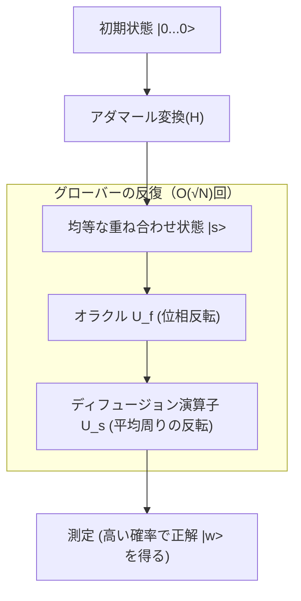

## 1. はじめに：検索問題の古典的限界と量子コンピュータの台頭

現代のコンピュータサイエンスにおいて、「検索」は最も基本的かつ重要なタスクの一つです。データベースから特定の顧客情報を探し出す、広大なネットワークの中から最適な経路を見つける、あるいは暗号鍵を総当たりで解読するなど、検索アルゴリズムの効率はあらゆるシステムの性能に直結します。

特に、データが何の構造も持たない（ソートされていない、規則性がない）場合、これを「非構造化データベースの検索問題」と呼びます。例えば、N個の箱が並んでおり、そのうちの1つにだけアタリが入っているとします。箱の外見はすべて同じで、開けてみるまで中身は分かりません。この場合、古典的なコンピュータ（現在私たちが日常的に使用しているコンピュータ）がアタリを見つけるために必要な試行回数は、最悪の場合でN回、平均でN/2回となります。つまり、計算量（時間計算量）はデータ数Nに比例し、$O(N)$ と表されます。

Nが小さければ $O(N)$ のアルゴリズムでも問題ありませんが、Nが数百万、数億、さらには $2^{128}$ や $2^{256}$ といった天文学的な数字になると、古典コンピュータでは宇宙の寿命が尽きるまでの時間をかけても検索を完了することができなくなります。これが古典的な非構造化検索における物理的かつ数学的な限界です。

しかし、量子力学の奇妙な性質（重ね合わせ、もつれ、干渉）を計算資源として利用する「量子コンピュータ」の登場により、この限界が突破される可能性が示されました。1996年、ベル研究所に所属していたロブ・グローバー（Lov Grover）は、非構造化データベースの検索を $O(\sqrt{N})$ の計算量で実行できる画期的なアルゴリズムを発表しました。これが「グローバーのアルゴリズム（Grover's Algorithm）」です。

$O(N)$ から $O(\sqrt{N})$ への計算量の削減は「二次的加速（Quadratic Speedup）」と呼ばれます。一見すると、ショアのアルゴリズム（Shor's Algorithm）による素因数分解の指数関数的加速（Exponential Speedup）に比べてインパクトが小さいように思えるかもしれません。しかし、非構造化検索はあらゆる問題のサブタスクとして現れるため、グローバーのアルゴリズムの応用範囲は極めて広く、組み合わせ最適化問題、機械学習、そして特に現代の暗号技術（共通鍵暗号）の安全性に対して決定的な影響を及ぼします。

本記事では、このグローバーのアルゴリズムがなぜ、そしてどのようにして検索を高速化するのか、その数学的な基礎から量子回路の実装、さらには社会に与える影響まで、徹底的に深掘りして解説します。

## 2. 量子力学の基礎：重ね合わせと確率振幅

グローバーのアルゴリズムを理解するためには、まず量子情報の基本的な表現方法を理解する必要があります。古典コンピュータの情報の最小単位が「0」か「1」のいずれかの状態をとる「ビット（Bit）」であるのに対し、量子コンピュータの情報の最小単位は「量子ビット（Qubit）」と呼ばれます。

量子ビットの最大の特徴は、「0」と「1」の状態を同時にとることができる「重ね合わせ（Superposition）」の性質を持つことです。数学的には、1つの量子ビットの状態 $|\psi\rangle$ は、基底状態 $|0\rangle$ と $|1\rangle$ の線形結合として次のように表されます。

$$ |\psi\rangle = \alpha|0\rangle + \beta|1\rangle $$

ここで、$\alpha$ と $\beta$ は複素数であり、「確率振幅（Probability Amplitude）」と呼ばれます。量子ビットを観測したとき、状態 $|0\rangle$ を得る確率は $|\alpha|^2$、状態 $|1\rangle$ を得る確率は $|\beta|^2$ となります。確率は合計して1になるため、以下の規格化条件を満たす必要があります。

$$ |\alpha|^2 + |\beta|^2 = 1 $$

n個の量子ビットを並べた場合、状態空間の次元は $2^n$ となります。例えば、3量子ビットの状態は $2^3 = 8$ 個の基底状態の重ね合わせとして表現できます。

$$ |\psi\rangle = \alpha_0|000\rangle + \alpha_1|001\rangle + \dots + \alpha_7|111\rangle $$

グローバーのアルゴリズムは、この $2^n$ 個のすべての可能な状態（検索対象の全候補）を等しい確率振幅で初期化し、量子干渉（Quantum Interference）を利用して、正解となる状態の確率振幅だけを増幅させることで、観測時に高い確率で正解を得るというメカニズムを持っています。このプロセスを「振幅増幅（Amplitude Amplification）」と呼びます。

## 3. 問題の定式化：オラクル（Oracle）とは何か

グローバーのアルゴリズムにおいて、検索問題は次のように数学的に定式化されます。

検索対象のインデックスを $x \in \{0, 1\}^n$ とします。全体の要素数は $N = 2^n$ です。関数 $f(x)$ を考え、この関数は入力 $x$ が正解のインデックス（ターゲット）である場合にのみ $1$ を返し、それ以外の場合は $0$ を返すとします。

- ターゲットの場合：$f(x) = 1$
- ターゲット以外の場合：$f(x) = 0$

私たちの目的は、関数 $f(x)$ を評価することで、$f(x) = 1$ となるような $x$（これを $w$ とします）を見つけ出すことです。古典的なアルゴリズムでは、$f(x)$ をさまざまな $x$ に対して評価（クエリ）し、結果が $1$ になるまで試行を繰り返すしかありません。

量子計算において、この関数 $f(x)$ の評価を行うブラックボックス的な演算子を「量子オラクル（Quantum Oracle）」と呼びます。オラクル $U_f$ は、量子状態に対して次のようなユニタリ変換を行います。

$$ U_f |x\rangle |y\rangle = |x\rangle |y \oplus f(x)\rangle $$

ここで、$|y\rangle$ は補助量子ビット（アンシラ・ビット）、$\oplus$ はモジュロ2の加算（XOR）を表します。

グローバーのアルゴリズムでは、補助量子ビット $|y\rangle$ を状態 $|-\rangle = \frac{1}{\sqrt{2}}(|0\rangle - |1\rangle)$ に初期化してオラクルに適用するテクニック（位相キックバック：Phase Kickback）を使用します。これにより、オラクルの作用は次のように簡略化されます。

$$ U_f |x\rangle = (-1)^{f(x)} |x\rangle $$

つまり、オラクル $U_f$ は、正解状態 $|w\rangle$ の位相（符号）だけを反転させ、それ以外の状態の位相はそのままにするという操作を行います。

- 正解の場合：$U_f |w\rangle = -|w\rangle$
- 不正解の場合：$U_f |x\rangle = |x\rangle \quad (x \neq w)$

行列で表現すると、$U_f$ は対角行列となり、正解のインデックスに対応する対角成分のみが $-1$、その他はすべて $1$ となります。

## 4. グローバーの反復（Grover Iteration）のメカニズム

グローバーのアルゴリズムは、以下の4つの主要なステップで構成されます。

1. **初期化（Initialization）**
2. **オラクルによる位相反転（Oracle Phase Flip）**
3. **平均値周りの反転（Inversion About the Mean / Diffusion Operator）**
4. **測定（Measurement）**

ステップ2とステップ3の組み合わせを「グローバーの反復（Grover Iteration）」と呼び、これを最適な回数だけ繰り返すことで、正解状態の確率振幅を最大化します。



### 4.1 初期化

まず、n個の量子ビットをすべて $|0\rangle$ の状態に初期化します。次に、各量子ビットにアダマールゲート（Hadamard Gate, $H$）を適用し、すべての状態が等しい確率振幅を持つ均等な重ね合わせ状態 $|s\rangle$ を作ります。

$$ |s\rangle = H^{\otimes n} |0\rangle^{\otimes n} = \frac{1}{\sqrt{N}} \sum_{x=0}^{N-1} |x\rangle $$

この状態では、すべての状態を観測する確率は $1/N$ で等しくなっています。確率振幅はすべて $\frac{1}{\sqrt{N}}$ です。

### 4.2 オラクルによる位相反転

均等な重ね合わせ状態 $|s\rangle$ に対してオラクル $U_f$ を適用します。前述の通り、正解状態 $|w\rangle$ の確率振幅の符号（位相）だけが反転します。

$$ U_f |s\rangle = \frac{1}{\sqrt{N}} \sum_{x \neq w} |x\rangle - \frac{1}{\sqrt{N}} |w\rangle $$

この操作により、正解の振幅だけがマイナスになりますが、確率（振幅の絶対値の2乗）は変化していません。したがって、この時点での測定では正解を見つける確率は依然として $1/N$ のままです。ここで次のステップが必要になります。

### 4.3 ディフュージョン演算子（平均値周りの反転）

次に、ディフュージョン演算子（Diffusion Operator）$U_s$ を適用します。この演算子は、各状態の確率振幅を、すべての状態の確率振幅の「平均値」を基準にして反転させる操作を行います。

数学的には、$U_s$ は次のように定義されます。

$$ U_s = 2|s\rangle\langle s| - I $$

ここで、$I$ は単位行列です。この演算子を適用すると何が起こるか直感的に理解してみましょう。

1. オラクル適用後、正解の振幅はマイナスになり、不正解の振幅はプラスのままです。
2. これにより、全振幅の「平均値」は元の $\frac{1}{\sqrt{N}}$ よりもわずかに小さくなります。
3. 不正解の振幅（プラス）は、この新しい平均値よりも大きいため、平均値を基準に反転すると元の値よりも**小さく**なります。
4. 一方、正解の振幅（マイナス）は、平均値（プラス）よりもずっと下にあるため、平均値を基準に反転すると元の値よりも大きく**プラスの方向に突き抜けます**。

結果として、不正解の確率振幅が減少し、正解の確率振幅が増幅されます。このオラクルとディフュージョン演算子のペア（$U_s U_f$）を1回のグローバー反復（Grover Operator, $G$）と定義します。

$$ G = U_s U_f $$

### 4.4 幾何学的な解釈と反復回数の導出

グローバーの反復は、2次元平面上の回転運動として非常に美しく幾何学的に表現できます。

状態空間を、正解状態 $|w\rangle$ と、すべての不正解状態の均等な重ね合わせである $|s'\rangle$ の2つの直交するベクトルで張られる2次元平面として考えます。

$$ |s'\rangle = \frac{1}{\sqrt{N-1}} \sum_{x \neq w} |x\rangle $$

初期状態 $|s\rangle$ は、この平面上で $|s'\rangle$ から角度 $\theta$ だけ $|w\rangle$ の方向に傾いたベクトルとして表せます。

$$ |s\rangle = \sin\theta |w\rangle + \cos\theta |s'\rangle $$

ここで、$\sin\theta = \frac{1}{\sqrt{N}}$ です。$N$ が十分に大きい場合、$\theta \approx \frac{1}{\sqrt{N}}$ と近似できます。

グローバーの反復 $G$ を1回適用することは、この2次元平面上で状態ベクトルを角度 $2\theta$ だけ $|w\rangle$ の方向に回転させることに等しいことが数学的に証明されています。

したがって、$k$ 回の反復を行った後の状態 $|\psi_k\rangle$ は次のようになります。

$$ |\psi_k\rangle = G^k |s\rangle = \sin((2k+1)\theta) |w\rangle + \cos((2k+1)\theta) |s'\rangle $$

私たちの目標は、状態ベクトルをできるだけ正解状態 $|w\rangle$ に近づけること、つまり $\sin((2k+1)\theta) \approx 1$ にすることです。これは角度が $\pi/2$ （90度）になることを意味します。

$$ (2k+1)\theta \approx \frac{\pi}{2} $$

$\theta \approx \frac{1}{\sqrt{N}}$ を代入して $k$ について解くと、

$$ k \approx \frac{\pi}{4}\sqrt{N} $$

これが、グローバーのアルゴリズムの計算量が $O(\sqrt{N})$ となる数学的根拠です。興味深いことに、反復回数を増やしすぎると、ベクトルが $|w\rangle$ を通り過ぎてしまい、正解を得る確率が逆に下がってしまいます。したがって、正確に最適な回数だけ反復を止める必要があります。

## 5. Qiskitを用いたPythonでの実装

理論だけでなく、実際に量子回路を記述してアルゴリズムの動きを確認してみましょう。IBMが提供するオープンソースの量子計算フレームワークである「Qiskit」を使用します。

ここでは、簡単のために $N=4$ ($n=2$ 量子ビット) の場合を考えます。正解を $w = |11\rangle$ (インデックス3) と設定します。必要な反復回数は $\frac{\pi}{4}\sqrt{4} \approx 1.57$ なので、1回の反復で十分に高い確率が得られるはずです。

```python
from qiskit import QuantumCircuit
from qiskit_aer import AerSimulator
from qiskit.visualization import plot_histogram
import matplotlib.pyplot as plt
import numpy as np

# 量子ビット数
n = 2

# 回路の初期化 (2量子ビット + 測定用の2古典ビット)
qc = QuantumCircuit(n, n)

# 1. 初期化：アダマールゲートを適用
qc.h([0, 1])
qc.barrier()

# 2. オラクル：|11> の位相を反転させる (CZゲートで実現可能)
# |11> の場合のみ -1 を掛ける
qc.cz(0, 1)
qc.barrier()

# 3. ディフュージョン演算子
# H -> X -> CZ -> X -> H
qc.h([0, 1])
qc.x([0, 1])
qc.cz(0, 1)
qc.x([0, 1])
qc.h([0, 1])
qc.barrier()

# 4. 測定
qc.measure([0, 1], [0, 1])

# 回路の描画 (ターミナルやJupyterで確認可能)
print(qc.draw())

# シミュレータでの実行
simulator = AerSimulator()
result = simulator.run(qc, shots=1000).result()
counts = result.get_counts()

print("\n測定結果:", counts)
# {'11': 1000} のように、100%の確率で正解が得られる
```

この簡単な例では、オラクルとディフュージョン演算子を基本ゲート（H, X, CZ）の組み合わせで構築しました。$N=4$ の場合、1回の反復で理論上100%の確率で正解の $|11\rangle$ が得られます。量子回路が持つ「並列性」と「干渉」の力をコードから直接感じ取ることができます。

規模が大きくなると、オラクルの設計やディフュージョン演算子の多制御ゲート（Multi-Controlled Toffoliなど）の実装が複雑になりますが、基本的な構造はどれだけ量子ビット数が増えても同じです。

## 6. グローバーのアルゴリズムがもたらす暗号技術への脅威

グローバーのアルゴリズムは、単なる数学的なパズルや抽象的なデータベース検索にとどまらず、現実世界のサイバーセキュリティに対して極めて具体的な脅威をもたらします。特に影響を受けるのが、AES（Advanced Encryption Standard）に代表される「共通鍵暗号（Symmetric-key cryptography）」や、SHA-256などの「ハッシュ関数」です。

### 共通鍵暗号に対する影響
AES-128のような暗号方式では、鍵長は128ビットであり、可能な鍵の組み合わせは $2^{128}$ 通り存在します。古典コンピュータで総当たり攻撃（ブルートフォース攻撃）を行う場合、最悪で $2^{128}$ 回の計算が必要です。これは現在のスーパーコンピュータを用いても宇宙の年齢をはるかに超える時間を要するため、実用上「安全」とみなされています。

しかし、攻撃者が大規模でエラー耐性のある量子コンピュータ（FTQC: Fault-Tolerant Quantum Computer）を利用し、グローバーのアルゴリズムを適用した場合、暗号関数をオラクルとして扱うことで、正解の鍵を検索する計算量が $O(\sqrt{2^{128}}) = O(2^{64})$ にまで劇的に削減されます。

$2^{64}$ 回の演算は、現代の古典的な計算機クラスターでも現実的な時間（数週間から数ヶ月）で実行可能な規模です。つまり、量子コンピュータの出現により、128ビットの鍵長を持つ暗号は、もはや安全とは言えなくなります。

### 耐量子暗号（ポスト量子暗号）への移行と対策
この脅威に対する対策は、原理的には非常にシンプルです。鍵長を2倍にすればよいのです。

もしAES-256を使用すれば、鍵の空間は $2^{256}$ となります。グローバーのアルゴリズムを適用しても、必要な計算量は $\sqrt{2^{256}} = 2^{128}$ となり、これは古典コンピュータにおけるAES-128と同等の強度を保つことを意味します。

そのため、NIST（米国国立標準技術研究所）をはじめとする標準化団体や各国のセキュリティ機関は、将来の量子脅威を見据え、共通鍵暗号の運用においては「256ビット以上の鍵長を使用すること」を強く推奨しています。ハッシュ関数についても同様で、SHA-256に対する衝突攻撃や原像攻撃の耐性が低下するため、SHA-384やSHA-512への移行が進められています。

このように、グローバーのアルゴリズムは、公開鍵暗号（RSAや[ECC](/p/elliptic-curve-cryptography-math-cpp/)）を無力化するショアのアルゴリズムと並んで、情報セキュリティの歴史における重大な転換点となるアルゴリズムなのです。

## 7. 応用と発展：グローバーのアルゴリズムの未来

グローバーのアルゴリズムは、非構造化検索に限定されず、様々な分野への応用と拡張が研究されています。

- **充足可能性問題 (SAT) などのNP完全問題への適用**：組合せ最適化問題の解空間を探索する際、グローバーの反復を利用して探索を加速するアプローチ。ヒューリスティックな古典アルゴリズムと量子アルゴリズムを組み合わせたハイブリッド手法の開発が進んでいます。
- **量子機械学習 (QML)**：データポイント間の距離計算やクラスタリングの最適化において、振幅増幅のメカニズムを応用し、学習プロセスの高速化を図る研究。
- **量子ウォーク (Quantum Walk)**：グラフ上の検索問題など、より構造を持ったデータに対する検索アルゴリズム。グローバーのアルゴリズムの一般化として捉えることができ、ネットワーク解析などに有望視されています。

## 8. 結論：量子計算の真価と限界

グローバーのアルゴリズムは、量子コンピュータが古典コンピュータに対して明確な優位性を示すことができる代表的な例です。古典的に $O(N)$ を必要とするタスクを $O(\sqrt{N})$ に短縮するという二次的加速は、データ量が膨大になるにつれてその効果を絶大に発揮します。

一方で、グローバーのアルゴリズムが魔法の杖ではないことも理解しておく必要があります。オラクルの構築自体に大きな計算コストがかかる場合や、データの読み込み（量子RAM、qRAMの実装）にボトルネックがある場合、理論通りの加速が得られない可能性が指摘されています。また、量子エラー訂正のオーバーヘッドを考慮すると、実際に古典コンピュータを上回るパフォーマンスを達成するためには、まだ多くのハードウェア的・ソフトウェア的なブレイクスルーが必要です。

しかし、理論的な美しさとその影響力の大きさは揺るぎません。確率振幅という非直感的な概念を巧みに操り、ノイズの海の中から正解だけを鮮やかに増幅させるこのアルゴリズムは、人間が自然の法則（量子力学）を計算資源としてどのように飼い慣らすことができるかを示す、人類の知性の結晶と言えるでしょう。

未来のエンジニアや研究者にとって、グローバーのアルゴリズムのメカニズムを深く理解することは、来るべき量子コンピューティング時代を生き抜くための強力な武器となるはずです。量子情報科学の世界はまだ始まったばかりであり、さらなる未知のアルゴリズムが発見される日もそう遠くはないかもしれません。
