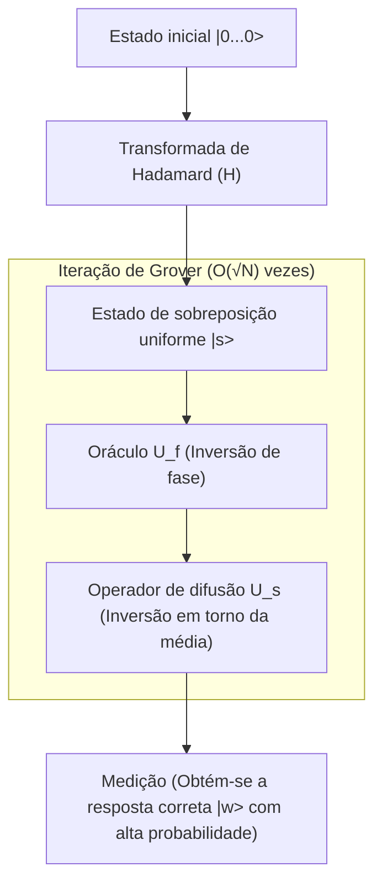

## 1. Introdução: Limites clássicos do problema de busca e a ascensão dos computadores quânticos

Na ciência da computação moderna, a "busca" é uma das tarefas mais fundamentais e importantes. Seja para encontrar informações específicas de clientes em um banco de dados, descobrir a rota ideal em uma rede vasta ou quebrar uma chave criptográfica por força bruta, a eficiência dos [algoritmos de busca](/pt/p/search-algorithms-linear-binary-hash-table-principles/) afeta diretamente o desempenho de qualquer sistema.

Em particular, quando os dados não possuem nenhuma estrutura (não classificados, sem regras), isso é chamado de "problema de busca em banco de dados não estruturado". Por exemplo, suponha que haja N caixas alinhadas e apenas uma delas contenha o prêmio. A aparência externa das caixas é toda igual, e é impossível saber o conteúdo até abri-las. Nesse caso, o número de tentativas necessárias para um computador clássico (os computadores que usamos no nosso dia a dia) encontrar o prêmio será, no pior dos casos, N vezes, e em média N/2 vezes. Ou seja, a complexidade computacional (complexidade de tempo) é proporcional ao número de dados N, e é denotada como $O(N)$.

Se N for pequeno, um algoritmo de $O(N)$ não representa um problema. Mas quando N atinge números astronômicos como milhões, centenas de milhões ou mesmo $2^{128}$ e $2^{256}$, um computador clássico não conseguirá concluir a busca nem se levasse toda a duração da vida do universo. Este é o limite físico e matemático na busca não estruturada clássica.

No entanto, com o surgimento do "computador quântico", que utiliza propriedades estranhas da mecânica quântica (sobreposição, emaranhamento e interferência) como recursos computacionais, revelou-se a possibilidade de romper esse limite. Em 1996, Lov Grover, afiliado ao Bell Labs, publicou um algoritmo revolucionário que consegue executar buscas em bancos de dados não estruturados com uma complexidade de $O(\sqrt{N})$. Este é o "Algoritmo de Grover" (Grover's Algorithm).

A redução da complexidade de $O(N)$ para $O(\sqrt{N})$ é chamada de "Aceleração Quadrática" (Quadratic Speedup). À primeira vista, pode parecer um impacto menor em comparação com a aceleração exponencial (Exponential Speedup) da fatoração de números primos pelo Algoritmo de Shor (Shor's Algorithm). No entanto, como a busca não estruturada aparece como uma subtarefa em diversos problemas, a gama de aplicações do Algoritmo de Grover é extremamente ampla, com impacto decisivo em problemas de otimização combinatória, aprendizado de máquina e, especialmente, na segurança das técnicas criptográficas modernas (criptografia de chave simétrica).

Neste artigo, exploraremos profundamente por que e como esse algoritmo de Grover acelera as buscas, abordando desde sua fundamentação matemática até a implementação de circuitos quânticos, além do impacto que ele trará à sociedade.

## 2. Fundamentos da mecânica quântica: Sobreposição e amplitude de probabilidade

Para entender o algoritmo de Grover, primeiro é necessário entender a forma básica de representação da informação quântica. Enquanto a menor unidade de informação em um computador clássico é o "bit" (Bit), que assume o estado "0" ou "1", a menor unidade em um computador quântico é chamada de "qubit" (Quantum bit).

A característica mais importante do qubit é a propriedade da "sobreposição" (Superposition), que permite assumir os estados "0" e "1" simultaneamente. Matematicamente, o estado $|\psi\rangle$ de um único qubit é expresso como uma combinação linear dos estados de base $|0\rangle$ e $|1\rangle$, da seguinte forma:

$$ |\psi\rangle = \alpha|0\rangle + \beta|1\rangle $$

Aqui, $\alpha$ e $\beta$ são números complexos e são chamados de "amplitudes de probabilidade" (Probability Amplitude). Quando medimos o qubit, a probabilidade de obter o estado $|0\rangle$ é $|\alpha|^2$ e a de obter o estado $|1\rangle$ é $|\beta|^2$. Como a soma das probabilidades deve ser igual a 1, a seguinte condição de normalização deve ser satisfeita:

$$ |\alpha|^2 + |\beta|^2 = 1 $$

Ao alinhar n qubits, a dimensão do espaço de estados passa a ser $2^n$. Por exemplo, o estado de 3 qubits pode ser expresso como uma sobreposição de $2^3 = 8$ estados de base:

$$ |\psi\rangle = \alpha_0|000\rangle + \alpha_1|001\rangle + \dots + \alpha_7|111\rangle $$

O algoritmo de Grover possui um mecanismo onde todos os $2^n$ estados possíveis (todos os candidatos a serem buscados) são inicializados com amplitudes de probabilidade iguais e, utilizando a interferência quântica (Quantum Interference), apenas a amplitude de probabilidade do estado que representa a resposta correta é amplificada. Dessa forma, é possível obter a resposta correta com alta probabilidade durante a medição. Esse processo é chamado de "amplificação de amplitude" (Amplitude Amplification).

## 3. Formulação do problema: O que é o Oráculo (Oracle)

No algoritmo de Grover, o problema de busca é formulado matematicamente da seguinte maneira.

Seja o índice alvo da busca $x \in \{0, 1\}^n$. O número total de elementos é $N = 2^n$. Considere uma função $f(x)$ que retorna $1$ somente quando a entrada $x$ é o índice correto (alvo) e retorna $0$ em todos os outros casos.

- Caso seja o alvo: $f(x) = 1$
- Outros casos: $f(x) = 0$

Nosso objetivo é avaliar a função $f(x)$ para encontrar um $x$ (vamos chamá-lo de $w$) tal que $f(x) = 1$. Em um algoritmo clássico, não há outra escolha senão avaliar (consultar) $f(x)$ para vários $x$ e repetir a tentativa até que o resultado seja $1$.

Na computação quântica, o operador do tipo caixa-preta que avalia essa função $f(x)$ é chamado de "Oráculo Quântico" (Quantum Oracle). O oráculo $U_f$ aplica a seguinte transformação unitária a um estado quântico:

$$ U_f |x\rangle |y\rangle = |x\rangle |y \oplus f(x)\rangle $$

Aqui, $|y\rangle$ é um qubit auxiliar (ancilla bit), e $\oplus$ representa a adição módulo 2 (XOR).

No algoritmo de Grover, usa-se a técnica de inicializar o qubit auxiliar $|y\rangle$ no estado $|-\rangle = \frac{1}{\sqrt{2}}(|0\rangle - |1\rangle)$ para ser aplicado no oráculo (esta técnica é conhecida como recuo de fase ou Phase Kickback). Isso simplifica a ação do oráculo da seguinte forma:

$$ U_f |x\rangle = (-1)^{f(x)} |x\rangle $$

Em outras palavras, o oráculo $U_f$ apenas inverte a fase (sinal) do estado da resposta correta $|w\rangle$ e mantém as fases dos outros estados inalteradas.

- Para a resposta correta: $U_f |w\rangle = -|w\rangle$
- Para respostas incorretas: $U_f |x\rangle = |x\rangle \quad (x \neq w)$

Expresso em forma de matriz, $U_f$ se torna uma matriz diagonal, onde apenas o componente diagonal correspondente ao índice da resposta correta é $-1$, e todos os outros são $1$.

## 4. O mecanismo da iteração de Grover (Grover Iteration)

O algoritmo de Grover é composto pelos quatro passos principais a seguir:

1. **Inicialização (Initialization)**
2. **Inversão de fase pelo oráculo (Oracle Phase Flip)**
3. **Inversão em torno da média (Inversion About the Mean / Diffusion Operator)**
4. **Medição (Measurement)**

A combinação do Passo 2 e do Passo 3 é chamada de "Iteração de Grover" (Grover Iteration), e repeti-la o número ideal de vezes maximiza a amplitude de probabilidade do estado correto.



### 4.1 Inicialização

Primeiro, inicializamos todos os n qubits no estado $|0\rangle$. Em seguida, aplicamos uma porta de Hadamard (Hadamard Gate, $H$) em cada qubit para criar um estado de sobreposição uniforme $|s\rangle$, onde todos os estados têm amplitudes de probabilidade iguais.

$$ |s\rangle = H^{\otimes n} |0\rangle^{\otimes n} = \frac{1}{\sqrt{N}} \sum_{x=0}^{N-1} |x\rangle $$

Neste estado, a probabilidade de observar qualquer estado é igual a $1/N$. Todas as amplitudes de probabilidade são $\frac{1}{\sqrt{N}}$.

### 4.2 Inversão de fase pelo oráculo

Aplicamos o oráculo $U_f$ no estado de sobreposição uniforme $|s\rangle$. Como mencionado anteriormente, apenas o sinal (fase) da amplitude de probabilidade do estado da resposta correta $|w\rangle$ é invertido.

$$ U_f |s\rangle = \frac{1}{\sqrt{N}} \sum_{x \neq w} |x\rangle - \frac{1}{\sqrt{N}} |w\rangle $$

Através dessa operação, apenas a amplitude da resposta correta se torna negativa, mas a probabilidade (o quadrado do valor absoluto da amplitude) não muda. Portanto, uma medição neste momento ainda teria apenas $1/N$ de probabilidade de encontrar a resposta correta. É por isso que o próximo passo é necessário.

### 4.3 Operador de difusão (Inversão em torno da média)

Em seguida, aplicamos o operador de difusão (Diffusion Operator) $U_s$. Esse operador inverte a amplitude de probabilidade de cada estado tendo como referência o "valor médio" das amplitudes de probabilidade de todos os estados.

Matematicamente, $U_s$ é definido como:

$$ U_s = 2|s\rangle\langle s| - I $$

Aqui, $I$ é a matriz identidade. Vamos tentar entender de forma intuitiva o que acontece ao aplicar esse operador.

1. Após a aplicação do oráculo, a amplitude da resposta correta fica negativa e as amplitudes incorretas permanecem positivas.
2. Como resultado, o "valor médio" de todas as amplitudes torna-se um pouco menor que o valor original de $\frac{1}{\sqrt{N}}$.
3. As amplitudes das respostas incorretas (positivas) são maiores que essa nova média, então ao inverter em torno da média, elas tornam-se **menores** que seu valor original.
4. Por outro lado, a amplitude da resposta correta (negativa) está muito abaixo da média (positiva), então, ao ser invertida em torno da média, ela **ultrapassa** a média na direção positiva e torna-se muito maior.

Como resultado, a amplitude de probabilidade da resposta incorreta diminui e a da resposta correta é amplificada. Esse par formado pelo oráculo e pelo operador de difusão ($U_s U_f$) é definido como uma iteração de Grover (Grover Operator, $G$).

$$ G = U_s U_f $$

### 4.4 Interpretação geométrica e derivação do número de iterações

A iteração de Grover pode ser belamente descrita de forma geométrica como um movimento de rotação em um plano bidimensional.

Podemos imaginar o espaço de estados como um plano bidimensional delineado por dois vetores ortogonais: o estado da resposta correta $|w\rangle$ e o estado $|s'\rangle$, que é uma sobreposição uniforme de todos os estados incorretos.

$$ |s'\rangle = \frac{1}{\sqrt{N-1}} \sum_{x \neq w} |x\rangle $$

O estado inicial $|s\rangle$ pode ser representado neste plano como um vetor inclinado a partir de $|s'\rangle$ por um ângulo $\theta$ na direção de $|w\rangle$.

$$ |s\rangle = \sin\theta |w\rangle + \cos\theta |s'\rangle $$

Aqui, $\sin\theta = \frac{1}{\sqrt{N}}$. Quando $N$ é suficientemente grande, podemos aproximar $\theta \approx \frac{1}{\sqrt{N}}$.

Proporcionar matematicamente a iteração de Grover $G$ uma única vez equivale a girar o vetor de estado neste plano bidimensional em direção a $|w\rangle$ num ângulo de $2\theta$.

Portanto, o estado $|\psi_k\rangle$ após $k$ iterações será:

$$ |\psi_k\rangle = G^k |s\rangle = \sin((2k+1)\theta) |w\rangle + \cos((2k+1)\theta) |s'\rangle $$

Nosso objetivo é aproximar o vetor de estado o máximo possível do estado de resposta correta $|w\rangle$, ou seja, fazer $\sin((2k+1)\theta) \approx 1$. Isso significa que o ângulo chega a $\pi/2$ (90 graus).

$$ (2k+1)\theta \approx \frac{\pi}{2} $$

Substituindo $\theta \approx \frac{1}{\sqrt{N}}$ e resolvendo para $k$, obtemos:

$$ k \approx \frac{\pi}{4}\sqrt{N} $$

Esta é a base matemática que explica por que a complexidade computacional do algoritmo de Grover é $O(\sqrt{N})$. Curiosamente, se o número de iterações for aumentado demais, o vetor passa do $|w\rangle$, e a probabilidade de obter a resposta correta diminui. Assim, as iterações devem parar exatamente no número ideal de vezes.

## 5. Implementação em Python utilizando Qiskit

Para além da teoria, vamos descrever os circuitos quânticos na prática e verificar o funcionamento do algoritmo. Vamos utilizar o "Qiskit", o framework de computação quântica de código aberto fornecido pela IBM.

Para simplificar, vamos considerar o caso de $N=4$ (Qubits $n=2$). A resposta correta será definida como $w = |11\rangle$ (índice 3). O número necessário de iterações é $\frac{\pi}{4}\sqrt{4} \approx 1.57$, então, em uma única iteração, deve-se obter uma probabilidade suficientemente alta.

```python
from qiskit import QuantumCircuit
from qiskit_aer import AerSimulator
from qiskit.visualization import plot_histogram
import matplotlib.pyplot as plt
import numpy as np

# Número de qubits
n = 2

# Inicialização do circuito (2 qubits quânticos + 2 bits clássicos para medição)
qc = QuantumCircuit(n, n)

# 1. Inicialização: Aplicar portas Hadamard
qc.h([0, 1])
qc.barrier()

# 2. Oráculo: Inverter a fase de |11> (Alcançável usando a porta CZ)
# Multiplicar por -1 apenas para o caso de |11>
qc.cz(0, 1)
qc.barrier()

# 3. Operador de difusão
# H -> X -> CZ -> X -> H
qc.h([0, 1])
qc.x([0, 1])
qc.cz(0, 1)
qc.x([0, 1])
qc.h([0, 1])
qc.barrier()

# 4. Medição
qc.measure([0, 1], [0, 1])

# Visualizar circuito (Pode ser verificado via terminal ou Jupyter)
print(qc.draw())

# Executar no simulador
simulator = AerSimulator()
result = simulator.run(qc, shots=1000).result()
counts = result.get_counts()

print("\nResultados da medição:", counts)
# Você obterá a resposta correta com 100% de probabilidade, por exemplo {'11': 1000}
```

Neste exemplo simples, o oráculo e o operador de difusão foram construídos usando uma combinação de portas básicas (H, X, CZ). No caso de $N=4$, a resposta correta $|11\rangle$ é obtida teoricamente com 100% de probabilidade com uma única iteração. Você pode sentir diretamente a partir do código os poderes do "paralelismo" e "interferência" intrínsecos aos circuitos quânticos.

À medida que a escala aumenta, o design do oráculo e a implementação da porta multi-controlada (como a Multi-Controlled Toffoli) do operador de difusão se tornam mais complexos, mas a estrutura básica continua a mesma, não importa o quanto o número de qubits aumente.

## 6. As ameaças que o algoritmo de Grover traz à criptografia

O algoritmo de Grover não é apenas um enigma matemático ou uma busca abstrata em banco de dados; ele representa uma ameaça muito concreta à segurança cibernética no mundo real. Ele afeta em especial a "criptografia de chave simétrica" (Symmetric-key cryptography), representada pelo AES (Advanced Encryption Standard), e as "funções hash", como SHA-256.

### Impactos na criptografia de chave simétrica
Em esquemas de criptografia como o AES-128, o comprimento da chave é de 128 bits, e há $2^{128}$ combinações de chaves possíveis. Executar um ataque de força bruta (brute-force attack) em um computador clássico exige, no pior dos casos, cálculos da ordem de $2^{128}$. Como isso demandaria muito mais tempo do que a própria idade do universo mesmo usando os supercomputadores de hoje, este método é considerado prático e "seguro".

No entanto, se um invasor utilizar um computador quântico de grande escala tolerante a falhas (FTQC: Fault-Tolerant Quantum Computer) aplicando o algoritmo de Grover, ao tratar a função de criptografia como o oráculo, a complexidade computacional para buscar a chave correta é drasticamente reduzida para $O(\sqrt{2^{128}}) = O(2^{64})$.

As operações de $2^{64}$ estão em uma escala onde podem ser executadas em uma quantidade realista de tempo (semanas a meses) nos atuais clusters computacionais clássicos. Em outras palavras, com o advento dos computadores quânticos, as criptografias com 128 bits de comprimento de chave não podem mais ser ditas seguras.

### Transição e contramedidas para criptografia pós-quântica (PQC)
Em princípio, as contramedidas para essa ameaça são extremamente simples: basta duplicar o comprimento da chave.

Se usarmos o AES-256, o espaço das chaves será $2^{256}$. Mesmo que o algoritmo de Grover seja aplicado, o esforço computacional necessário será $\sqrt{2^{256}} = 2^{128}$, o que significa manter a força equivalente à do AES-128 em um computador clássico.

Por isso, prevendo essa futura ameaça quântica, entidades de padronização, como o NIST (Instituto Nacional de Padrões e Tecnologia dos EUA), e organizações de segurança em todo o mundo recomendam vivamente "o uso de chaves com 256 bits ou mais" para a criptografia de chave simétrica. Para funções hash também ocorre o mesmo: a resistência a ataques de colisão e resistência à preimagem sobre o SHA-256 cai, impulsionando a transição para SHA-384 ou SHA-512.

Portanto, ao lado do Algoritmo de Shor (que desabilita a criptografia de chave pública como RSA e [ECC](/pt/p/elliptic-curve-cryptography-math-cpp/)), o Algoritmo de Grover figura como uma das contribuições algorítmicas de mudança histórica na segurança da informação.

## 7. Aplicações e desenvolvimentos: O futuro do algoritmo de Grover

O algoritmo de Grover não se restringe às buscas não estruturadas, estando sujeito a muita pesquisa quanto à sua expansão e aplicação em diversos campos.

- **Aplicação a problemas NP-completos como o Problema de Satisfatibilidade (SAT)**: Uma abordagem que utiliza as iterações de Grover para acelerar a exploração ao buscar pelo espaço de soluções em problemas de otimização combinatória. O desenvolvimento de métodos híbridos aliando algoritmos quânticos com algoritmos clássicos heurísticos está avançando.
- **Aprendizado de máquina quântico (Quantum Machine Learning - QML)**: Pesquisas que buscam acelerar o processo de treinamento usando o mecanismo de amplificação de amplitudes na otimização de cálculos de distância entre os pontos de dados ou para clusters (clustering).
- **Caminhada Quântica (Quantum Walk)**: [Algoritmos de busca](/pt/p/search-algorithms-linear-binary-hash-table-principles/) para dados melhor estruturados, como os problemas de busca em gráficos. Pode ser interpretado como uma generalização do algoritmo de Grover e é visto com muita esperança para a análise de redes, etc.

## 8. Conclusão: O verdadeiro valor e os limites da computação quântica

O algoritmo de Grover é um exemplo clássico de como os computadores quânticos podem demonstrar uma clara superioridade sobre os computadores clássicos. A redução quadrática do tempo de $O(N)$ necessário classicamente, encurtado para $O(\sqrt{N})$, mostra eficácia tremenda quando o volume de dados torna-se monumental.

Por outro lado, é crucial entender que o algoritmo de Grover não é uma varinha mágica. Foi apontado que, quando grandes custos computacionais são investidos na própria estrutura de criação do oráculo, ou se há um gargalo no carregamento dos dados (implementação da RAM quântica, qRAM), pode ser impossível atingir a aceleração prometida na teoria. Além disso, quando contabilizado o custo indireto associado à correção de erro quântico, será preciso aguardar muitos outros grandes avanços de hardware e software antes que se possa realmente superar as plataformas de computação clássicas de forma sistemática.

No entanto, a sua beleza teórica e o peso da sua influência são inabaláveis. O algoritmo orquestra magicamente a manipulação do conceito não-intuitivo de amplitude de probabilidade, para extrair a única resposta correta no meio do ruído ensurdecedor, servindo de testemunho sobre quão brilhantemente nós, humanos, podemos domar as leis da natureza (mecânica quântica) como fonte de força computacional, apresentando assim, os frutos finais de todo nosso engenho e brilhantismo.

Para os engenheiros e pesquisadores do futuro, compreender a fundo o mecanismo do algoritmo de Grover os municiará com as armas de que precisarão para sobreviver e transcender na iminente era da computação quântica. O universo da ciência da informação quântica está apenas abrindo os olhos e quem sabe veremos, não em um dia tão remoto, o descobrimento de algoritmos de alcance ainda mais ilimitado.
