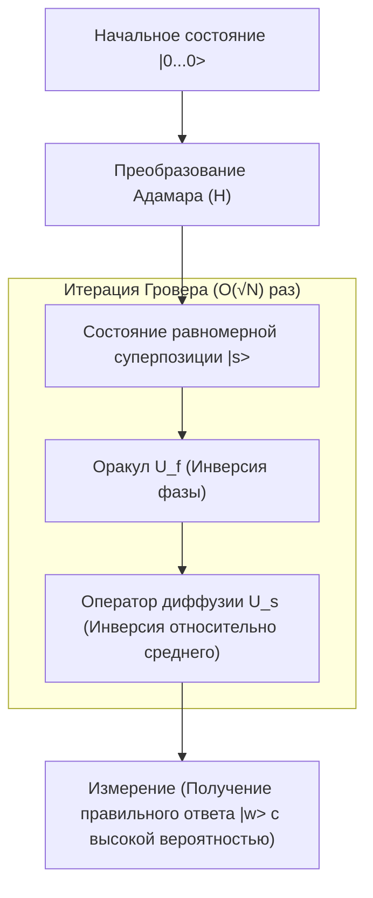

## 1. Введение: Классические пределы задачи поиска и появление квантовых компьютеров

В современной информатике "поиск" является одной из самых фундаментальных и важных задач. Начиная от поиска конкретной информации о клиенте в базе данных до нахождения оптимального маршрута в обширной сети или взлома криптографических ключей полным перебором — эффективность алгоритмов поиска напрямую влияет на производительность любой системы.

В частности, когда данные не имеют никакой структуры (не отсортированы, нет закономерностей), это называется "задачей поиска в неструктурированной базе данных". Например, представьте, что есть N коробок, и только в одной из них находится приз. Все коробки выглядят одинаково, и до открытия неизвестно, что внутри. В этом случае классическому компьютеру (такому, какой мы используем повседневно) для нахождения приза потребуется в худшем случае N попыток, а в среднем — N/2 попыток. Это означает, что вычислительная сложность (временная сложность) пропорциональна количеству данных N и обозначается как $O(N)$.

Если N невелико, алгоритм $O(N)$ не вызывает проблем, но когда N достигает миллионов, миллиардов или даже астрономических чисел, таких как $2^{128}$ или $2^{256}$, классическому компьютеру не хватит и времени жизни Вселенной для завершения поиска. Это является физическим и математическим пределом классического неструктурированного поиска.

Однако с появлением "квантовых компьютеров", которые используют странные свойства квантовой механики (суперпозицию, запутанность, интерференцию) в качестве вычислительных ресурсов, появилась возможность преодолеть этот предел. В 1996 году Лов Гровер (Lov Grover), работавший в Bell Labs, представил революционный алгоритм, позволяющий выполнять поиск в неструктурированной базе данных с вычислительной сложностью $O(\sqrt{N})$. Он получил название "алгоритм Гровера" (Grover's Algorithm).

Снижение вычислительной сложности с $O(N)$ до $O(\sqrt{N})$ называется "квадратичным ускорением" (Quadratic Speedup). На первый взгляд может показаться, что это не так впечатляюще по сравнению с экспоненциальным ускорением (Exponential Speedup) факторизации в алгоритме Шора (Shor's Algorithm). Однако, поскольку неструктурированный поиск возникает как подзадача в самых разнообразных проблемах, область применения алгоритма Гровера чрезвычайно широка. Он оказывает решающее влияние на задачи комбинаторной оптимизации, машинное обучение и, в частности, на безопасность современных криптографических технологий (симметричной криптографии).

В этой статье мы глубоко погрузимся в изучение того, почему и как алгоритм Гровера ускоряет поиск: от его математических основ до реализации квантовых схем и влияния на общество.

## 2. Основы квантовой механики: суперпозиция и амплитуда вероятности

Чтобы понять алгоритм Гровера, сначала нужно понять базовый способ представления квантовой информации. В то время как минимальная единица информации в классическом компьютере — это "бит" (Bit), принимающий состояние либо "0", либо "1", минимальная единица информации в квантовом компьютере называется "квантовым битом" или "кубитом" (Qubit).

Главная особенность кубита — его способность находиться в состоянии "0" и "1" одновременно. Это свойство называется "суперпозицией" (Superposition). Математически состояние одного кубита $|\psi\rangle$ выражается как линейная комбинация базисных состояний $|0\rangle$ и $|1\rangle$:

$$ |\psi\rangle = \alpha|0\rangle + \beta|1\rangle $$

Здесь $\alpha$ и $\beta$ — комплексные числа, называемые "амплитудами вероятности" (Probability Amplitude). При измерении (наблюдении) кубита вероятность получить состояние $|0\rangle$ равна $|\alpha|^2$, а вероятность получить состояние $|1\rangle$ равна $|\beta|^2$. Поскольку сумма вероятностей должна быть равна 1, должно выполняться следующее условие нормировки:

$$ |\alpha|^2 + |\beta|^2 = 1 $$

Если мы объединим n кубитов, размерность пространства состояний составит $2^n$. Например, состояние 3 кубитов можно представить как суперпозицию $2^3 = 8$ базисных состояний:

$$ |\psi\rangle = \alpha_0|000\rangle + \alpha_1|001\rangle + \dots + \alpha_7|111\rangle $$

Алгоритм Гровера инициализирует все эти $2^n$ возможных состояний (всех кандидатов на поиск) с равными амплитудами вероятности, а затем использует квантовую интерференцию (Quantum Interference) для усиления амплитуды вероятности только правильного (искомого) состояния. Таким образом, при измерении правильный ответ получается с высокой вероятностью. Этот процесс называется "усилением амплитуды" (Amplitude Amplification).

## 3. Формулировка проблемы: Что такое Оракул (Oracle)

В алгоритме Гровера задача поиска формулируется математически следующим образом.

Пусть индекс искомого элемента равен $x \in \{0, 1\}^n$. Общее количество элементов $N = 2^n$. Рассмотрим функцию $f(x)$, которая возвращает $1$, только если входной $x$ является правильным индексом (целью), и возвращает $0$ во всех остальных случаях.

- В случае цели: $f(x) = 1$
- В остальных случаях: $f(x) = 0$

Наша цель — вычислить функцию $f(x)$, чтобы найти такой $x$ (назовем его $w$), при котором $f(x) = 1$. В классических алгоритмах у нас нет другого выбора, кроме как вычислять (опрашивать) $f(x)$ для различных $x$, повторяя попытки, пока результат не станет равным $1$.

В квантовых вычислениях оператор типа «черный ящик», который выполняет оценку этой функции $f(x)$, называется "квантовым оракулом" (Quantum Oracle). Оракул $U_f$ выполняет следующее унитарное преобразование над квантовым состоянием:

$$ U_f |x\rangle |y\rangle = |x\rangle |y \oplus f(x)\rangle $$

Здесь $|y\rangle$ — вспомогательный кубит (анцилла-кубит), а $\oplus$ обозначает сложение по модулю 2 (XOR).

В алгоритме Гровера используется техника (отдача фазы: Phase Kickback), при которой вспомогательный кубит $|y\rangle$ инициализируется в состояние $|-\rangle = \frac{1}{\sqrt{2}}(|0\rangle - |1\rangle)$ и применяется к оракулу. Это упрощает действие оракула следующим образом:

$$ U_f |x\rangle = (-1)^{f(x)} |x\rangle $$

Иными словами, оракул $U_f$ инвертирует фазу (знак) только правильного состояния $|w\rangle$, оставляя фазы всех остальных состояний неизменными.

- Правильный ответ: $U_f |w\rangle = -|w\rangle$
- Неправильный ответ: $U_f |x\rangle = |x\rangle \quad (x \neq w)$

Если представить это в виде матрицы, $U_f$ будет диагональной матрицей, где только диагональный элемент, соответствующий правильному индексу, равен $-1$, а все остальные равны $1$.

## 4. Механизм итерации Гровера (Grover Iteration)

Алгоритм Гровера состоит из следующих четырех основных шагов:

1. **Инициализация (Initialization)**
2. **Инверсия фазы с помощью оракула (Oracle Phase Flip)**
3. **Инверсия относительно среднего (Inversion About the Mean / Diffusion Operator)**
4. **Измерение (Measurement)**

Комбинация шагов 2 и 3 называется "Итерацией Гровера" (Grover Iteration). Повторяя её оптимальное количество раз, мы максимизируем амплитуду вероятности правильного состояния.



### 4.1 Инициализация

Сначала все n кубитов инициализируются в состояние $|0\rangle$. Затем к каждому кубиту применяется вентиль Адамара (Hadamard Gate, $H$), что создает состояние равномерной суперпозиции $|s\rangle$, в котором все состояния имеют равные амплитуды вероятности.

$$ |s\rangle = H^{\otimes n} |0\rangle^{\otimes n} = \frac{1}{\sqrt{N}} \sum_{x=0}^{N-1} |x\rangle $$

В этом состоянии вероятность наблюдения каждого из состояний одинакова и равна $1/N$. Все амплитуды вероятности равны $\frac{1}{\sqrt{N}}$.

### 4.2 Инверсия фазы с помощью оракула

К состоянию равномерной суперпозиции $|s\rangle$ применяется оракул $U_f$. Как упоминалось ранее, инвертируется только знак (фаза) амплитуды вероятности правильного состояния $|w\rangle$.

$$ U_f |s\rangle = \frac{1}{\sqrt{N}} \sum_{x \neq w} |x\rangle - \frac{1}{\sqrt{N}} |w\rangle $$

В результате этой операции амплитуда правильного ответа становится отрицательной, но вероятность (квадрат абсолютного значения амплитуды) не меняется. Следовательно, при измерении на этом этапе вероятность нахождения правильного ответа все еще равна $1/N$. Именно поэтому необходим следующий шаг.

### 4.3 Оператор диффузии (Инверсия относительно среднего)

Затем применяется оператор диффузии (Diffusion Operator) $U_s$. Этот оператор выполняет инверсию амплитуд вероятности каждого состояния относительно их «среднего значения».

Математически $U_s$ определяется следующим образом:

$$ U_s = 2|s\rangle\langle s| - I $$

Где $I$ — единичная матрица. Давайте интуитивно поймем, что происходит при применении этого оператора.

1. После применения оракула амплитуда правильного ответа становится отрицательной, а амплитуды неправильных ответов остаются положительными.
2. В результате "среднее значение" всех амплитуд становится немного меньше исходного $\frac{1}{\sqrt{N}}$.
3. Амплитуды неправильных ответов (положительные) больше этого нового среднего значения. Если инвертировать их относительно среднего, они станут **меньше** своих первоначальных значений.
4. С другой стороны, амплитуда правильного ответа (отрицательная) находится намного ниже среднего значения (которое положительно). Если инвертировать ее относительно среднего, она **сильно выскочит в положительную сторону**, превысив свое первоначальное значение по модулю.

В результате амплитуды вероятности неправильных ответов уменьшаются, а амплитуда вероятности правильного ответа увеличивается (усиливается). Эта пара из оракула и оператора диффузии ($U_s U_f$) определяется как одна итерация Гровера (Grover Operator, $G$).

$$ G = U_s U_f $$

### 4.4 Геометрическая интерпретация и вывод количества итераций

Итерацию Гровера можно очень красиво геометрически представить как вращательное движение в двумерной плоскости.

Представим пространство состояний как двумерную плоскость, натянутую на два ортогональных вектора: правильное состояние $|w\rangle$ и состояние $|s'\rangle$, которое является равномерной суперпозицией всех неправильных состояний.

$$ |s'\rangle = \frac{1}{\sqrt{N-1}} \sum_{x \neq w} |x\rangle $$

Начальное состояние $|s\rangle$ может быть представлено как вектор в этой плоскости, отклоненный от $|s'\rangle$ на угол $\theta$ в направлении $|w\rangle$.

$$ |s\rangle = \sin\theta |w\rangle + \cos\theta |s'\rangle $$

Здесь $\sin\theta = \frac{1}{\sqrt{N}}$. Если $N$ достаточно велико, можно использовать приближение $\theta \approx \frac{1}{\sqrt{N}}$.

Математически доказано, что однократное применение итерации Гровера $G$ эквивалентно вращению вектора состояния в этой двумерной плоскости на угол $2\theta$ в направлении $|w\rangle$.

Следовательно, состояние $|\psi_k\rangle$ после $k$ итераций будет выглядеть так:

$$ |\psi_k\rangle = G^k |s\rangle = \sin((2k+1)\theta) |w\rangle + \cos((2k+1)\theta) |s'\rangle $$

Наша цель — максимально приблизить вектор состояния к правильному состоянию $|w\rangle$, то есть сделать $\sin((2k+1)\theta) \approx 1$. Это означает, что угол должен быть равен $\pi/2$ (90 градусов).

$$ (2k+1)\theta \approx \frac{\pi}{2} $$

Подставив $\theta \approx \frac{1}{\sqrt{N}}$ и решив уравнение относительно $k$, получаем:

$$ k \approx \frac{\pi}{4}\sqrt{N} $$

Это и есть математическое обоснование того, почему вычислительная сложность алгоритма Гровера составляет $O(\sqrt{N})$. Интересно, что если сделать слишком много итераций, вектор "пройдет мимо" состояния $|w\rangle$, и вероятность получения правильного ответа снова снизится. Поэтому необходимо остановиться ровно на оптимальном количестве итераций.

## 5. Реализация на Python с использованием Qiskit

Давайте не ограничиваться теорией и посмотрим, как работает алгоритм на практике, написав квантовую схему. Мы будем использовать "Qiskit" — фреймворк с открытым исходным кодом для квантовых вычислений, предоставляемый IBM.

Для простоты рассмотрим случай $N=4$ ($n=2$ кубита). Установим правильный ответ $w = |11\rangle$ (индекс 3). Необходимое количество итераций равно $\frac{\pi}{4}\sqrt{4} \approx 1.57$, поэтому одной итерации должно быть достаточно для получения очень высокой вероятности.

```python
from qiskit import QuantumCircuit
from qiskit_aer import AerSimulator
from qiskit.visualization import plot_histogram
import matplotlib.pyplot as plt
import numpy as np

# Количество кубитов
n = 2

# Инициализация схемы (2 квантовых бита + 2 классических бита для измерения)
qc = QuantumCircuit(n, n)

# 1. Инициализация: применение вентиля Адамара
qc.h([0, 1])
qc.barrier()

# 2. Оракул: инверсия фазы состояния |11> (реализуется с помощью вентиля CZ)
# Умножаем на -1 только в случае |11>
qc.cz(0, 1)
qc.barrier()

# 3. Оператор диффузии
# H -> X -> CZ -> X -> H
qc.h([0, 1])
qc.x([0, 1])
qc.cz(0, 1)
qc.x([0, 1])
qc.h([0, 1])
qc.barrier()

# 4. Измерение
qc.measure([0, 1], [0, 1])

# Отрисовка схемы (можно посмотреть в терминале или Jupyter)
print(qc.draw())

# Запуск на симуляторе
simulator = AerSimulator()
result = simulator.run(qc, shots=1000).result()
counts = result.get_counts()

print("\nРезультат измерения:", counts)
# Получаем правильный ответ со 100% вероятностью, например {'11': 1000}
```

В этом простом примере оракул и оператор диффузии были построены с использованием комбинации базовых вентилей (H, X, CZ). В случае $N=4$ теоретически можно получить правильный ответ $|11\rangle$ со 100% вероятностью всего за одну итерацию. Из этого кода можно напрямую ощутить мощь квантового "параллелизма" и "интерференции".

При увеличении масштаба проектирование оракула и реализация многокубитных управляемых вентилей для оператора диффузии (например, Multi-Controlled Toffoli) усложняются, но базовая структура остается неизменной независимо от количества кубитов.

## 6. Угроза криптографии от алгоритма Гровера

Алгоритм Гровера — это не просто математическая головоломка или абстрактный поиск в базе данных; он представляет собой весьма конкретную угрозу реальной кибербезопасности. В частности, он влияет на "симметричное шифрование" (Symmetric-key cryptography), такое как AES (Advanced Encryption Standard), и на "хеш-функции", такие как SHA-256.

### Влияние на симметричное шифрование
В таких системах шифрования, как AES-128, длина ключа составляет 128 бит, и существует $2^{128}$ возможных комбинаций ключей. При атаке полным перебором (брутфорс) на классическом компьютере потребуется в худшем случае $2^{128}$ вычислений. Поскольку на это ушло бы время, намного превышающее возраст Вселенной даже при использовании самых современных суперкомпьютеров, система считается практически "безопасной".

Однако, если злоумышленник будет использовать крупномасштабный отказоустойчивый квантовый компьютер (FTQC: Fault-Tolerant Quantum Computer) и применит алгоритм Гровера, рассматривая криптографическую функцию как оракул, то вычислительная сложность поиска правильного ключа резко сократится до $O(\sqrt{2^{128}}) = O(2^{64})$.

$2^{64}$ операций — это масштаб, который можно выполнить за разумное время (от нескольких недель до нескольких месяцев) даже на современных классических вычислительных кластерах. Это означает, что с появлением квантовых компьютеров шифрование с ключом длиной 128 бит больше нельзя будет считать безопасным.

### Переход на постквантовую криптографию и контрмеры
Решение этой проблемы в принципе очень простое: нужно удвоить длину ключа.

Если использовать AES-256, пространство ключей станет $2^{256}$. Даже при применении алгоритма Гровера необходимая вычислительная сложность составит $\sqrt{2^{256}} = 2^{128}$, что означает сохранение уровня надежности, эквивалентного AES-128 на классических компьютерах.

Поэтому организации по стандартизации, такие как NIST (Национальный институт стандартов и технологий США), и службы безопасности различных стран настоятельно рекомендуют «использовать длину ключа не менее 256 бит» для симметричного шифрования с учетом будущих квантовых угроз. Аналогичная ситуация с хеш-функциями: поскольку устойчивость SHA-256 к коллизиям и атакам на нахождение прообраза снижается, происходит постепенный переход на SHA-384 и SHA-512.

Таким образом, алгоритм Гровера, наряду с алгоритмом Шора, который делает уязвимым шифрование с открытым ключом (RSA и [ECC](/ru/p/elliptic-curve-cryptography-math-cpp/)), является алгоритмом, знаменующим собой важный поворотный момент в истории информационной безопасности.

## 7. Применение и развитие: Будущее алгоритма Гровера

Алгоритм Гровера не ограничивается неструктурированным поиском; исследуются его применение и расширение в различных областях.

- **Применение к NP-полным задачам, таким как задача выполнимости булевых формул (SAT)**: Подход, использующий итерацию Гровера для ускорения поиска в пространстве решений задач комбинаторной оптимизации. Развивается создание гибридных методов, сочетающих эвристические классические и квантовые алгоритмы.
- **Квантовое машинное обучение (QML)**: Исследования по ускорению процесса обучения за счет применения механизма усиления амплитуды для вычисления расстояний между точками данных или оптимизации кластеризации.
- **Квантовое блуждание (Quantum Walk)**: [Алгоритмы поиска](/ru/p/search-algorithms-linear-binary-hash-table-principles/) для данных с более сложной структурой, такие как задачи поиска на графах. Их можно рассматривать как обобщение алгоритма Гровера; они считаются многообещающими для сетевого анализа.

## 8. Заключение: Истинная ценность и ограничения квантовых вычислений

Алгоритм Гровера — это яркий пример того, как квантовые компьютеры могут демонстрировать явное превосходство над классическими. Квадратичное ускорение, сокращающее задачу, классически требующую $O(N)$ времени, до $O(\sqrt{N})$, проявляет себя в полной мере по мере того, как объемы данных становятся огромными.

С другой стороны, важно понимать, что алгоритм Гровера не является волшебной палочкой. Отмечается, что если само построение оракула требует больших вычислительных затрат или если существует «бутылочное горлышко» при чтении данных (реализация квантовой RAM, qRAM), теоретическое ускорение может быть не достигнуто. Кроме того, учитывая накладные расходы на квантовую коррекцию ошибок, для того чтобы на практике превзойти производительность классических компьютеров, еще потребуется множество аппаратных и программных прорывов.

Однако теоретическая красота и масштаб его влияния неоспоримы. Этот алгоритм, который искусно манипулирует неинтуитивным понятием амплитуды вероятности и блестяще усиливает лишь правильный ответ в море шума, можно назвать квинтэссенцией человеческого интеллекта, показывающей, как мы можем "приручить" законы природы (квантовую механику) в качестве вычислительного ресурса.

Для будущих инженеров и исследователей глубокое понимание механизмов алгоритма Гровера должно стать мощным оружием для процветания в грядущую эпоху квантовых вычислений. Мир квантовой информатики только начинается, и день, когда будут открыты новые неизвестные алгоритмы, возможно, не за горами.
