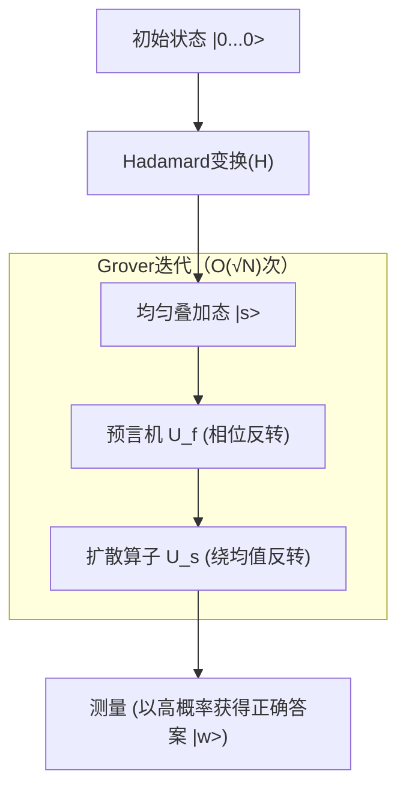

## 1. 引言：搜索问题的经典极限与量子计算机的崛起

在现代计算机科学中，“搜索”是最基本且最重要的任务之一。无论是从数据库中查找特定客户信息，在庞大的网络中寻找最优路径，还是通过暴力破解密码密钥，[搜索算法](/zh-cn/p/search-algorithms-linear-binary-hash-table-principles/)的效率直接影响任何系统的性能。

特别地，当数据没有任何结构（未排序、无规律）时，我们称之为“非结构化数据库的搜索问题”。例如，假设有 N 个箱子排成一排，其中只有一个箱子装有中奖物品。箱子的外观完全相同，在打开之前无法知道里面的内容。在这种情况下，经典计算机（我们日常使用的计算机）找到中奖物品所需的尝试次数，最坏情况下为 N 次，平均为 N/2 次。也就是说，计算量（时间[复杂度](/zh-cn/p/time-space-complexity-big-o-notation-examples/)）与数据量 N 成正比，表示为 $O(N)$。

如果 N 较小，$O(N)$ 的算法也没有问题。但当 N 达到数百万、数亿，甚至 $2^{128}$ 或 $2^{256}$ 这种天文数字时，经典计算机即使耗尽宇宙寿命的时间也无法完成搜索。这就是经典非结构化搜索在物理和数学上的极限。

然而，利用量子力学的奇妙特性（叠加、纠缠、干涉）作为计算资源的“量子计算机”的出现，展示了突破这一极限的可能性。1996年，当时隶属于贝尔实验室的洛夫·格罗弗（Lov Grover）发表了一项突破性的算法，该算法能够以 $O(\sqrt{N})$ 的计算量执行非结构化数据库的搜索。这就是“Grover算法（Grover's Algorithm）”。

从 $O(N)$ 到 $O(\sqrt{N})$ 的计算量减少被称为“二次加速（Quadratic Speedup）”。乍一看，与Shor算法（Shor's Algorithm）在质因数分解上实现的指数级加速（Exponential Speedup）相比，其影响力似乎较小。但是，由于非结构化搜索作为子任务出现在几乎所有问题中，Grover算法的应用范围极其广泛，对组合优化问题、机器学习，尤其是现代密码技术（对称密钥加密）的安全性有着决定性的影响。

在本文中，我们将深入解析Grover算法为什么以及如何加速搜索，从其数学基础到量子电路的实现，再到对社会产生的影响进行全面探讨。

## 2. 量子力学的基础：叠加与概率幅

要理解Grover算法，首先需要了解量子信息的基本表示方法。经典计算机信息的最基本单位是取“0”或“1”状态的“比特（Bit）”，而量子计算机信息的最基本单位被称为“量子比特（Qubit）”。

量子比特最大的特点是拥有能够同时处于“0”和“1”状态的“叠加（Superposition）”特性。在数学上，一个量子比特的状态 $|\psi\rangle$ 可以表示为基态 $|0\rangle$ 和 $|1\rangle$ 的线性组合：

$$ |\psi\rangle = \alpha|0\rangle + \beta|1\rangle $$

这里，$\alpha$ 和 $\beta$ 是复数，被称为“概率幅（Probability Amplitude）”。当观测该量子比特时，得到状态 $|0\rangle$ 的概率为 $|\alpha|^2$，得到状态 $|1\rangle$ 的概率为 $|\beta|^2$。因为概率总和必须为1，所以需要满足以下归一化条件：

$$ |\alpha|^2 + |\beta|^2 = 1 $$

如果排列 n 个量子比特，状态空间的维度将达到 $2^n$。例如，3个量子比特的状态可以表示为 $2^3 = 8$ 个基态的叠加：

$$ |\psi\rangle = \alpha_0|000\rangle + \alpha_1|001\rangle + \dots + \alpha_7|111\rangle $$

Grover算法的机制是：将这 $2^n$ 个所有可能的状态（搜索目标的所有候选）以相等的概率幅进行初始化，并利用量子干涉（Quantum Interference）仅放大概率为正确答案的状态的概率幅，从而在观测时以极高的概率获得正确答案。这个过程被称为“振幅放大（Amplitude Amplification）”。

## 3. 问题的数学表述：什么是预言机（Oracle）

在Grover算法中，搜索问题在数学上被公式化如下：

假设搜索目标的索引为 $x \in \{0, 1\}^n$。总元素数量为 $N = 2^n$。考虑一个函数 $f(x)$，假设当输入 $x$ 为正确答案的索引（目标）时，该函数返回 $1$，否则返回 $0$。

- 目标情况：$f(x) = 1$
- 非目标情况：$f(x) = 0$

我们的目的是通过评估函数 $f(x)$，找到使得 $f(x) = 1$ 的 $x$（将其设为 $w$）。在经典算法中，我们只能对不同的 $x$ 评估（查询）$f(x)$，并不断重复尝试直到结果为 $1$。

在量子计算中，执行这个函数 $f(x)$ 评估的黑盒算子被称为“量子预言机（Quantum Oracle）”。预言机 $U_f$ 对量子态执行如下的幺正变换：

$$ U_f |x\rangle |y\rangle = |x\rangle |y \oplus f(x)\rangle $$

这里，$|y\rangle$ 是辅助量子比特（Ancilla Qubit），$\oplus$ 表示模2加法（XOR）。

在Grover算法中，使用了一种将辅助量子比特 $|y\rangle$ 初始化为状态 $|-\rangle = \frac{1}{\sqrt{2}}(|0\rangle - |1\rangle)$ 然后作用于预言机的技巧（相位反冲：Phase Kickback）。由此，预言机的作用可简化如下：

$$ U_f |x\rangle = (-1)^{f(x)} |x\rangle $$

也就是说，预言机 $U_f$ 执行的操作是：仅反转正确状态 $|w\rangle$ 的相位（符号），而保持其他状态的相位不变。

- 答案正确时：$U_f |w\rangle = -|w\rangle$
- 答案错误时：$U_f |x\rangle = |x\rangle \quad (x \neq w)$

用矩阵表示的话，$U_f$ 是一个对角矩阵，只有对应正确答案索引的对角元素为 $-1$，其他全为 $1$。

## 4. Grover迭代（Grover Iteration）机制

Grover算法由以下4个主要步骤构成：

1. **初始化（Initialization）**
2. **预言机相位反转（Oracle Phase Flip）**
3. **绕均值反转（Inversion About the Mean / Diffusion Operator）**
4. **测量（Measurement）**

步骤2和步骤3的组合被称为“Grover迭代（Grover Iteration）”，通过重复最佳次数的迭代，可以最大化正确状态的概率幅。



### 4.1 初始化

首先，将所有 n 个量子比特初始化为 $|0\rangle$ 状态。接下来，对每个量子比特应用Hadamard门（Hadamard Gate, $H$），创建一个所有状态具有相等概率幅的均匀叠加态 $|s\rangle$。

$$ |s\rangle = H^{\otimes n} |0\rangle^{\otimes n} = \frac{1}{\sqrt{N}} \sum_{x=0}^{N-1} |x\rangle $$

在这种状态下，观测到所有状态的概率都相等，为 $1/N$。概率幅均为 $\frac{1}{\sqrt{N}}$。

### 4.2 预言机相位反转

对均匀叠加态 $|s\rangle$ 应用预言机 $U_f$。如前所述，只有正确答案状态 $|w\rangle$ 的概率幅的符号（相位）会被反转。

$$ U_f |s\rangle = \frac{1}{\sqrt{N}} \sum_{x \neq w} |x\rangle - \frac{1}{\sqrt{N}} |w\rangle $$

通过此操作，只有正确答案的振幅变为负数，但概率（振幅绝对值的平方）没有改变。因此，此时测量找到正确答案的概率依然是 $1/N$。这就需要进行下一步。

### 4.3 扩散算子（绕均值反转）

接下来，应用扩散算子（Diffusion Operator）$U_s$。该算子执行的操作是：以所有状态概率幅的“平均值”为基准，对每个状态的概率幅进行反转。

在数学上，$U_s$ 的定义如下：

$$ U_s = 2|s\rangle\langle s| - I $$

这里，$I$ 是单位矩阵。让我们直观地理解一下应用这个算子会发生什么。

1. 应用预言机后，正确答案的振幅变为负，错误答案的振幅保持为正。
2. 这样一来，所有振幅的“平均值”会变得比原来的 $\frac{1}{\sqrt{N}}$ 稍微小一点。
3. 错误答案的振幅（正数）大于这个新的平均值，因此以平均值为基准反转后，会变得比原来的值**更小**。
4. 另一方面，正确答案的振幅（负数）远低于平均值（正数），因此以平均值为基准反转后，会超过原来的值向**正方向大幅突升**。

结果，错误答案的概率幅减小，正确答案的概率幅被放大。我们将这对预言机和扩散算子的组合（$U_s U_f$）定义为一次Grover迭代（Grover Operator, $G$）。

$$ G = U_s U_f $$

### 4.4 几何解释与迭代次数推导

Grover迭代在二维平面上可以非常优美地用几何上的旋转运动来表示。

我们可以将状态空间视为由两个正交向量张成的二维平面：一个是正确状态 $|w\rangle$，另一个是所有错误状态的均匀叠加态 $|s'\rangle$。

$$ |s'\rangle = \frac{1}{\sqrt{N-1}} \sum_{x \neq w} |x\rangle $$

初始状态 $|s\rangle$ 可以表示为该平面上一个从 $|s'\rangle$ 向 $|w\rangle$ 方向倾斜了角度 $\theta$ 的向量。

$$ |s\rangle = \sin\theta |w\rangle + \cos\theta |s'\rangle $$

这里，$\sin\theta = \frac{1}{\sqrt{N}}$。当 $N$ 足够大时，可以近似为 $\theta \approx \frac{1}{\sqrt{N}}$。

数学上已经证明，应用一次Grover迭代 $G$ 就等于在该二维平面上将状态向量向 $|w\rangle$ 方向旋转 $2\theta$ 的角度。

因此，经过 $k$ 次迭代后的状态 $|\psi_k\rangle$ 如下：

$$ |\psi_k\rangle = G^k |s\rangle = \sin((2k+1)\theta) |w\rangle + \cos((2k+1)\theta) |s'\rangle $$

我们的目标是让状态向量尽可能接近正确答案状态 $|w\rangle$，即让 $\sin((2k+1)\theta) \approx 1$。这意味着角度趋近于 $\pi/2$（90度）。

$$ (2k+1)\theta \approx \frac{\pi}{2} $$

代入 $\theta \approx \frac{1}{\sqrt{N}}$ 并解出 $k$：

$$ k \approx \frac{\pi}{4}\sqrt{N} $$

这就是Grover算法计算量为 $O(\sqrt{N})$ 的数学依据。有趣的是，如果迭代次数过多，向量会越过 $|w\rangle$，反而导致获得正确答案的概率下降。因此，必须准确在最佳次数时停止迭代。

## 5. 使用Qiskit的Python实现

除了理论之外，让我们实际编写量子电路来确认算法的运行。我们将使用IBM提供的开源量子计算框架“Qiskit”。

为了简单起见，我们考虑 $N=4$ ($n=2$ 个量子比特) 的情况。将正确答案设置为 $w = |11\rangle$ (索引3)。所需的迭代次数为 $\frac{\pi}{4}\sqrt{4} \approx 1.57$，因此通过1次迭代应该就能获得足够高的概率。

```python
from qiskit import QuantumCircuit
from qiskit_aer import AerSimulator
from qiskit.visualization import plot_histogram
import matplotlib.pyplot as plt
import numpy as np

# 量子比特数
n = 2

# 电路初始化 (2个量子比特 + 2个经典比特用于测量)
qc = QuantumCircuit(n, n)

# 1. 初始化：应用Hadamard门
qc.h([0, 1])
qc.barrier()

# 2. 预言机：反转 |11> 的相位 (可以通过CZ门实现)
# 仅在 |11> 的情况下乘以 -1
qc.cz(0, 1)
qc.barrier()

# 3. 扩散算子
# H -> X -> CZ -> X -> H
qc.h([0, 1])
qc.x([0, 1])
qc.cz(0, 1)
qc.x([0, 1])
qc.h([0, 1])
qc.barrier()

# 4. 测量
qc.measure([0, 1], [0, 1])

# 绘制电路 (可以在终端或Jupyter中查看)
print(qc.draw())

# 在模拟器中执行
simulator = AerSimulator()
result = simulator.run(qc, shots=1000).result()
counts = result.get_counts()

print("\n测量结果:", counts)
# 会得到类似 {'11': 1000} 的结果，意味着以100%的概率得到正确答案
```

在这个简单的例子中，我们用基本门（H, X, CZ）的组合构建了预言机和扩散算子。在 $N=4$ 的情况下，通过1次迭代，理论上就能以100%的概率获得正确答案 $|11\rangle$。我们可以从代码中直接感受到量子电路所具备的“并行性”和“干涉”的力量。

当规模变大时，预言机的设计和扩散算子的多控门（如Multi-Controlled Toffoli）的实现会变得复杂，但无论量子比特数增加多少，其基本结构是相同的。

## 6. Grover算法对密码技术的威胁

Grover算法不仅局限于数学谜题或抽象的数据库搜索，它对现实世界的网络安全构成了非常具体的威胁。受影响最大的是以AES（Advanced Encryption Standard）为代表的“对称密钥加密（Symmetric-key cryptography）”以及SHA-256等“哈希函数”。

### 对对称密钥加密的影响
在像AES-128这样的加密方式中，密钥长度为128位，存在的可能密钥组合有 $2^{128}$ 种。如果使用经典计算机进行暴力破解攻击（Brute-force attack），最坏需要 $2^{128}$ 次计算。即使使用目前的超级计算机，这也需要远超宇宙年龄的时间，因此在实用中被认为是“安全”的。

然而，如果攻击者利用大规模且具备容错能力的量子计算机（FTQC: Fault-Tolerant Quantum Computer），并应用Grover算法，通过将加密函数视为预言机，搜索正确密钥的计算量将急剧减少至 $O(\sqrt{2^{128}}) = O(2^{64})$。

$2^{64}$ 次运算在现代的经典计算机集群中也是在现实时间（几周到几个月）内可执行的规模。也就是说，随着量子计算机的出现，具有128位密钥长度的加密技术将不再安全。

### 向抗量子密码（后量子密码）的过渡与对策
从原理上讲，应对这一威胁的对策非常简单。只要将密钥长度翻倍即可。

如果使用AES-256，密钥空间就是 $2^{256}$。即使应用Grover算法，所需的计算量也是 $\sqrt{2^{256}} = 2^{128}$，这意味着它将保持与经典计算机下AES-128同等的强度。

因此，NIST（美国国家标准与技术研究院）等标准化组织和各国的安全机构，考虑到未来的量子威胁，强烈建议在对称密钥加密的应用中“使用256位以上的密钥长度”。对于哈希函数也是如此，由于抗SHA-256碰撞攻击和原像攻击的能力下降，目前正推进向SHA-384和SHA-512的过渡。

如此一来，Grover算法与使公钥加密（RSA和[ECC](/zh-cn/p/elliptic-curve-cryptography-math-cpp/)）失效的Shor算法齐名，共同成为了信息安全历史上具有重大转折意义的算法。

## 7. 应用与发展：Grover算法的未来

Grover算法不仅限于非结构化搜索，它在多个领域的应用与扩展也在被广泛研究。

- **应用于可满足性问题 (SAT) 等NP完全问题**：在探索组合优化问题的解空间时，利用Grover迭代来加速搜索。目前正在开发结合启发式经典算法和量子算法的混合方法。
- **量子机器学习 (QML)**：在数据点之间的距离计算和聚类优化中，应用振幅放大的机制，旨在加速学习过程的研究。
- **量子游走 (Quantum Walk)**：针对图上的搜索问题等具有更多结构数据的[搜索算法](/zh-cn/p/search-algorithms-linear-binary-hash-table-principles/)。它可以被视为Grover算法的推广，在网络分析等领域被寄予厚望。

## 8. 结论：量子计算的真正价值与极限

Grover算法是量子计算机相较于经典计算机能够展现出明显优势的代表性例子。将经典算法中需要 $O(N)$ 的任务缩短至 $O(\sqrt{N})$ 的二次加速，随着数据量的膨胀，其效果将极为显著。

另一方面，我们也必须认识到Grover算法并非魔法棒。有人指出，如果构建预言机本身需要极大的计算成本，或者在读取数据（量子RAM，qRAM的实现）方面存在瓶颈，可能无法获得理论上的加速。此外，考虑到量子纠错的开销，为了在实际应用中超越经典计算机的性能，仍然需要硬件和软件方面的许多突破。

尽管如此，其理论上的美感和巨大的影响力不可动摇。巧妙运用概率幅这一反直觉的概念，从噪声之海中鲜明地放大出唯一正确的答案，该算法展示了人类如何将自然法则（量子力学）驯化为计算资源，堪称人类智慧的结晶。

对于未来的工程师和研究人员来说，深刻理解Grover算法的机制，必将成为他们在即将到来的量子计算时代立足的强大武器。量子信息科学的世界才刚刚开始，发现更多未知算法的日子或许已经不远了。
