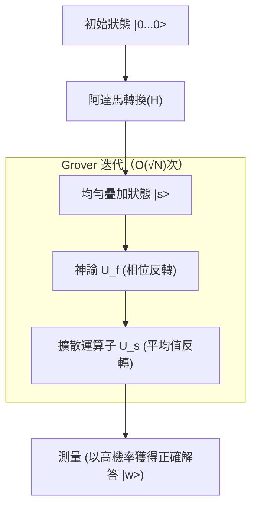

## 1. 簡介：搜尋問題的古典極限與量子電腦的崛起

在現代電腦科學中，「搜尋」是最基本且重要的任務之一。無論是從資料庫中找出特定顧客資訊、在廣大的網路中尋找最佳路徑，或是以暴力破解法解密金鑰，[搜尋演算法](/zh-tw/p/search-algorithms-linear-binary-hash-table-principles/)的效率都直接關係到所有系統的效能。

特別是當資料不具備任何結構（未排序、無規則性）時，這被稱為「非結構化資料庫搜尋問題」。例如，假設有 N 個箱子排成一列，其中只有一個裝有中獎物品。箱子的外觀全都相同，直到打開前都無法知道裡面的內容。在這種情況下，古典電腦（我們現在日常使用的電腦）要找到中獎物品所需的嘗試次數，最壞情況下為 N 次，平均為 N/2 次。也就是說，計算量（時間[複雜度](/zh-tw/p/time-space-complexity-big-o-notation-examples/)）與資料數量 N 成正比，表示為 $O(N)$。

如果 N 很小，$O(N)$ 的演算法並無問題，但當 N 達到數百萬、數億，甚至 $2^{128}$ 或 $2^{256}$ 這種天文數字時，古典電腦即使花費到宇宙壽命終結的時間，也無法完成搜尋。這就是古典非結構化搜尋在物理與數學上的極限。

然而，隨著利用量子力學奇妙特性（疊加、糾纏、干涉）作為計算資源的「量子電腦」出現，展現了突破這個極限的可能性。1996 年，任職於貝爾實驗室的洛夫·格羅弗（Lov Grover）發表了一項劃時代的演算法，能夠以 $O(\sqrt{N})$ 的計算量執行非結構化資料庫的搜尋。這就是「Grover 演算法（Grover's Algorithm）」。

將計算量從 $O(N)$ 減少到 $O(\sqrt{N})$ 被稱為「二次加速（Quadratic Speedup）」。乍看之下，與 Shor 演算法（[Shor's Algorithm](/zh-tw/p/shors-algorithm-and-rsa-breaking/)）在質因數分解上實現的指數級加速（Exponential Speedup）相比，影響似乎較小。但是，由於非結構化搜尋幾乎會作為所有問題的子任務出現，因此 Grover 演算法的應用範圍極為廣泛，對組合最佳化問題、機器學習，特別是現代密碼技術（對稱金鑰加密）的安全性，都有著決定性的影響。

在本文中，我們將徹底深入解說 Grover 演算法為何以及如何加速搜尋，從其數學基礎、量子電路的實作，到對社會所帶來的影響。

## 2. 量子力學的基礎：疊加與機率幅

為了理解 Grover 演算法，首先必須了解量子資訊的基本表達方式。相較於古典電腦的資訊最小單位是處於「0」或「1」狀態的「位元（Bit）」，量子電腦的資訊最小單位則被稱為「量子位元（Qubit）」。

量子位元最大的特徵是具備能夠同時處於「0」與「1」狀態的「疊加（Superposition）」性質。在數學上，一個量子位元的狀態 $|\psi\rangle$ 可以表示為基底狀態 $|0\rangle$ 和 $|1\rangle$ 的線性組合，如下所示：

$$ |\psi\rangle = \alpha|0\rangle + \beta|1\rangle $$

這裡，$\alpha$ 和 $\beta$ 是複數，被稱為「機率幅（Probability Amplitude）」。當我們觀測量子位元時，得到狀態 $|0\rangle$ 的機率為 $|\alpha|^2$，得到狀態 $|1\rangle$ 的機率為 $|\beta|^2$。因為機率總和必須為 1，所以必須滿足以下的歸一化條件：

$$ |\alpha|^2 + |\beta|^2 = 1 $$

n 個量子位元並列時，狀態空間的維度會是 $2^n$。例如，3 個量子位元的狀態可以表示為 $2^3 = 8$ 個基底狀態的疊加：

$$ |\psi\rangle = \alpha_0|000\rangle + \alpha_1|001\rangle + \dots + \alpha_7|111\rangle $$

Grover 演算法的機制是將這 $2^n$ 個所有可能狀態（搜尋目標的所有候選者）以相等的機率幅進行初始化，並利用量子干涉（Quantum Interference），僅放大正確解答狀態的機率幅，使得在觀測時能以很高的機率得到正確解答。這個過程被稱為「振幅放大（Amplitude Amplification）」。

## 3. 問題的公式化：什麼是神諭（Oracle）

在 Grover 演算法中，搜尋問題在數學上被公式化如下：

假設搜尋目標的索引為 $x \in \{0, 1\}^n$。總元素數量為 $N = 2^n$。考慮一個函數 $f(x)$，當輸入 $x$ 為正確解答的索引（目標）時，此函數回傳 $1$，在其他情況下回傳 $0$。

- 為目標時：$f(x) = 1$
- 非目標時：$f(x) = 0$

我們的目的是透過評估函數 $f(x)$，找出使得 $f(x) = 1$ 的 $x$（我們將其設為 $w$）。在古典演算法中，我們只能對各種 $x$ 評估（查詢） $f(x)$，並重複嘗試直到結果為 $1$。

在量子計算中，執行這個函數 $f(x)$ 評估的黑盒子運算子被稱為「量子神諭（Quantum Oracle）」。神諭 $U_f$ 對量子狀態進行如下的么正變換（Unitary Transformation）：

$$ U_f |x\rangle |y\rangle = |x\rangle |y \oplus f(x)\rangle $$

這裡，$|y\rangle$ 是輔助量子位元（Ancilla Qubit），$\oplus$ 代表模 2 加法（XOR）。

在 Grover 演算法中，我們使用將輔助量子位元 $|y\rangle$ 初始化為狀態 $|-\rangle = \frac{1}{\sqrt{2}}(|0\rangle - |1\rangle)$ 並套用於神諭的技巧（相位回踢：Phase Kickback）。這使得神諭的作用被簡化如下：

$$ U_f |x\rangle = (-1)^{f(x)} |x\rangle $$

也就是說，神諭 $U_f$ 只會將正確解答狀態 $|w\rangle$ 的相位（正負號）反轉，而保持其他狀態的相位不變。

- 正確解答時：$U_f |w\rangle = -|w\rangle$
- 錯誤解答時：$U_f |x\rangle = |x\rangle \quad (x \neq w)$

若以矩陣表示，$U_f$ 會是一個對角矩陣，只有對應正確解答索引的對角元素為 $-1$，其他全為 $1$。

## 4. Grover 迭代（Grover Iteration）的機制

Grover 演算法由以下四個主要步驟組成：

1. **初始化（Initialization）**
2. **神諭相位反轉（Oracle Phase Flip）**
3. **平均值反轉（Inversion About the Mean / Diffusion Operator）**
4. **測量（Measurement）**

步驟 2 和步驟 3 的組合被稱為「Grover 迭代（Grover Iteration）」，透過重複最佳次數的迭代，能夠將正確解答狀態的機率幅最大化。



### 4.1 初始化

首先，將 n 個量子位元全數初始化為 $|0\rangle$ 狀態。接著，對每個量子位元應用阿達馬閘（Hadamard Gate, $H$），創造出所有狀態具有相等機率幅的均勻疊加狀態 $|s\rangle$。

$$ |s\rangle = H^{\otimes n} |0\rangle^{\otimes n} = \frac{1}{\sqrt{N}} \sum_{x=0}^{N-1} |x\rangle $$

在這個狀態下，觀測到所有狀態的機率都等於 $1/N$。機率幅全為 $\frac{1}{\sqrt{N}}$。

### 4.2 神諭相位反轉

對均勻疊加狀態 $|s\rangle$ 應用神諭 $U_f$。如前所述，只有正確解答狀態 $|w\rangle$ 的機率幅正負號（相位）會被反轉。

$$ U_f |s\rangle = \frac{1}{\sqrt{N}} \sum_{x \neq w} |x\rangle - \frac{1}{\sqrt{N}} |w\rangle $$

透過這個操作，只有正確解答的振幅會變成負值，但機率（振幅絕對值的平方）並未改變。因此，若在這個時間點進行測量，找到正確解答的機率依然是 $1/N$。所以這時需要進行下一個步驟。

### 4.3 擴散運算子（平均值反轉）

接著，應用擴散運算子（Diffusion Operator）$U_s$。這個運算子的操作是將各狀態的機率幅，以所有狀態機率幅的「平均值」為基準進行反轉。

在數學上，$U_s$ 被定義如下：

$$ U_s = 2|s\rangle\langle s| - I $$

這裡，$I$ 是單位矩陣。讓我們直觀地理解應用這個運算子會發生什麼事：

1. 應用神諭後，正確解答的振幅變為負值，而錯誤解答的振幅保持正值。
2. 如此一來，所有振幅的「平均值」會變得比原本的 $\frac{1}{\sqrt{N}}$ 略小。
3. 錯誤解答的振幅（正值）大於這個新的平均值，因此以平均值為基準反轉後，會比原來的值**更小**。
4. 另一方面，正確解答的振幅（負值）遠低於平均值（正值），因此以平均值為基準反轉後，會大幅度地**突破至正值方向**並大於原本的值。

結果，錯誤解答的機率幅減少，而正確解答的機率幅被放大。這個神諭與擴散運算子的組合（$U_s U_f$）被定義為一次 Grover 迭代（Grover Operator, $G$）。

$$ G = U_s U_f $$

### 4.4 幾何學解釋與迭代次數推導

Grover 迭代可以極其優美地用幾何方式表示為二維平面上的旋轉運動。

將狀態空間想像為由正確解答狀態 $|w\rangle$ 與所有錯誤解答狀態均勻疊加的 $|s'\rangle$ 這兩個正交向量所張成的二維平面。

$$ |s'\rangle = \frac{1}{\sqrt{N-1}} \sum_{x \neq w} |x\rangle $$

初始狀態 $|s\rangle$ 可以在這個平面上表示為從 $|s'\rangle$ 朝 $|w\rangle$ 方向傾斜角度 $\theta$ 的向量。

$$ |s\rangle = \sin\theta |w\rangle + \cos\theta |s'\rangle $$

這裡，$\sin\theta = \frac{1}{\sqrt{N}}$。當 $N$ 足夠大時，可以近似為 $\theta \approx \frac{1}{\sqrt{N}}$。

數學上已經證明，套用一次 Grover 迭代 $G$，等同於在這個二維平面上將狀態向量朝 $|w\rangle$ 的方向旋轉 $2\theta$ 的角度。

因此，進行 $k$ 次迭代後的狀態 $|\psi_k\rangle$ 如下所示：

$$ |\psi_k\rangle = G^k |s\rangle = \sin((2k+1)\theta) |w\rangle + \cos((2k+1)\theta) |s'\rangle $$

我們的目標是讓狀態向量盡可能接近正確解答狀態 $|w\rangle$，也就是讓 $\sin((2k+1)\theta) \approx 1$。這意味著角度將變為 $\pi/2$（90 度）。

$$ (2k+1)\theta \approx \frac{\pi}{2} $$

將 $\theta \approx \frac{1}{\sqrt{N}}$ 代入並解出 $k$：

$$ k \approx \frac{\pi}{4}\sqrt{N} $$

這就是 Grover 演算法計算量為 $O(\sqrt{N})$ 的數學依據。有趣的是，如果迭代次數過多，向量會越過 $|w\rangle$，反而會導致獲得正確解答的機率下降。因此，必須準確地在最佳次數停止迭代。

## 5. 使用 Qiskit 在 Python 中實作

除了理論，讓我們實際撰寫量子電路來確認演算法的運作。我們將使用 IBM 提供的開源量子計算框架「Qiskit」。

在這裡，為了簡化，我們考慮 $N=4$（$n=2$ 個量子位元）的情況。將正確解答設定為 $w = |11\rangle$（索引 3）。所需的迭代次數為 $\frac{\pi}{4}\sqrt{4} \approx 1.57$，因此只要進行 1 次迭代，應該就能獲得足夠高的機率。

```python
from qiskit import QuantumCircuit
from qiskit_aer import AerSimulator
from qiskit.visualization import plot_histogram
import matplotlib.pyplot as plt
import numpy as np

# 量子位元數
n = 2

# 電路初始化 (2量子位元 + 測量用的2古典位元)
qc = QuantumCircuit(n, n)

# 1. 初始化：應用阿達馬閘
qc.h([0, 1])
qc.barrier()

# 2. 神諭：反轉 |11> 的相位 (可透過 CZ 閘實現)
# 僅在 |11> 的情況下乘上 -1
qc.cz(0, 1)
qc.barrier()

# 3. 擴散運算子
# H -> X -> CZ -> X -> H
qc.h([0, 1])
qc.x([0, 1])
qc.cz(0, 1)
qc.x([0, 1])
qc.h([0, 1])
qc.barrier()

# 4. 測量
qc.measure([0, 1], [0, 1])

# 繪製電路 (可在終端機或 Jupyter 檢視)
print(qc.draw())

# 在模擬器中執行
simulator = AerSimulator()
result = simulator.run(qc, shots=1000).result()
counts = result.get_counts()

print("\n測量結果:", counts)
# 會以 100% 的機率得到正確解答，例如 {'11': 1000}
```

在這個簡單的範例中，我們結合基本閘（H, X, CZ）建構了神諭與擴散運算子。在 $N=4$ 的情況下，理論上僅需 1 次迭代就能以 100% 的機率獲得正確解答 $|11\rangle$。我們能從程式碼中直接感受到量子電路所具備的「並行性」與「干涉」力量。

當規模變大時，神諭的設計及擴散運算子的多重控制閘（如 Multi-Controlled Toffoli）的實作會變得複雜，但無論量子位元數如何增加，其基本結構是相同的。

## 6. Grover 演算法帶來的密碼技術威脅

Grover 演算法不僅僅是數學上的謎題或抽象的資料庫搜尋，它對現實世界的網路安全帶來了極為具體的威脅。受影響最大的主要是以 AES（進階加密標準）為代表的「對稱金鑰加密（Symmetric-key cryptography）」，以及如 SHA-256 的「雜湊函數」。

### 對稱金鑰加密的影響
在如 AES-128 的加密方式中，金鑰長度為 128 位元，可能的金鑰組合有 $2^{128}$ 種。若使用古典電腦進行暴力破解攻擊，最壞情況下需要 $2^{128}$ 次計算。這即使使用目前的超級電腦，也需要遠超過宇宙年齡的時間，因此在實務上被視為是「安全的」。

然而，如果攻擊者使用大規模具備容錯能力的量子電腦（FTQC: Fault-Tolerant Quantum Computer），並應用 Grover 演算法，將加密函數視為神諭處理，搜尋正確金鑰的計算量將大幅縮減至 $O(\sqrt{2^{128}}) = O(2^{64})$。

$2^{64}$ 次運算，是現代古典電腦叢集也能在合理時間內（數週到數個月）執行的規模。也就是說，隨著量子電腦的出現，擁有 128 位元金鑰長度的加密法將不再安全。

### 轉向抗量子密碼（後量子密碼）與對策
針對這種威脅的對策，原理上非常簡單，只需將金鑰長度加倍即可。

如果使用 AES-256，金鑰空間將變為 $2^{256}$。即使應用 Grover 演算法，所需的計算量也會是 $\sqrt{2^{256}} = 2^{128}$，這意味著它在古典電腦上能保持與 AES-128 同等的強度。

因此，以 NIST（美國國家標準暨技術研究院）為首的標準化組織與各國安全機構，著眼於未來的量子威脅，強烈建議在對稱金鑰加密的運用上「使用 256 位元以上的金鑰長度」。雜湊函數也同樣如此，因為對 SHA-256 的碰撞攻擊與原像攻擊抵抗力會降低，目前也正在推動轉移至 SHA-384 或 SHA-512。

就這樣，Grover 演算法與能使公鑰加密（RSA 與 [ECC](/zh-tw/p/elliptic-curve-cryptography-math-cpp/)）失效的 Shor 演算法並列，成為了資訊安全歷史上的一個重大轉捩點。

## 7. 應用與發展：Grover 演算法的未來

Grover 演算法不侷限於非結構化搜尋，各界也正在研究它在不同領域的應用與擴展。

- **應用於可滿足性問題（SAT）等 NP 完全問題**：在探索組合最佳化問題的解空間時，利用 Grover 迭代加速探索的方法。目前正致力於開發結合啟發式古典演算法與量子演算法的混合手法。
- **量子機器學習（QML）**：在資料點間的距離計算與分群最佳化中，應用振幅放大的機制，以加速學習過程的研究。
- **量子[隨機漫步](/zh-tw/p/random-walk/)（Quantum Walk）**：針對圖形上搜尋問題等較具結構化資料的[搜尋演算法](/zh-tw/p/search-algorithms-linear-binary-hash-table-principles/)。可以被視為 Grover 演算法的廣義化，在網路分析等領域備受期待。

## 8. 結論：量子計算的真正價值與極限

Grover 演算法是量子電腦對古典電腦展現出明確優勢的代表性範例。將古典上需要 $O(N)$ 的任務縮短至 $O(\sqrt{N})$ 的二次加速，隨著資料量變得龐大，其效果將發揮得淋漓盡致。

另一方面，我們也必須了解 Grover 演算法並非魔法棒。有研究指出，如果神諭的建構本身需要龐大的計算成本，或者資料的讀取（量子 RAM，qRAM 的實作）存在瓶頸，可能無法獲得理論上的加速。此外，若考量量子錯誤更正的額外負擔（Overhead），為了實際上達成超越古典電腦的效能，硬體與軟體方面仍需要許多突破。

然而，其理論的美感與影響力之大是無法動搖的。巧妙地操作機率幅這個非直覺概念，從充滿雜訊的海中僅鮮明地放大正確解答，這個演算法展示了人類能如何將自然法則（量子力學）馴服為計算資源，可說是人類智慧的結晶。

對於未來的工程師與研究者而言，深入理解 Grover 演算法的機制，將會是在即將到來的量子運算時代生存下來的強大武器。量子資訊科學的世界才剛剛開始，或許距離發現更多未知演算法的日子也不遠了。
