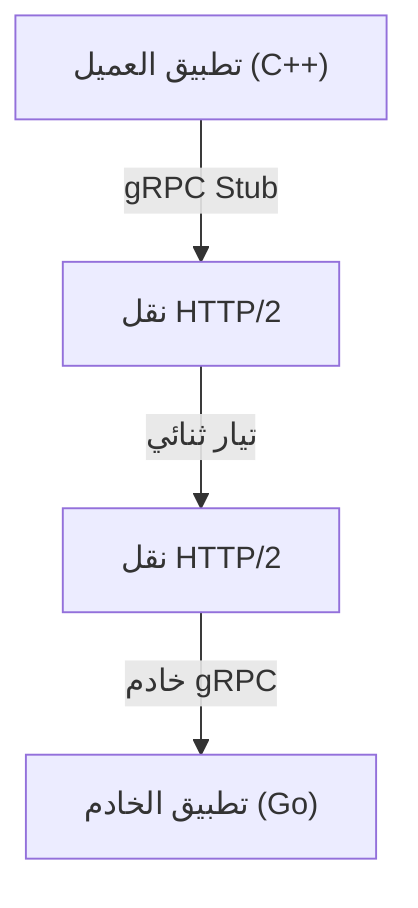

في تطوير الأنظمة الحديثة، أصبح اعتماد بنية الخدمات المصغرة خيارًا قياسيًا. في حين أن هناك ميزة كبيرة تتمثل في أن كل خدمة يمكن أن تتوسع بشكل مستقل ويتم تطويرها باستخدام لغات وحزم تكنولوجية مختلفة، فإن تأثير الاتصال بين الخدمات (الاتصال بين العمليات) على أداء النظام وموثوقيته أصبح أكبر من أي وقت مضى.

في اتصالات الخدمات المصغرة التقليدية، تم استخدام مزيج من REST API عبر HTTP/1.1 وبيانات JSON على نطاق واسع. ومع ذلك، مع زيادة حركة المرور وزيادة متطلبات الوقت الفعلي، أصبحت قيود هذا النهج واضحة. لذلك، فإن ما يجذب الانتباه وأصبح الآن المعيار الفعلي في العديد من الأنظمة واسعة النطاق هو الجمع بين **gRPC** و **Protocol Buffers (Protobuf)**.

ستشرح هذه المقالة بالتفصيل سبب قوة gRPC و Protocol Buffers، وكيف يعملان ومزاياهما، ومقارنة مع JSON/REST، والتحديات في النشر الفعلي.

## 1. قيود REST و JSON

من أجل فهم تفوق gRPC، من الضروري أولاً فرز التحديات التي يواجهها نهج REST + JSON التقليدي.

### تكلفة تحليل JSON وحجم البيانات
JSON (JavaScript Object Notation) هو تنسيق قائم على النص، وله ميزة كبيرة تتمثل في سهولة قراءته من قبل البشر. ومع ذلك، فإنه ليس بالضرورة فعالاً لأجهزة الكمبيوتر.

1. **حجم البيانات يميل إلى التضخم**: يرسل JSON أسماء الحقول كسلاسل نصية في كل مرة. على سبيل المثال، في بيانات مثل `{"user_id": 12345, "status": "active"}`، غالبًا ما تشغل البيانات الوصفية مثل أسماء المفاتيح والأقواس مساحة أكبر بالبايت من الحمولة الفعلية (12345, active).
2. **عبء التسلسل وإلغاء التسلسل**: تستهلك عملية تحويل السلاسل النصية إلى أرقام وكائنات (عملية التحليل) موارد وحدة المعالجة المركزية بشكل كبير. خاصة في البيئات التي تتطاير فيها كميات كبيرة من الرسائل بين الخدمات المصغرة، تتراكم تكلفة التحليل هذه لتسبب زمن انتقال ضخم وزيادة في استخدام وحدة المعالجة المركزية.

### عنق الزجاجة في HTTP/1.1
تعمل واجهات برمجة تطبيقات REST التقليدية بشكل أساسي على HTTP/1.1. يحتوي HTTP/1.1 على القيود الهيكلية التالية:

- **حظر رأس الخط (HoL)**: من الصعب معالجة طلبات متعددة بالتوازي عبر اتصال TCP واحد، وإذا تأخرت معالجة طلب سابق، فسيتم حظر الطلبات اللاحقة أيضًا.
- **رؤوس تعتمد على النص**: يتم إرسال معلومات الرأس كنص عادي في كل مرة دون ضغط، مما يهدر النطاق الترددي.
- **اتصال أحادي الاتجاه**: في الأساس نموذج يعيد فيه الخادم استجابة لطلب من عميل، ولتحقيق دفع من الخادم أو بث ثنائي الاتجاه، كان من الضروري الجمع بين تقنيات أخرى مثل WebSocket.

## 2. ما هي Protocol Buffers (Protobuf)؟

**Protocol Buffers** (أو Protobuf باختصار)، التي طورتها Google، هي آلية قابلة للتوسيع ولا تعتمد على لغة أو منصة محددة لتسلسل البيانات المهيكلة. إنها تشبه XML أو JSON، لكنها أصغر وأسرع وأبسط.

### قوة التسلسل الثنائي
يقوم Protobuf بترميز البيانات بتنسيق ثنائي. بدلاً من إرسال أسماء الحقول كسلاسل نصية مثل JSON، فإنه يستخدم "علامات (أرقام حقول)" صحيحة محددة مسبقًا لتحديد البيانات.

```protobuf
// user.proto
syntax = "proto3";

package user;

message UserRequest {
  int32 user_id = 1;
  string include_details = 2;
}

message UserResponse {
  int32 user_id = 1;
  string name = 2;
  bool is_active = 3;
}
```

بناءً على المخطط المحدد في ملف `.proto` أعلاه، يتم تحويل البيانات إلى سلسلة ثنائية مضغوطة للغاية. لا تحتاج وحدة المعالجة المركزية إلى تحليل السلاسل النصية ويمكنها تعيين البيانات الثنائية مباشرة إلى الهياكل الموجودة في الذاكرة، لذلك تكون سرعات التسلسل وإلغاء التسلسل أسرع بعدة مرات إلى عشرات المرات من JSON.

### التطوير الموجه بالمخطط
باستخدام Protobuf، يتم تحديد مواصفات (مخطط) واجهة برمجة التطبيقات بوضوح كملف `.proto`. هذا ليس مجرد مستند، بل يعمل كعقد (contract) قابل للتنفيذ.
من هذا الملف `.proto`، باستخدام مترجم protoc، يمكنك إنشاء فئات الوصول إلى البيانات تلقائيًا بلغات مختلفة مثل C++ و Java و Python و Go و Ruby و C# وغيرها. هذا يحل المشكلة الأبدية في تطوير واجهات برمجة التطبيقات المتمثلة في "التباعد بين التوثيق والتنفيذ".

## 3. بنية gRPC و HTTP/2

**gRPC** هو إطار عمل RPC (استدعاء الإجراء عن بُعد) عالي الأداء ومفتوح المصدر يستخدم Protocol Buffers كلغة تعريف واجهة (IDL) وتنسيق تبادل الرسائل الأساسي.



الميزة الأكبر لـ gRPC هي أنها تعتمد بالكامل **HTTP/2** كبروتوكول اتصال.

### ثورة الاتصالات عبر HTTP/2
تم تصميم HTTP/2 لحل العديد من المشكلات التي واجهت HTTP/1.1.

1. **تعدد الإرسال (Multiplexing)**: عبر اتصال TCP واحد، يمكن إرسال واستقبال تدفقات متعددة من الطلبات والاستجابات في نفس الوقت، بغض النظر عن الترتيب. هذا يزيل حظر رأس الخط ويقلل بشكل كبير من العبء الإضافي لإنشاء الاتصال.
2. **التأطير الثنائي**: على عكس بروتوكولات HTTP/1.1 القائمة على النص، يقوم HTTP/2 بتقسيم جميع البيانات إلى إطارات ثنائية لإرسالها. يتوافق هذا بشكل كبير مع البيانات الثنائية الخاصة بـ Protobuf.
3. **ضغط الرأس (HPACK)**: يضغط رؤوس HTTP الزائدة بكفاءة، مما يوفر النطاق الترددي للشبكة.

### نماذج الاتصال الأربعة
من خلال الاستفادة من ميزات البث في HTTP/2، تقدم gRPC أربعة نماذج اتصال تتجاوز مجرد الطلب والاستجابة البسيطة.

1. **Unary RPC**: يرسل العميل طلبًا واحدًا ويرد الخادم باستجابة واحدة. الشكل الأكثر شيوعًا الأقرب إلى REST API.
2. **Server Streaming RPC**: يرسل العميل طلبًا واحدًا ويعيد الخادم تيارًا من البيانات (استجابات متعددة). فعال عند إرجاع كميات كبيرة من البيانات شيئًا فشيئًا.
3. **Client Streaming RPC**: يرسل العميل تيارًا من البيانات ويعيد الخادم استجابة واحدة. مناسب لتحميل الملفات الكبيرة.
4. **Bidirectional Streaming RPC**: يستخدم كل من العميل والخادم تدفقات مستقلة لإرسال واستقبال البيانات. مثالي للاتصالات المعقدة في الوقت الفعلي ثنائية الاتجاه، مثل تطبيقات الدردشة أو الألعاب عبر الإنترنت.

## 4. مزايا gRPC في بيئة الخدمات المصغرة

الفوائد المحددة لاعتماد gRPC في بنية الخدمات المصغرة هي كما يلي.

### أداء ساحق
يعمل التسلسل الثنائي وتعدد الإرسال في HTTP/2 على تقليل زمن انتقال الاتصال بشكل كبير. خاصة في بيئة (رسم بياني عميق للاستدعاء) حيث تتواصل عشرات الخدمات المصغرة داخليًا في سلسلة لمعالجة طلب مستخدم واحد، فإن تأثير تقليل زمن الانتقال هذا يرتبط ارتباطًا مباشرًا بتحسين وقت استجابة النظام بأكمله.

### التعاون عبر حواجز اللغة
في الأنظمة الحديثة، ليس من غير المألوف وجود بيئة "متعددة اللغات" (Polyglot) حيث تُكتب مكونات التعلم الآلي بلغة Python، وتُكتب بوابة واجهة برمجة التطبيقات ذات حركة المرور العالية بلغة Go، وتُكتب الواجهة الخلفية القديمة بلغة Java.
باستخدام gRPC و Protobuf، يمكنك ببساطة مشاركة ملف `.proto` لإنشاء رمز اتصال مُحسّن لكل لغة تلقائيًا. لم يعد المطورون بحاجة إلى كتابة معالجة شبكة منخفضة المستوى أو معالجة تحليل JSON، ويمكنهم التركيز على تنفيذ منطق الأعمال.

### أمان قوي للأنواع وتوافق مع الإصدارات السابقة
في JSON API، غالبًا ما تحدث أخطاء وقت التشغيل بسبب أخطاء إملائية في أسماء الحقول أو عدم تطابق أنواع البيانات (مثل تلقي سلسلة نصية عندما يُتوقع رقم). يوفر Protobuf كتابة ثابتة قوية، مما يسمح باكتشاف هذه الأخطاء في وقت الترجمة.
بالإضافة إلى ذلك، نظرًا لأن Protobuf يستخدم أرقام الحقول، فمن السهل الحفاظ على التوافق مع الإصدارات السابقة والتوافق مع الإصدارات المستقبلية في الاتصال بين العملاء القدامى والخوادم الجديدة. حتى إذا قمت بإزالة الحقول التي لم تعد هناك حاجة إليها (بشكل صارم، إهمالها وحجز أرقامها) أو أضفت حقولًا جديدة، فلن ينكسر الاتصال.

## 5. التحديات والتدابير المضادة عند اعتماد gRPC

على الرغم من قوة gRPC، إلا أن هناك بعض العقبات عند اعتمادها.

### التوافق مع المتصفحات
نظرًا لأن gRPC تعتمد على ميزات متقدمة لـ HTTP/2 (خاصة رأس Trailer)، فمن الصعب استدعاء واجهات برمجة تطبيقات gRPC مباشرة من متصفحات الويب الحالية.
هناك حلان شائعان لهذه المشكلة:
- **gRPC-Web**: تقنية تقوم بتحويل البروتوكول قليلاً بحيث يمكن استخدامه من المتصفح. يتصل بخادم gRPC عبر وكيل مثل Envoy.
- **gRPC Gateway**: عن طريق إضافة تعليقات توضيحية إلى ملف `.proto`، يتم إنشاء وكيل عكسي تلقائيًا في نفس الوقت الذي يتم فيه إنشاء خادم gRPC، مما يسمح بالوصول إليه كواجهة برمجة تطبيقات RESTful JSON.

### القابلية للقراءة بالنسبة للبشر
يمكن فحص محتويات JSON بسهولة عن طريق ضربها بأمر `curl`، ولكن لا يمكن قراءة Protobuf الثنائي كما هو.
للتصحيح أثناء التطوير، تحتاج إلى استخدام أدوات CLI مخصصة مثل `grpcurl`، أو عملاء واجهة برمجة تطبيقات متوافقين مع gRPC مثل Postman. أيضًا، عند التقاط الحزم، يلزم اتخاذ تدابير مثل جعل Wireshark يقرأ ملف `.proto` لتحليله.

## الخلاصة

يؤدي الجمع بين gRPC و Protocol Buffers إلى تحسين الأداء وأمان الأنواع وإنتاجية التطوير في الاتصال بين الخدمات المصغرة بشكل كبير.
هذا لا يعني أن JSON و REST أصبحا غير ضروريين. لا يزال REST/JSON هو الخيار الأفضل لواجهات برمجة التطبيقات العامة المواجهة للجمهور والتواصل مع الواجهة الأمامية في العديد من الحالات. ومع ذلك، بالنسبة للاتصال بين الخدمات داخل الواجهة الخلفية، فقد انتقل gRPC بالفعل من "خيار يجب مراعاته" إلى "الخيار الافتراضي".

إذا كنت تعاني من عبء الاتصال، أو كنت على وشك بناء خدمة مصغرة واسعة النطاق، فإن اعتماد gRPC يجب أن يجلب تطورًا دراماتيكيًا لنظامك.
