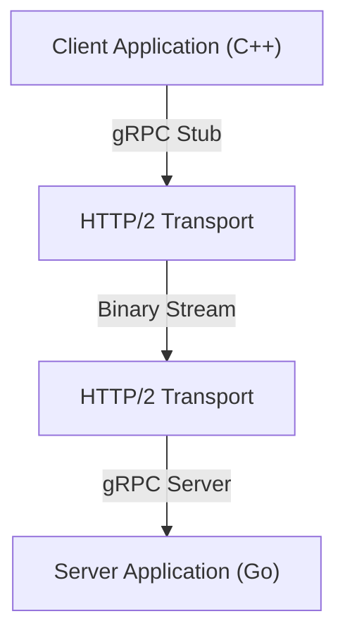

In der modernen Systementwicklung ist die Einführung der Microservice-Architektur zu einer Standardwahl geworden. Während jeder Service unabhängig skaliert und mit unterschiedlichen Sprachen und Technologie-Stacks entwickelt werden kann, hat die Kommunikation zwischen Services (Inter-Prozess-Kommunikation) einen beispiellos großen Einfluss auf die Leistung und Zuverlässigkeit des Systems.

In der herkömmlichen Microservice-Kommunikation wurde häufig die Kombination aus REST-APIs über HTTP/1.1 und JSON-Daten verwendet. Mit zunehmendem Datenverkehr und höheren Anforderungen an Echtzeitfähigkeit werden die Grenzen dieses Ansatzes jedoch deutlich. Hier zieht die Kombination aus **gRPC** und **Protocol Buffers (Protobuf)** Aufmerksamkeit auf sich, die heute in vielen großen Systemen zum De-facto-Standard geworden ist.

In diesem Artikel werden wir im Detail erklären, warum gRPC und Protocol Buffers so leistungsstark sind, wie sie funktionieren und welche Vorteile sie bieten, sie mit JSON/REST vergleichen und die Herausforderungen bei der tatsächlichen Implementierung aufzeigen.

## 1. Die Grenzen von REST und JSON

Um die Überlegenheit von gRPC zu verstehen, müssen wir zunächst die Herausforderungen des traditionellen REST + JSON-Ansatzes klären.

### Parsing-Kosten und Datengröße von JSON
JSON (JavaScript Object Notation) ist ein textbasiertes Format und hat den großen Vorteil, für Menschen leicht lesbar zu sein. Für Computer ist es jedoch nicht immer effizient.

1. **Neigung zur Aufblähung der Datengröße**: JSON überträgt Feldnamen jedes Mal als Strings. Zum Beispiel nehmen in Daten wie `{"user_id": 12345, "status": "active"}` oft Metadaten wie Schlüsselnamen und Klammern mehr Bytes ein als die eigentliche Nutzlast (12345, active).
2. **Belastung durch Serialisierung und Deserialisierung**: Der Prozess der Umwandlung von Strings in Zahlen oder Objekte (Parsing-Prozess) verbraucht erheblich CPU-Ressourcen. Besonders in Umgebungen, in denen viele Nachrichten zwischen Microservices ausgetauscht werden, summieren sich diese Parsing-Kosten und führen zu enormer Latenz und erhöhtem CPU-Verbrauch.

### Der Engpass von HTTP/1.1
Herkömmliche REST-APIs arbeiten hauptsächlich über HTTP/1.1. HTTP/1.1 hat folgende strukturelle Grenzen.

- **Head-of-Line (HoL) Blocking**: Es ist schwierig, mehrere Anfragen parallel über eine einzige TCP-Verbindung zu verarbeiten, und wenn sich die Verarbeitung vorheriger Anfragen verzögert, werden auch nachfolgende Anfragen blockiert.
- **Textbasierte Header**: Header-Informationen werden jedes Mal als unkomprimierter Klartext gesendet, was Bandbreite verschwendet.
- **Unidirektionale Kommunikation**: Es handelt sich grundsätzlich um ein Modell, bei dem der Server auf eine Anfrage vom Client mit einer Antwort reagiert. Um Server-Push oder bidirektionales Streaming zu realisieren, mussten andere Technologien wie WebSockets kombiniert werden.

## 2. Was sind Protocol Buffers (Protobuf)?

Von Google entwickelt, sind **Protocol Buffers** (kurz Protobuf) ein sprach- und plattformunabhängiger, erweiterbarer Mechanismus zur Serialisierung strukturierter Daten. Sie ähneln XML oder JSON, sind aber kleiner, schneller und einfacher.

### Die Kraft der binären Serialisierung
Protobuf kodiert Daten in einem binären Format. Anstatt Feldnamen als Strings zu senden wie bei JSON, verwendet es vordefinierte ganzzahlige "Tags (Feldnummern)", um Daten zu identifizieren.

```protobuf
// user.proto
syntax = "proto3";

package user;

message UserRequest {
  int32 user_id = 1;
  string include_details = 2;
}

message UserResponse {
  int32 user_id = 1;
  string name = 2;
  bool is_active = 3;
}
```

Basierend auf dem in der obigen `.proto`-Datei definierten Schema werden die Daten in ein sehr kompaktes Binärformat umgewandelt. Da die CPU keine Strings parsen muss und binäre Daten direkt in Strukturen im Speicher abbilden kann, ist die Geschwindigkeit der Serialisierung und Deserialisierung im Vergleich zu JSON mehrmals bis dutzendfach schneller.

### Schema-Driven Development
Durch die Verwendung von Protobuf wird die API-Spezifikation (Schema) klar als `.proto`-Datei definiert. Dies fungiert nicht nur als Dokumentation, sondern als ausführbarer Vertrag (Contract).
Aus dieser `.proto`-Datei können mit dem protoc-Compiler Datenzugriffsklassen für verschiedene Sprachen wie C++, Java, Python, Go, Ruby, C# usw. automatisch generiert werden. Dies löst das ewige Problem in der API-Entwicklung: die "Diskrepanz zwischen Dokumentation und Implementierung".

## 3. Die Architektur von gRPC und HTTP/2

**gRPC** ist ein hochleistungsfähiges Open-Source-RPC (Remote Procedure Call)-Framework, das diese Protocol Buffers als Interface Definition Language (IDL) und als zugrunde liegendes Nachrichtenaustauschformat verwendet.



Das größte Merkmal von gRPC ist die vollständige Übernahme von **HTTP/2** als Kommunikationsprotokoll.

### Die Kommunikationsrevolution durch HTTP/2
HTTP/2 wurde entwickelt, um viele der Probleme von HTTP/1.1 zu lösen.

1. **Multiplexing**: Mehrere Anfrage- und Antwort-Streams können gleichzeitig und in beliebiger Reihenfolge über eine einzige TCP-Verbindung gesendet und empfangen werden. Dies eliminiert Head-of-Line-Blocking und reduziert den Overhead für den Verbindungsaufbau drastisch.
2. **Binary Framing**: Im Gegensatz zu den textbasierten Protokollen von HTTP/1.1 teilt HTTP/2 alle Daten in binäre Frames auf und sendet sie. Dies passt sehr gut zu den binären Daten von Protobuf.
3. **Header-Kompression (HPACK)**: Redundante HTTP-Header werden effizient komprimiert, was Netzwerkbandbreite spart.

### 4 Kommunikationsmodelle
gRPC nutzt die Streaming-Fähigkeiten von HTTP/2, um vier Kommunikationsmodelle anzubieten, die über einfache Anfragen und Antworten hinausgehen.

1. **Unary RPC**: Der Client sendet eine einzige Anfrage, und der Server gibt eine einzige Antwort zurück. Das ist der herkömmlichen REST-API am ähnlichsten.
2. **Server Streaming RPC**: Der Client sendet eine einzige Anfrage, und der Server gibt einen Datenstrom (mehrere Antworten) zurück. Nützlich, wenn große Datenmengen nach und nach zurückgegeben werden.
3. **Client Streaming RPC**: Der Client sendet einen Datenstrom, und der Server gibt eine einzige Antwort zurück. Geeignet für den Upload großer Dateien.
4. **Bidirectional Streaming RPC**: Sowohl Client als auch Server verwenden unabhängige Streams, um Daten zu senden und zu empfangen. Ideal für komplexe, bidirektionale Echtzeitkommunikation wie Chat-Apps oder Online-Echtzeitspiele.

## 4. Vorteile von gRPC in einer Microservice-Umgebung

In einer Microservice-Architektur ergeben sich durch den Einsatz von gRPC konkret folgende Vorteile.

### Überwältigende Leistung
Durch binäre Serialisierung und HTTP/2-Multiplexing wird die Kommunikationslatenz erheblich reduziert. Besonders in Umgebungen, in denen intern dutzende Microservices hintereinander kommunizieren, um eine einzige Benutzeranfrage zu verarbeiten (tiefer Call-Graph), führt dieser latenzreduzierende Effekt direkt zu einer Verbesserung der Antwortzeit des gesamten Systems.

### Zusammenarbeit über Sprachbarrieren hinweg
In modernen Systemen ist es nicht ungewöhnlich, eine "polyglotte" (mehrsprachige) Umgebung zu haben, in der beispielsweise die Machine-Learning-Komponente in Python, das hochtraffic-API-Gateway in Go und das Legacy-Backend in Java geschrieben ist.
Durch die Verwendung von gRPC und Protobuf können optimierte Kommunikationscodes für jede Sprache automatisch generiert werden, indem einfach die `.proto`-Datei geteilt wird. Entwickler müssen keine Low-Level-Netzwerkverarbeitung oder JSON-Parsing-Routinen schreiben und können sich auf die Implementierung der Geschäftslogik konzentrieren.

### Robuste Typsicherheit und Abwärtskompatibilität
Bei JSON-APIs treten häufig Laufzeitfehler auf, z. B. durch Tippfehler in Feldnamen oder Datentypinkonsistenzen (z. B. wenn ein String empfangen wird, obwohl eine Zahl erwartet wurde). Protobuf bietet eine starke statische Typisierung, sodass diese Fehler zur Kompilierzeit erkannt werden können.
Da Protobuf außerdem Feldnummern verwendet, können Abwärtskompatibilität und Aufwärtskompatibilität in der Kommunikation zwischen alten Clients und neuen Servern leicht aufrechterhalten werden. Selbst wenn nicht mehr benötigte Felder entfernt (streng genommen veraltet (deprecated) und die Nummer reserviert) oder neue Felder hinzugefügt werden, bricht die Kommunikation nicht ab.

## 5. Herausforderungen und Lösungen bei der Einführung von gRPC

Obwohl gRPC leistungsstark ist, gibt es auch einige Hürden bei der Einführung.

### Kompatibilität mit Browsern
Da gRPC auf fortgeschrittenen Funktionen von HTTP/2 basiert (insbesondere Trailer-Header usw.), ist es schwierig, gRPC-APIs direkt aus aktuellen Webbrowsern aufzurufen.
Die zwei häufigsten Lösungen für dieses Problem sind folgende:
- **gRPC-Web**: Eine Technologie, die das Protokoll leicht transformiert, um es aus dem Browser nutzbar zu machen. Sie kommuniziert mit dem gRPC-Server über einen Proxy wie Envoy.
- **gRPC Gateway**: Ein Ansatz, bei dem durch Hinzufügen von Annotationen zur `.proto`-Datei automatisch ein Reverse-Proxy neben dem gRPC-Server generiert wird, der auch den Zugriff als RESTful JSON API ermöglicht.

### Lesbarkeit für Menschen
Während JSON leicht mit dem `curl`-Befehl abgerufen und dessen Inhalt betrachtet werden kann, ist Protobuf als Binärformat nicht ohne Weiteres lesbar.
Für das Debugging während der Entwicklung müssen spezielle CLI-Tools wie `grpcurl` oder gRPC-kompatible API-Clients wie Postman verwendet werden. Beim Packet Capturing sind ebenfalls Maßnahmen erforderlich, wie das Laden der `.proto`-Datei in Wireshark zur Analyse.

## Zusammenfassung

Die Kombination aus gRPC und Protocol Buffers verbessert die Leistung, Typsicherheit und Entwicklungsproduktivität bei der Kommunikation zwischen Microservices dramatisch.
JSON und REST werden dadurch nicht obsolet. Für öffentliche APIs und die Kommunikation mit dem Frontend ist REST/JSON in vielen Fällen immer noch am besten geeignet. In der Service-zu-Service-Kommunikation innerhalb des Backends wandelt sich gRPC jedoch bereits von einer "zu prüfenden Option" zur "Standardoption".

Wenn Sie mit Kommunikations-Overhead zu kämpfen haben oder im Begriff sind, groß angelegte Microservices aufzubauen, sollte die Einführung von gRPC Ihrem System eine dramatische Evolution bringen.
