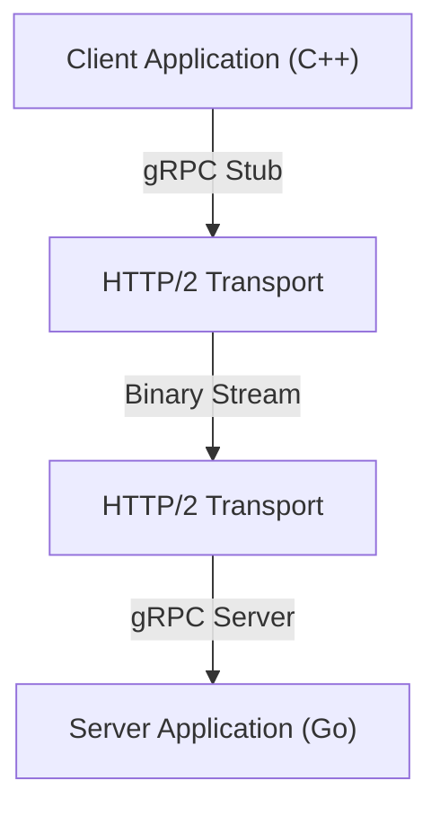

In modern system development, the adoption of microservices architecture has become a standard choice. While there is a huge advantage that each service can scale independently and be developed with different languages and technology stacks, the impact of inter-service communication (inter-process communication) on system performance and reliability has never been greater.

In traditional microservices communication, the combination of REST API over HTTP/1.1 and JSON data has been widely used. However, as traffic increases and the demand for real-time performance grows, the limitations of this approach have become apparent. Thus, the combination of **gRPC** and **Protocol Buffers (Protobuf)** has drawn attention and is now the de facto standard in many large-scale systems.

In this article, we will explain in detail why gRPC and Protocol Buffers are so powerful, their mechanisms and advantages, a comparison with JSON/REST, and the challenges in actual implementation.

## 1. The Limitations of REST and JSON

To understand the superiority of gRPC, it is first necessary to sort out the issues with the traditional REST + JSON approach.

### JSON Parsing Cost and Data Size
JSON (JavaScript Object Notation) is a text-based format, which has the great advantage of being easily readable by humans. However, it is not necessarily efficient for computers.

1. **Data size tends to bloat**: JSON sends field names as strings every time. For example, in data like `{"user_id": 12345, "status": "active"}`, metadata such as key names and brackets often take up more bytes than the actual payload (12345, active).
2. **Serialization and deserialization overhead**: The process of converting strings into numbers or objects (parsing) significantly consumes CPU resources. Especially in environments where a massive amount of messages fly back and forth between microservices, this parsing cost accumulates and brings about huge latency and an increase in CPU usage.

### HTTP/1.1 Bottlenecks
Traditional REST APIs mainly operate on HTTP/1.1. HTTP/1.1 has the following structural limitations:

- **Head-of-Line (HoL) Blocking**: It is difficult to process multiple requests in parallel on a single TCP connection, and if the processing of a preceding request is delayed, subsequent requests are also blocked.
- **Text-based Headers**: Header information is sent as plain text every time without being compressed, which wastes bandwidth.
- **Unidirectional Communication**: It is fundamentally a model where the server returns a response to a request from the client, and to achieve server pushes or bidirectional streaming, it was necessary to combine other technologies like WebSocket.

## 2. What are Protocol Buffers (Protobuf)?

Developed by Google, **Protocol Buffers** (Protobuf for short) is a language- and platform-neutral, extensible mechanism for serializing structured data. It is similar to XML or JSON, but smaller, faster, and simpler.

### The Power of Binary Serialization
Protobuf encodes data in a binary format. Instead of sending field names as strings like JSON, it uses predefined integer "tags (field numbers)" to identify the data.

```protobuf
// user.proto
syntax = "proto3";

package user;

message UserRequest {
  int32 user_id = 1;
  string include_details = 2;
}

message UserResponse {
  int32 user_id = 1;
  string name = 2;
  bool is_active = 3;
}
```

Based on the schema defined in the above `.proto` file, data is converted into a very compact binary sequence. Because the CPU does not need to parse strings and can map binary data directly to structures in memory, the speed of serialization and deserialization is several to tens of times faster compared to JSON.

### Schema-Driven Development
By using Protobuf, the API specification (schema) is clearly defined as a `.proto` file. This acts not just as documentation, but as an executable contract.
From this `.proto` file, using the protoc compiler, data access classes can be automatically generated for various languages such as C++, Java, Python, Go, Ruby, and C#. This solves the eternal challenge in API development of the "gap between documentation and implementation."

## 3. gRPC Architecture and HTTP/2

**gRPC** is a high-performance, open-source RPC (Remote Procedure Call) framework that uses this Protocol Buffers as its Interface Definition Language (IDL) and underlying message exchange format.



The most significant feature of gRPC is that it fully adopts **HTTP/2** as its communication protocol.

### Communications Revolution with HTTP/2
HTTP/2 was designed to solve many of the issues faced by HTTP/1.1.

1. **Multiplexing**: Over a single TCP connection, multiple request and response streams can be sent and received simultaneously and in any order. This eliminates Head-of-Line blocking and dramatically reduces the overhead of connection establishment.
2. **Binary Framing**: Unlike the text-based protocols of HTTP/1.1, HTTP/2 divides all data into binary frames for transmission. This is very compatible with Protobuf's binary data.
3. **Header Compression (HPACK)**: Efficiently compresses redundant HTTP headers, saving network bandwidth.

### 4 Communication Models
Taking advantage of HTTP/2's streaming capabilities, gRPC offers four communication models that go beyond simple request-response.

1. **Unary RPC**: The client sends a single request, and the server returns a single response. This is closest to a typical REST API.
2. **Server Streaming RPC**: The client sends a single request, and the server returns a stream of data (multiple responses). Useful for returning large amounts of data a little at a time.
3. **Client Streaming RPC**: The client sends a stream of data, and the server returns a single response. Suitable for large file uploads.
4. **Bidirectional Streaming RPC**: Both client and server use independent streams to send and receive data. Ideal for complex two-way real-time communication, such as chat apps and real-time online games.

## 4. Advantages of gRPC in a Microservices Environment

The specific benefits of adopting gRPC in a microservices architecture are as follows.

### Overwhelming Performance
Binary serialization and HTTP/2 multiplexing significantly reduce communication latency. Especially in environments where dozens of microservices communicate in a chain to process a single user request (deep call graph), this latency reduction effect directly translates to improved system-wide response times.

### Collaboration Across Language Barriers
In modern systems, it is not uncommon to have a "polyglot (multi-language)" environment where machine learning components are written in Python, high-traffic API gateways in Go, and legacy backends in Java.
With gRPC and Protobuf, by simply sharing the `.proto` file, communication code optimized for each language can be automatically generated. Developers no longer need to write low-level network processing or JSON parsing code and can concentrate on implementing business logic.

### Robust Type Safety and Backward Compatibility
In JSON APIs, runtime errors frequently occur due to typos in field names or data type mismatches (such as receiving a string where a number is expected). Protobuf provides strong static typing, allowing these errors to be detected at compile time.
Additionally, because Protobuf uses field numbers, it is easy to maintain backward and forward compatibility even in communication between old clients and new servers. Even if no longer needed fields are removed (strictly speaking, deprecated and the numbers reserved) or new fields are added, communication will not break.

## 5. Challenges and Countermeasures in Adopting gRPC

While powerful, gRPC also has some hurdles to its adoption.

### Browser Compatibility
Because gRPC relies on advanced features of HTTP/2 (especially Trailer headers, etc.), it is currently difficult to call gRPC APIs directly from Web browsers.
The two general solutions to this problem are:
- **gRPC-Web**: A technology that slightly converts the protocol so it can be used from browsers. It communicates with the gRPC server via a proxy such as Envoy.
- **gRPC Gateway**: A technique that adds annotations to the `.proto` file to automatically generate a reverse proxy alongside the gRPC server, allowing it to be accessed as a RESTful JSON API as well.

### Human Readability
While JSON can be easily inspected by running a `curl` command, binary Protobuf cannot be read as is.
For debugging during development, you need to use dedicated CLI tools like `grpcurl` or gRPC-compatible API clients like Postman. Also, when performing packet capture, ingenuity is required, such as loading the `.proto` file into Wireshark for analysis.

## Summary

The combination of gRPC and Protocol Buffers dramatically improves performance, type safety, and development productivity in inter-microservice communication.
This doesn't mean JSON and REST will become unnecessary. For public-facing APIs and communication with the frontend, REST/JSON are still often more suitable. However, for internal inter-service communication in the backend, gRPC is already shifting from an "option to consider" to the "default choice."

If you are suffering from communication overhead, or are about to build a large-scale microservices system, adopting gRPC should bring a dramatic evolution to your system.
