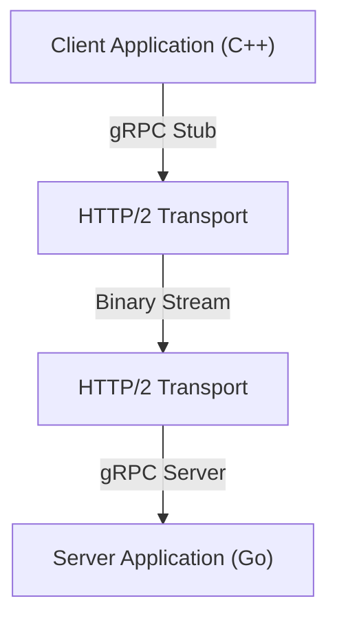

En el desarrollo de sistemas modernos, la adopción de la arquitectura de microservicios se ha convertido en una opción estándar. Si bien cada servicio tiene la gran ventaja de escalar de manera independiente y poder desarrollarse con diferentes lenguajes y pilas tecnológicas, el impacto de la comunicación entre servicios (comunicación entre procesos) en el rendimiento y la fiabilidad del sistema es mayor que nunca.

En la comunicación tradicional de microservicios, la combinación de API REST sobre HTTP/1.1 y datos JSON ha sido ampliamente utilizada. Sin embargo, a medida que aumenta el tráfico y las demandas de tiempo real, las limitaciones de este enfoque se han vuelto evidentes. Por lo tanto, la combinación que está atrayendo atención y ahora es el estándar de facto en muchos sistemas a gran escala es **gRPC** y **Protocol Buffers (Protobuf)**.

En este artículo, explicaremos en detalle por qué gRPC y Protocol Buffers son tan potentes, sus mecanismos y ventajas, una comparación con JSON/REST, y los desafíos en su implementación real.

## 1. Los límites de REST y JSON

Para entender la superioridad de gRPC, primero necesitamos organizar los desafíos del enfoque tradicional de REST + JSON.

### El costo de análisis de JSON y el tamaño de los datos
JSON (JavaScript Object Notation) es un formato basado en texto y tiene la gran ventaja de ser legible para los humanos. Sin embargo, no siempre es eficiente para las computadoras.

1. **Tendencia al aumento excesivo del tamaño de los datos**: JSON envía los nombres de los campos como cadenas cada vez. Por ejemplo, en datos como `{"user_id": 12345, "status": "active"}`, los metadatos como los nombres de clave y paréntesis a menudo ocupan más bytes que el contenido real (12345, active).
2. **Carga de serialización y deserialización**: El proceso de convertir cadenas en números y objetos (análisis o parsing) consume recursos de CPU de manera significativa. Especialmente en entornos donde grandes cantidades de mensajes vuelan entre microservicios, este costo de análisis se acumula, resultando en una latencia masiva y un mayor uso de la CPU.

### Los cuellos de botella de HTTP/1.1
Las API REST tradicionales se ejecutan principalmente sobre HTTP/1.1. HTTP/1.1 tiene las siguientes limitaciones estructurales:

- **Bloqueo Head-of-Line (HoL)**: Es difícil procesar múltiples solicitudes concurrentemente sobre una sola conexión TCP. Si el procesamiento de una solicitud anterior se retrasa, las solicitudes posteriores también se bloquean.
- **Cabeceras basadas en texto**: Las cabeceras se envían en texto plano cada vez sin compresión, desperdiciando ancho de banda.
- **Comunicación unidireccional**: Es básicamente un modelo donde el servidor devuelve una respuesta a una solicitud del cliente. Para lograr la inserción (push) del servidor o la transmisión bidireccional, era necesario combinar otras tecnologías como WebSocket.

## 2. ¿Qué es Protocol Buffers (Protobuf)?

Desarrollado por Google, **Protocol Buffers** (Protobuf para abreviar) es un mecanismo extensible independiente del lenguaje y de la plataforma para serializar datos estructurados. Es similar a XML y JSON, pero es más pequeño, más rápido y más simple.

### El poder de la serialización binaria
Protobuf codifica los datos en formato binario. En lugar de enviar los nombres de los campos como cadenas al igual que JSON, utiliza "etiquetas (números de campo)" enteros predefinidos para identificar los datos.

```protobuf
// user.proto
syntax = "proto3";

package user;

message UserRequest {
  int32 user_id = 1;
  string include_details = 2;
}

message UserResponse {
  int32 user_id = 1;
  string name = 2;
  bool is_active = 3;
}
```

Basado en el esquema definido en el archivo `.proto` anterior, los datos se convierten en una secuencia binaria muy compacta. Dado que la CPU no necesita analizar cadenas y puede mapear datos binarios directamente a estructuras en memoria, la velocidad de serialización y deserialización es desde varias veces hasta decenas de veces más rápida en comparación con JSON.

### Desarrollo impulsado por esquemas
Al usar Protobuf, la especificación de la API (esquema) se define claramente como un archivo `.proto`. Esto no funciona simplemente como un documento, sino como un contrato ejecutable.
A partir de este archivo `.proto`, se pueden generar automáticamente clases de acceso a datos para varios lenguajes, incluyendo C++, Java, Python, Go, Ruby y C#, utilizando el compilador protoc. Esto resuelve el eterno desafío en el desarrollo de APIs: la "brecha entre la documentación y la implementación".

## 3. Arquitectura de gRPC y HTTP/2

**gRPC** es un marco RPC (Llamada a Procedimiento Remoto) de código abierto de alto rendimiento que utiliza Protocol Buffers como su lenguaje de definición de interfaces (IDL) y como su formato base de intercambio de mensajes.



La característica principal de gRPC es que adopta completamente **HTTP/2** como su protocolo de comunicación.

### Revolución de la comunicación mediante HTTP/2
HTTP/2 fue diseñado para resolver muchos de los problemas enfrentados por HTTP/1.1.

1. **Multiplexación**: Permite enviar y recibir de forma simultánea múltiples flujos de solicitudes y respuestas sobre una única conexión TCP, sin importar el orden. Esto elimina el bloqueo Head-of-Line y reduce drásticamente la sobrecarga de establecimiento de conexiones.
2. **Entramado (Framing) binario**: A diferencia del protocolo basado en texto de HTTP/1.1, HTTP/2 divide todos los datos en tramas binarias para la transmisión. Esto se alinea muy bien con los datos binarios de Protobuf.
3. **Compresión de cabeceras (HPACK)**: Comprime de forma eficiente las cabeceras HTTP redundantes y ahorra ancho de banda de red.

### 4 modelos de comunicación
Aprovechando las capacidades de streaming de HTTP/2, gRPC ofrece cuatro modelos de comunicación que van más allá de simples peticiones y respuestas.

1. **Unary RPC**: El cliente envía una única petición y el servidor devuelve una única respuesta. Es la forma más cercana a las APIs REST comunes.
2. **Server Streaming RPC**: El cliente envía una petición y el servidor devuelve un flujo (stream) de datos (múltiples respuestas). Útil para devolver grandes cantidades de datos poco a poco.
3. **Client Streaming RPC**: El cliente envía un flujo de datos y el servidor devuelve una única respuesta. Adecuado para grandes subidas de archivos.
4. **Bidirectional Streaming RPC**: Tanto el cliente como el servidor envían y reciben datos utilizando flujos independientes. Ideal para comunicaciones complejas en tiempo real y bidireccionales, como aplicaciones de chat o juegos en línea.

## 4. Ventajas de gRPC en un entorno de microservicios

Los beneficios específicos de adoptar gRPC en una arquitectura de microservicios son los siguientes:

### Rendimiento abrumador
Gracias a la serialización binaria y a la multiplexación de HTTP/2, la latencia de red se reduce drásticamente. Especialmente en entornos donde docenas de microservicios se comunican en cadena para procesar una sola petición de usuario (un gráfico de llamadas profundo), esta reducción de latencia se traduce directamente en una mejora del tiempo de respuesta general del sistema.

### Cooperación más allá de las barreras del lenguaje
En sistemas modernos, no es raro encontrar entornos "políglotas" donde los componentes de machine learning se escriben en Python, el API gateway de alto tráfico en Go, y los backends heredados en Java.
Con gRPC y Protobuf, al simplemente compartir el archivo `.proto`, se puede generar automáticamente código de comunicación optimizado para cada lenguaje. Los desarrolladores ya no necesitan escribir procesamiento de red de bajo nivel o analizar JSON, permitiéndoles concentrarse en la lógica de negocio.

### Robustez en la seguridad de tipos y compatibilidad hacia atrás
Con las API JSON, a menudo ocurren errores de ejecución debido a errores tipográficos en los nombres de los campos o desajustes de tipos de datos (como recibir una cadena cuando se espera un número). Protobuf proporciona una tipificación estática fuerte, de modo que estos errores se pueden detectar en tiempo de compilación.
Además, dado que Protobuf utiliza números de campo, mantiene fácilmente tanto la compatibilidad hacia atrás como hacia adelante en la comunicación entre clientes antiguos y servidores nuevos. Incluso si los campos que ya no se necesitan son eliminados (estrictamente hablando, desaprobados y su número reservado) o si se agregan nuevos campos, la comunicación no se interrumpe.

## 5. Desafíos y soluciones al introducir gRPC

A pesar de ser potente, la adopción de gRPC también presenta algunos obstáculos.

### Compatibilidad con navegadores
Debido a que gRPC depende de funciones avanzadas de HTTP/2 (particularmente las cabeceras Trailer), es difícil llamar a la API de gRPC directamente desde los navegadores web actuales.
Hay dos soluciones comunes a este problema:
- **gRPC-Web**: Una tecnología que convierte ligeramente el protocolo para su uso en navegadores. Se comunica con el servidor gRPC a través de un proxy como Envoy.
- **gRPC Gateway**: Un enfoque que agrega anotaciones al archivo `.proto` para generar automáticamente un proxy inverso junto al servidor gRPC, permitiendo el acceso también como una API RESTful JSON.

### Legibilidad humana
Mientras que JSON se puede consultar y ver fácilmente utilizando un comando `curl`, Protobuf es binario y no se puede leer tal cual.
Para depurar durante el desarrollo, debes usar herramientas CLI dedicadas como `grpcurl` o clientes API compatibles con gRPC como Postman. Además, al capturar paquetes, se requiere cierto esfuerzo para cargar archivos `.proto` en Wireshark y analizar los datos.

## Conclusión

La combinación de gRPC y Protocol Buffers mejora drásticamente el rendimiento, la seguridad de tipos y la productividad en el desarrollo de la comunicación entre microservicios.
Esto no significa que JSON y REST ya no sean necesarios. Para APIs públicas y comunicación con el frontend, REST/JSON a menudo sigue siendo más apropiado. Sin embargo, para la comunicación entre servicios dentro del backend, gRPC ya está pasando de ser "una opción a considerar" a "la opción predeterminada".

Si estás luchando contra la sobrecarga de comunicación, o estás a punto de construir microservicios a gran escala, la adopción de gRPC seguramente traerá una evolución drástica a tu sistema.
